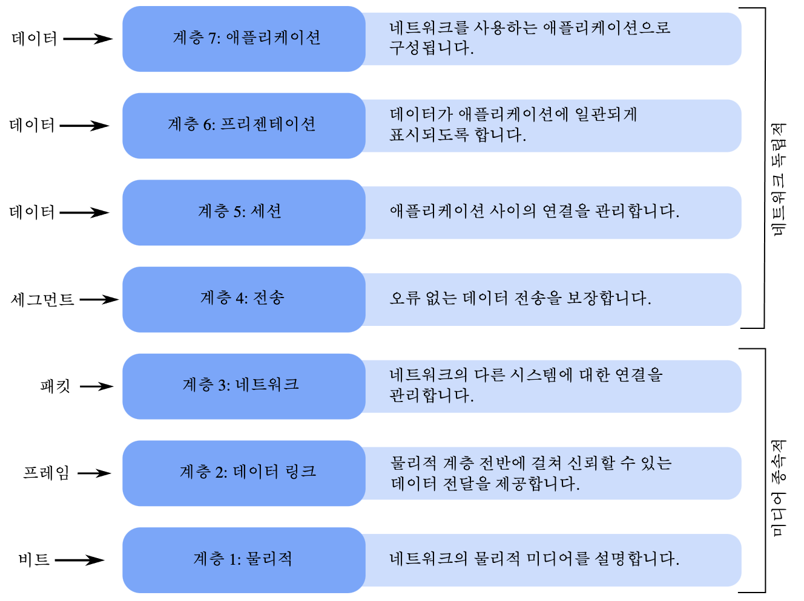
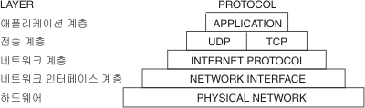
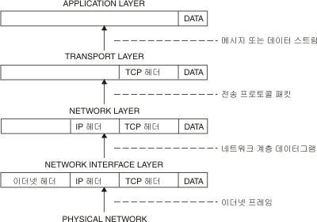
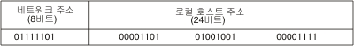

# Net Practice

TCP/IP 주소 지정이 작동하는 방식을 이해하고, 소규모 네트워크를 구성해야 한다.  

## 네트워크란

- 네트워크는 둘 이상의 컴퓨터와 이들을 연결하는 링크의 조합이다.  
- 네트워크는 몇 개의 독립적인 장치가 적절한 영역내에서 적당히 빠른 속도의 물리적 통신 채널을 통하여 서로가 직접 통신할 수 있도록 지원해 주는 데이터 통신 체계이다.   

현대식 컴퓨터 네트워크의 복잡도로 인해 네트워크의 작업 방법을 설명하기 위한 여러 개념적 모델이 등장했다. 가장 일반적인 모델이 ISO의 개방 시스템 연결 규약 참조 모델이다. OSI 7계층 모델이라고도 한다. OSI 참조 모델이 네트워킹 개념을 논의하기에 유용하지만 많은 네트워킹 프로토콜이 OSI 모델을 그대로 따르지는 않는다. TCP/IP에서는 애플리케이션 및 프리젠테이션 계층 기능이 결합되며 세션 및 전송 계층 그리고 데이터 링크 및 물리적 계층도 마찬가지이다.  

네트워크를 사용함으로써 파일을 공유하거나 다른 네트워크에 있는 컴퓨터의 파일에 접근할 수 있다. 또한, 사진과 음악 또는 비디오같은 디지털 미디어를 네트워크를 통해서 스트리밍하거나 인터넷에서 다른 사람과 만나서 네트워크 게임을 즐길 수 있게 되었다. 이렇게 큰 장점을 가진 네트워크이지만 이로 인해서 바이러스나 악성코드, 해킹으로 인한 개인 정보 유출 등 보안상의 문제점이 생긴다.  

### 네트워크 종류

가장 작은 규모의 네트워크인 개인 통신망(Personal Area Network, PAN), 근거리 영역의 네트워크(Local Area Network, LAN), 대도시 영역의 네트워크인 도시권 통신망(Metropolitan Area Network, MAN), 광대역 네트워크인 원거리 통신망(Wide Area Network, WAN), 정보의 축적과 제공, 통신 속도와 형식의 변화, 통신 경로의 선택 등 여러 종류의 정보 서비스가 부가된 통신망인 부가 가치 통신망(Value Added Network, VAN)과 광대역 종합정보통신망(BISDN) 전화, 팩스, 데이터 통신, 비디오텍스 등 통신 관련 서비스를 종합하여 다루는 통합 서비스 디지털 통신망인 종합정보통신망(Integrated Service Digital Network, ISDN)이 있다.  

### 회선 구성 방식

중앙 컴퓨터와 단말기를 일대일로 연결하여 언제든지 데이터 전송이 가능하게 하는 방식인 포인트 투 포인트 방식이 있고, 다수의 단말기를 한 개의 통신 회선에 연결하여 사용하는 방식으로, 멀티 포인트 방식이라고도 하는 멀티 드롭 방식이 있다. 또한, 여러 대의 단말기를 다중화 장치를 활용하여 중앙 컴퓨터와 연결하여 사용하는 방식으로 다중화 방식이라고도 하는 회선 다중 방식이 있다. 

### 데이터 교환 방식

- 회선 교환 : 통신을 원하는 두 지점의 교환기를 이용하여 물리적으로 접속시키는 방법으로써 송신자의 모든 데이터는 동일한 경로로 전송된다. 대표적으로 음성 전화망이 있으며 포인트 투 포인트 방식으로 연결된다.  
- 패킷 교환 : 회선 교환과 다르게 전용선의 개녕이 없다. 데이터를 일괄적으로 한 번에 보내지 않고, 여러 개로 분할해서 송신하는 방법을 말한다. 분할된 데이터를 패킷이라고 한다. 패킷에는 데이터와 최종 목적지에 대한 정보가 들어있어서 라우터가 이를 보고 패킷을 최적 경로를 향해 전달한다.  
- 공간 분할 교환 : 기계식 접점과 전자 교환기의 전자식 접점 등을 이용하여 교환을 수행한다. 기존의 음성용 전화 회선망을 이용할 수 있어서 간단한 저속 데이터 전송에 매우 효과적이다.  
- 시분할 교환 : 전자 부품이 갖는 고속성과 디지털 교환 기술을 이용하여 다수의 디지털 신호를 시분할적으로 동작시켜 다중화하는 방식이다. 이 방식은 데이터 전용 회선 교환 방식에 이용된다.  

## TCP/IP (Transmission Control Protocol/Internet Protocal)

컴퓨터가 서로 통신하는 경우, 특정 규칙이나 프로토콜을 사용하여 순서대로 데이터를 전송 및 수신할 수 있다. 전세계적으로 가장 일상적으로 사용되는 프로토콜 세트 중 하나가 TCP/IP이다. 

- TCP/IP는 컴퓨터 사이의 통신 표준 및 네트워크의 라우팅 및 상호연경에 대한 자세한 규칙을 지정하는 프로토콜 스위트이다.
- 네트워크에 연결된 여러 컴퓨터 사이의 통신을 허용한다. 각 네트워크는 호스트와 통신하는 다른 네트워크에 연결될 수 있다. 패킷 교환 및 스트림 전송으로 작동하는 많은 유형의 네트워크 기술이 있지만, TCP/IP는 하드웨어에 구애받지 않는다는 하나의 큰 장점이 있다.  
- TCP/IP는 컴퓨터 시스템을 네트워크에 접속하여 다른 인터넷 호스트와 통신할 수 있는 인터넷 호스트로 만드는 기능을 제공한다. 다음을 수행할 수 있는 명령과 기능이 포함된다. 
    - 시스템 사이에서 파일 전송
    - 원격 시스템에 로그인
    - 원격 시스템에서 명령 실행
    - 원격 시스템에 파일 인쇄
    - 원격 사용자에 이메일 전송
    - 원격 사용자와 대롸적 통신
    - 네트워크 관리

### TCP/IP 용어

- 클라이언트 : 네트워크 프로세스나 다른 컴퓨터의 데이터, 서비스 또는 자원들을 액세스하는 컴퓨터 또는 프로세스이다. 
- 호스트 : 인터넷 네트워크에 접속되고 다른 인터넷 호스트와 통신할 수 있는 컴퓨터이다. 
- 네트워크 : 둘 이상의 호스트 및 이들 사이의 연결 링크 조합이다.  
- 패킷 : 호스트와 네트워크 사이의 한 트랜잭션에 대한 제어 정보 및 데이터 블록이다. 
- 포트 : 프로세스에 대한 논리적 연결 지점이다. 데이터는 포트(또는 소켓)을 통해 프로세스 사이에서 전송된다. 각 포트는 데이터 송수신을 위한 큐를 제공한다. 
- 프로세스 : 실행 중인 프로그햄이다. 프로세스는 컴퓨터에서 활동 중인 요소이다. 터미널, 파일, 기타 입출력 장치는 각기 다른 프로세스를 통해 통신한다. 따라서 네트워크 통신은 프로세스 간 통신이다. 
- 프로토콜 : 물리적 또는 논리적 레벨로 통신을 처리하는 규칙 세트이다. 다른 프로토콜을 사용하여 서비스를 제공하는 경우도 있다. 예를 들어, 연결 레벨 프로토콜은 전송 레벨 프로토콜을 사용하여 두 호스트 사이의 연결을 유지하는 패킷을 전송한다.
- 서버 : 네트워크 상의 다른 컴퓨터 또는 프로세스가 액세스할 수 있는 데이터, 서비스 또는 자원을 제공하는 컴퓨터 또는 프로세스이다.  

### TCP/IP 네트워크 계획

TCP/IP는 유연한 네트워킹 도구이기 때문에 특정 요구에 맞게 조정하여 사용할 수 있다. 네트워크를 계획할 경우에 이와 같은 주요 문제점을 생각해봐야 한다.  

1. 사용하려는 네트워크 하드웨어의 유형 결정한다.
2. 네트워크의 물리적 배치를 계획한다. 각 호스트 머신이 제공할 기능을 고려한다.
3. 사용자의 요구사항에 가장 적합한 네트워크가 플랫 네트워크인지 계층 네트워크인지 결정한다.
    - 사용자의 네트워크가 작은 규모이고, 하나의 물리적 네트워크로 구성되는 경우에는 플랫 네트워크가 적합하다. 그러나 네트워크가 매우 크고, 여러 물리적 네트워크로 복잡한 경우에는 계층 네트워크가 효과적일 수 있다. 
4. 네트워크를 다른 네트워크에 연결하려면 게이트 웨이의 설정 및 구성 방식을 계획해야 한다. 
    - 계이트웨이로 서비스되는 하나 이상의 머신 결정
    - 정적 또는 동적 라우팅 또는 이 둘의 조합을 사용해야하는지 여부를 결정
5. 주소 지정 체계를 결정한다. 
6. 시스템을 서브넷으로 분할해야 하는지 여부를 결정하고, 분할하는 경우에는 서브넷 마스크 지정 방법을 결정한다.
7. 이름 지정 체계를 결정한다. 네트워크의 각 머신에는 자체적으로 고유 호스트 이름이 있어야 한다. 
8. 네트워크에 이름 해석을 위한 이름 서버가 필요한지, 아니면 /etc/hosts 파일의 사용만으로 충분한지 여부를 결정한다.
9. 네트워크에서 원격 사용자에게 제공하려는 서비스 유형을 결정한다.

### TCP/IP 프로토콜

프로토콜은 시스템과 애플리케이션 프로그램에서 정보를 교환할 수 있도록 하는 메시지 형식 및 일련의 작업 절차에 대한 규칙 세트이다.  
수신 호스트가 메시지를 이해하려면 톤신에 관련된 각 시스템이 이런한 규칙을 준수해야 한다.  
TCP/IP 프로토콜은 계층이라는 관점에서 이해할 수 있다. 계층은 애플리케이션 계층, 전송 계층, 네트워크 계층, 네트워크 인터페이스 계층, 하드웨어로 구성된다.  

  

다음은 TCP/IP가 정보를 발신자에서 수신자로 이동하는 방법이다.  
- 애플리케이션 프로그램은 메시지나 데이터 스트림을 인터넷 전송 계층 프로토콜 중 하나로 전송한다. (UDP 또는 TCP로 전송)
- 데이터 스트림을 받은 프로토콜은 패킷이라고 부르는 작은 조각으로 데이터를 나누고, 대상 주소를 추가하여 다음 계층을 따라 패킷을 패스한다.  
- 인터넷 네트워크 계층은 패킷을 IP(Internet Protocol) 데이터그램에 포함한 후 데이터그램 헤더 및 트레일러에 넣고 데이터그램 전송 위치를 결정한 후 네트워크 인터페이스 계층으로 데이터그램을 패스한다. 
- 네트워크 계층은 IP 데이터그램을 승인하고 이더넷이나 토큰 링 네트워크롸 같은 특정 네트워크 하드웨어를 통해 이들을 프레임으로 전송한다.  

위 그림을 보면 정보가 전송자에서 호스트로의 TCP/IP 프로토콜 계층에 따라 아래로 흐른다.
호스트가 수신한 프레임은 역 방향으로 프로토콜 계층을 이동한다. 각 계층은 데이터가 애플리케이션 계층에 다시 도달할 때까지 해당 헤더 정보를 스트립한다. 

위 그림을 보면 정보가 호스트에서 전송자로 TCP/IP 프로토콜 계층에 따라 위로 흐른다.  
- 프레임은 네트워크 인터페이스 계층에서 수신한다.  
- 네트워크 인터페이스 계층은 이더넷 헤더를 스트립하여 데이터그램을 네트워크 계층으로 전송한다.
- 네트워크 계층에서는 인터넷 프로토콜이 IP 헤더를 스트립하고 전송 계층으로 패킷을 전송한다. 
- 전송 계층에서는 TCP가 TCP 헤더를 스트립하여 애플리케이션 계층으로 데이터를 전송한다.  

네트워크의 호스트는 정보의 전송과 수신을 동시에 수행한다. 아래의 그림은 TCP/IP 계층에 따라 양방향으로 데이터가 흐르는 것을 보여준다.  

### TCP/IP 주소 지정

TCP/IP는 사용자와 애플리케이션이 통신할 고유 네트워크나 호스트를 식별할 수 있게 하는 인터넷 주소 지정 체계를 포함하고 있다.  
인터넷 주소는 우편번호 주소와 유산한 방식으로 작용하여 선택한 대상으로 데이터가 라우트되도록 한다.  
TCP/IP는 네트워크, 서브네크워트, 호스트, 소켓에 주소를 지정하고 브로드캐스트 및 로컬 루프백에 대한 특수 주소를 사용하기 위한 표준을 제공한다.  

인터넷 주소는 네트워크 주소와 호스트(또는 로컬) 주소로 이루어진다.  
고유한 공식 네트워크 주소는 다른 인터넷 네트워크에 연결할 때 각 네트워크에 지정된다.  
그러나 로컬 네트워크를 다른 인터넷 네트워크에 연결하지 않은 경우 로컬 사용에 간편한 네트워크 주소로 지정될 수 있다.  

### 인터넷 주소

IP(Internet Protocol)는 32비트의 두 부분으로 된 주소 필드를 사용한다.  
인터넷 주소는 네트워크 주소 부분과 호스트 주소 부분으로 이루어져 있다.  
이를 사용하면 원격 호스트가 정보 전송 시에 원격 네트워크와 원격 네트워크의 호스트 모두를 지정할 수 있다.  

TCP/IP는 인터넷 주소의 세 가지 클래스인 클래스 A, 클래스 B, 클래스 C를 지원한다.  
다른 클래스는 32비트 주소를 할당하는 방법으로 지정한다.  
네트워크가 지정되는 특정 주소 클래스는 네트워크의 크기에 따라 다르다.  

- 클래스 A : 8비트 네트워크 주소와 24비트 로컬 또는 호스트 주소로 구성된다.
- 클래스 B : 16비트 네트워크 주소와 16비트 로컬 또는 호스트 주소로 구성된다.
- 클래스 C : 24비트 네트워크 주소와 8비트 로컬 또는 호스트 주소로 구성된다.
- 0을 사용하는 인터넷 주소 : C 클래스 인터넷 주소가 호스트 주소 부분에 0을 포함하면 TCP/IP는 네트워크의 와일드 카드 주소를 전송한다.  

### 서브넷 주소

서브넷 주소 지정을 이용하면 여러 네트워크로 이루어진 자율 시스템이 동일한 인터넷 주소를 공유할 수 있다.  
TCP/IP의 서브 네트워크 기능은 단일 네트워크를 여러개의 논리적 네트워크(서브넷)로 분할할 수 있다.  
하나의 인터넷 네트워크 주소를 서브넷에 내부적으로 구성하면 더 적은 인터넷 네트워크 주소가 필요하면서 로컬 라우팅 기능은 개선된다.  

표준 인터넷 프로토콜 주소 필드에는 네트워크 주소와 로컬 주소의 두 부분이 있다.  
서브넷이 사용되도록 하기 위해 인터넷 주소의 로컬 주소 부분이 서브넷 번호와 호스트 번호로 분할된다.  
서브넷은 로컬 자율 시스템이 메시지를 확실하게 라우트할 수 있도록 식별된다.  

이 그림은 전형적인 클래스 A 주소 구조를 보여준다.  
처음 8비트는 네트워크 주소를 포함하고 나머지 24비트는 로컬 호스트 주소를 포함한다.  
클래스 A 인터넷 주소에 대한 서브넷 주소를 작성하기 위해 두가지로 나눌 수 있다.  
물리적 네트워크(또는 서브넷)를 식별하는 번호, 서브넷의 호스트를 식별하는 번호로 로컬 주소를 나눌 수 있다.  
전송인은 알려진 네트워크 주소로 메시지를 라우트하고, 로컬 시스템이 해당 서브넷과 호스트에 메시지를 라우트한다.  
로컬 주소를 서브넷 주소와 호스트 주소로 분할하는 방법을 결정할 때, 서브넷 수와 해당 서브넷의 호스트 수를 고려해야 한다.  

