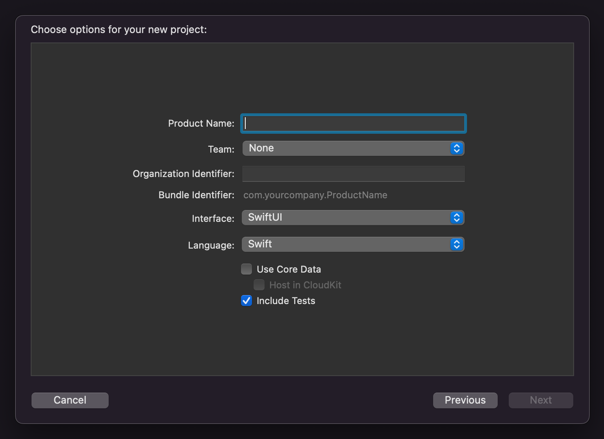
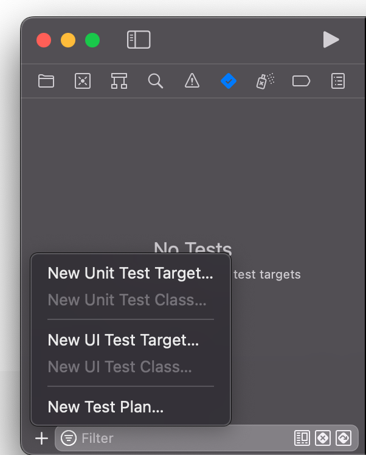

# Today I Learned

[](https://chanul.gitbook.io/til/)

* 매일 배우고 기록한다.
* 새로운 개발 지식을 찾았다면 쌓아둔다.
* 쌓아둔 개발 지식은 이해하기 쉽게 정리한다.

<hr>

## 

### 22.05.14 : Swift Unit Test
>
>Unit Test는 소스 코드에서 특정 모듈이 의도대로 정확하게 작동하는지 테스트하는 과정이다. 함수와 메소드에 대한 테스트 케이스를 작성하면 변경된 코드에서 발생한 문제를 빠르게 파악할 수 있다. 테스크 케이스는 서로 분리되어야 한다. 이를 위해 가짜 객체(Mock object)를 생성하는 것도 좋은 방법이다.
>
>한마디로 Unit Test는 "의도대로 정확히 동작하는지 확인하는 절차"이다.
>
>Xcode에서는 프로젝트를 생성하며 Unit Test를 포함시킬 수 있다.
>
>
>기존 프로젝트에 테스트를 추가할 수 있다. Navigator View의 탭에서 New Unit Test Target을 클릭하면 생성된다.
>
>
>Unit Test 파일을 생성하면 다음과 같은 코드를 볼 수 있다. 가장 먼저 테스트를 진행할 프로젝트를 포함시켜준다. `@testable` 구문을 통해 프로젝트의 코드에 접근하여 사용할 수 있다. 테스트 클래스에 `setUpWithError`와 `tearDownWithError` 메서드를 볼 수 있다. 이 메서드들은 테스트 동작의 시작과 마지막에 실행되어 테스트 환경을 만들어 준다.
>
>```swift
>import XCTest
>@testable import ProjectName	// 테스트할 프로젝트를 포함시켜준다.
>
>class ProjectTests: XCTestCase {
>	override func setUpWithError() throws {
>		// 이 메서드는 클래스의 각 테스트 메서드를 호출하기 전에 호출된다.
>	}
>	
>	override func tearDownWithError() throws {
>		// 이 메서드는 클래스의 각 테스트 메서드를 호출한 후에 호출된다.
>	}
>}
>```
>
>테스트 메소드 이름은 테스트로 인식되기 위해서 반드시 test로 시작해야한다. 테스트는 given - when - then 구조로 작성하는 것이 좋다. 
>
>```swift
>func testAddTwoNums() {
>	// given - 필요한 값을 설정
>	let a = 10
>	let b = 20
>	
>	// when - 테스트 코드 실행
>	let result = addTwoNums(a, b)
>	
>	// then - 실행 결과 확인
>	XCTAssertEqual(result, 30, "Wrong calc")
>}
>```
>
>Unit Test를 실제 프로젝트에 도입하려면 모듈 분리 등 기존 코드에 많은 수정이 필요하고, 테스트 코드를 작성하는 데에도 원래 코드를 작성하는만큼의 시간이 소요될 수 있다.
>
>[Unit Test란?](https://silver-g-0114.tistory.com/142)  
>[UnitTest의 사용법](https://zeddios.tistory.com/48)

### 22.05.12 : 사용자 스토리
>
>유저, 가치, 그리고 우리가 작업할 수 있는 단위를 고민한다.
>- 유저에게 어떤 가치를 전달할 수 있는가
>- 가치를 전달하려면 무엇이 필요한가
>- 무엇을 만드는 효율을 어떻게 높일 수 있는가
>  
>우리는 무언가를 개발하여 누군가에게 가치를 전달해야 한다.
>사용자 스토리는 기능을 사용자의 관점에서 이야기하는 것이다.
>
>사용자 스토리는 '시스템 요구사항을 상세하게 설명하는 것'에서 '요구사항에 대해 이야기하는 것'으로 초점을 바꿀 수 있도록 도움을 준다. 사용자 스토리는 요구 사항을 다음과 같은 형식의 문장으로 표현된다. 
>### <사용자 유형>으로서, 나는 <어떤 욕구>를 원한다, <어떤 보상>을 받을 수 있도록
>이렇게 사용자 스토리를 작성하게 된다면 "어떻게" 대신에 "무엇"에 집중할 수 있다. 작성하는 경우에는 항상 사용자의 요구과 성취하려는 목적을 설정하고 집중해야 한다. 
>
>좋은 유저 스토리를 위해서는 잘 정의된 인수 기준이 필요하다. 인수 기준이란 유저 스토리가 수용되고, 걸러지는 기준을 말한다. 체크 리스트처럼 작동하여 만족하는 요건과 아닌 요건을 명시한다. 훌륭한 인수 기준을 위해서 준비 단계에서 기능 작동을 보여주는 방법에 대해 생각해야 한다. 인수 기준은 복잡해지고 많은 과정을 포함할 수 있지만 과다한 인수 기준이 있다면 애자일 방식이 아닐 것이다. 
>
> [사용자 스토리는 무엇인가?](https://yozm.wishket.com/magazine/detail/754/)
> 


### 22.05.08 : JavaScript Set
> ### 객체 Set
> Set 생성자를 사용하면 원시 값이나 객체 참조의 고유한 값을 저장하는 개체를 만들 수 있다. 
> ```javascript
> let obj = new Set([0])
>
> // 값 확인
> obj.has(0)	// true
> obj.has(2)	// false
> obj.size	// 1
>
> // 값 추가
> obj.add(1)	// [0, 1]
> obj.add(2)	// [0, 1, 2]
> obj.add(2)	// [0, 1, 2]
> 
> // 값 제거
> obj.delete(0)	// [1, 2]
> obj.has(0)	// false
> obj.has(1)	// true
> 
> ```
> Set 객체의 모든 값을 확인하는 방법
> ```javascript
> let obj = new Set([1, 2, 3])
>
> obj.forEach(ele => {
> 	console.log(ele)
> })
> // 1, 2, 3
> 
> let iterator = obj.values()
> console.log(iterator.next().value)	// 1
> console.log(iterator.next().value)	// 2
> console.log(iterator.next().value)	// 3
> console.log(iterator.next().value)	// undefined
> ```
> [JavaScript Set](https://developer.mozilla.org/en-US/docs/Web/JavaScript/Reference/Global_Objects/Set/values#try_it)

### 22.05.07 : JavaScript 반복문
> ### 반복문
> ```javascript
> // 배열
> let array = [1, 2, 3, 4, 5]
> 
> for (ele of array) {
> 	console.log(ele)	// 배열의 요소를 하나씩 출력
> }
> 
> // 객체
> let object = { a: 10, b: 20, c: 30 }
> 
> for (key in object) {
> 	console.log(key)	// 객체의 키를 하나씩 출력
> }
> ```
> [JavaScript 반복문](https://developer.mozilla.org/ko/docs/Web/JavaScript/Guide/Loops_and_iteration#for...of_%EB%AC%B8)
> <hr/>
> 
> ### 함수 인자 전달
> 함수에 전달되는 인자는 값이 복사되거나 주소가 복사되어 전달된다. JS에서 원시 데이터는 값이 복사되어 전달되고, 객체는 주소가 복사되어 전달된다. 배열도 객체이기 때문에 주소가 복사된다.
> ```javascript
> // 값의 복사
> function swap(a, b) {
> 	let tmp = a
> 	a = b
> 	b = tmp
> }
> 
> let a = 10
> let b = 20
> swap(a, b)
> console.log(a, b)	// 10, 20 (변경되지 않음)
>
> // 주소의 복사
> function swap_obj(c, d) {
> 	let tmp = c.val
> 	c.val = d.val
> 	d.val = tmp
> }
> 
> let c = { val: 10 }
> let d = { val: 20 }
> swap_obj(c, d)
> console.log(c.val, d.val)	// 20, 10 (변경됨)
> ```
> [JavaScript 함수 인자](https://lamarr.dev/javascript/2020/04/08/04.html)

### 22.05.06 : Swift Array, JavaScript String
> 배열 선언
> ```swift
> let numbers = [1, 2, 3, 4, 5]
> let strings = ["a", "b", "c", "d"]
> ```
> 배열 생성
> ```swift
> var doubles: [Double] = [] 
> 
> // 반복되는 문자가 포함된 배열 생성
> var digits = Array(repeating: 0, count: 10)
> print(digits) // [0, 0, 0, 0, 0, 0, 0, 0, 0, 0]
> ```
> 배열 추가
> ```swift
> var strings = ["a"]
> ```
> ```swift
> strings.append("b")
> strings.append(contentsOf: ["c", "d"])
> // ["a", "b", "c", "d"]
> string.insert("z", at: 2)
> // ["a", "b", "z", "c", "d"]
> ```
> [Swift Array](https://developer.apple.com/documentation/swift/array)
> <hr />
>
> ## JavaScript  
> 정수를 문자열로 변환하는 함수
> ```javaScript
> // toString()
> // toString(radix)
> 
> let num = 10
> 
> console.log(num.toString())  // '10'
> console.log(num.toString(2)) // '1010'
> ```
> [JavaScript number toString](https://developer.mozilla.org/en-US/docs/Web/JavaScript/Reference/Global_Objects/Number/toString)  
>
>
> 문자열을 정수로 변환하는 함수
> ```javaScript
> // parseInt(string)
> // parseInt(string, radix)
> 
> let str = '321'
> 
> console.log(parseInt(str))     // 321
> console.log(parseInt(str, 16)) // 801
> ```
> [JavaScript string parseInt](https://developer.mozilla.org/en-US/docs/Web/JavaScript/Reference/Global_Objects/parseInt)

### 22.05.05 : Swift String
> 문자열의 인덱스가 문자열 길이를 초과하면 에러가 발생된다.
> ```swift
> let str = "abc"
> var idx = str.startIndex
> while (idx < str.endIndex) {
> 	idx = str.index(idx, offsetBy: 2)  // Error
> }
> ```
> 인덱스 함수에 `limitedBy` 인자를 넘겨서 문제를 해결할 수 있다. 이때는 함수가 `String.Index?` 을 반환하기 때문에 옵셔널을 처리해주어야 한다.
> ```swift
> while (idx < str.endIndex) {
> 	idx = str.index(idx, offsetBy: 2, limitedBy: str.endIndex) ?? str.endIndex
> }
> ```
> [swift String.Index](https://developer.apple.com/documentation/swift/string/1784601-index)
>
> 문자열 split  
> 특정 문자나 문자열을 기준으로 문자열을 분해하여 배열로 반환하는 함수이다.
> ```swift
>func split(separator: Character, maxSplits: Int = Int.max, omittingEmptySubsequences: Bool = true) -> [Substring]
> ```
> ```swift
> let str = "a b c"
> 
> str.split(separator: " ")
> // ["a", "b", "c"]  
> 
> str.split(separator: " ", maxSplits: 1)
> // ["a", "b c"]
> ```
> [Swift split](https://developer.apple.com/documentation/swift/string/2894564-split)  
>
> 문자열을 특정 길이로 나누는 함수를 `index` 함수로 구현할 수 있다.
> ```swift
> extension String {
>	 func split_len(_ len:Int) -> [String] {
> 		var result: [String] = []
>		var start = self.startIndex
>	
>		while (start < self.endIndex) {
>			let end = self.index(start, offsetBy: len, limitedBy: self.endIndex) ?? self.endIndex
>			result.append(String(self[start..<end]))
>			start = end
>		}
>		return result
>	}
> }
> 
> ```
>  
> 문자열 join  
> 배열의 문자열들을 하나의 문자열로 합하여 반환한다. 만약에 문자열 사이에 구분자를 넣고 싶다면 `separator` 인자를 넘겨주면 된다. 
> ```swift
> ["a", "b", "c"].joined()
> // "abc"
>
> ["a", "b", "c"].joined(separator: ", ")
> // "a, b, c"
> ```
> [Swift join](https://developer.apple.com/documentation/swift/sequence/1641243-joined) 
>

### 22.05.04 : Swift String

> #### Swift
>
> 문자열에서 특정 위치의 문자를 가져오기
>
> ```
> let str = "abc"
> let char = str[0] // Error
> ```
>
> Swift에서는 문자열의 인덱스를 표현하기 위해 `String.Index` 라는 타입을 사용한다.
>
> ```swift
> let char = str[str.startIndex] // "a"
> ```
>
> `startIndex` 라는 값을 제공하여 문자열의 첫번째 위치를 나타낸다.\
> 만약에 정수로 문자에 접근하길 원한다면 `String.Index(_:offsetBy:)` 함수를 사용하면 된다.
>
> ```swift
> let index = str.index(str.startIndex, offsetBy: 1)
> let char = str[index]  // "b"
> ```
>
> [apple doc - index(\_:offsetBy:)](https://developer.apple.com/documentation/swift/string/1786175-index)
>
> 부분 문자열을 가져오기
>
> ```swift
> let str = "abcdef"
> let start = str.index(str.startIndex, offsetBy: 1)
> let end = str.index(str.endIndex, offsetBY: -2)
> let substr = str[start...end]  // "bcde"
> ```
>
> `String.Index`로 범위를 만들고, 문자열의 subscript를 이용하여 부분 문자열을 가져올 수 있다. 그러나 `substr`의 타입은 문자열이 아니라 부분 문자열을 담고 있는 특수한 타입이다. 그러므로 문자열로 변환하여 사용해야 한다.
>
> ```swift
> let newStr = String(substr)
> ```
>
> [문자열 다루기](http://seorenn.blogspot.com/2018/05/swift-string-index.html)

### 22.05.03 : bash (if), diff

> #### bash 문법
>
> 조건문
>
> ```bash
> if [ 조건 ]
> then
> 	# true
> else
> 	# false
> fi
> ```
>
> [if문](https://ansan-survivor.tistory.com/539)
>
> diff 명령어\
> 파일을 비교하는 명령어
>
> ```bash
> diff [옵션] file1 file2
> ```
>
> ```bash
> diff file1 file2
>
> # 1c2   
> # < aaaa
> # ---
> # > bbbb
> ```
>
> ```bash
> diff -u file1 file2
>
> # --- file1       2022-05-03 21:01:24.000000000 +0900
> # +++ file2       2022-05-03 21:01:30.000000000 +0900
> # @@ -1 +1 @@
> # -aaaa
> # +bbbb
> ```
>
> 파일 정보가 두 줄로 출력되는데 file1은 `-` 로 표시되고, file2는 `+` 로 표시된다는 내용이다. `@@ -1 +1 @@`는 `-` (file1)의 1 line과 `+` (file2)의 1 line의 내용이라는 뜻이다.
>
> [diff 사용법](https://muyu.tistory.com/entry/diff-%EC%82%AC%EC%9A%A9%EB%B2%95)

### 22.05.02 : bash (read)

> #### bash 문법
>
> 파일의 내용을 한 줄씩 가져오기
>
> ```bash
> path="/path/to/filename"
> while IFS= read -r line
> do
> 	command1 on $line
> 	command2 on $line
> 	..
> 	....
> 	commandN
> done < "$path"
> ```
>
> [while..do..done bash loop](https://bash.cyberciti.biz/guide/While\_loop)
>
> 함수 사용하기
>
> ```bash
> # function의 파라미터는 $n
> function test {
> 	echo $1
> 	echo $2
> }
> test "hello" "world"
> ```
>
> [function bash](https://www.fun25.co.kr/blog/bash-function-example/?category=005)

### 22.05.01 : gitbook

> 깃북과 깃허브를 동기화하여 TIL 페이지 생성
>
> * 동기화가 완료되면 깃허브에 마크다운 파일이 생성되고, 마크다운 파일을 수정하여 깃북을 업데이트할 수 있다.
