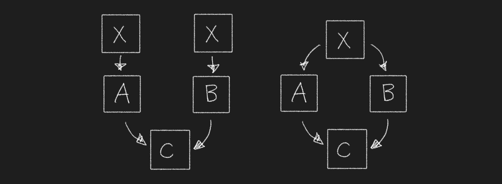

# Today I Learned

[](https://chanul.gitbook.io/til/)

* 매일 배우고 기록하고 정리한다.
* 새로운 개발 지식을 쌓아둔다.
* 쌓아둔 개발 지식을 정리한다.

<hr>

## 22.07.13 : template

>template는 함수나 클래스를 개별적으로 다시 작성하지 않아도, 여러 자료형으로 사용할 수 있도록 만들어 놓은 틀이다.  
>template는 Function Template와 Class Template로 나뉘어진다.  
>template 매개변수는 타입을 인수로 전달하는데 사용할 수 있는 특별한 종류의 매개변수이다. 
>template를 선언하는 형식은 다음과 같다. 
>
>```cpp
>template <class identifier> function_declaration;
>template <typename identifier> function_declaration;
>```
>
>### Function Template
>
>함수를 정의할 때, 함수의 기능은 명확하지만 자료형을 모호하게 둔다. 
>c++에서는 다형성의 오버로딩 특성에 의해서 함수 이름이 같아도 되기 때문에 다음과 같이 함수를 정의하게 된다.  
>
>```cpp
>int sum(int a, int b)
>{
>    return (a + b);
>}
>
>double sum(double a, double b)
>{
>    return (a + b);
>}
>```
>
>인자의 타입을 다르게 하여 같은 이름의 함수를 반복적으로 정의해야 한다. 이렇게 반복해야하는 문제를 해결하기 위해 >template를 사용한다. 다음은 위의 코드를 template로 작성한 코드이다.  
>
>```cpp
>template <typename T>
>T sum(T a, T b)
>{
>    return (a + b);
>}
>```
>
>두개의 인자가 타입이 다른 경우
>
>```cpp
>template <class T1, class T2>
>void printAll(T1 a, T2 b)
>{
>    cout << "T1: " << a << endl;
>    cout << "T2: " << b << endl;
>}
>```
>
>이 함수 템플릿을 사용하기 위해서는 다음과 같은 형식을 사용한다.
>
>```cpp
>function_name <type> (parameters);
>```
>
>만약에 위에 구현된 함수를 호출하는 경우에는 다음과 같이 작성할 수 있다. 
>
>```cpp
>int x, y;
>sum <int> (x, y);
>```
>
>컴파일러는 템플릿 함수에 대한 호출을 만나면 실제 템플릿 매개 변수로 전달된 타입으로 대체하는 함수를 자동으로 생성한 다음 호출한다. 
>
>```cpp
>
>template <class T>
>T sum(T a, T b)
>{
>    T   result;
>    result = a + b;
>    return (result);
>}
>
>int main(void)
>{
>    int i=5, j=10, k;
>    long x=5, y=10, z;
>
>    k = sum<int>(i, j);
>    z = sum<long>(x, y);
>
>    std::cout << k << std::endl;
>    std::cout << z << std::endl;
>    return (0);
>}
>```
>
>위의 예에서는 함수 템플릿 sum()을 두번 사용했다. 처음에는 int 타입의 인수를 사용하고, 다음은 long 타입의 인수를 사용했다. 컴파일러는 적절한 함수를 인스턴스화한 다음에 호출한다. `T` 타입이 sum() 템플릿 함수안에서 객체를 선언하는 데에도 사용된다.  
>
>컴파일러는 각 호출에 필요한 타입을 자동으로 결정한다. 템플릿 함수가 동일한 타입의 인수가 들어올 것이라고 예상하고 있기 때문에 다른 타입의 인수를 보내면 컴파일 에러가 발생한다. 만약에 두 인수의 타입을 다르게 한다면 다음과 같이 둘 이상의 타입 매개 변수를 허용하는 함수 템플릿을 정의할 수도 있다.  
>
>```cpp
>template <class T, class U>
>T GetMin(T a, U b)
>{
>    return (a<b?a:b);
>}
>```
>
>이 경우에 다른 두 매개변수를 허용하고 함수는 T 유형의 객체를 반환한다.  
>
>### 클래스 템플릿
>
>클래스 템플릿을 작성하여 템플릿 매개변수를 유형으로 사용하는 맴버를 가질 수 있다.  
>
>```cpp
>template <class T>
>class mypair {
>    T values [2];
>  public:
>    mypair (T first, T second)
>    {
>      values[0]=first; values[1]=second;
>    }
>};
>```
>
>이 클래스의 객체를 선언하여 사용하려면 다음과 같이 작성할 수 있다. 
>
>```cpp
>mypair<int> myobject (115, 36);
>
>mypair<double> myfloats (3.0, 2.18);
>```
>
>클래스 템플릿 선언의 외부에 함수 맴버를 정의한다면 정의 앞에 템플릿 <...> 점두사를 붙여야 한다.  
>
>```cpp
>// class templates
>#include <iostream>
>using namespace std;
>
>template <class T>
>class mypair {
>    T a, b;
>  public:
>    mypair (T first, T second)
>      {a=first; b=second;}
>    T getmax ();
>};
>
>template <class T>
>T mypair<T>::getmax ()
>{
>  T retval;
>  retval = a>b? a : b;
>  return retval;
>}
>
>int main () {
>  mypair <int> myobject (100, 75);
>  cout << myobject.getmax();
>  return 0;
>}
>```
>
>### 템플릿 전문화
>
>다음은 클래스 템플릿 전문화에 사용되는 구문이다.
>
>```cpp
>template <> class mycontainer <char> { ... };
>```
>
>클래스 템플릿 이름 앞에 빈 template<> 매개변수 목록이 된다. 템플릿 전문화를 명시적으로 선언하는 것이다. 이 접두사보다 더 중요한 것은 클래스 템플릿 이름 위에있는 <char> 매개변수이다. 이 특수화 매개변수 자체는 템플릿 클래스 특수화를 선언할 유형을 식별한다. 일반 클래스 템플릿과 전문화 간의 차이점을 확인할 수 있다. 
>
>```cpp
>template <class T> class mycontainer { ... };   // 일반 템플릿
>template <> class mycontainer <char> { ... };   // 전문화
>```
>
>### 템플릿에 대한 비유형 매개변수
>
>유형을 나타내는 class 또는 typename 키워드 대신에 일반 타입 매개변수를 가질 수도 있다. 일반 타입 매개변수를 설정하면 다음과 같이 정의된다.
>
>```cpp
>template <class T=char, int N=10> class mysequence { ... };
>```
>
>


[template에 관하여](https://blockdmask.tistory.com/43)

## 22.07.12 : 왜 예외를 쓰는 게 좋을까요?
> 
> c++에 예외가 도입된 이유를 생각해볼 필요가 있다. Java와 c# 같은 언어가 c++의 예외를 물려받은 이유는 결함내성 소프트웨어를 쉽게 작성하기 위함이다. 에러 처리를 한 후에도 일관성있는 상태를 유지해야 한다는 사실은 결함 내성을 달성하기 까다롭게 만든다.  
> 
> 어떤 파일을 열고 데이터를 읽어들이는 C코드를 생각해본다.
> 
> ```cpp
> char*
> OpenAndRead(char* fn, char* mode)
> {
>   FILE* fp = fopen(fn, mode);
>   char *buf = malloc(BUF_SZ);
>   fgets(buf, BUF_SZ, fp);
>   return buf;
> }
> ```
> 
> OpenAndRead()는 모든 서브루틴이 잘 수행된다는 가정을 한다면 잘 작동하고 읽기 쉽다. 하지만 fn 파일이 없는 경우, malloc()이나 fgets()가 실패되어 에러가 발생할 가능성이 있다. 이 코드를 결함내성이 있게 만드려면 각 서브루틴이 호출된 후에 에러가 발생하는지 확인하고, 어떤 행동을 해야하는지 결정해야한다. 단순히 에러 메시지를 출력하고 자원을 해제한 후에 -1을 반환하도록 바꾸어 보면 다음과 같을 것이다.  
> 
> ```cpp
> int
> OpenAndRead(char* fn, char* mode, char** data)
> {
>   *data = NULL;
>   char* buf = NULL;
>   FILE* fp = fopen(fn, mode);
>   if (!fp) {
>     printf("Can't open %s\n", fn);
>     return -1;
>   }
>  
>   buf = malloc(BUF_SZ);
>   if (!buf) {
>     printf("Can't allocate memory for data\n");
>     fclose(fp);
>     return -1;
>   }
>  
>   if (!fgets(buf, BUF_SZ, fp)) {
>     printf("Can't read data from %s\n", fn);
>     free(buf);
>     fclose(fp);
>     return -1;
>   }
>  
>   *data = buf;
>  
>   return 0;
> }
> ```
> 
> 이 코드는 에러를 처리하지만 읽기 어렵다. 알고리즘과 에러 처리가 섞여있기 때문인데 이 문제를 예외를 발생시키는 방법으로 변경할 수 있다.  
> 
> ```cpp
> int
> OpenAndRead(char* fn, char* mode, char** data)
> {
>   *data = NULL;
>   char* buf = NULL;
>   FILE* fp = NULL;
>   try {
>     fp = fopen(fn, mode);
>     buf = malloc(BUF_SZ);
>     fgets(buf, BUF_SZ, fp);
>     *data = buf;
>     return 0;
>   }
>   catch (const FileDoesNotExist&) {
>     printf("Can't open %s\n", fn);
>   }
>   catch (const FileNotAccessible&) {
>     printf("The access %s is not permissible for %s\n", mode, fn);
>   }
>   catch (const MemoryExhausted&) {
>     printf("Can't allocate memory for data\n");
>     fclose(fp);
>   }
>   catch (const EndOfFile&) {
>     printf("Can't read data from %s\n", fn);
>     fclose(fp);
>     free(buf);
>   }
>  
>   return -1;
> }
> ```
> 
> OpenAndRead() 주 제어 흐름이 에러 처리와 분리되어 읽기 쉬워졌다. 하지만 아직 라인 수가 많다. 여기에서 예외가 발생했을 때 이루어지는 스택 풀기 과정을 이해하면 코드 라인 수를 줄일 수 있다.  
> 
> 스택 풀기는 예외가 발생하면 예외 처리기를 만나기 전까지 스택을 풀어가는 과정을 말한다. c++ 에서는 try 영역에서 생성된 모든 자동 객체들에 대해 소멸자를 불러온다. 자동 객체들은 생성되었던 반대 순서로 소멸된다.  
> 
> 자원을 소유하는 객체들을 자동 객체로 정의하면 예외가 발생하더라도 자동적으로 소멸된다. 이런 프로그래밍을 가능하게 만드는 자원 소유 객체들이 파일이나 메모리에 이미 정의되어 있다. 파일 자원용으로 std::fstream, 메모리 자원용으로는 boost::scoped_ptr을 사용할 수 있다. 이 객체를 사용하면 다음과 같이 구현할 수 있다.  
> 
> ```cpp
> char*
> OpenAndRead(const std::string& fn, std::ios_base::openmode mode)
> {
>   try {
>     std::fstream fs(fn.c_str(), mode);
>     boost::scoped_ptr buf(new char[BUF_SZ+1]);
>     fs.getline(buf.get(), BUF_SZ);
>     return buf.get();
>   }
>   catch (const std::ios_base::failure&) {
>     std::cout << "Can't open or read data from " << fn << std::endl;
>   }
>   catch (const std::bad_alloc&) {
>     std::cout << "Can't allocate memory for data" << std::endl;
>   }
>  
>   return 0;
> }
> ```
> 
> c++ 런타임이 모든 자원 해제를 알아서 해주기 때문에 에러 코드에 자원 해제 코드를 추가하지 않아도 된다. OpenAndRead()가 상당히 간단해졌다.  
> 
> 예외를 사용하는 경우에 다음과 같은 문제도 해결할 수 있다. 만약에 에러가 발생한 원인을 알고 싶지만 OpenAndRead를 호출하는 시점이 멀리 떨어져 있다면 어떻게 원인을 알 수 있는지 생각할 수 있다. 다음과 같은 상황에서는 원인을 파악할 수 없다.
> 
> ```cpp
> int
> OpenAndRead(char* fn, char* mode, char** data)
> {
>   *data = NULL;
>   char* buf = NULL;
>   FILE* fp = fopen(fn, mode);
>   if (!fp) {
>     printf("Can't open %s\n", fn);
>     return -1;
>   }
>  
>   buf = malloc(BUF_SZ);
>   if (!buf) {
>     printf("Can't allocate memory for data\n");
>     fclose(fp);
>     return -2;
>   }
>  
>   if (!fgets(buf, BUF_SZ, fp)) {
>     printf("Can't read data from %s\n", fn);
>     free(buf);
>     fclose(fp);
>     return -3;
>   }
>  
>   *data = buf;
>  
>   return 0;
> }
>  
> char* foo(char* fn, char* mode)
> {
>   char* data = 0;
>   if (OpenAndRead(fn, mode, &data) >= 0)
>     return data;
>   else
>     return 0;
> }
>  
> void bar()
> {
>   ...... // fn과 mode를 얻어낸다
>   char* data = foo(fn, mode);
>   if (data) {
>     ...... // 정상 처리
>   }
>   else {
>     ...... // bar()가 뭘 할 수 있을까요?
>   }
> }
> ```
> 
> OpenAndRead()는 반환 코드를 통해서 에러를 구분하려 하지만 foo()에서 무시하여 bar()는 무슨 일이 일어났는지 알 수 없다. bar()가 할 수 있는 일은 에러 메시지를 출력하고 종료하거나 에러를 무시할 수 밖에 없다. 이런 문제는 예외를 사용하여 해결할 수 있다. 호출 경로상의 어떤 함수가 예외를 처리하지 않고 무시하면 된다. OpenAndRead()와 foo()는 예외를 어떻게 처리해야 할지 모른다고 가정하고, bar()는 처리할 수 있다고 가정한다면 다음과 같이 구현된다.  
> 
> ```cpp
> char*
> OpenAndRead(const std::string& fn, std::ios_base::openmode mode)
> {
>   std::fstream fs(fn.c_str(), mode); // std::ios_base::failure() 가 발생할지 모릅니다.
>   boost::scoped_ptr buf(new char[BUF_SZ+1]);  // std::bad_alloc() 가 발생할지 모릅니다
>   fs.getline(buf.get(), BUF_SZ);
>   return buf.get();
> }
>  
> char* foo(char* fn, char* mode)
> {
>   // 아무런 예외도 잡지 않고 있습니다
>   return OpenAndRead(fn, mode);
> }
>  
> void bar()
> {
>   ...... // fn과 mode를 알아냅니다
>   try {
>     char* data = foo(fn, mode);
>   }
>   catch (const std::ios_base::failure&) {
>     std::cout << "Can't open or read data from " << fn << std::endl;
>     // 왜 fn 열어서 데이터를 읽으려고 했는지를 안다면 좀 더 정확한 진단 메시지를 출력하고,
>     // 사용자에게 뭔가 조치를 취하라고 알려줄 수 있습니다
>   }
>   catch (const std::bad_alloc&) {
>     std::cout << "Can't allocate memory for data" << std::endl;
>     // 이런 경우를 대비해 메모리를 미리 따로 마련해 놓았다면 bad_alloc()를 
>     // 좀 더 부드럽게 처리할 수도 있을 것입니다.
>   }
> }
> ```
> 
> 이제는 OpenAndRead()와 foo()가 다시 간단해졌고, bar()만 에러 처리에 관여하고 있다. 그리고 예외가 무엇을 의미하는지 알고 충분한 상황 정보가 있기 때문에 예외를 잘 처리할 수 있다.  
> 
> 또 한가지 예외의 장점은 객체라는 점이다. 객체이기 때문에 많은 정보를 담아서 발생시키면 정확한 에러 상황을 알 수 있다. 예외 처리기는 그 정보들이 접근하여 어떤 일이 벌어지고 있는지 정확히 알아내는데 도움이 된다.  
> 
> 
> ## intptr_t, uintptr_t
> 
> intptr_t와 uintptr_t는 포인터의 주소를 저장하는데 사용된다.  
> 안전한 포인터 선언 방법으로 제공하기 때문에 포인터를 정수 표현으로 변환할 때 유용하게 사용할 수 있다. 포인터 주소를 정수값으로 가지고 있기 때문에 연산이 가능하다. 특히 비트연산을 하는 경우에 사용된다. 비트 연산은 unsigned에서 더 잘 수행되기 때문에 uintptr_t를 하면 된다.  
> 
> 다음 예시는 포인터가 포인터 배열인지 테스트한다.
> ```cpp
> #define N  10
> char special[N][1];
> 
> // UB as testing order of pointer, not of the same array, is UB.
> int test_special1(char *candidate) {
>   return (candidate >= special[0]) && (candidate <= special[N-1]);
> }
> 
> // OK - integer compare
> int test_special2(char *candidate) {
>   intptr_t ca = (intptr_t) candidate;
>   intptr_t mn = (intptr_t) special[0];
>   intptr_t mx = (intptr_t) special[N-1];
>   return (ca >= mn) && (ca <= mx);
> }
> ```
> 
> [what is the use of intptr_t?](https://stackoverflow.com/questions/35071200/what-is-the-use-of-intptr-t)
> 


## 22.07.09 : Overloading, Overriding
> 
> overloading과 overriding은 이름이 비슷해서 헷갈리는 경우가 있다.  
> overloading은 같은 이름의 함수를 여러개 정의하고, 매개변수의 유형과 개수를 다르게하여 다양한 유형의 호출에 응답할 수 있게 만든다.  
> overriding은 상위 클래스가 가지고 있는 맴버함수를 하위 클래스의 메서드로 재정의해서 사용한다. 부모 클래스의 메서드를 무시하고 자식 클래스의 메서드 기능을  사용한다.  
> 
> overloading은 매서드의 이름만 같고, 매개변수와 리턴 타입이 달라도 되지만 override는 메서드 이름과 매개변수, 리턴타입이 모두 같아야 한다.  
> 
> [오버로딩과 오버라이딩의 차이와 예제](https://private.tistory.com/25)
> 
## 22.07.05 : this 포인터
> 
> c++에서 클래스의 멤버 함수를 호출할 때 객체를 어떻게 찾을까?  
> 숨겨진 포인터인 this를 사용한다. 멤버 함수를 컴파일 단계에서 다음과 같이 변환한다.  
> 
> ```cpp
> void func(int i)
> {
> 	val = i;
> }
> 
> obj.func(10);
> ```
> 
> ```cpp
> void func(Simple* const this, int i)
> {
> 	this->val = i;
> }
> 
> obj.func(&obj, 10);
> ```
> 
> 멤버 함수의 인수로 객체의 주소가 전달된다. 멤버 함수의 정의도 컴파일러에 의해 변환된다. 객체에 this 포인터를 추가하여 멤버 함수 안의 변수가 맴버 함수를 호출한  객체를 참조하도록 한다.  
> 그러나 명시적으로 this를 참조해야하는 경우가 있다.  
> 
> 1. 멤버 변수와 이름이 같은 매개 변수를 가진 멤버 함수
> 
> ```cpp
> void func(int val)
> {
> 	this->val = val;
> }
> 
> // this->val : 멤버 변수
> // val       : 매개 변수
> ```
> 
> 2. 멤버 함수 체이닝 기법
> 
> 멤버 함수가 this를 반환하면 체이닝 기능이 있는 함수를 만들 수 있다.  
> 
> ```cpp
> Simple& func(int val)
> {
> 	this->val += val;
> 	return (*this);
> }
> ```
> 
> ```cpp
> int main(void)
> {
> 	Simple obj;
> 	
> 	obj.func(10).func(5).func(1);
> 	std::cout << obj.getValue() << std::endl;
> 	return (0);
> }
> ```
> 
> [this 포인터](https://boycoding.tistory.com/250)
> 


## 22.07.03 : 고정 소수점의 사칙연산
> 
> 소수점 연산을 빠르게 처리해야하는 상황에서 고정 소수점 연산은 부동 소수점 연산에 비해 2~3배 이상 속도 차이가 난다.  
> 부동 소수점 연산은 실수형 숫자를 저장하는 방식이 정수형에 비해 매우 복잡하다.  
> 그래픽에서 부동 소수 계산은 필수적이고 계산량이 많기 때문에 빠르게 부동 소수를 처리하는 방법을 고안했다.  
> 그 방법이 고정 소수점 연산이다.  
> 
> 고정 소수점 연산이란 정수형을 이용하여 소수의 정수부와 소수부를 저장하도록 하는 수치해법적인 방법이다.  
> 복잡한 실수형 연산을 단순한 정수의 사칙연산으로 간소화하는 방법이다.  
> 
> ### 고정 소수점
> 
> 고정 소수점은 특정 숫자의 소수점 위치를 고정하는 방식이다.  
> 소수점 위치의 설정은 사용자가 임의대로 정하면 된다.  
> 
> 
> 
> Sign - 부호를 표현하기 위한 비트
> IWL - Integer Word Length, 정수부를 표현하는 비트 수
> FWL - Fractional Word Length, 소수부를 표현하는 비트 수
> WL - Word Length, 전체 비트 수
> 
> ### 사칙 연산
> 
> 고정 소수점의 덧셈, 뺄셈은 정수의 덧셈, 뺄셈과 완전히 동일하다. 따라서 다른 구현이 필요하지 않다.  
> 그러나 곱셈과 나눗셈의 경우는 그렇지 않다. 고정 소수점의 곱셈과 나눗셈의 과정에서 손실없이 정확한 결과를 얻기 위해서는 다른 방법을 사용해야 한다.  
> 16비트의 공간을 사용한 고정 소수점은 연산을 위해 2배인 32비트 크기의 여분 공간을 활용하여 진행한다.  
> 곱셈과 나눗셈의 과정을 보면 복잡하지만 결과값의 소수점 위치에 집중한다면 간단하게 구현할 수 있다.  
> 
> 같은 IWL을 가진 고정 소수점 끼리의 연산을 가정한다. 그렇다면 이들은 FWL도 같다.  
> FWL을 L이라고 정하고, 소수점을 찍지 않은 상태의 정수 값을 각각 a, b라고 한다면 다음과 같이 고정 소수점 수를 분수로 나타낼 수 있다.  
> 
>   
>   
> 
> 그림에서 보이듯이 덧셈과 뺄셈은 정수와 동일하게 진행되지만 곱셉과 나눗셈의 경우에는 추가적인 연산이 필요하다. 그리고 연산 과정 중에 데이터 손실이 일어날 수 있다.  
> 곱셈은 $a \times b$ 에 $2^L$ 을 나누어주고, 나눗셈은 $a \times 2^L$ 를 계산하고  $b$ 를 나누어준다.  
> 이때 연산을 위한 여분의 공간이 없다면 overflow가 발생하여 원하는 값을 얻지 못할 수 있다.  
> 
> 64bit를 지원하지 않는 컴파일러를 사용해야하는 상황에서 32bit로 이 문제를 해결해본다.  
> bit shift를 이용하여 곱셈과 나눗셈을 한다면 두개의 32bit를 연결할 수 있다.  
> 
> 
> 
> [게임 프로그래밍을 위한 고정 소수점 연산](https://m.blog.naver.com/PostView.naver?isHttpsRedirect=true&blogId=lhj321&logNo=50102267173)  
> [고정 소수점의 사칙 연산](http://arkainoh.blogspot.com/2017/11/fixed-point.html#:~:text=%EA%B3%A0%EC%A0%95%20%EC%86%8C%EC%88%98%EC%A0%90%EC%9D%98%20%EC%82%AC%EC%B9%99%EC%97%B0%EC%82%B0&text=%EB%B3%B5%EC%9E%A1%ED%95%9C%20%EC%8B%A4%EC%88%98%EC%9D%98%20%EC%82%AC%EC%B9%99%EC%97%B0%EC%82%B0,%EC%9D%98%20%EA%B2%BD%EC%9A%B0%EB%8A%94%20%EA%B7%B8%EB%A0%87%EC%A7%80%20%EC%95%8A%EB%8B%A4.)  

## 22.07.01 : 이진 나눗셈
> 
> 이진 나눗셈이 십진수의 나눗셈과 큰 차이가 있지는 않지만 알고리즘이 생각만큼 이해하기 쉽지 않다.  
> 특히 음수와 양수의 나눗셈, 혹은 음수끼리의 나눗셈까지 고려해야한다면 더욱 그렇다.  
> 
> $13 \div 5$ 를 5bit의 이진수로 간단히 나타내보면 $01101 \div 00101$ 이다.  
> 이를 Shift Operator를 이용하여 계산해본다.  
> 
> 몫은 Quotient이므로 $Q$로 나타내고, 제수는 Divisor이므로 $D$, 나머지는 Reminder이므로 $R$로 나타낸다.  
> $D$가 5bit이면 $Q$와 $R$을 5bit로 정할 수 있다.  
> 
> |  $R$  |  $Q$  |  $D$  |
> | :---: | :---: | :---: |
> | 00000 | 01101 | 00101 |
> 
> $R$ 과 $Q$ 가 구분되어 있지만 사실은 아래처럼 연결되어 있는 상태이며, 계산 과정에서도 아래와 같은 상황에 있다고 생각해야 한다.  
> 
> |   $R, Q$    |  $D$  |
> | :---------: | :---: |
> | 00000 01101 | 00101 |
> 
> ## Step 1
> 
> $R$ 과 $Q$ 를 왼쪽으로 1비트씩 움직인다.  
> ( $00000\;01101 << 1 = 00000\;11010$ )
> 
> |  $R$  |  $Q$  |  $D$  |
> | :---: | :---: | :---: |
> | 00000 | 11010 | 00101 |
> 
> $R$ 과 $D$ 를 비교해보면 $R$ 이 더 작으므로 넘어간다.  
> 
> ## Step 2
> 
> $R$ 과 $Q$ 를 왼쪽으로 1비트씩 움직인다.  
> ( $00000\;11010 << 1 = 00001\;10100$ )
> 
> |  $R$  |  $Q$  |  $D$  |
> | :---: | :---: | :---: |
> | 00001 | 10100 | 00101 |
> 
> $R$ 과 $D$ 를 비교해보면 $R$ 이 더 작으므로 넘어간다.  
> 
> ## Step 3
> 
> $R$ 과 $Q$ 를 왼쪽으로 1비트씩 움직인다.  
> ( $00001\;10100 << 1 = 00011\;01000$ )
> 
> |  $R$  |  $Q$  |  $D$  |
> | :---: | :---: | :---: |
> | 00011 | 01000 | 00101 |
> 
> $R$ 과 $D$ 를 비교해보면 $R$ 이 더 작으므로 넘어간다.  
> 
> ## Step 4
> 
> $R$ 과 $Q$ 를 왼쪽으로 1비트씩 움직인다.  
> ( $00011\;01000 << 1 = 00110\;10000$ )
> 
> |  $R$  |  $Q$  |  $D$  |
> | :---: | :---: | :---: |
> | 00110 | 10000 | 00101 |
> 
> $R$ 과 $D$ 를 비교해보면 $R >= D$ 이므로 $Q$ 의 첫째자리 bit를 1로 바꾼다.  
> 
> |  $R$  |   $Q$   |  $D$  |
> | :---: | :-----: | :---: |
> | 00110 | 1000`1` | 00101 |
> 
> $R$ 를 $D$ 만큼 빼준다.
> 
> |   $R$   |  $Q$  |  $D$  |
> | :-----: | :---: | :---: |
> | `00001` | 10001 | 00101 |
> 
> ## Step 5
> 
> $R$ 과 $Q$ 를 왼쪽으로 1비트씩 움직인다.  
> ( $00001\;10001 << 1 = 00011\;00010$ )
> 
> |  $R$  |  $Q$  |  $D$  |
> | :---: | :---: | :---: |
> | 00011 | 00010 | 00101 |
> 
> $R$ 과 $D$ 를 비교해보면 $R$ 이 더 작으므로 넘어간다.  
> $D$ 가 5bit이므로 5번째 연산에서 멈춘다.  
> 이렇게 비트연산을 통하여 나머지와 몫을 구할 수 있다.  
> 

## 22.06.27 : c++ 타입 캐스팅
> 
> c 언어에서 사용하는 타입 캐스팅 방식을 c++에서 사용할 수 있지만 타입 캐스팅을 위한 연산자가 따로 제공된다. (static_cast, dynamic_cast, reinterpret_cast, const_cast)  
> 기존에 사용하는 c 스타일의 방식은 의도를 파악하기 어렵고, 가차없이 진행되지만 c++ 스타일의 방식으로 조금더 안정적인 코드를 작성할 수 있다.  
> 
> ## static_cast 연산자
> 
>  - 컴파일 단계에서 타입 캐스팅이 적합한지 검사하고 에러를 발생시킨다.  
>  - 기본 자료형 간의 타입 캐스팅에 사용된다. 
>  - 포인터 타입을 다른 타입으로 변환하지 않는다.
>  - 상속 관계에 있는 포인터 간의 변환이 가능하다.
>  - downcast시에는 unsafe하게 동작할 수 있다.  
> 
> ```cpp
> double  d = 3.14;
> int     x = static_cast<int>(d);
> 
> std::cout << x << std::endl;  // 3
> ```
> 
>  - 부모-자식 클래스 간의 타입 캐스팅을 지원하여 컴파일은 가능하지만 안전하지 않다.
>  - `부모 -> 자식`, `자식 -> 부모` 모두 가능하다.
>  - `부모 -> 자식`의 경우에 자식 클래스의 속성에 임의의 값이 들어간다.
> 
> ### 부모 -> 자식 형변환
> 
> ```cpp
> class	Parent
> {
> 	private :
> 		int	x;
> 	public :
> 		Parent(int x) : x(x)
> 		{
> 		}
> 		void	print_x(void)
> 		{
> 			std::cout << "x: " << x << std::endl;
> 		}
> };
> 
> class	Child : public Parent
> {
> 	private :
> 		int	y;
> 	public :
> 		Child(int x, int y) : Parent(x), y(y)
> 		{
> 		}
> 		void	print_point(void)
> 		{
> 			Parent::print_x();
> 			std::cout << "y: " << y << std::endl;
> 		}
> };
> 
> int	main(void)
> {
> 	Parent*	p1 = new Child(10, 20);
> 	Child*	c1 = static_cast<Child*>(p1);
> 	c1->print_point();
> 	
> 	Parent*	p2 = new Parent(10);
> 	Child*	c2 = static_cast<Child*>(p2);
> 	c2->print_point();
> }
> 
> // c2->y 에는 임의의 값이 들어간다.
> ```
> 
> ### Errors
> 
> ```cpp
> double	d = 3.14;
> double	*ptr = &d;
> int		*x = static_cast<int*>(d);
> 
> std::cout << x << std::endl;
> /*
> <컴파일 에러>
> error: cannot cast from type 'double' to pointer type 'int *'
> */
> ```
> 
> ```cpp
> double	d = 3.14;
> double	*ptr = &d;
> int		*x = static_cast<int*>(ptr);
> 
> std::cout << x << std::endl;
> /*
> <컴파일 에러>
> error: static_cast from 'double *' to 'int *' is not allowed
> */
> ```
> 
> ## dynamic_cast 연산자
> 
> - 상속 관계에서 static_cast보다 안정적으로 타입 캐스팅을 처리한다. 
> - `자식 -> 부모` 변환에서 safe downcasting이 가능하다.
> - dynamic_cast는 런타임에서 안정성 검사를 진행한다.  
> - 컴파일 시점에는 변환하려는 클래스가 다향성 클래스인지 검사한다.
> - 런타임 시간에 해당 타입이 다운 캐스팅이 가능한지 검사하기 때문에 런타임 비용이 조금 높다.
> - 성공할 경우 new_type의 value를 반환한다.
> - 실패한 경우 
>   - new_type이 포인터라면 null pointer
>   - new_type이 참조라면 bad_cast (exception) 
> 
> ```cpp
> int	main(void)
> {
> 	Parent*	p1 = new Child(10, 20);
> 	Child*	c1 = dynamic_cast<Child*>(p1); 
> 	// 컴파일 에러: error: 'Parent' is not polymorphic
> 
> 	c1->print_point();
> 	
> 	Parent*	p2 = new Parent(10);
> 	Child*	c2 = dynamic_cast<Child*>(p2);
> 	// 컴파일 에러: error: 'Parent' is not polymorphic
> 
> 	c2->print_point();
> }
> ```
> 
> - dynamic_cast는 가상 함수를 가진 다향성 클래스에 한해서는 `부모 -> 자식` 타입 캐스팅을 허용한다.  
> 
> ```cpp
> Parent*	p1 = new Child(10, 20);
> Child*	c1 = dynamic_cast<Child*>(p1); // error: 'Parent' is not polymorphic
> ```
> 
> ```cpp
> class	Parent
> {
> 	// ...
> 	
> 	virtual void	print_x(void) // 가상 함수
> };
> ```
> 
> ```cpp
> Parent*	p1 = new Child(10, 20);
> Child*	c1 = dynamic_cast<Child*>(p1); // 컴파일 성공
> ```
> 
> - 부모 객체를 자식 클래스로 변환하면 컴파일을 성공하지만 null pointer가 반환된다.
> 
> ```cpp
> Parent	*p2 = new Parent(10);
> ChildA	*c2 = dynamic_cast<ChildA *>(p2); 
> 
> std::cout << "isNull: " << (c2 == NULL ? "true" : "false") << std::endl;
> 
> // isNull: true
> ```
> 
> [dynamic_cast](https://blockdmask.tistory.com/241?category=249379)
> 
> ## reinterpret_cast 연산자
> 
> - 포인터/참조의 타입 캐스팅 연산자로서 타입을 재해석하는 수준으로 변환을 진행한다.  
> - 변환을 강제하기 때문에 안전하지 않다.  
> 
> ```cpp
> Person*	person = new Person();
> int*	i = reinterpret_cast<int*>(person);
> ```
> 
> ## const_cast 연산자
> 
>  - 포인터 또는 참조형의 const를 잠시 제거하는데 사용된다.
>  - volatile 키워드를 잠시 제거하는데에도 사용 가능하다.
>  - 다른 형변환 연산자처럼 타입을 변형하지 못한다.
>  - 함수 포인터에는 사용하지 못한다.
> 
> ```cpp
> char        str[] = "hello";
> const char* str1 = str;
> char*		    str2 = const_cast<char*>(str1);
> 
> str2[0] = 'H';
> std::cout << str << std::endl;  // Hello
> std::cout << str1 << std::endl; // Hello
> ```
> 
> ### Errors
> 
> ```cpp
> int  main(void)
> {
>   int	      i = 0;
>   const int *ptr = &i;
>   double    *d = const_cast<double *>(ptr);
> 
>   std::cout << d << std::endl;
>   return (0);
> }
> 
> /*
> < 컴파일 에러 >
> error: const_cast from 'const int *' to 'double *' is not allowed
> */
> ```
> 
> ```cpp
> int  main(void)
> {
>   int	      i = 0;
> 	const int *ptr = &i;
> 	double    *d = const_cast<double>(ptr);
> 
> 	std::cout << d << std::endl;
>   return (0);
> }
> 
> /*
> < 컴파일 에러 >
> error: const_cast to 'double', which is not a reference,
>       pointer-to-object, or pointer-to-data-member
> */
> ```
> 
> [c++ 형변환 연산자 정리](https://mynameisdabin.tistory.com/20)
> 

## 22.06.24 : c++ 난수 생성

> 
> ## rand 함수
> 
> ```cpp
> #include <cstdlib>
> 
> int	rand(void);
> 
> // 반환 : [0 ~ RAND_MAX] 범위에서 랜덤한 숫자
> ```
> 
> RAND_MAX는 stdlib.h 헤더 파일에 32767으로 작성되어있다. 0부터 32767 사이에서 랜덤한 값을 얻을 수 있지만 프로그램이 생성되는 시점에 정해져서 프로그램을 여러번 실행시켜도 같은 값을 반환한다.  
> 
> ```cpp
> #include <iostream>
> #include <cstdlib>
> 
> int	main(void)
> {
> 	std::cout << rand() << std::endl;
> 	std::cout << rand() << std::endl;
> 	std::cout << rand() << std::endl;
> 	return (0);
> }
> 
> // 16807
> // 282475249
> // 1622650073
> 
> // 프로그램을 계속 실행해도 같은 값이 나온다.
> ```
> 
> ## srand 함수
> 
> ```cpp
> #include <cstdlib>
> 
> void	srand(unsigned int seed);
> 
> // seed : srand는 seed값과 매칭되는 숫자를 정한다.
> ```
> 
> srand 함수에 매개변수로 들어오는 seed 값에 의해서 rand함수의 결과값이 달라진다.
> 
> ```cpp
> #include <iostream>
> #include <cstdlib>
> 
> int	main(void)
> {
> 	std::cout << rand() << std::endl;
> 	std::cout << rand() << std::endl;
> 	std::cout << rand() << std::endl;
> 	srand(1);
> 	std::cout << rand() << std::endl;
> 	srand(2);
> 	std::cout << rand() << std::endl;
> 	srand(3);
> 	std::cout << rand() << std::endl;
> 	srand(3);
> 	std::cout << rand() << std::endl;
> 	return (0);
> }
> 
> // 16807
> // 282475249
> // 1622650073
> // 16807
> // 33614
> // 50421
> // 50421
> 
> // srand으로 값을 변경하지만 같은 seed 값으로 변경된 rand() 값은 항상 동일하다.
> ```
> 
> 같은 seed 값은 동일한 랜덤값을 가지지만 만약에 항상 변하는 값을 seed로 넘겨준다면 원하는대로 호출할 때마다 랜덤한 값을 만들 수 있다.  
> 그래서 seed 값으로 시간 값을 넘겨주는 방법을 사용한다.  
> 
> ```cpp
> #include <iostream>
> #include <cstdlib>
> #include <time.h>
> 
> int	main(void)
> {
> 	srand((unsigned int)time(NULL));
> 	std::cout << rand() << std::endl;
> 	return (0);
> }
> 
> // 프로그램을 실행할 때마다 다른 랜덤값을 출력한다.
> ```
> 
> ```cpp
> #include <iostream>
> #include <cstdlib>
> #include <time.h>
> 
> int	main(void)
> {
> 	int	range = 10;
> 
> 	srand((unsigned int)time(NULL));
> 	std::cout << rand() % range << std::endl;
> 	return (0);
> }
> 
> // 랜덤한 값을 특정값으로 나눈 나머지를 가져오는 방식으로 랜덤값의 범위를 지정한다.
> ```


## 22.06.23 : 추상 클래스, 인터페이스
> 
> ### 추상 클래스
> 추상 클래스는 인스턴스화 할 수 없는 클래스로 하나 이상의 순수 가상 함수가 있다.  
> 순수 가상 함수는 파생 클래스에 의해 재정의되어야 하는 함수이다.  
> 
> ```cpp
> class AbstractClass
> {
> 	virtual void functionA() = 0;	// 순수 가상 함수
> 	virtual void functionB();		// 가상 함수
> 	void functionC();
> }
> ```
> 
> ### 인터페이스
> 인터페이스는 구현이 없이 가상 소멸자와 순수 가상 함수만 포함된다.  
> 모든 인터페이스에는 소멸자가 있어야 한다.  
> 
> ```cpp
> class InterfaceClass
> {
> 	public :
> 		virtual ~InterfaceClass();
> 		virtual void functionA() = 0;
> 		virtual void functionB() = 0;
> 		virtual void functionC() = 0;
> }
> ```
> 
> [Abstract class vs interface](https://cplusplus.com/forum/beginner/157568/)
> 

## 22.06.20 : 예외 처리
> 
> 프로그램 오류는 두가지로 나뉜다. 프로그래밍 실수로 인한 논리 오류와 프로그래머가 제어할 수 없는 런타임 오류이다.  
> 오류를 명시적으로 처리하지 않으면 프로그램이 경고없이 중단되거나 잘못된 데이터를 사용하여 잘못된 결과를 생성할 수 있기 때문에 예외를 사용하여 오류를 처리해야 한다.  
> 
> 예외 처리는 try, throw, catch를 사용한다.  
> try 내의 코드를 실행하고 throw되면 예외를 받을 catch를 찾는다.  
> throw 핸들러는 예외 객체와 같은 타입을 받는 catch를 찾으면 예외를 처리하고, 아니라면 terminate 함수가 호출되어 abort가 호출된다.  
> 
> ```cpp
> try 
> {	// 예외 발생 영역
> 
> 	// ...
> 	throw (예외 객체); // 예외 발생
> 	
> } 
> catch (예외 객체) 
> {	// 예외 처리 영역
> 
> 	// ...
> 	
> }
> ```
> 
> [예외 처리](http://www.tcpschool.com/cpp/cpp_exception_intro)  
> [함수 예외 처리, 스택 풀기](https://blog.hexabrain.net/179)  
> [terminate 함수](https://underin1365.tistory.com/15)  
> 
> ## 예외 처리 클래스 생성
> 
> throw로 발생된 예외 객체는 같은 타입의 객체를 받는 catch에서 처리된다.  
> 클래스를 정의하여 예외 객체로 사용할 수 있다.  
> 
> ```cpp
> class	Exception
> {
> 	public :
> 		virtual void report(void) // 오버라이딩을 위해 가상 함수로 선언
> 		{
> 			std::cerr << "Exception" << std::endl;
> 		}
> };
> 
> class	OtherException : public Exception
> {
> 	public :
> 		void report(void)
> 		{
> 			std::cerr << "Other Exception" << std::endl;
> 		}
> }
> 
> int	main(void)
> {
> 	try
> 	{
> 		throw Exception();
> 	}
> 	catch(Exception &e)
> 	{
> 		e.report();
> 	}
> }
> ```  
> [예외 처리 클래스](https://ansohxxn.github.io/cpp/chapter14-3/)
> 


## 22.06.19 : 순환 참조

> 헤더 파일들이 서로를 include하는 경우에 순환 참조가 발생한다. 이 경우에 전방 선언으로 include없이 포인터로 class를 선언하면 해결된다.  
> 
> ```cpp
> // A.h
> class B;
> 
> class A
> {
> 	void	call(B* obj);
> };
> 
> // B.h
> class A;
> 
> class B
> {
> 	void	call(A* obj);
> };
> ```


## 22.06.17 : CreateML, 인터페이스
> 
> # CreateML
> 
> Swift또는 macOS 플레이그라운드같이 친숙한 도구를 사용하여 Mac에서 맞춤형 기계 학습 모델을 생성하고 훈련할 수 있다.  
> 이미지 인식, 텍스트에서 의미 추출 또는 숫자 값 간의 관계 찾기와 같은 작업을 수행하도록 모델을 훈련할 수 있다.
> 
> 대표 샘플을 보여줌으로써 패턴을 인식하도록 모델을 훈련시킬 수 있다.  
> 모델을 훈련시킨 후에 새로운 데이터로 테스트하고 작업을 얼마나 잘 수행하는지 평가한다.  
> 모델이 충분히 잘 수행되면 CoreML을 사용하여 앱에 통합할 준비가 된 것이다.  
> 
>   
> 
> CreateML은 사진 및 Siri와 같은 Apple 제품에 내장된 기계 학습 인프라를 활용한다.  
> 이는 이미지 분류 및 자연어 모델이 더 작고 훈련하는 데 훨씬 더 적은 시간이 걸린다는 뜻이다.  
> 
> # CoreML
> 
> CoreML은 머신 러닝 알고리즘을 훈련 데이터 세트에 적용하여 모델을 생성한다.  
> 모델을 사용하여 새 입력 데이터를 기반으로 예측한다.  
> 모델은 코드로 작성하기 어렵거나 비현실적인 다양한 작업을 수행할 수 있다.  
> 예를 들어 사진을 분류하거나 픽셀에서 직접 사진 내의 특정 개체를 감지하도록 모델을 훈련할 수 있다.  
> 
> 
> 
> 모델을 만든 후 앱에 통합하고 사용자의 기기에 배포한다.  
> 앱은 CoreML API와 사용자 데이터를 사용하여 예측하고 모델을 훈련하거나 미세 조정한다.  
> 사용자의 기기에서만 모델을 실행하면 네트워크 연결이 필요하지 않으므로 사용자의 데이터를 비공개로 유지하고 앱의 응답성을 유지하는데 도움이 된다.  
> 
> CoreML은 도메인별 프레임워크 및 기능의 기반이 된다.  
> CoreML은 이미지 분석을 위한 Vision,  
> 텍스트 처리를 위한 Natural Language,  
> 오디오를 텍스트로 변환하기 위한 Speech,
> 오디오에서 소리를 식별하기위한 Sound Analysis가 있다.  
> 
> CoreML 자체는 Accelerate and BNNS와 Metal Performance Shaders와 같은 저수준 기본 요소를 기반으로 한다.  
> 
> 
> 
> # interface
> 
> `interface`는 특정 기능 구현을 약속하는 추상 형식이다.  
> 반드시 구현해야하는 기능 목록을 만들어서 이를 사용하는 클래스들이 기능을 구현하도록 하며, 구현하지 않는 경우 에어를 발생시킨다.  
> 다른 클래스를 작성할 때 기본이 되는 틀이 된다.  
> 
> ## 순수 가상 함수와 추상 클래스
> 
> 순수 가상 함수를 하나라도 가지고 있는 클래스를 추상 클래스라고 한다.  
> 추상 클래스는 다음과 같은 특징을 가지고 있다.
> 1. 순수 가상 함수를 선언한 클래스는 인스턴스 생성을 할 수 없다.  
> 2. 추상 클래스를 상속한 자식 클래스는 순수 가상 함수를 구현해야 인스턴스를 생성할 수 있다.
> 
> ```cpp
> // 추상 클래스
> class interface
> {
> 	public :
>       	// 순수 가상 함수 
> 		virtual void test() = 0;
> }
> ```
> 
> ## interface를 사용하는 이유
> 
> 객체 지향의 개념에 맞게 잘 정돈된 설계를 위해서 사용한다.  
> 인터페이스를 사용하지 않아도 가능하지만 나중에 재사용의 문제나 관리적 측면에서 편리하다.  
> 제품의 규격을 정해서 호환성을 높이는 일과 같다.  
> 
> 
> [c++ 추상 클래스에 대한 고찰](https://thrillfighter.tistory.com/172)  
> 

## 22.06.16 : virtual 키워드

> 
> # virtual 키워드
> 
> virtual 키워드를 함수에 붙이면 오버라이딩이 가능해진다.  
> 오버라이딩을 해야하는 이유는 부모 클래스 포인터가 자식 클래스를 가리키는 경우에 부모가 자식을 원할하게 사용하기 위함이다.  
> 
> ```cpp
> 
> class A
> {
> 	// ...
> };
> 
> class B : public A
> {
> 	// ...
> };
> 
> class C : public B
> {
> 	// ...
> }
> 
> int	main( void )
> {
> 	A *ptr = C();	// 부모 포인터가 자식을 가리키는 경우
> 	
> 	return (0);
> }
> 
> ```
> 
> 부모가 자식을 가리켜서 새롭게 정의된 자식의 기능을 사용할 수 있다면 불필요함을 줄일 수 있다.  
> 이를 다형성이라고 하며, 오버라이딩을 성립시켜주는 `virtual` 키워드로 구현된다.  
> `virtual` 키워드가 붙은 함수는 `동적 바인딩`되기 때문에 오버라이딩된다. 
> 
> ## 정적 바인딩과 동적 바인딩
> 
> 정적 바인딩은 컴파일 시점에 데이터 타입을 기준으로 실행될 함수를 정하지만  
> 동적 바인딩은 런타임 시점에 객체 타입을 기준으로 실행될 함수를 정한다.  
> 
> 함수는 컴파일 시점에 코드가 메모리에 저장되고, 함수를 호출하는 부분에 함수가 저장된 메모리 주소값이 저장된다.  
> 바인딩으로 함수를 호출하는 부분에 함수가 위치한 메모리 주소로 연결시켜줄 수 있다.  
> 
> ```
> 프로그램 실행 -> 함수 호출 -> 함수가 저장된 주소로 점프 -> 함수 실행 -> 원래 위치로
> ```
> 
> 정적 바인딩과 반대로 동적 바인딩은 실행 파일을 생성하는 시점에 바인딩하지 않고 보류 상태로 둔다.  
> 점프할 메모리를 저장하기 위해 따로 메모리 공간을 가지고 있는다.  
> 
> [정적 바인딩, 동적 바인딩](https://secretroute.tistory.com/entry/140819)  
> 
> ## virtual 소멸자 함수
> 
> 부모 클래스의 포인터로 자식 클래스를 호출할 때 가상 함수로 정의되지 않은 자식 클래스의 함수를 호출하면 부모 클래스의 멤버 함수가 호출된다.
> 소멸자도 자식 클래스의 소멸자가 아닌 부모 클래스의 소멸자가 호출된다.  
> 가상 함수로 소멸자가 사용되었다면 자식 클래스에서 재정의 될 수 있음을 명시하기 때문에 자식 클래스의 소멸자부터 차례대로 부모 클래스의 소멸자가 호출된다.  
> 
> <details>
> <summary>virtual 키워드가 없는 경우</summary>
> 
> ```cpp
> #include <iostream>
> 
> class A
> {
> 	public :
>     	~A( void )
>     	{
>     		std::cout << "destroyed A" << std::endl;
>     	}
> };
> 
> class B : public A
> {
> 	public :
> 		~B( void )
> 		{
> 			std::cout << "destroyed B" << std::endl;
> 		}
> };
> 
> class C : public B
> {
> 	public :
> 		~C( void )
> 		{
> 			std::cout << "destroyed C" << std::endl;
> 		}
> };
> 
> int	main( void )
> {
> 	A *a = new C();
> 	B *b = new C();
> 	C *c = new C();
> 	
> 	delete a;
> 	std::cout << std::endl;
> 	delete b;
> 	std::cout << std::endl;
> 	delete c;
> }
> 
> /* prints 
> 
> destroyed A
> 
> destroyed B
> destroyed A
> 
> destroyed C
> destroyed B
> destroyed A
> 
> */
> 
> ```
> </details>
> 
> 
> <details>
> <summary>virtual 키워드가 있는 경우</summary>
> 
> ```cpp
> #include <iostream>
> 
> class A
> {
> 	public :
>     	virtual ~A( void )
>     	{
>     		std::cout << "destroyed A" << std::endl;
>     	}
> };
> 
> class B : public A
> {
> 	public :
> 		~B( void )
> 		{
> 			std::cout << "destroyed B" << std::endl;
> 		}
> };
> 
> class C : public B
> {
> 	public :
> 		~C( void )
> 		{
> 			std::cout << "destroyed C" << std::endl;
> 		}
> };
> 
> int	main( void )
> {
> 	A *a = new C();
> 	B *b = new C();
> 	C *c = new C();
> 	
> 	delete a;
> 	std::cout << std::endl;
> 	delete b;
> 	std::cout << std::endl;
> 	delete c;
> }
> 
> /* prints 
> 
> destroyed C
> destroyed B
> destroyed A
> 
> destroyed C
> destroyed B
> destroyed A
> 
> destroyed C
> destroyed B
> destroyed A
> 
> */
> 
> ```
> </details>
> 
> [부모 클래스 소멸자에 virtual을 사용하는 이유](https://younggwan.tistory.com/45)  
> 
## 22.06.15 : 다중 상속, 가상 상속, 다이아몬드 상속 문제
> 
> ## 다중 상속
> 
> c++ 클래스는 2개 이상의 부모 클래스를 상속받을 수 있다.
> 
> ```cpp
> class A
> {
> 	// ...
> };
> 
> class B
> {
> 	// ...
> };
> 
> class C : public A, public B
> {
> 	// ...
> };
> ```
> 
> 다중 상속은 다이아몬드 형태의 상속 구조를 만들 수 있다. 이러한 상속 계층에서 클래스의 다중 인스턴스를 방지하기 위해서 가상 상속 키워드인 `virtual`을 사용한다.  
> 아래의 왼쪽 그림을 보면 `class X`가 `class C`에 두번 상속된다. `class A`와 `class B`의 부모 클래스로 `class X`가 중복되어 상속되면 `class C`가 객체에 의해 접근될때 어떤 데이터나 함수가 호출되어야하는지에 대한 모호성이 발생된다. 모호성은 컴파일러를 혼동시키기 때문에 오류를 표시하고 이를 피해기 위해서 `virtual` 키워드를 붙여서 상속받는다.  
> 
> 
> 
> 
> ```cpp
> class X
> {
> 	// ...
> }
> 
> class A : virtual public X
> {
> 	// ...
> };
> 
> class B : virtual public X
> {
> 	// ...
> };
> 
> class C : public A, public B
> {
> 	// ...
> };
> ```
> 
> [가상 상속으로 다이아몬드 상속 문제 해결](https://ansohxxn.github.io/cpp/chapter12-8/)
> 


## 22.06.14 : 객체 지향 프로그래밍
> 
> # 객체 지향 프로그래밍
> 
> 객체 지향 프로그래밍(Object Oriented Programming)은 컴퓨터 프로그래밍 패러다임 중 하나이다. 프로그램을 명령어의 목록으로 보는 시각에서 벗어나 여러개의 독립된 단위, 즉 객체들의 모임으로 파악하고자 하는 것이다. 각각의 객체는 메시지를 주고받고, 데이터를 처리할 수 있다.  
> 
> ## 기본 구성 요소
> 
> - 클래스(Class) : 객체지향 프로그램의 기본적인 사용자 정의 데이터형으로 같은 종류의 집단에 속하는 속성과 행위을 정의한다.
> - 객체(Object) : 클래스가 메모리상에 할당된 것이다. 객체는 독립적인 속성과 클래스에서 정의한 행위를 수행한다.
> - 메서드(Method) : 객체를 사용하는 방법으로서 객체에 명령을 내리는 메시지라 할 수 있다. 
> 
> ## 특징
> 
> - 자료 추상화 : 불필요한 정보는 숨기고 중요한 정보만을 표현하여 프로그래밍을 만든다. 추상 자료형은 자료와 자료의 연산을 캡슐화하여 정보를 은닉할 수 있다. 일반적으로 추상 자료형을 클래스, 추상 자료형에서 정의된 연산을 메소드(함수)라고 한다.
> - 상속 : 새로운 클래스가 기존 클래스의 자료와 연산을 이용할 수 있도록 한다. 상속을 통해서 기존 클래스를 상속받은 하위 클래스를 의도에 맞게 수정하여 사용하거나 클래스 간의 종속 관계를 형성하여 객체를 조직화할 수 있다.
> - 다형성 개념 : 어떤 한 요소에 여러 개념을 넣는 것으로서 일반적으로 오버라이딩이나 오버로딩을 의미한다. 
>   - 오버라이딩 : 같은 이름의 메소드가 여러 클래스에서 다른 기능을 한다.
>   - 오버로딩 : 같은 이름의 메소드가 인자의 개수나 자료형에 따라서 다른 기능을 한다.
> - 동적 바인딩 : 실행 시간 중에 일어나거나 실행 과정에서 변경될 수 있는 바인딩이다. 
> 
> [객체 지향 프로그래밍](https://ko.wikipedia.org/wiki/%EA%B0%9D%EC%B2%B4_%EC%A7%80%ED%96%A5_%ED%94%84%EB%A1%9C%EA%B7%B8%EB%9E%98%EB%B0%8D#:~:text=%EA%B0%9D%EC%B2%B4%20%EC%A7%80%ED%96%A5%20%ED%94%84%EB%A1%9C%EA%B7%B8%EB%9E%98%EB%B0%8D%EC%9D%80%20%EC%BB%B4%ED%93%A8%ED%84%B0,%EB%A5%BC%20%EC%B2%98%EB%A6%AC%ED%95%A0%20%EC%88%98%20%EC%9E%88%EB%8B%A4.)  
> 
> ## 상속 관계에서 생성자
> 
> 상속 관계에 있는 자식 객체를 생성하면 부모 클래스의 생성자부터 차례대로 생성자 호출이 일어난다. 그런데 만약에 부모 클래스의 생성자가 매개변수를 받는다면 자식 클래스 생성자에서 호출해야한다. 다음과 같은 방법으로 자식 클래스에서 부모 클래스의 생성자를 호출할 수 있다.  
> 
> ```cpp
> class Parent
> {
> 	private :
> 		int	val;
> 	public :
> 		Parent( int val )
> 		{
> 			this->val = val;
> 		}
> };
> 
> class Child : public Parent
> {
> 	private :
> 		int	id;
> 	public :
> 		Child( int val, int id ) : Parent(val)	// 부모 클래스 생성자
> 		{
> 			this->id = id;
> 		}
> };
> ```
> 
> ## 상속 관계에서 대입 연산자
> 
> 상속받는 자식 클래스가 대입 연산자를 새로 정의하면 부모 클래스의 대입 연산자가 디폴트로 생성된다. 만약에 자식 클래스에서 부모 클래스의 대입 연산자를 정의한다면 부모 클래스의 대입 연산자를 명시적으로 호출해야한다.  
> 
> ```cpp
> class Parent
> {
> 	private :
> 		int	val;
> 	public :
> 		Parent( int val ) : val(val) { }
> 		Parent& operator = ( const Parent& origin )
> 		{
> 			this->val = origin.val;
> 			return (*this);
> 		}
> };
> 
> class Child : public Parent
> {
> 	public :
> 		Child( int val ) : Parent(val) { }
> 		Child& operator = ( const Parent &origin )
> 		{
> 			Parent::operator = (origin);
> 			return (*this);
> 		}
> };
> ```
> 
> [상속 구조 대입 연산자](https://saelly.tistory.com/122)
> 
> ## 상속 관계에서 메소드
> 
> ### 상속 오버라이딩
> 
> 부모 클래스에서 정의된 함수를 자식 클래스에서 재정의하는 상속 오버 라이딩을 할 수 있다.  
> 
> ```cpp
> #include <iostream>
> 
> class Parent
> {
> 	private :
> 		int	val;
> 	public :
> 		Parent( int val ) : val(val) { }
> 		Parent& operator = ( const Parent& origin )
> 		{
> 			this->val = origin.val;
> 			return (*this);
> 		}
> 		
> 		void	print( void )
> 		{
> 			std::cout << this->val << std::endl;
> 		}
> };
> 
> class Child : public Parent
> {
> 	private :
> 		int	id;
> 	public :
> 		Child( int val ) : Parent(val), id(val) { }
> 		Child& operator = ( const Parent &origin )
> 		{
> 			Parent::operator = (origin);
> 			return (*this);
> 		}
> 		
> 		void	print( void )
> 		{
> 			std::cout << this->id << std::endl;
> 		}
> };
> 
> int	main( void )
> {
> 	Child	one(1, 2);
> 	
> 	one.print();	// 2
> 	return (0);
> }
> 
> ```


## 22.06.13 : c++ 상속
> 
> c++에서는 클래스가 어떠한 클래스의 속성과 행동을 물려받는 상속이 있다. 클래스를 물려받으면 여러 클래스의 공통된 속성을 효율적으로 관리할 수 있다.  
> 
> 클래스를 상속하려면 상속받을 클래스의 이름 옆에 접근 제한자와 상속할 클래스 이름을 붙여주면 된다. 접근 제한자로는 `public`, `private`, `protected`가 있다.
> 
> ```cpp
> class 부모클래스 
> {
> 	// ...
> }
> 
> class 자식클래스 : 접근제한자 부모클래스
> {
> 	// ...
> }
> ```
> 
> ## 멤버 초기화
> 
> 자식 클래스의 생성자는 부모 클래스의 멤버 변수까지 초기화해야한다.  
> 
> ```cpp
> #include <iostream>
> 
> class ClassName1
> {
> 	private :
> 		int val;
> 	public :
> 		ClassName1(int _val) : val(_val) { }
> 		
> 		void print_val( void )
> 		{
> 			std::cout << val << std::endl;
> 		}
> };
> 
> class ClassName2 : public ClassName1
> {
> 	private :
> 		int id;
> 	public :
> 		ClassName2(int _id, int _val) : ClassName1(_val), id(_id) { }
> 		
> 		void print_info( void )
> 		{
> 			print_val();
> 			std::cout << id << std::endl;
> 		}
> };
> ```
> 
> ## 상속관계 접근 지정자
> 
> 자식 클래스는 상속 접근 지정자에 따라서 부모 클래스에 접근할 수 있는 권한이 정해진다. 부모 클래스에 접근하는 경우는 두가지이다. 자식 클래스의 `정의부`와 `객체`에서 부모 클래스에 접근을 시도할 수 있으며 경우에 따라 접근 범위가 달라진다.  
> 
> | 부모 클래스 | 자식 클래스 정의부 |    자식 클래스 객체    |
> | :---------: | :----------------: | :--------------------: |
> |   public    |         O          | O (public 상속인 경우) |
> |  protected  |         O          |           X            |
> |   private   |         X          |           X            |
> 
> ```cpp
> class ParentClass
> {
> 	private :
> 		int	a;
> 	public :
> 		int	b;
> 	protected :
> 		int	c;
> };
> 
> class PublicChild : public ParentClass
> {
> 	public :
> 		PublicChild(int _a, int _b, int _c)
> 		{
> 			a = _a;	// error: 'a' is a private member of 'ParentClass'
> 			b = _b;
> 			c = _c;
> 		}
> };
> 
> class PrivateChild : private ParentClass
> {
> 	public :
> 		PrivateChild(int _a, int _b, int _c)
> 		{
> 			a = _a;	// error: 'a' is a private member of 'ParentClass'
> 			b = _b;
> 			c = _c;
> 		}
> };
> 
> class ProtectedChild : protected ParentClass
> {
> 	public :
> 		ProtectedChild(int _a, int _b, int _c)
> 		{
> 			a = _a;	// error: 'a' is a private member of 'ParentClass'
> 			b = _b;
> 			c = _c;
> 		}
> };
> 
> int	main( void )
> {
> 	PublicChild		pub(1, 2, 3);
> 	PrivateChild	pri(1, 2, 3);
> 	ProtectedChild	pro(1, 2, 3);
> 
> 	pub.a;	// error: 'a' is a private member of 'ParentClass'
> 	pub.b;
> 	pub.c;	// error: 'c' is a protected member of 'ParentClass'
> 	
> 	pri.a;	// error: 'a' is a private member of 'ParentClass'
> 	pri.b;	// error: 'b' is a private member of 'ParentClass'
> 	pri.c;	// error: 'c' is a private member of 'ParentClass'
> 	
> 	pro.a;	// error: 'a' is a private member of 'ParentClass'
> 	pro.b;	// error: 'b' is a protected member of 'ParentClass'
> 	pro.c;	// error: 'c' is a protected member of 'ParentClass'
> 	
> 	return (0);
> }
> ```
> 
> [상속이란](https://blog.hexabrain.net/173)  
> [상속 접근 지정자](https://thrillfighter.tistory.com/531)  
> 
## 22.06.11 : const class overloading

>
> const 키워드는 값을 상수로 선언하여 변경할 수 없게 한다.  
> 함수 선언부에는 세가지 위치에서 사용할 수 있다.
> 
> `const` returnType function( `const` paramType& ) `const` { ... }
> 
> 1. `const returnType` : 함수에서 반환되는 객체나 변수가 변경되지 않음을 나타낸다.
> 2. `const paramType&` : 함수에 전달되는 참조 값이 변경되지 않음을 나타낸다.
> 3. `const { ... }` : 함수 내에서 클래스 내부의 어떤 변수도 변경되지 않음을 나타낸다.
> 
> 

## 22.06.10 : 연산자 오버로딩

> 연산자 오버로딩은 연산자를 재정의한다. 대부분의 연산자 함수를 전역 함수 또는 클래스로 재정의할 수 있다.  
> 
> ## 연산자 오버로드 규칙
> - 새로운 연산자를 정의할 수 없다.
> - 오버로드 된 연산자는 비정적 클래스 멤버 함수이거나 전역함수이어야 한다.
>   - private 또는 protected 접근자의 전역 함수는 클래스의 friend로 선언해야 한다.
> - 멤버 함수로 오버로드된 연산자의 첫번째 파라미터는 항상 연산자가 호출되는 객체의 클래스 형식이다.
>   - 첫번째 파라미터에 대한 변환은 제공되지 않는다.  
> 
> - 연산자 오버로딩은 두가지이다.
>    - 멤버 연산자 오버로딩: 클래스 내부에 있는 연산자 오버로딩이다. 왼쪽 피연산자는 자신(this), 오른쪽 피연산자는 매개변수
>    - 전역 연산자 오버로딩: 전역 공간에 있는 연산자 오버로딩이다. 왼쪽 피연산자는 첫번째 매개변수, 오른쪽 피연산자는 두번째 매개변수
> 
> ## 연산자 오버로딩 예시
> 
> ```cpp
> #include <iostream>
> 
> class Point
> {
> 	
> private :
> 	int	x;
> 	int	y;
> public :
> 	Point(int x, int y);
> 	void	print( void );
> 	
> 	// + 연산자 오버로딩
> 	Point operator + (const Point& p);
> };
> 
> Point::Point(int x, int y)
> {
> 	this->x = x;
> 	this->y = y;
> }
> 
> void	Point::print( void )
> {
> 	std::cout << " x: " << this->x;
> 	std::cout << " y: " << this->y;
> 	std::cout << std::endl;
> }
> 
> Point Point::operator + (const Point& p)
> {
> 	Point result(
> 		this->x + p.x,
> 		this->y + p.y
> 	);
> 	return (result);
> }
> 
> int	main( void )
> {
> 	Point a(10, 20);
> 	Point b(3, 4);
> 	Point c = a + b;
> 
> 	a.print();
> 	b.print();
> 	c.print();
> }
> 
> // x: 10 y: 20
> // x: 3 y: 4
> // x: 13 y: 24
> 
> ```  
> 
> [c++ 연산자 오버로딩](https://yeolco.tistory.com/119)  
> [전역 연산자 오버로딩](https://m.blog.naver.com/PostView.naver?isHttpsRedirect=true&blogId=dd1587&logNo=221102620758)  
> 
> # friend 키워드
> 
> `friend`키워드는 접근 지정자를 무시하는 예외 기능을 가진 키워드이다. 이는 객체 지향 개념의 정보 은닉 개념에 정면으로 위배된다.  
> 
> - friend로 선언된 대상에게 `private` 또는 `protected`가 `public`으로 작용한다. 
> - friend 지정은 단방향이며 명시적으로 지정한 대상에게만 작용된다.
> - friend 관계는 상속되지 않는다.
> 
> friend 키워드는 3가지 경우에 사용된다.
> 
> 1. friend 클래스 : 특정 클래스가 다른 클래스를 friend로 선언
> 2. friend 멤버 함수 : 클래스의 특정 멤버 함수를 friend로 선언
> 3. friend 전역 함수 : 접근 지정자를 무시하고 클래스 내부의 멤버에 접근
>    
> [friend 키워드](https://genesis8.tistory.com/98)  
> 

## 22.06.09 : 실수의 표현
> 
> # 컴퓨터가 실수를 표현하는 방식
> 
> 컴퓨터는 실수를 그대로 저장할 수 없기 때문에 다른 방식을 사용한다. 실수를 정수와 소수로 나누고, 정수를 표현할 부분과 소수를 표현할 부분을 정한다. 표현할 자릿수를 정하는 방식에 따라서 `고정 소수점 방식`과 `부동 소수점 방식`으로 나뉜다.  
> 
> 1. 고정 소수점 방식 (Fixed Point)
> 2. 부동 소수점 방식 (Floatting Point)
> 
> # 고정 소수점 방식 (Fixed Point)
> 
> 고정 소수점 방식은 소수부의 자릿수를 미리 정한다. 32비트 실수를 고정 소수점 방식으로 표현하면 다음 그림과 같다.  
> 
>   
> 
> 
> # 부동 소수점 방식 (Floating Point)
> 
> 부동 소수점 방식은 소수부의 자릿수가 고정되어 있지 않고, 고정 소수점 방식보다 넚은 범위의 수를 나타낼 수 있다. 부동 소수점 방식이 매우 큰 실수를 표현할 수 있는 이유는 다음같은 수식을 사용하기 때문이다.  
> 
> $$
> x = \pm(.1b_2 \cdots b_k) \times 2^e
> $$
> 
> 이 식에서 $(.1b_2 \cdots b_k)$는 가수부이고, $e$는 지수부라고 한다.
> 
> - 부호부 (Sign): 1비트, 숫자의 부호로써 양수이면 0이고 음수이면 1
> - 지수부 (Exponent): 8비트, 지수
> - 가수부 (Mantissa): 23비트, 가수 또는 유효숫자  
> 
>   
> 
> 다음과 같이 나타낼 수 있다.  
> 
> $$
> x = (-1)^S \times M \times 2^E
> $$
> 
> 십진수 21.8125를 정규화된 이진수로 변환해본다.
> 
> $$정수부: (21.)_{10} = (10101)_2$$
> $$소수부: (0.8125)_{10} = (1101)_2$$
> $$(21.8125)_{10} = (10101.1101)_2$$
> $$정규화: 0.101011101 \times 2^5$$
> $$S=0, M=101011101, E=(5)_{10}=(101)_2$$
> 
> 나머지 비트를 소수부는 앞에 채우고, 가수부는 뒤에 채워준다.  
> $$|\ 부호부(1)\ |\ 지수부(8)\ |\ 가수부(23)\ |$$
> $$|\ 0\ |\ 00000101\ |\ 1010111010000000000000000\ |$$
> 
> 
> [실수의 표현](https://ahnjg.tistory.com/16)  
> [부동 소수점](https://ko.wikipedia.org/wiki/%EB%B6%80%EB%8F%99%EC%86%8C%EC%88%98%EC%A0%90)  
> 
> # 비트 연산자
> 
> 비트 단위 연산자는 변수 내의 비트를 조작한다. 비트 단위 연산자를 사용하면 메모리를 절약하여 사용할 수 있기 때문에 최적화가 필요한 특정 상황에서 사용된다.  
> 
> 비트 연산자 종류
> | Symbol |  Form  | Operation                             |
> | :----: | :----: | :------------------------------------ |
> |  `<<`  | x << y | x의 모든 비트를 y만큼 왼쪽으로 이동   |
> |  `>>`  | x << y | x의 모든 비트를 y만큼 오른쪽으로 이동 |
> |  `~`   |   ~x   | x의 모든 비트를 반전                  |
> |  `&`   | x & y  | x와 y비트들을 AND 연산                |
> |  `\|`  | x \| y | x와 y비트들을 OR 연산                 |
> |  `^`   | x ^ y  | x와 y비트들을 XOR 연산                |
> 
> 산술 할당 연산자처럼 비트 할당 연산자를 제공한다.
> 
> | Symbol |  Form   | Operation                             |
> | :----: | :-----: | :------------------------------------ |
> | `<<=`  | x <<= y | x의 모든 비트를 y만큼 왼쪽으로 이동   |
> | `>>=`  | x <<= y | x의 모든 비트를 y만큼 오른쪽으로 이동 |
> |  `&=`  | x &= y  | x에 x & y 값을 할당                   |
> | `\|=`  | x \|= y | x에 x \| y 값을 할당                  |
> |  `^=`  | x ^= y  | x에 x ^ y 값을 할당                   |
>
> [비트 단위 연산자](https://boycoding.tistory.com/163)
> 
## 22.06.08 : OCCF

> # 정식 클래스 형식 (Orthodox Canonical Class Form)
> 
> ```cpp
> class A final
> {
>    public:
>       A ();	// 기본 생성자
>       ~A (); // 기본 소멸자
>       A (const A &a);	// 복사 생성자
>       A & operator = (const A &a);	// 할당 연산자 오버로딩
> };
> ```
> 
> [OCCF](https://www.francescmm.com/orthodox-canonical-class-form/)  
> 
> # 얕은 복사와 깊은 복사
> 
> 새롭게 생성되는 변수에 다른 변수의 값을 대입하기 위해서 대입 연산자( `=` )를 사용한다. 객체도 마찬가지로 대입 연산자를 사용하여 다른 변수에 대입할 수 있다. 하지만 객체의 대입은 얕은 복사가 이루어진다.  
> 복사에는 얕은 복사와 깊은 복사가 있다. 얕은 복사는 동적 할당된 변수의 `주소값을 복사`하고, 깊은 복사는 새로 동적 할당하고 `데이터를 복사`한다.  
> 
> 얕은 복사의 `주소값을 복사` 예시 코드는 다음과 같다. 
> 
> ```cpp
> #include <iostream>
> #include <string>
> 
> class Person {
> public:
>     Person() {
>         name = new std::string("nonamed");
>     };
>     Person(std::string n) {
>         name = new std::string(n);
>     }
> 	~Person() {
> 		delete name;
> 	}
>     std::string	*name;
> };
> 
> int main() {
>     Person P1("Buddy");
>     Person P2 = P1;
> 
> 	// 출력: (P1 주소) (P1.name 주소) (P1.name 값)
> 	std::cout << "P1: ";
> 	std::cout << &P1 << " ";
> 	std::cout << P1.name << " ";
> 	std::cout << *P1.name << " " << std::endl;
> 
> 	// 출력: (P2 주소) (P2.name 주소) (P2.name 값)
> 	std::cout << "P2: ";
> 	std::cout << &P2 << " ";
> 	std::cout << P2.name << " ";
> 	std::cout << *P2.name << " " << std::endl;
> 
> 	// P1.name 값 변경
>     *P1.name = "Jay";
> 	
> 	std::cout << "P1: ";
> 	std::cout << &P1 << " ";
> 	std::cout << P1.name << " ";
> 	std::cout << *P1.name << " " << std::endl;
> 
> 	std::cout << "P2: ";
> 	std::cout << &P2 << " ";
> 	std::cout << P2.name << " ";
> 	std::cout << *P2.name << " " << std::endl;
> 
>     exit(EXIT_SUCCESS);
> }
> 
> // P1: 0x7ff7bf9675f0 0x6000020d9120 Buddy 
> // P2: 0x7ff7bf9675c0 0x6000020d9120 Buddy 
> // P1: 0x7ff7bf9675f0 0x6000020d9120 Jay 
> // P2: 0x7ff7bf9675c0 0x6000020d9120 Jay  
> ```  
> 
> P1.name의 값을 변경하였는데 P2.name의 값도 변경되었다. 변수의 주소가 같기 때문에 변수의 값이 항상 같다. 이렇게 동적 할당된 변수의 주소값을 복사해주는 방식이 `얕은 복사`이다. 새롭게 동적 할당을 하고 데이터를 복사하기 위해서는 `복사 생성자`와 `할당 연산자 오버로딩`을 클래스에 정의해주어야 한다.  
> 
> 
> # 복사 생성자
> 
> c++에서 복사 생성자는 다른 객체의 참조를 인수로 받아서 자신을 초기화하는 방법이다. 복사 생성자로 초기화되는 객체는 깊은 복사가 된다. 반대로 디폴트 복사 생성자는 얕은 복사가 이루어진다.
> 
> ```cpp
> ClassName(const ClassName&);
> ```
> 
> 복사 생성자는 다음의 상황에서 호출된다.  
> 1. 함수의 인자로 객체가 전달
> 2. 함수의 반환값으로 객체가 반환
> 3. 새로운 객체를 기존의 객체와 똑같이 초기화  
> 
> 이전의 코드에서 복사 생성자를 추가하면 다음과 같은 결과를 얻게 된다. 생성된 객체의 name 변수 주소가 다르게 출력되며 변수가 변경되어도 다른 객체의 변수는 변경되지 않는다.  
> 
> ```cpp
> class Person {
> public:
> 
>     // ...
> 	
> 	// 복사 생성자
> 	Person(const Person &origin) {
> 		name = new std::string(*origin.name);
> 	}
> };
> 
> int	main() {
> 	
> 	// 출력 코드
> 	// (P1 주소) (P1.name 주소) (P1.name 값)
> 	// (P2 주소) (P2.name 주소) (P2.name 값)
> 	
> }
> 
> // P1: 0x7ff7bbe3d5f0 0x600000051120 Buddy 
> // P2: 0x7ff7bbe3d5c0 0x600000051140 Buddy 
> // P1: 0x7ff7bbe3d5f0 0x600000051120 Jay 
> // P2: 0x7ff7bbe3d5c0 0x600000051140 Buddy
> ```  
> 
> [복사 생성자](http://www.tcpschool.com/cpp/cpp_conDestructor_copyConstructor)  
> 
> # 할당 연산자 오버로딩
> 
> `복사 생성자`로 깊은 복사가 가능하지만 새로운 변수를 초기화하는 위치에서만 가능하다. 다음과 같이 새로운 변수의 초기화 이후에 대입하면 얕은 복사가 이루어진다.  
> 
> ```cpp
> class Person {
> public:
> 
>     // ...
> 	
> 	// 복사 생성자
> 	Person(const Person &origin) {
> 		name = new std::string(*origin.name);
> 	}
> };
> 
> int	main() {
> 	Person P1("Buddy");
>     Person P2;
> 	P2 = P1;
> 	
> 	// 출력 코드
> 	// (P1 주소) (P1.name 주소) (P1.name 값)
> 	// (P2 주소) (P2.name 주소) (P2.name 값)
> 	
> }
> 
> // P1: 0x7ff7b56535f0 0x600000c45120 Buddy 
> // P2: 0x7ff7b56535c0 0x600000c45120 Buddy 
> // P1: 0x7ff7b56535f0 0x600000c45120 Jay 
> // P2: 0x7ff7b56535c0 0x600000c45120 Jay 
> ```  
> 
> 복사 생성자를 정의해도 대입 연산자( `=` )를 사용하는 경우에 얕은 복사가 이루어진다. 그렇기 때문에 `할당 연산자 오버로딩`을 정의해야 한다.  
> 
> `연산자 오버로딩`은 두개의 객체가 이미 생성되어 있는 상태에서 호출되기 때문에 주의할 점이 있다. 이전에 동적 할당된 데이터를 해제해야 한다. 해제하지 않고 데이터를 복사하게 되면 이전의 데이터를 해제할 수 없기 때문에 메모리 누수 문제가 발생한다.  
> 
> ```cpp
> class Person {
> public:
> 
>     // ...
> 	
> 	// 복사 생성자
> 	Person(const Person &origin) {
> 		name = new std::string(*origin.name);
> 	}
> 	
> 	// 대입 연산자 오버로딩
> 	Person& operator=(const Person &origin) {
> 		delete name;
> 		name = new std::string(*origin.name);
> 		return *this;
> 	}
> };
> 
> int	main() {
> 	Person P1("Buddy");
>     Person P2;
> 	P2 = P1;
> 	
> 	// 출력 코드
> 	// (P1 주소) (P1.name 주소) (P1.name 값)
> 	// (P2 주소) (P2.name 주소) (P2.name 값)
> 	
> }
> 
> // P1: 0x7ff7bafd25f0 0x600003d65120 Buddy 
> // P2: 0x7ff7bafd25c0 0x600003d65140 Buddy 
> // P1: 0x7ff7bafd25f0 0x600003d65120 Jay 
> // P2: 0x7ff7bafd25c0 0x600003d65140 Buddy 
> ```  
> 
> [대입 연산자 오버로딩](https://musket-ade.tistory.com/entry/C-%EB%8C%80%EC%9E%85-%EC%97%B0%EC%82%B0%EC%9E%90-%EC%98%A4%EB%B2%84%EB%A1%9C%EB%94%A9)
> 

## 22.06.07 : c++ 함수 포인터

> 함수 포인터는 함수를 가리키는 변수이다.  
> 
> ```cpp
> #include <iostream>
> 
> void	say_hello( void )
> {
> 	std::cout << "Hello" << std::endl;
> }
> 
> int	main( void )
> {
> 	void (*funcPtr)() = say_hello;
> 	
> 	say_hello();
> 	funcPtr();
> 	reurn (0);
> }
> 
> // Hello
> // Hello
> ```
> 
> 멤버 함수 포인터를 위한 연산자이다.  
> 
> ```cpp
> #include <iostream>
> 
> class Harl
> {
> 	
> public :
> 	void	say_hello( void );
> 	void	say_name( void );
> 	
> };
> 
> void	Harl::say_hello( void )
> {
> 	std::cout << "Hello!" << std::endl;
> }
> 
> void	Harl::say_name( void )
> {
> 	std::cout << "I'm Harl" << std::endl;
> }
> 
> int	main( void )
> {
> 	Harl	harl;
> 	Harl	*harl_ptr;
> 	void	(Harl::*fp)( void );
> 	
> 	fp = &Harl::say_hello;
> 	(harl.*fp)();
> 	
> 	harl_ptr = new Harl;
> 	fp = &Harl::say_name;
> 	(harl_ptr->*fp)();
> }
> ```
> 
> [멤버 함수 포인터](https://www.joinc.co.kr/w/Site/C/Documents/Using_Member_Function_Pointer)

## 22.06.06 : 파일 입출력
> 
> # fstream
> 
> ## (constructor)
> ```cpp
> // default (1)	
> fstream();
> 
> // initialization (2)	
> explicit fstream (const char* filename,
>                   ios_base::openmode mode = ios_base::in | ios_base::out);
> 				  
> // filename : 파일의 이름을 나타내는 문자열
> // mode : 파일에 대해 요청된 입/출력 모드 플래그 
> 
> ```
> 
> ### mode
> 
> | member constant | stands for | access                                                                                   |
> | :-------------- | :--------- | :--------------------------------------------------------------------------------------- |
> | in              | input      | File open for reading: the internal stream buffer supports input operations.             |
> | out             | output     | File open for writing: the internal stream buffer supports output operations.            |
> | binary          | binary     | Operations are performed in binary mode rather than text.                                |
> | ate             | at end     | The output position starts at the end of the file.                                       |
> | app             | append     | All output operations happen at the end of the file, appending to its existing contents. |
> | trunc           | truncate   | Any contents that existed in the file before it is open are discarded.                   |
> 
> ### Example
> 
> ```cpp
> // fstream constructor.
> #include <fstream>      // std::fstream
> 
> int main () {
> 
>   std::fstream fs ("test.txt", std::fstream::in | std::fstream::out);
> 
>   // i/o operations here
> 
>   fs.close();
> 
>   return 0;
> }
> ```
> 
> ## open
> 
> ```cpp
> void open (const char* filename,
>            ios_base::openmode mode = ios_base::in | ios_base::out);
> 		   
> // filename : 파일의 이름을 나타내는 문자열
> // mode : 파일에 대해 요청된 입/출력 모드 플래그 
> 
> ```
> 
> ### Example
> 
> ```cpp
> // fstream::open / fstream::close
> #include <fstream>      // std::fstream
> 
> int main () {
> 
>   std::fstream fs;
>   fs.open ("test.txt", std::fstream::in | std::fstream::out | std::fstream::app);
> 
>   fs << " more lorem ipsum";
> 
>   fs.close();
> 
>   return 0;
> }
> ```
> 
> ## is_open : 파일이 열려있는지 확인
> 
> ```cpp
> bool is_open();
> 
> // 반환 : 열려있으면 true, 아니면 false
> ```
> 
> ## close : 파일 닫기
> 
> ```cpp
> void close();
> 
> // 반환 : 없음
> ```
> 
> ## swap : 데이터 교환
> 
> ```cpp
> void swap(fstream& x);
> 
> // x : 다른 fstream 객체
> // 반환 : 없음
> ```
> 
> ### Example
> 
> ```cpp
> // swapping fstream objects
> #include <fstream>      // std::fstream
> 
> int main () {
>   std::fstream foo;
>   std::fstream bar ("test.txt");
> 
>   foo.swap(bar);
> 
>   foo << "lorem ipsum";
> 
>   foo.close();
> 
>   return 0;
> }
> ```
> 
> # istream
> 
> ## getline : 한 줄을 읽는다.
> 
> 스트림에서 문자를 추출한다. n개의 문자가 s에 기록될 때까지 s에 c-string으로 저장한다.  
> 구분 문자는 개행 문자(`\n`)이거나 지정된 문자(`delim`)이다.
> 
> ```cpp
> istream& getline (char* s, streamsize n );
> istream& getline (char* s, streamsize n, char delim );
> 
> // s : 추출된 문자 배열의 포인터
> // n : 읽을 문자의 최대 개수
> // delim : 명시적 구분 문자로서 이 문자가 발견되면 추출 작업 종료
> ```
> 
> ### Example
> 
> ```cpp
> // istream::getline example
> #include <iostream>     // std::cin, std::cout
> 
> int main () {
>   char name[256], title[256];
> 
>   std::cout << "Please, enter your name: ";
>   std::cin.getline (name,256);
> 
>   std::cout << "Please, enter your favourite movie: ";
>   std::cin.getline (title,256);
> 
>   std::cout << name << "'s favourite movie is " << title;
> 
>   return 0;
> }
> ```
> 
> # ostream
> 
> ## write : 데이터 쓰기
> 
> 문자열 앞에서부터 n개의 문자를 스트림에 넣는다.
> 
> ```cpp
> ostream& write (const char* s, streamsize n);
> 
> // s : 최소 n개의 문자를 가진 문자열
> // n : 삽입할 문자의 개수
> // 반환 : ostream 개체
> ```
> 
> ## Example
> 
> ```cpp
> // Copy a file
> #include <fstream>      // std::ifstream, std::ofstream
> 
> int main () {
>   std::ifstream infile ("test.txt",std::ifstream::binary);
>   std::ofstream outfile ("new.txt",std::ofstream::binary);
> 
>   // get size of file
>   infile.seekg (0,infile.end);
>   long size = infile.tellg();
>   infile.seekg (0);
> 
>   // allocate memory for file content
>   char* buffer = new char[size];
> 
>   // read content of infile
>   infile.read (buffer,size);
> 
>   // write to outfile
>   outfile.write (buffer,size);
> 
>   // release dynamically-allocated memory
>   delete[] buffer;
> 
>   outfile.close();
>   infile.close();
>   return 0;
> }
> ```
> 
> [c++ fstream](https://m.cplusplus.com/reference/ostream/ostream/write/)
> [파일 입출력에 대해서](https://blockdmask.tistory.com/322)

## 22.06.05 : 객체 생성 방법, 포인터와 참조자

>
> ## 객체 생성 방법
> c++에서는 객체를 생성하는 방법이 두가지이다. 스택에 생성하는 방법과 힙에 생성하는 방법이 있는데 이들의 차이는 클래스의 생성자와 소멸자를 통해 알 수 있다.  
> 
> ```cpp
> class Number
> {
> 	
> private :
> 	int val;
> 
> public :
> 	Number( int val );
> 	~Number( void );
> 	void	print_val( void );
> 	
> };
> 
> Number::Number( int val )
> {
> 	this->val = val;
> }
> 
> Number::~Number( void )
> {
> 	std::cout << "destroyed: " << this->val << std::endl;
> }
> 
> void	Number::print_val( void )
> {
> 	std::cout << "val: " << this->val << std::endl;
> }
> 
> Number	*test_heap( void )
> {
> 	Number	*num;
> 	
> 	num = new Number(20);
> 	num->print_val();
> 	return (num);
> }
> 
> void	test_stack( void )
> {
> 	Number	num(10);
> 	
> 	num.print_val();
> }
> 
> int	main( void )
> {
> 	Number	*num_heap;
> 
> 	num_heap = test_heap();
> 	test_stack();
> 	delete num_heap;
> 	return (0);
> }
> 
> /* output
> 
> val: 20
> val: 10
> destroyed: 10
> destroyed: 20
> 
> */
> ```
> - `test_stack` 함수에서 생성된 인스턴스는 함수가 종료되며 자동으로 해제된다.  
> - `test_heap` 함수에서 `new` 키워드로 생성된 인스턴스는 `delete` 키워드로 해제하기 전까지 메모리에 유지된다.  
> 
> 만약에 객체 배열을 동적 할당한다면 `delete []`로 해제한다.
> 
> ```cpp
> Number*	nums = new Number [5];
> delete [] nums;
> ```
> 
> [객체 생성의 두가지 방법과 차이](https://yoon90.tistory.com/13)
> [객체 배열과 동적 할당이란](https://blog.naver.com/PostView.nhn?blogId=kartmon&logNo=221503845077)
> 
> ## 포인터와 참조자
> 
> 포인터 변수는 메모리에 주소값을 저장하고, 읽어서 실제 데이터에 접근한다. C 언어에서는 변수나 상수를 가리키는 방법으로 포인터를 사용하였지만 c++에서는 포인터와 함께 참조자라는 방법을 사용할 수 있다.
> 
> ```cpp
> #include <iostream>
> 
> int	main( void )
> {
> 	int		num = 10;
> 	int*	ptr = &num;
> 	int&	ref = num;
> 
> 	// 변수
> 	std::cout << "num: " << num << std::endl;
> 	
> 	// 포인터
> 	std::cout << "ptr: " << ptr << std::endl;
> 	std::cout << "*ptr: " << *ptr << std::endl;
> 	
> 	// 참조자
> 	std::cout << "ref: " << ref << std::endl;
> 	std::cout << "&ref: " << &ref << std::endl;
> }
> 
> // num: 10
> // ptr: 0x7ff7b25ad5fc
> // *ptr: 10
> // ref: 10
> // &ref: 0x7ff7be3da5fc
> ```
> 
> 참조자는 `*` 대신에 `&`를 붙여서 선언하면 되고, 선언할 때에 반드시 참조할 변수를 명시해주어야 한다. 그리고 선언된 참조자는 자신이 참조하는 대상을 변경할 수 없다. 이후 동작들은 참조 대상의 값을 변경시킬 뿐이다. 다른 참조자를 대입하려해도 참조하는 주소는 변경되지 않고 데이터 값이 변경된다.  
> 
> ```cpp
> ref = 20;
> std::cout << "num: " << num << std::endl;
> std::cout << "ref: " << ref << std::endl;
> 
> // num: 20
> // ref: 20
> ```
> 
> ```cpp
> int		new_num = 30;
> int&	other_ref = new_num;
> 
> ref = other_ref;
> std::cout << ref << " : " << &ref << std::endl;
> std::cout << other_ref << " : " << &other_ref << std::endl;
> 
> // 30 : 0x7ff7bd3a75fc
> // 30 : 0x7ff7bd3a75e4
> ```
> 
> 다음은 함수가 참조자를 인자로 받는 경우이다.  
> 
> ```cpp
> void	change_num(int& n)
> {
> 	n = 20;
> }
> 
> int	main( void )
> {
> 	int		num = 10;
> 	int&	ref = num;
> 	
> 	std::cout << "num: " << num << std::endl;
> 	std::cout << "ref: " << ref << std::endl;
> 	change_num(ref);
> 	std::cout << "num: " << num << std::endl;
> 	std::cout << "ref: " << ref << std::endl;
> }
> 
> // num: 10
> // ref: 10
> // num: 20
> // ref: 20
> ```
> 
> [포인터 위키백과](https://ko.wikipedia.org/wiki/%ED%8F%AC%EC%9D%B8%ED%84%B0_(%ED%94%84%EB%A1%9C%EA%B7%B8%EB%9E%98%EB%B0%8D)#:~:text=%ED%8F%AC%EC%9D%B8%ED%84%B0(pointer)%EB%8A%94%20%ED%94%84%EB%A1%9C%EA%B7%B8%EB%9E%98%EB%B0%8D%20%EC%96%B8%EC%96%B4,%EA%B2%83%EC%9D%84%20%EC%97%AD%EC%B0%B8%EC%A1%B0%EB%9D%BC%EA%B3%A0%20%ED%95%9C%EB%8B%A4.)  
> [c++ 참조자](https://modoocode.com/141)
> 


### 22.06.03 : c++ 소멸자
> 
> 소멸자란 개체가 범위를 벗어나거나 호출에 의해 명시적으로 제거될 때 자동으로 호출되는 멤버 함수이다. 소멸자의 이름은 클래스와 같고, 앞에 `~`가 붙는다.  
> 
> 예제 코드에서 `String::~String` 소멸자는 `delete`를 사용하여 동적 할당된 공간의 할당을 취소한다.
> 
> ```cpp
> // spec1_destructors.cpp
> #include <string>
> 
> class String {
> public:
>    String( char *ch );  // Declare constructor
>    ~String();           //  and destructor.
> private:
>    char    *_text;
>    size_t  sizeOfText;
> };
> 
> // Define the constructor.
> String::String( char *ch ) {
>    sizeOfText = strlen( ch ) + 1;
> 
>    // Dynamically allocate the correct amount of memory.
>    _text = new char[ sizeOfText ];
> 
>    // If the allocation succeeds, copy the initialization string.
>    if( _text )
>       strcpy_s( _text, sizeOfText, ch );
> }
> 
> // Define the destructor.
> String::~String() {
>    // Deallocate the memory that was previously reserved
>    //  for this string.
>    delete[] _text;
> }
> 
> int main() {
>    String str("The piper in the glen...");
> }
> ```
> 
> ## 소멸자 선언
> 
> - 클래스와 이름이 같으며 물결표(~)가 앞에 붙는다.
> - 인수를 받아들이지 않는다.
> - 값(또는 void)를 반환하지 않아야 한다.
> 
> ## 소멸자 사용
> 
> 소멸자는 클래스 멤버 함수를 자유롭게 호출하고 클래스 멤버 데이터에 접근할 수 있다.  
> 다음 이벤트 중 하나가 발생하면 소멸자가 호출된다.  
> 
> - 블록 스코프에 지역 개체가 있는 상태에서 블록 스코프를 벗어난 경우
> - `new`키워드로 할당된 개체가 `delete`키워드로 제거된 경우
> - 임시 개체의 수명이 종료된 경우
> - 프로그램이 종료되고 전역 또는 정적 개체가 있는 경우
> - 소멸자는 소멸자 함수의 정규화된 이름을 사용하여 명시적으로 호출된다.  
> 
> 소멸자 사용에 두가지 제한 사항이 있다.
> 
> - 주소를 가져갈 수 없다.
> - 파생 클래스는 기본 클래스의 소멸자를 상속하지 않는다.
> 
> ## 파괴 순서
> 
> 개체가 범위를 벗어나거나 삭제된 경우 개체가 완전히 소멸되는 이벤트 순서는 다음과 같다.
> 
> 1. 클래스의 소멸자가 호출되고 소멸자 함수의 본문이 실행된다.
> 2. 비정적 멤버 개체의 소멸자는 클래스 선언에 나타나는 역순으로 호출된다. 이러한 멤버의 생성에 사용되는 선택적 멤버 초기화 목록은 생성 또는 소멸 순서에 영향을 주지 않는다.
> 3. 비가상 기본 클래스의 소멸자는 선언의 역순으로 호출된다.
> 4. 가상 기본 클래스의 소멸자는 선언의 역순으로 호출된다.
> 
> ```cpp
> // order_of_destruction.cpp
> #include <cstdio>
> 
> struct A1      { virtual ~A1() { printf("A1 dtor\n"); } };
> struct A2 : A1 { virtual ~A2() { printf("A2 dtor\n"); } };
> struct A3 : A2 { virtual ~A3() { printf("A3 dtor\n"); } };
> 
> struct B1      { ~B1() { printf("B1 dtor\n"); } };
> struct B2 : B1 { ~B2() { printf("B2 dtor\n"); } };
> struct B3 : B2 { ~B3() { printf("B3 dtor\n"); } };
> 
> int main() {
>    A1 * a = new A3;
>    delete a;
>    printf("\n");
> 
>    B1 * b = new B3;
>    delete b;
>    printf("\n");
> 
>    B3 * b2 = new B3;
>    delete b2;
> }
> 
> Output: A3 dtor
> A2 dtor
> A1 dtor
> 
> B1 dtor
> 
> B3 dtor
> B2 dtor
> B1 dtor
> ```
> 
> [c++ 소멸자 참조](https://docs.microsoft.com/en-us/cpp/cpp/destructors-cpp?view=msvc-170)  
> [인스턴스 배열의 소멸자는 역순으로 호출](https://stackoverflow.com/questions/31101854/order-of-destruction-for-stack-heap-allocated-arrays/31102112)
> 
### 22.06.02 : c++ timestamp, string
> 
> # c++ const
> 
> `const` 키워드는 값을 상수로 선언하여 변경할 수 없도록 한다. 한번 설정된 값이 read-only 메모리에 올라가게되어 변경하지 못하고 계속 유지하게 된다.
> 
> ```cpp
> const int	val = 0;
> val = 1; // error!
> ```
> 
> ## const 포인터
> 
> 상수가 가리키는 공간을 수정하지 못하게 한다. `const`가 `int`에 적용되었기 때문에 포인터가 가리키고 있는 값을 변경할 수 없지만, 주소값은 변경할 수 있다.
> 
> ```cpp
> int			val = 0;
> const int	*ptr = &val;
> 
> val = 1;	// ok
> *ptr = 2;	// error
> ```
> 
> 반대로 다음의 경우에는 주소값을 변경하지 못하게 한다. `const`가 포인터에 적용되어 주소값을 변경할 수 없지만, 포인터가 가리키고 있는 값을 변경할 수 있다.
> 
> ```cpp
> int			val_1 = 0;
> int			val_2 = 0;
> int* const	ptr = &val_1;
> 
> val_1 = 1;	// ok
> *ptr = 2;	// ok
> ptr = &val_2;	// error
> ``` 
> 
> 
> [c++ const 이해하기](https://dydtjr1128.github.io/cpp/2020/01/08/Cpp-const.html)  
> [static 멤버와 const 멤버](http://www.parkjonghyuk.net/lecture/program2/chap06.pdf)
> 
> # c++ static
> 
> [static의 클래스, 멤버 함수, 객체, 함수 예제](https://wookiist.dev/71)
> 
> # timestamp
> 
> [현재 날짜와 현재 시간 출력](https://wookiist.dev/71)
> 
> # c++ string 클래스 멤버 함수
> 
> [c++ string 페이지에 정리함](c++/StringMethods.md)  
> 
> ---
> 
> [c++ string 참조](https://www.cplusplus.com/reference/string/string/)  
> [c++ string 클래스에 대해서 (총정리) 참조](https://blockdmask.tistory.com/338)  
> 
### 22.06.01 : c++ class
> 
> ## class란
> 
> 클래스는 공통적인 속성을 가진 여러 자료형의 변수와 함수를 묶는 사용자 정의 자료형이다.  
> 사물의 특성과 행동을 모델링하여 데이터화한다.  
> 구조체와 다르게 접근제어 지시자를 선언하지 않으면 private로 선언된다.  
> 
> 선언지시자
> - private : 클래스 내에서만 접근허용
> - public : 어디서든 접근허용
> - protected : 클래스 안, 상속관계에만 접근허용
> 
> ```cpp
> class 클래스이름
> {
> 	// 변수(상태), 함수(행동) ...
> };
> ```
> 
> ```cpp
> class person
> {
> private :
> 	char	*name;
> 	int		age;
> public :
> 	// 내부 클래스 정의
> 	void	print_name(void)
> 	{
> 		std::cout << name << std::endl;
> 	}
> 	
> 	// 외부 클래스 정의
> 	void	print_age(void);
> }
> 
> // 외부 클래스 정의
> void	person::print_age(void)
> {
> 	std::cout << age << std::endl;
> }
> ```
> 
> ### 범위 지정 연산자 (::)
> 
> 범위 지정 연산자는 여러 범위에서 사용된 식별자를 식별하고 구분하는데 사용하는 연산자이다. 식별자로는 변수, 함수 또는 열거체가 올 수 있다.  
> 클래스에 이 연산자를 사용하면 네임스페이스 멤버를 식별하거나, 클래스의 정적 멤버를 호출할 수 있습니다. 
> 
> 범위 지정 연산자 문법
> - :: 식별자
> - 클래스이름 :: 식별자
> - 네임스페이스 :: 식별자
> - 열거체 :: 식별자
> 
> ## 클래스 생성자, 소멸자
> 
> 클래스는 객체가 생성될 때마다 컴파일러에 의해 생성자 함수가 호출된다.  
> 
> 1. 디폴트 생성자
> 2. 매개변수 생성자
> 3. 복사 생성자
> 4. 소멸자  
> 
> ### 1. 디폴트 생성자  
> 
> 내부적으로 알아서 생성되지만 사용자가 직접 정의할 수 있는 생성자이다. 함수 반환형이 아니며 함수 이름은 클래스 이름과 같다.
> 
> ```cpp
> class	Point
> {
> private :
> 	int	x;
> 	int	y;
> public :
> 	// 디폴트 생성자
> 	Point()
> 	{
> 		x = 10;
> 		y = 20;
> 	}
> }
> ```
> 
> ### 2. 매개변수 생성자
> 
> 매개변수 생성자를 통해서 객체 생성시 클래스 멤버 변수의 값을 초기화할 수 있다. 매개변수 생성자는 생성자 함수 매개변수로 값을 받아서 클래스 멤버 변수를 초기화한다. 매개변수 생성자 안의 this 키워드는 클래스 자신을 가리킨다.  
> 
> ```cpp
> class	Point
> {
> private :
> 	int	x;
> 	int	y;
> public :
> 	// 디폴트 생성자
> 	Point()
> 	{
> 		x = 10;
> 		y = 20;
> 	}
> 	// 매개변수 생성자
> 	Point(int x, int y)
> 	{
> 		this->x = x;
> 		this->y = y;
> 	}
> }
> ```
> 
> ### 3. 복사 생성자
> 
> 기존의 객체를 복사하여 새로운 객체를 생성한다. 컴파일어는 모든 클래스의 기본 복사 생성자를 제공한다.  
> 
> ```cpp
> // 디폴트 복사 생성자
> int main(void)
> {
> 	Point	a;
> 	Point	b = a;
> }
> ```
> 
> ### 4. 소멸자
> 
> 소멸자는 객체의 사용이 끝날때 호출하는 함수이다. 기본으로 디폴트 소멸자가 생성된다. 보통 동적 할당된 메모리를 해제할 때 사용된다.  
> 
> ```cpp
> class	Point
> {
> private :
> 	int	x;
> 	int	y;
> public :
> 	// 디폴트 생성자
> 	Point()
> 	{
> 		x = 10;
> 		y = 20;
> 	}
> 	// 매개변수 생성자
> 	Point(int x, int y)
> 	{
> 		this->x = x;
> 		this->y = y;
> 	}
> 	// 디폴트 소멸자
> 	~Point()
> 	{
> 		std::cout << "소멸자" << std::endl;
> 	}
> }
> ```
> 
> ## c++ iomanip
> 
> iomanip(Input Output Manipulator)는 입출력 조정자로 cout의 출력을 조정할 수 있다. 사용 함수는 다음과 같다.
> 
> <details>
> <summary>setw : 출력 폭을 정한다. </summary>
> 
> 다음 스트림 요소의 너비를 설정하며 지정하려는 각 요소 앞에 삽입해야 한다.  
> setw가 설정하는 출력 폭은 최소 값이다. 그러므로 데이터가 지정한 폭보다 길다면 지정된 폭은 무시되고 데이터의 길이에 맞추어진다.  
> 
> ```cpp
> #include <iomanip>
> 
> T6 setw(streamsize Wide);
> 
> // Wide : 표시 필드의 너비
> // 반환값 : 조작자는 스트림에서 추출하거나 스트림 str에 삽입할 때 호출 str.width(Wide)한 다음 반환하는 개체를 반환한다. 
> 
> ```
> 
> ```cpp
> int	val = 12345;
> 
> std::cout << "val:" << val << std::endl;
> std::cout << "val:" << setw(10) << val << std::endl;
> std::cout << "val:" << setw(3) << val << std::endl;
> 
> // val:12345
> // val:     12345
> // val:12345
> ```
> </details>
> 
> <details>
> <summary>setfill : 공백을 채우는데 사용할 문자를 설정한다.</summary>
> 
> ```cpp
> #include <iomanip>
> 
> template <class Elem>
> T4 setfill(Elem Ch);
> 
> // Ch : 오른쪽 맞춤된 디스플레이에서 공백을 채우는데 사용할 문자입니다.
> // 반환값 : 조작자는 스트림에서 추출하거나 스트림 str에 삽입할 때 호출 str.fill(Ch)한 다음 반환하는 개체를 반환한다. 형식 Elem은 스트림 str의 요소 형식과 동일해야 한다.
> 
> ```
> </details>  
> 
> 
> [클래스, 객체, 인스턴스 참조](https://valueelectronic.tistory.com/159)
> 
