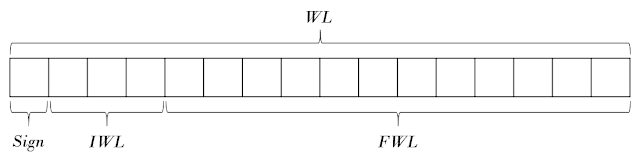
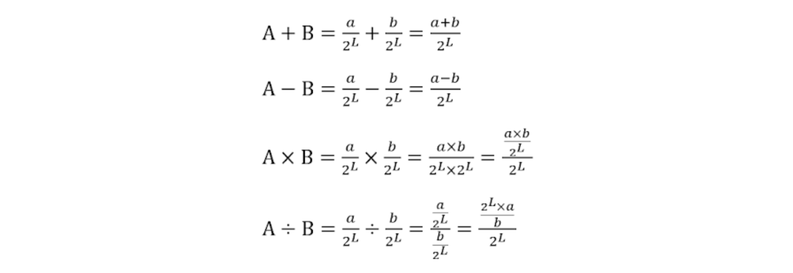

# Today I Learned

[](https://chanul.gitbook.io/til/)

* 매일 배우고 기록하고 정리한다.
* 새로운 개발 지식을 쌓아둔다.
* 쌓아둔 개발 지식을 정리한다.

<hr>

## 22.07.17 : iterator

### iterator

반복자는 어떤 컨테이너에 접근하든 동일한 방법으로 접근하기 위해 제공되는 객체이다.  
원소의 위치를 가지고 있는 포인터와 비슷한 형태이다.  
vector는 연속된 메모리 공간을 가지고 있어서 인덱스 연산으로 임의 접근이 가능하고, 증가시키며 순회도 가능하다. 하지만 list의 경우에는 연속된 메모리 공간을 가지고 있지 않고, 현재 가리키고 있는 노드에서 다음 노드의 주소로 갱신하는 방식으로 순회를 진행한다. 이렇게 컨테이너마다 요소에 접근하는 방식이 다르므로 반복자를 사용하여 컨테이너의 내부 구조를 몰라도 어떤 컨테이너든지 통일된 인터페이스를 가지게 된다.  


## 22.07.15 : container, template specialization
>
>## Container
>
>- Standard sequence container (vector, deque, list)
>- vector : 크기가 변할 수 있는 배열을 나타내는 시퀀스 컨테이너이다. 
>    - 배열과 달리 크기가 동적으로 변경될 수 있으며 저장공간은 컨테이너에서 자동으로 처리된다.
>    - 내부적으로 vector는 동적으로 할당된 배열을 사용하여 요소를 저장한다.  
>    - 새 요소가 삽입될 때 크기를 늘려야 한다면 새 배열을 할당하고 모든 요소를 옮긴다.  
>
>    - 컨테이너 속성
>    - Sequence : 요소는 엄격한 선형 시퀀스로 정렬된다. 개별 요소에 해당 위치로 접근된다. 
>    - Dynamic array : 포인터로 모든 요소에 직접 접근할 수 있으며, 끝에 추가/제거를 빠르게 할 수 있다. 
>    - Allocator-aware : 저장공간을 동적으로 처리한다.
>
>- deque(double ended queue) : 양방향 큐는 양쪽 끝에서 확장하거나 축소할 수 있는 동적 크기의 시퀀스 컨테이너이다. 
>    - 일반적으로 동적 배열의 일부 형태로 다양한 방식으로 구현될 수 있다.
>    - 개별 요소는 임의 접근 반복자를 통해 직접 접근할 수 있다.
>    - 필요에 따라서 컨테이너를 확장 및 축소하여 저장 공간을 자동으로 처리할 수 있다. 
>    - vector와 유사하지만 시작 부분에도 요소를 효율적으로 삽입/삭제한다. 
>    - 모든 요소가 인접한 저장 위치에 저장된다고 보장하지 않으므로 다른 요소에 대한 포인터를 오프셋하여 접근하면 정의되지 않은 동작이 발생한다.
>    - 시작과 끝이 아닌 위치에 요소를 삽입/제거하는 작업의 경우에 list보다 성능이 저하되고 반복자와 참조의 일관성이 떨어진다.
>
>- list : 시퀀스 내에서 어느 곳에나 삽입/제거를 일정한 시간에 수행하고 양방향으로 반복할 수 있는 시퀀스 컨테이너이다. 
>    - list는 이중 연결 리스트로 구현된다. 
>    - 이중 연결 리스트는 서로 관련 없는 저장 위치에 포람된 각 요소를 저장할 수 있다. 
>    - list는 일반적으로 반복자가 이미 확보된 컨테이너 내의 모든 위치에서 요소의 삽입/추출/이동에서 좋은 성능을 보이기 때문에 이러한 속성을 사용하는 알고리즘에서 수행된다. 
>    - 주요 단점은 위치별로 요소에 직접 접근할 수 없다. 시작이나 끝같은 위치에서 해당 위치까지 반복해야 하므로 선형 시간이 걸린다. 
>
>## Template specialization
>
>템플릿의 특정 패턴에 대해서 별도의 처리가 하고 싶은 경우에 사용할 수 있다.  
>예를 들어 다음과 같은 상황이 있을 수 있다.  
>
>```cpp
>template <typename T>
>T Max(const T a, const T b)
>{
>    return (a > b ? a : b);
>}
>
>int main(void)
>{
>    std::cout << Max<int>(100, 200) << std::endl;
>    std::cout << Max<const char*>("one", "two") << std::endl;
>    return (0);
>}
>```
>
>`int` 타입인 경우에는 정상적으로 크기를 비교하지만, `const char *` 타입인 경우에는 단순히 주소를 비교하여 출력된다.  
>위의 코드에 특수화를 사용하여 제대로 동작하도록 수정하면 다음과 같다.  
>
>```cpp
>template <typename T>
>T Max(const T a, const T b)
>{
>    return (a > b ? a : b);
>}
>
>// char* 타입에 대한 특수화
>template <>
>char* Max<char*>(char* a, char* b)
>{
>    return (strcmp(a, b) > 0 ? a : b);
>}
>
>// const char* 타입에 대한 특수화
>template <>
>const char* Max<const char*>(const char* a, const char* b)
>{
>    return (stdlen(a) > strlen(b) ? a : b);
>}
>
>int main(void)
>{
>    std::cout << Max<int>(100, 200) << std::endl;
>    std::cout << Max<const char*>("one", "two") << std::endl;
>    return (0);
>}
>```
>
>`char*`, `const char*` 타입의 함수를 직접 명시하므로 컴파일러가 해당 타입 함수가 필요할 때 임의대로 만들지 않고 명시된 함수를 사용하도록 만든다.  
>

## 22.07.13 : template

>template는 함수나 클래스를 개별적으로 다시 작성하지 않아도, 여러 자료형으로 사용할 수 있도록 만들어 놓은 틀이다.  
>template는 Function Template와 Class Template로 나뉘어진다.  
>template 매개변수는 타입을 인수로 전달하는데 사용할 수 있는 특별한 종류의 매개변수이다. 
>template를 선언하는 형식은 다음과 같다. 
>
>```cpp
>template <class identifier> function_declaration;
>template <typename identifier> function_declaration;
>```
>
>### Function Template
>
>함수를 정의할 때, 함수의 기능은 명확하지만 자료형을 모호하게 둔다. 
>c++에서는 다형성의 오버로딩 특성에 의해서 함수 이름이 같아도 되기 때문에 다음과 같이 함수를 정의하게 된다.  
>
>```cpp
>int sum(int a, int b)
>{
>    return (a + b);
>}
>
>double sum(double a, double b)
>{
>    return (a + b);
>}
>```
>
>인자의 타입을 다르게 하여 같은 이름의 함수를 반복적으로 정의해야 한다. 이렇게 반복해야하는 문제를 해결하기 위해 template를 사용한다. 다음은 위의 코드를 template로 작성한 코드이다.  
>
>```cpp
>template <typename T>
>T sum(T a, T b)
>{
>    return (a + b);
>}
>```
>
>두개의 인자가 타입이 다른 경우
>
>```cpp
>template <class T1, class T2>
>void printAll(T1 a, T2 b)
>{
>    cout << "T1: " << a << endl;
>    cout << "T2: " << b << endl;
>}
>```
>
>이 함수 템플릿을 사용하기 위해서는 다음과 같은 형식을 사용한다.
>
>```cpp
>function_name <type> (parameters);
>```
>
>만약에 위에 구현된 함수를 호출하는 경우에는 다음과 같이 작성할 수 있다. 
>
>```cpp
>int x, y;
>sum <int> (x, y);
>```
>
>컴파일러는 템플릿 함수에 대한 호출을 만나면 실제 템플릿 매개 변수로 전달된 타입으로 대체하는 함수를 자동으로 생성한 다음 호출한다. 
>
>```cpp
>
>template <class T>
>T sum(T a, T b)
>{
>    T   result;
>    result = a + b;
>    return (result);
>}
>
>int main(void)
>{
>    int i=5, j=10, k;
>    long x=5, y=10, z;
>
>    k = sum<int>(i, j);
>    z = sum<long>(x, y);
>
>    std::cout << k << std::endl;
>    std::cout << z << std::endl;
>    return (0);
>}
>```
>
>위의 예에서는 함수 템플릿 sum()을 두번 사용했다. 처음에는 int 타입의 인수를 사용하고, 다음은 long 타입의 인수를 사용했다. 컴파일러는 적절한 함수를 인스턴스화한 다음에 호출한다. `T` 타입이 sum() 템플릿 함수안에서 객체를 선언하는 데에도 사용된다.  
>
>컴파일러는 각 호출에 필요한 타입을 자동으로 결정한다. 템플릿 함수가 동일한 타입의 인수가 들어올 것이라고 예상하고 있기 때문에 다른 타입의 인수를 보내면 컴파일 에러가 발생한다. 만약에 두 인수의 타입을 다르게 한다면 다음과 같이 둘 이상의 타입 매개 변수를 허용하는 함수 템플릿을 정의할 수도 있다.  
>
>```cpp
>template <class T, class U>
>T GetMin(T a, U b)
>{
>    return (a<b?a:b);
>}
>```
>
>이 경우에 다른 두 매개변수를 허용하고 함수는 T 유형의 객체를 반환한다.  
>
>### 클래스 템플릿
>
>클래스 템플릿을 작성하여 템플릿 매개변수를 유형으로 사용하는 멤버를 가질 수 있다.  
>
>```cpp
>template <class T>
>class mypair {
>    T values [2];
>  public:
>    mypair (T first, T second)
>    {
>      values[0]=first; values[1]=second;
>    }
>};
>```
>
>이 클래스의 객체를 선언하여 사용하려면 다음과 같이 작성할 수 있다. 
>
>```cpp
>mypair<int> myobject (115, 36);
>
>mypair<double> myfloats (3.0, 2.18);
>```
>
>클래스 템플릿 선언의 외부에 함수 멤버를 정의한다면 정의 앞에 템플릿 <...> 점두사를 붙여야 한다.  
>
>```cpp
>// class templates
>#include <iostream>
>using namespace std;
>
>template <class T>
>class mypair {
>    T a, b;
>  public:
>    mypair (T first, T second)
>      {a=first; b=second;}
>    T getmax ();
>};
>
>template <class T>
>T mypair<T>::getmax ()
>{
>  T retval;
>  retval = a>b? a : b;
>  return retval;
>}
>
>int main () {
>  mypair <int> myobject (100, 75);
>  cout << myobject.getmax();
>  return 0;
>}
>```
>
>### 템플릿 전문화
>
>다음은 클래스 템플릿 전문화에 사용되는 구문이다.
>
>```cpp
>template <> class mycontainer <char> { ... };
>```
>
>클래스 템플릿 이름 앞에 빈 template<> 매개변수 목록이 된다. 템플릿 전문화를 명시적으로 선언하는 것이다. 이 접두사보다 더 중요한 것은 클래스 템플릿 이름 위에있는 <char> 매개변수이다. 이 특수화 매개변수 자체는 템플릿 클래스 특수화를 선언할 유형을 식별한다. 일반 클래스 템플릿과 전문화 간의 차이점을 확인할 수 있다. 
>
>```cpp
>template <class T> class mycontainer { ... };   // 일반 템플릿
>template <> class mycontainer <char> { ... };   // 전문화
>```
>
>### 템플릿에 대한 비유형 매개변수
>
>유형을 나타내는 class 또는 typename 키워드 대신에 일반 타입 매개변수를 가질 수도 있다. 일반 타입 매개변수를 설정하면 다음과 같이 정의된다.
>
>```cpp
>template <class T=char, int N=10> class mysequence { ... };
>```
>
>


[template에 관하여](https://blockdmask.tistory.com/43)
[template](https://m.blog.naver.com/PostView.naver?isHttpsRedirect=true&blogId=4roring&logNo=221145837492)

## 22.07.12 : 왜 예외를 쓰는 게 좋을까요?
> 
> c++에 예외가 도입된 이유를 생각해볼 필요가 있다. Java와 c# 같은 언어가 c++의 예외를 물려받은 이유는 결함내성 소프트웨어를 쉽게 작성하기 위함이다. 에러 처리를 한 후에도 일관성있는 상태를 유지해야 한다는 사실은 결함 내성을 달성하기 까다롭게 만든다.  
> 
> 어떤 파일을 열고 데이터를 읽어들이는 C코드를 생각해본다.
> 
> ```cpp
> char*
> OpenAndRead(char* fn, char* mode)
> {
>   FILE* fp = fopen(fn, mode);
>   char *buf = malloc(BUF_SZ);
>   fgets(buf, BUF_SZ, fp);
>   return buf;
> }
> ```
> 
> OpenAndRead()는 모든 서브루틴이 잘 수행된다는 가정을 한다면 잘 작동하고 읽기 쉽다. 하지만 fn 파일이 없는 경우, malloc()이나 fgets()가 실패되어 에러가 발생할 가능성이 있다. 이 코드를 결함내성이 있게 만드려면 각 서브루틴이 호출된 후에 에러가 발생하는지 확인하고, 어떤 행동을 해야하는지 결정해야한다. 단순히 에러 메시지를 출력하고 자원을 해제한 후에 -1을 반환하도록 바꾸어 보면 다음과 같을 것이다.  
> 
> ```cpp
> int
> OpenAndRead(char* fn, char* mode, char** data)
> {
>   *data = NULL;
>   char* buf = NULL;
>   FILE* fp = fopen(fn, mode);
>   if (!fp) {
>     printf("Can't open %s\n", fn);
>     return -1;
>   }
>  
>   buf = malloc(BUF_SZ);
>   if (!buf) {
>     printf("Can't allocate memory for data\n");
>     fclose(fp);
>     return -1;
>   }
>  
>   if (!fgets(buf, BUF_SZ, fp)) {
>     printf("Can't read data from %s\n", fn);
>     free(buf);
>     fclose(fp);
>     return -1;
>   }
>  
>   *data = buf;
>  
>   return 0;
> }
> ```
> 
> 이 코드는 에러를 처리하지만 읽기 어렵다. 알고리즘과 에러 처리가 섞여있기 때문인데 이 문제를 예외를 발생시키는 방법으로 변경할 수 있다.  
> 
> ```cpp
> int
> OpenAndRead(char* fn, char* mode, char** data)
> {
>   *data = NULL;
>   char* buf = NULL;
>   FILE* fp = NULL;
>   try {
>     fp = fopen(fn, mode);
>     buf = malloc(BUF_SZ);
>     fgets(buf, BUF_SZ, fp);
>     *data = buf;
>     return 0;
>   }
>   catch (const FileDoesNotExist&) {
>     printf("Can't open %s\n", fn);
>   }
>   catch (const FileNotAccessible&) {
>     printf("The access %s is not permissible for %s\n", mode, fn);
>   }
>   catch (const MemoryExhausted&) {
>     printf("Can't allocate memory for data\n");
>     fclose(fp);
>   }
>   catch (const EndOfFile&) {
>     printf("Can't read data from %s\n", fn);
>     fclose(fp);
>     free(buf);
>   }
>  
>   return -1;
> }
> ```
> 
> OpenAndRead() 주 제어 흐름이 에러 처리와 분리되어 읽기 쉬워졌다. 하지만 아직 라인 수가 많다. 여기에서 예외가 발생했을 때 이루어지는 스택 풀기 과정을 이해하면 코드 라인 수를 줄일 수 있다.  
> 
> 스택 풀기는 예외가 발생하면 예외 처리기를 만나기 전까지 스택을 풀어가는 과정을 말한다. c++ 에서는 try 영역에서 생성된 모든 자동 객체들에 대해 소멸자를 불러온다. 자동 객체들은 생성되었던 반대 순서로 소멸된다.  
> 
> 자원을 소유하는 객체들을 자동 객체로 정의하면 예외가 발생하더라도 자동적으로 소멸된다. 이런 프로그래밍을 가능하게 만드는 자원 소유 객체들이 파일이나 메모리에 이미 정의되어 있다. 파일 자원용으로 std::fstream, 메모리 자원용으로는 boost::scoped_ptr을 사용할 수 있다. 이 객체를 사용하면 다음과 같이 구현할 수 있다.  
> 
> ```cpp
> char*
> OpenAndRead(const std::string& fn, std::ios_base::openmode mode)
> {
>   try {
>     std::fstream fs(fn.c_str(), mode);
>     boost::scoped_ptr buf(new char[BUF_SZ+1]);
>     fs.getline(buf.get(), BUF_SZ);
>     return buf.get();
>   }
>   catch (const std::ios_base::failure&) {
>     std::cout << "Can't open or read data from " << fn << std::endl;
>   }
>   catch (const std::bad_alloc&) {
>     std::cout << "Can't allocate memory for data" << std::endl;
>   }
>  
>   return 0;
> }
> ```
> 
> c++ 런타임이 모든 자원 해제를 알아서 해주기 때문에 에러 코드에 자원 해제 코드를 추가하지 않아도 된다. OpenAndRead()가 상당히 간단해졌다.  
> 
> 예외를 사용하는 경우에 다음과 같은 문제도 해결할 수 있다. 만약에 에러가 발생한 원인을 알고 싶지만 OpenAndRead를 호출하는 시점이 멀리 떨어져 있다면 어떻게 원인을 알 수 있는지 생각할 수 있다. 다음과 같은 상황에서는 원인을 파악할 수 없다.
> 
> ```cpp
> int
> OpenAndRead(char* fn, char* mode, char** data)
> {
>   *data = NULL;
>   char* buf = NULL;
>   FILE* fp = fopen(fn, mode);
>   if (!fp) {
>     printf("Can't open %s\n", fn);
>     return -1;
>   }
>  
>   buf = malloc(BUF_SZ);
>   if (!buf) {
>     printf("Can't allocate memory for data\n");
>     fclose(fp);
>     return -2;
>   }
>  
>   if (!fgets(buf, BUF_SZ, fp)) {
>     printf("Can't read data from %s\n", fn);
>     free(buf);
>     fclose(fp);
>     return -3;
>   }
>  
>   *data = buf;
>  
>   return 0;
> }
>  
> char* foo(char* fn, char* mode)
> {
>   char* data = 0;
>   if (OpenAndRead(fn, mode, &data) >= 0)
>     return data;
>   else
>     return 0;
> }
>  
> void bar()
> {
>   ...... // fn과 mode를 얻어낸다
>   char* data = foo(fn, mode);
>   if (data) {
>     ...... // 정상 처리
>   }
>   else {
>     ...... // bar()가 뭘 할 수 있을까요?
>   }
> }
> ```
> 
> OpenAndRead()는 반환 코드를 통해서 에러를 구분하려 하지만 foo()에서 무시하여 bar()는 무슨 일이 일어났는지 알 수 없다. bar()가 할 수 있는 일은 에러 메시지를 출력하고 종료하거나 에러를 무시할 수 밖에 없다. 이런 문제는 예외를 사용하여 해결할 수 있다. 호출 경로상의 어떤 함수가 예외를 처리하지 않고 무시하면 된다. OpenAndRead()와 foo()는 예외를 어떻게 처리해야 할지 모른다고 가정하고, bar()는 처리할 수 있다고 가정한다면 다음과 같이 구현된다.  
> 
> ```cpp
> char*
> OpenAndRead(const std::string& fn, std::ios_base::openmode mode)
> {
>   std::fstream fs(fn.c_str(), mode); // std::ios_base::failure() 가 발생할지 모릅니다.
>   boost::scoped_ptr buf(new char[BUF_SZ+1]);  // std::bad_alloc() 가 발생할지 모릅니다
>   fs.getline(buf.get(), BUF_SZ);
>   return buf.get();
> }
>  
> char* foo(char* fn, char* mode)
> {
>   // 아무런 예외도 잡지 않고 있습니다
>   return OpenAndRead(fn, mode);
> }
>  
> void bar()
> {
>   ...... // fn과 mode를 알아냅니다
>   try {
>     char* data = foo(fn, mode);
>   }
>   catch (const std::ios_base::failure&) {
>     std::cout << "Can't open or read data from " << fn << std::endl;
>     // 왜 fn 열어서 데이터를 읽으려고 했는지를 안다면 좀 더 정확한 진단 메시지를 출력하고,
>     // 사용자에게 뭔가 조치를 취하라고 알려줄 수 있습니다
>   }
>   catch (const std::bad_alloc&) {
>     std::cout << "Can't allocate memory for data" << std::endl;
>     // 이런 경우를 대비해 메모리를 미리 따로 마련해 놓았다면 bad_alloc()를 
>     // 좀 더 부드럽게 처리할 수도 있을 것입니다.
>   }
> }
> ```
> 
> 이제는 OpenAndRead()와 foo()가 다시 간단해졌고, bar()만 에러 처리에 관여하고 있다. 그리고 예외가 무엇을 의미하는지 알고 충분한 상황 정보가 있기 때문에 예외를 잘 처리할 수 있다.  
> 
> 또 한가지 예외의 장점은 객체라는 점이다. 객체이기 때문에 많은 정보를 담아서 발생시키면 정확한 에러 상황을 알 수 있다. 예외 처리기는 그 정보들이 접근하여 어떤 일이 벌어지고 있는지 정확히 알아내는데 도움이 된다.  
> 
> 
> ## intptr_t, uintptr_t
> 
> intptr_t와 uintptr_t는 포인터의 주소를 저장하는데 사용된다.  
> 안전한 포인터 선언 방법으로 제공하기 때문에 포인터를 정수 표현으로 변환할 때 유용하게 사용할 수 있다. 포인터 주소를 정수값으로 가지고 있기 때문에 연산이 가능하다. 특히 비트연산을 하는 경우에 사용된다. 비트 연산은 unsigned에서 더 잘 수행되기 때문에 uintptr_t를 하면 된다.  
> 
> 다음 예시는 포인터가 포인터 배열인지 테스트한다.
> ```cpp
> #define N  10
> char special[N][1];
> 
> // UB as testing order of pointer, not of the same array, is UB.
> int test_special1(char *candidate) {
>   return (candidate >= special[0]) && (candidate <= special[N-1]);
> }
> 
> // OK - integer compare
> int test_special2(char *candidate) {
>   intptr_t ca = (intptr_t) candidate;
>   intptr_t mn = (intptr_t) special[0];
>   intptr_t mx = (intptr_t) special[N-1];
>   return (ca >= mn) && (ca <= mx);
> }
> ```
> 
> [what is the use of intptr_t?](https://stackoverflow.com/questions/35071200/what-is-the-use-of-intptr-t)
> 


## 22.07.09 : Overloading, Overriding
> 
> overloading과 overriding은 이름이 비슷해서 헷갈리는 경우가 있다.  
> overloading은 같은 이름의 함수를 여러개 정의하고, 매개변수의 유형과 개수를 다르게하여 다양한 유형의 호출에 응답할 수 있게 만든다.  
> overriding은 상위 클래스가 가지고 있는 멤버함수를 하위 클래스의 메서드로 재정의해서 사용한다. 부모 클래스의 메서드를 무시하고 자식 클래스의 메서드 기능을  사용한다.  
> 
> overloading은 매서드의 이름만 같고, 매개변수와 리턴 타입이 달라도 되지만 override는 메서드 이름과 매개변수, 리턴타입이 모두 같아야 한다.  
> 
> [오버로딩과 오버라이딩의 차이와 예제](https://private.tistory.com/25)
> 
## 22.07.05 : this 포인터
> 
> c++에서 클래스의 멤버 함수를 호출할 때 객체를 어떻게 찾을까?  
> 숨겨진 포인터인 this를 사용한다. 멤버 함수를 컴파일 단계에서 다음과 같이 변환한다.  
> 
> ```cpp
> void func(int i)
> {
> 	val = i;
> }
> 
> obj.func(10);
> ```
> 
> ```cpp
> void func(Simple* const this, int i)
> {
> 	this->val = i;
> }
> 
> obj.func(&obj, 10);
> ```
> 
> 멤버 함수의 인수로 객체의 주소가 전달된다. 멤버 함수의 정의도 컴파일러에 의해 변환된다. 객체에 this 포인터를 추가하여 멤버 함수 안의 변수가 멤버 함수를 호출한  객체를 참조하도록 한다.  
> 그러나 명시적으로 this를 참조해야하는 경우가 있다.  
> 
> 1. 멤버 변수와 이름이 같은 매개 변수를 가진 멤버 함수
> 
> ```cpp
> void func(int val)
> {
> 	this->val = val;
> }
> 
> // this->val : 멤버 변수
> // val       : 매개 변수
> ```
> 
> 2. 멤버 함수 체이닝 기법
> 
> 멤버 함수가 this를 반환하면 체이닝 기능이 있는 함수를 만들 수 있다.  
> 
> ```cpp
> Simple& func(int val)
> {
> 	this->val += val;
> 	return (*this);
> }
> ```
> 
> ```cpp
> int main(void)
> {
> 	Simple obj;
> 	
> 	obj.func(10).func(5).func(1);
> 	std::cout << obj.getValue() << std::endl;
> 	return (0);
> }
> ```
> 
> [this 포인터](https://boycoding.tistory.com/250)
> 


## 22.07.03 : 고정 소수점의 사칙연산
> 
> 소수점 연산을 빠르게 처리해야하는 상황에서 고정 소수점 연산은 부동 소수점 연산에 비해 2~3배 이상 속도 차이가 난다.  
> 부동 소수점 연산은 실수형 숫자를 저장하는 방식이 정수형에 비해 매우 복잡하다.  
> 그래픽에서 부동 소수 계산은 필수적이고 계산량이 많기 때문에 빠르게 부동 소수를 처리하는 방법을 고안했다.  
> 그 방법이 고정 소수점 연산이다.  
> 
> 고정 소수점 연산이란 정수형을 이용하여 소수의 정수부와 소수부를 저장하도록 하는 수치해법적인 방법이다.  
> 복잡한 실수형 연산을 단순한 정수의 사칙연산으로 간소화하는 방법이다.  
> 
> ### 고정 소수점
> 
> 고정 소수점은 특정 숫자의 소수점 위치를 고정하는 방식이다.  
> 소수점 위치의 설정은 사용자가 임의대로 정하면 된다.  
> 
> 
> 
> Sign - 부호를 표현하기 위한 비트
> IWL - Integer Word Length, 정수부를 표현하는 비트 수
> FWL - Fractional Word Length, 소수부를 표현하는 비트 수
> WL - Word Length, 전체 비트 수
> 
> ### 사칙 연산
> 
> 고정 소수점의 덧셈, 뺄셈은 정수의 덧셈, 뺄셈과 완전히 동일하다. 따라서 다른 구현이 필요하지 않다.  
> 그러나 곱셈과 나눗셈의 경우는 그렇지 않다. 고정 소수점의 곱셈과 나눗셈의 과정에서 손실없이 정확한 결과를 얻기 위해서는 다른 방법을 사용해야 한다.  
> 16비트의 공간을 사용한 고정 소수점은 연산을 위해 2배인 32비트 크기의 여분 공간을 활용하여 진행한다.  
> 곱셈과 나눗셈의 과정을 보면 복잡하지만 결과값의 소수점 위치에 집중한다면 간단하게 구현할 수 있다.  
> 
> 같은 IWL을 가진 고정 소수점 끼리의 연산을 가정한다. 그렇다면 이들은 FWL도 같다.  
> FWL을 L이라고 정하고, 소수점을 찍지 않은 상태의 정수 값을 각각 a, b라고 한다면 다음과 같이 고정 소수점 수를 분수로 나타낼 수 있다.  
> 
>   
>   
> 
> 그림에서 보이듯이 덧셈과 뺄셈은 정수와 동일하게 진행되지만 곱셉과 나눗셈의 경우에는 추가적인 연산이 필요하다. 그리고 연산 과정 중에 데이터 손실이 일어날 수 있다.  
> 곱셈은 $a \times b$ 에 $2^L$ 을 나누어주고, 나눗셈은 $a \times 2^L$ 를 계산하고  $b$ 를 나누어준다.  
> 이때 연산을 위한 여분의 공간이 없다면 overflow가 발생하여 원하는 값을 얻지 못할 수 있다.  
> 
> 64bit를 지원하지 않는 컴파일러를 사용해야하는 상황에서 32bit로 이 문제를 해결해본다.  
> bit shift를 이용하여 곱셈과 나눗셈을 한다면 두개의 32bit를 연결할 수 있다.  
> 
> 
> 
> [게임 프로그래밍을 위한 고정 소수점 연산](https://m.blog.naver.com/PostView.naver?isHttpsRedirect=true&blogId=lhj321&logNo=50102267173)  
> [고정 소수점의 사칙 연산](http://arkainoh.blogspot.com/2017/11/fixed-point.html#:~:text=%EA%B3%A0%EC%A0%95%20%EC%86%8C%EC%88%98%EC%A0%90%EC%9D%98%20%EC%82%AC%EC%B9%99%EC%97%B0%EC%82%B0&text=%EB%B3%B5%EC%9E%A1%ED%95%9C%20%EC%8B%A4%EC%88%98%EC%9D%98%20%EC%82%AC%EC%B9%99%EC%97%B0%EC%82%B0,%EC%9D%98%20%EA%B2%BD%EC%9A%B0%EB%8A%94%20%EA%B7%B8%EB%A0%87%EC%A7%80%20%EC%95%8A%EB%8B%A4.)  

## 22.07.01 : 이진 나눗셈
> 
> 이진 나눗셈이 십진수의 나눗셈과 큰 차이가 있지는 않지만 알고리즘이 생각만큼 이해하기 쉽지 않다.  
> 특히 음수와 양수의 나눗셈, 혹은 음수끼리의 나눗셈까지 고려해야한다면 더욱 그렇다.  
> 
> $13 \div 5$ 를 5bit의 이진수로 간단히 나타내보면 $01101 \div 00101$ 이다.  
> 이를 Shift Operator를 이용하여 계산해본다.  
> 
> 몫은 Quotient이므로 $Q$로 나타내고, 제수는 Divisor이므로 $D$, 나머지는 Reminder이므로 $R$로 나타낸다.  
> $D$가 5bit이면 $Q$와 $R$을 5bit로 정할 수 있다.  
> 
> |  $R$  |  $Q$  |  $D$  |
> | :---: | :---: | :---: |
> | 00000 | 01101 | 00101 |
> 
> $R$ 과 $Q$ 가 구분되어 있지만 사실은 아래처럼 연결되어 있는 상태이며, 계산 과정에서도 아래와 같은 상황에 있다고 생각해야 한다.  
> 
> |   $R, Q$    |  $D$  |
> | :---------: | :---: |
> | 00000 01101 | 00101 |
> 
> ## Step 1
> 
> $R$ 과 $Q$ 를 왼쪽으로 1비트씩 움직인다.  
> ( $00000\;01101 << 1 = 00000\;11010$ )
> 
> |  $R$  |  $Q$  |  $D$  |
> | :---: | :---: | :---: |
> | 00000 | 11010 | 00101 |
> 
> $R$ 과 $D$ 를 비교해보면 $R$ 이 더 작으므로 넘어간다.  
> 
> ## Step 2
> 
> $R$ 과 $Q$ 를 왼쪽으로 1비트씩 움직인다.  
> ( $00000\;11010 << 1 = 00001\;10100$ )
> 
> |  $R$  |  $Q$  |  $D$  |
> | :---: | :---: | :---: |
> | 00001 | 10100 | 00101 |
> 
> $R$ 과 $D$ 를 비교해보면 $R$ 이 더 작으므로 넘어간다.  
> 
> ## Step 3
> 
> $R$ 과 $Q$ 를 왼쪽으로 1비트씩 움직인다.  
> ( $00001\;10100 << 1 = 00011\;01000$ )
> 
> |  $R$  |  $Q$  |  $D$  |
> | :---: | :---: | :---: |
> | 00011 | 01000 | 00101 |
> 
> $R$ 과 $D$ 를 비교해보면 $R$ 이 더 작으므로 넘어간다.  
> 
> ## Step 4
> 
> $R$ 과 $Q$ 를 왼쪽으로 1비트씩 움직인다.  
> ( $00011\;01000 << 1 = 00110\;10000$ )
> 
> |  $R$  |  $Q$  |  $D$  |
> | :---: | :---: | :---: |
> | 00110 | 10000 | 00101 |
> 
> $R$ 과 $D$ 를 비교해보면 $R >= D$ 이므로 $Q$ 의 첫째자리 bit를 1로 바꾼다.  
> 
> |  $R$  |   $Q$   |  $D$  |
> | :---: | :-----: | :---: |
> | 00110 | 1000`1` | 00101 |
> 
> $R$ 를 $D$ 만큼 빼준다.
> 
> |   $R$   |  $Q$  |  $D$  |
> | :-----: | :---: | :---: |
> | `00001` | 10001 | 00101 |
> 
> ## Step 5
> 
> $R$ 과 $Q$ 를 왼쪽으로 1비트씩 움직인다.  
> ( $00001\;10001 << 1 = 00011\;00010$ )
> 
> |  $R$  |  $Q$  |  $D$  |
> | :---: | :---: | :---: |
> | 00011 | 00010 | 00101 |
> 
> $R$ 과 $D$ 를 비교해보면 $R$ 이 더 작으므로 넘어간다.  
> $D$ 가 5bit이므로 5번째 연산에서 멈춘다.  
> 이렇게 비트연산을 통하여 나머지와 몫을 구할 수 있다.  
> 
