# Today I Learned

[](https://chanul.gitbook.io/til/)

<hr>

## 22.08.18 : SwiftUI LazyVGrid

> [ios13과 ios14에서 그리드 레이아웃을 구현하는 방법](https://betterprogramming.pub/the-swiftui-equivalents-to-uicollectionview-60415e3c1bbe)  
> 
> SwiftUI는 CollectionView을 지원하지 않기 때문에 UIKit에서 CollectionView를 가져와서 사용하거나 VStack, HStack으로 구현해야했다. 그러나 ios14 버전부터 LazyVGrid, LazyHGrid 라는 그리드 컨테이너를 지원한다.  
> 
> # LazyVGrid
> 
> 수직 방향의 그리드에 자식 뷰를 정렬하여 필요한 만큼만 항목을 생성하는 컨테이너 뷰이다.  
> 
> ```swift
> init(
> 	columns: [GridItem],
> 	alignment: HorizontalAlignment,
> 	spacing: CGFloat?,
> 	pinnedViews: PinnedScrollableViews,
> 	content: () -> Content
> 	)
> ```  
> 
> - columns: 그리드의 각 행의 크기와 위치를 지정하기 위한 GridItem의 배열
> - alignment: 상위 뷰 내에서 그리드의 정렬
> - spacing: 그리드와 상위 뷰의 다음 항목 사이의 간격
> - pinnedViews: 부모 스크롤 뷰의 경계에 고정할 뷰
> - content: 그리드의 내용 
> 
> 클로저에 제공하는 첫번째 content는 그리드의 맨 위 행에 나타난다. 첫번째 행을 선행 가장 자리에서 후행 가장자리로 채운 다음 두번째 행을 채우는 식으로 계속된다. 행의 수는 무제한으로 증가할 수 있지만 열의 수는 인자로 받은 GridItem 인스턴스에 따라서 지정된다.  
> 
> ```swift
> struct VerticalSmileys: View {
>     let columns = [GridItem(.flexible()), GridItem(.flexible())]
> 
>     var body: some View {
>          ScrollView {
>              LazyVGrid(columns: columns) {
>                  ForEach(0x1f600...0x1f679, id: \.self) { value in
>                      Text(String(format: "%x", value))
>                      Text(emoji(value))
>                          .font(.largeTitle)
>                  }
>              }
>          }
>     }
> 
>     private func emoji(_ value: Int) -> String {
>         guard let scalar = UnicodeScalar(value) else { return "?" }
>         return String(Character(scalar))
>     }
> }
> ```  
> 
> 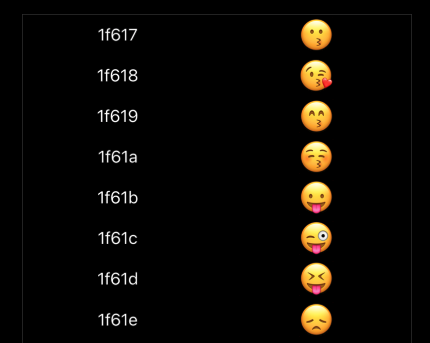  
> 
> ## GridItem
> 
> lazy grid의 항목 레이아웃을 GridItem 인스턴스 배열을 사용하여 구성할 수 있다. 각각의 GridItem은 size와 spacing과 같은 레이아웃 속성을 지정한다.  
> 
> ```swift
> struct GridItemDemo: View {
>     let rows = [
>         GridItem(.fixed(30), spacing: 1),
>         GridItem(.fixed(60), spacing: 10),
>         GridItem(.fixed(90), spacing: 20),
>         GridItem(.fixed(10), spacing: 50)
>     ]
> 
>     var body: some View {
>         ScrollView(.horizontal) {
>             LazyHGrid(rows: rows, spacing: 5) {
>                 ForEach(0...300, id: \.self) { _ in
>                     Color.red.frame(width: 30)
>                     Color.green.frame(width: 30)
>                     Color.blue.frame(width: 30)
>                     Color.yellow.frame(width: 30)
>                 }
>             }
>         }
>     }
> }
> ```  
> 
> LazyHGrid는 열에서 가장 넓은 셀을 기준으로 각 열의 너비를 설정한다. 주어진 열의 모든 View에 한 번에 접근할 수 있기 때문에 이 작업을 수행할 수 있다. 위의 예에서 Color View는 항상 동일한 고정 너비를 가지므로 전체 그리드에서 열 너비가 균일하다.  
> 
> 그러나 LazyVGrid는 사람들이 앱의 정보를 스크롤할 때 새 셀을 생성하기 때문에 일반적으로 행의 모든 View에 액세스할 수 없다. 대신 각 행에 대한 정보는 그리드 항목에 의존한다. 위의 예는 각 행에 대해 서로 다른 고정 높이를 나타내고 각 행 뒤에 표시할 간격을 다르게 설정한다.  
> 
> 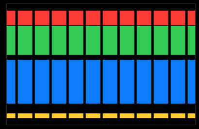  
> 
> 


## 22.08.16 : 픽셀 단위 원 그리기

> [Bresenham 알고리즘으로 원 그리기](https://reitbe.github.io/computergraphics/2022/07/30/CG-03-bresenham-algorithm-circle-drawing.html)
> 
> ## 브레젠험 알고리즘으로 원 그리기
> 
> 이 알고리즘으로 직선을 그릴 때에는 (0 < m < 1) 조건에서 x를 증가시키며 y의 중간값을 검사했다.  
> 원은 (0, 반지름) 좌표에서 시작하여 x를 1씩 증가시키며 y의 중간값이 원의 내부에 있는지 확인한다.  
> 원의 공식은 다음과 같다.  
> 
> $$
> x^2 + y^2 = r^2
> $$
> $$
> \therefore d = x^2 + y^2 - r^2
> $$  
> 
> - d > 0 : 원의 바깥에 점이 있다.
> - d < 0 : 원의 내부에 점이 있다.
> - d = 0 : 원의 둘레에 점이 있다.
> 
> 이 판별식에 중간점을 대입하여 중간점이 어디에 있는지 확인할 수 있다.  
> 
> $$
> d = x^2 + (y - \frac{1}{2})^2 - r^2
> $$  
> 
> - d > 0 : 다음 점에서 y 감소
> - d < 0 : 다음 점에서 y 유지
> 
> 분기에 따라서 y값이 다르기 때문에 다음과 같은 식을 얻을 수 있다.  
> 
> $$
> d_1 = (x + 1)^2 + ((y - 1) - \frac{1}{2})^2 - r^2
> $$
> $$
> d_2 = (x + 1)^2 + (y - \frac{1}{2})^2 - r^2
> $$
> 
> 
> 그러나 이대로 코드를 구현하면 많은 연산을 해야하기 때문에 공식을 정리한다. 초기 값을 받고, 변화시키는 방법으로 나타낸다면 다음과 같다.  
> 
> $$
> d_1 = d + \Delta d_1 \\  
> d_2 = d + \Delta d_2
> $$
> $$
> \Delta d_1 = d_1 - d \\  
> \Delta d_2 = d_2 - d
> $$
> $$
> \Delta d_1 = (x^2 + ((y - 1) - \frac{1}{2})^2 - r^2) - ((x + 1)^2 + (y - \frac{1}{2})^2 - r^2) \\  
> \Delta d_2 = (x^2 + ((y - 1) - \frac{1}{2})^2 - r^2) - ((x + 1)^2 + (y - \frac{1}{2})^2 - r^2)
> $$
> $$
> \Delta d_1 = 2(x - y) + 3 \\  
> \Delta d_2 = 2x + 1
> $$
> 
> 공식을 바탕으로 코드를 작성하면 다음과 같다.  
> 
> ```c
> // 의사코드
> x=0, y=r
> d = 1-r
> 
> while(x<y)
> {
> 	x=x+1
> 	if(d>0){ // 중간점이 원의 바깥에 있다. -> y값 감소
> 		d=d+2(x-y)+3
> 		y=y-1
> 	}
> 	else d=d+2x+1 // 중간점이 원의 내부에 있다 -> y값 유지
> 	plot8(x,y) // 대칭되는 8개 점을 그린다.
> }
> ```
> 


## 22.08.15 : DDA 알고리즘, 레이캐스팅
> 
> # Digital Differential Analyzer
> 
> DDA 알고리즘은 중간값을 취하지 않고 데이터를 한 자리씩 다루어서 정밀도를 높이는 알고리즘이다.  
> 
> ## 조건
> 
> 1. 먼저, 직선 기울기의 절대값을 확인한다.
> 2. 기울기가 1보다 작으면 x축을 기준으로, 1보다 크면 y축을 기준으로 잡는다.
> 3. 기준으로 잡은 축을 1씩 이동시키고, 다른 축에는 기울기를 더한다.
> 4. 나온 값이 실수라면 반올림을 한 좌표에 점을 찍는다.
> 
> ## 레이캐스팅
> 
> DDA 알고리즘으로 좌표 상에 그려지는 광선을 추적하며 충돌하는 벽을 확인할 수 있다.  
> 
> 1. 반복문을 실행할 때마다 누적될 직선의 기울기 절대값을 확인한다.  
> 2. x축 또는 y축으로 1씩 이동하며, 기울기 값을 더한다.  
> 3. 이동된 좌표에 벽이 있는지 확인하고, 존재한다면 충돌되어 이동을 멈춘다.  
> 
> 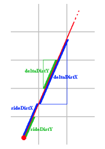  
> 
> 위의 그림과 같이 sideDistX와 sideDistY에 deltaDist 값이 각각 더해진다. 값이 더해지는 순서는 sideDist 값을 비교하여 정한다.  
> sideDistX가 sideDistY보다 작다면 sideDistX에 deltaDistX가 더해지며, x축으로 1만큼 이동시킨다.  
> sideDistY가 sideDistX보다 작다면 sideDistY에 deltaDistY가 더해지며, y축으로 1만큼 이동시킨다.  
> 이렇게 x축 또는 y축으로 1씩 이동시키며 해당 좌표에 벽이 있는지 확인한다.  
> 
> ## deltaDist  
> 
> 두 직각 삼각형이 닮음이라면, 대응되는 변의 길이에 대한 비율은 같다. 이를 활용하여 다음과 같이 delta 값을 구한다.  
> 
> 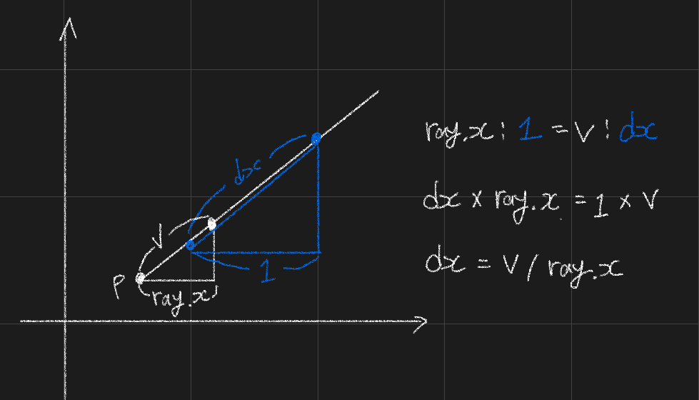  
> 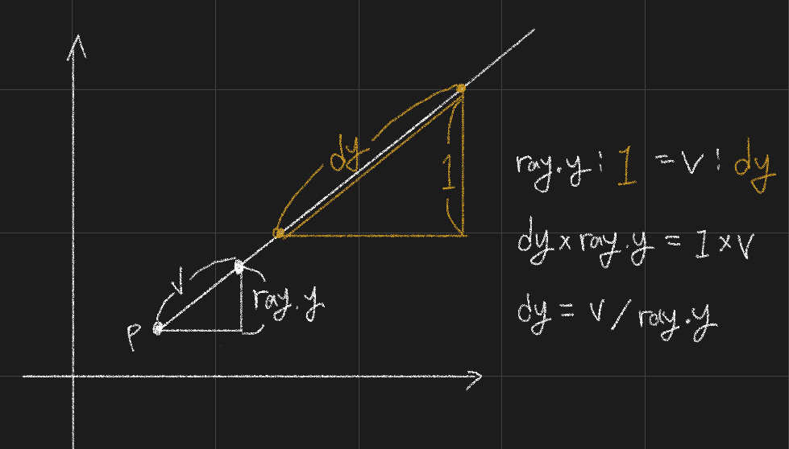  
> 
> - 광선의 방향벡터인 ray로 하나의 삼각형을 그린다.
> - delta 값을 빗변의 길이로 가지는 삼각형을 그린다.
> - 두 직각 삼각형은 예각의 각도가 같으므로 대응하는 변의 길이의 비가 같다.
>   - $ray.x : 1 = v : dx$
> - 그러므로 다음과 같은 공식이 만들어진다.
>   - $dx = v / ray.x$
> - delta 값은 앞으로 비율로써 계산하기 때문에 $v$를 1이라고 할 수 있다.
>   - $dx = 1 / ray.x$
> - delta 값은 절대값으로 충돌 지점을 만나기 전까지 누적된다.
>   - $dx = |\ 1 / ray.x\ |$
> - 코드로 구현하면 다음과 같다.
>     ```c
>     double delta_dist_x = abs(1 / ray_dir_x);
>     double delta_dist_y = abs(1 / ray_dir_y);
>     ```  
> 
> ## sideDist  
> 
> deltaDist를 구하는 방식처럼 닮음 조건을 활용하여 sideDist 값을 구할 수 있다.  
> 
> 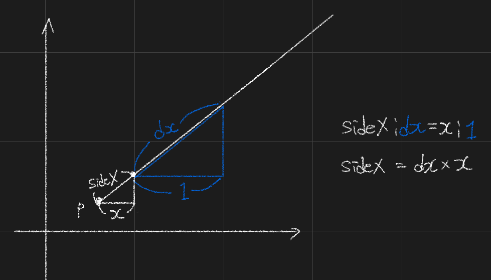  
> 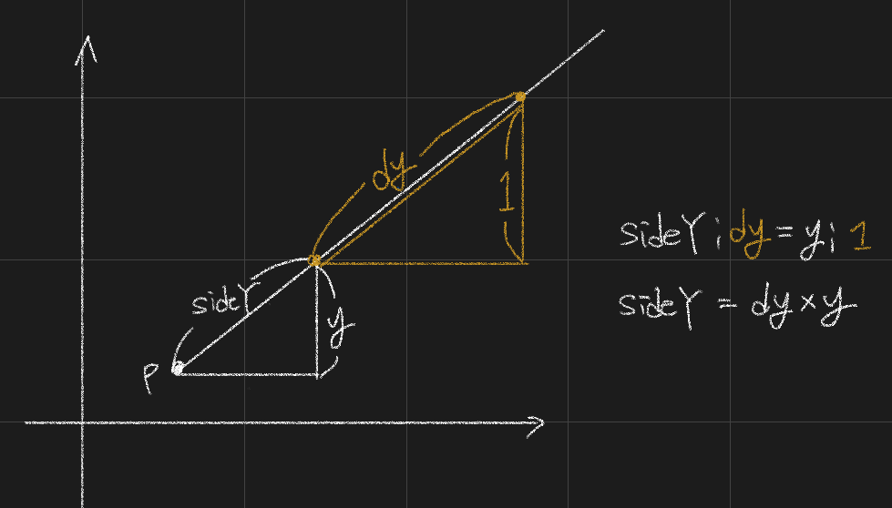  
> 
> - delta 값을 구한 방식처럼 두 직각 삼각형의 변의 길이의 비율로 side 값을 구한다. 그러면 다음과 같은 식이 나온다.
>     - $sideX = x \times dx$
>     - $sideY = y \times dy$
> - 시작점과 그리드 상의 좌표로 $x, y$를 구할 수 있다.
>     - 광선방향X가  
>     0보다 작다면 ( $x = posX - mapX$ ),  
>     0보다 크다면 ( $x = mapX + 1.0 - posX$ )
>     - 광선방향Y가  
>     0보다 작다면 ( $y = posY - mapY$ ),  
>     0보다 크다면 ( $y = mapY + 1.0 - posY$ )  
> - $x, y$를 이전의 공식에 대입하면 다음과 같다.
>     - 광선방향X가  
>     0보다 작다면 ( $sideX = (posX - mapX) \times dx$ ),  
>     0보다 크다면 ( $sideX = (mapX + 1.0 - posX) \times dx$  )  
>     - 광선방향Y가  
>     0보다 작다면 ( $sideY = (posY - mapY) \times dy$ ),  
>     0보다 크다면 ( $sideY = (mapY + 1.0 - posY) \times dy$ )  
>     
> 
> 


## 22.08.13 : SwiftUI

> # 동적으로 미리보기 생성
> 
> PreviewProvider에 코드를 추가하여 다양한 장치 크기에서 미리보기를 렌더링할 수 있다. 기본적으로 미리보기는 활성화된 scheme의 크기로 렌더링된다. Device() 수정자를 호출하여 미리보기 장치를 변경할 수 있다.  
> 
> 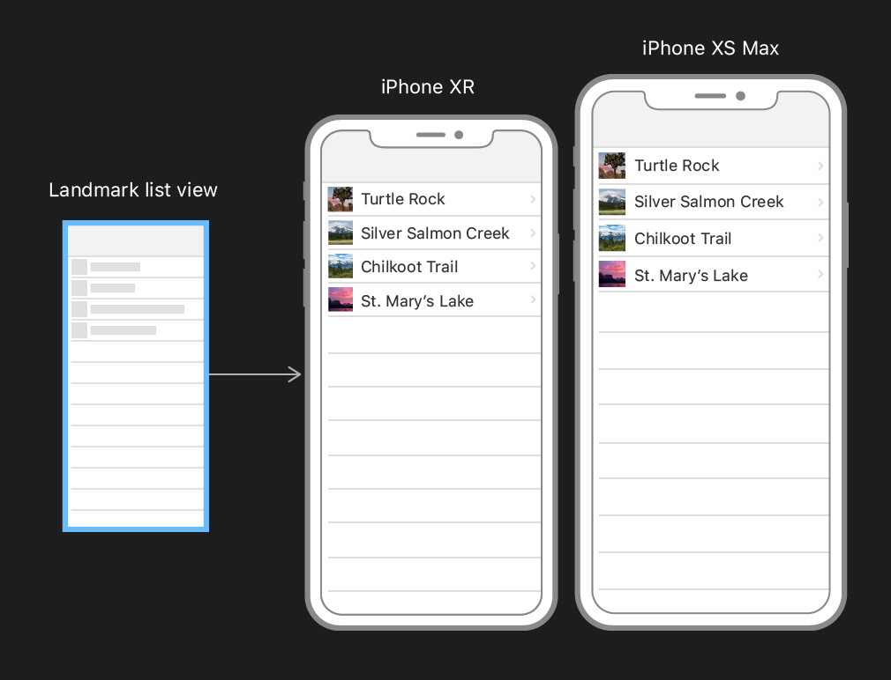  
> 
> 아래의 코드는 현재 리스트 미리보기를 iPhone SE 사이즈로 변경한다. Xcode의 scheme 메뉴에 있는 장치 이름을 넘겨주면 된다.  
> 
> ```swift
> // ...
> 
> struct LandmarkList_Previews: PreviewProvider {
>     static var previews: some View {
>         LandmarkList()
>             .previewDevice(PreviewDevice(rawValue: "iPhone SE (2nd generation)"))
>     }
> }
> ```  
> 
> LandmarkList에 장치 이름 배열을 데이터로 사용할 수 있다. ForEash는 list와 동일한 방식으로 컬렉션에서 작동한다. 모든 child View를 사용하는 모든 곳에 사용할 수 있다. '\\.self' 데이터 요소가 여기에 사용하는 문자열과 단순한 값 유형인 경우 식별자에 대한 키 경로로 사용할 수 있다. 
> 
> ```swift
> // ...
> 
> struct LandmarkList_Previews: PreviewProvider {
>     static var previews: some View {
>         ForEach(["iPhone SE (2nd generation)", "iPhone XS Max"], id: \.self) { deviceName in
>             LandmarkList()
>                 .previewDevice(PreviewDevice(rawValue: deviceName))
>         }
>     }
> }
> ```
> 


## 22.08.11 : 직각삼각형의 비
> 
> 두 직각삼각형의 예각의 각도가 같다면 그 삼각형 안의 대응하는 변의 길이의 비도 같다.  
> 합동에 대해 공부하면, 두 개의 각과 그 사이의 변의 길이가 같은 경우 다른 모든 조건(길이와 각의 크기)이 같다는 것을 알 수 있다.  
> 
> 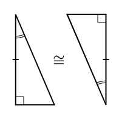  
> 
> 다음 4개의 삼각형은 모두 각A가 공통이고, 모두 직각을 가지고 있다. 그러므로 삼각형은 AA 닮음 조건에 의해 닮음이다.  
> 
> 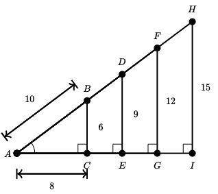  
> 
> 4개의 삼각형의 데이터는 다음과 같다.  
> 
> 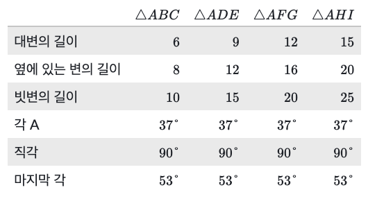  
> 
> 데이터를 가지고 비율표를 작성하면 다음과 같다.  
> 
> 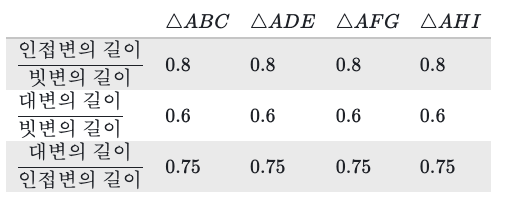  
> 
> 즉, 삼각형이 전부 다른 크기를 가지고 있지만 대응되는 변의 길이에 대한 비율은 다 같다.  
> 
> 직각삼각형의 변의 비를 구하는 방법으로 DDA 알고리즘에서 delta 값을 구했다.  
> 
>   
>   
> 
> 


## 22.08.09 : atan2
> 
> [두 점 사이의 절대각도를 재는 atan2](https://spiralmoon.tistory.com/entry/%ED%94%84%EB%A1%9C%EA%B7%B8%EB%9E%98%EB%B0%8D-%EC%9D%B4%EB%A1%A0-%EB%91%90-%EC%A0%90-%EC%82%AC%EC%9D%B4%EC%9D%98-%EC%A0%88%EB%8C%80%EA%B0%81%EB%8F%84%EB%A5%BC-%EC%9E%AC%EB%8A%94-atan2)
> 
> atan2는 역탄젠트를 계산하는 함수이다. 아크탄젠트(arctangent)는 역탄젠트라고도 하며 탄젠트의 역함수이다. 아크탄젠트를 이용하면 𝞱각도를 구할 수 있다. 모든 프로그래밍 언어에는 아크탄젠트를 계산할 수 있도록 Math 모듈에 atan(y/x), atan2(y, x) 함수를 지원한다.  
> 
> ## atan, atan2 차이점
> 
> 두 함수는 𝞱의 절대각을 구하는 함수이지만 두가지로 나뉘었다.  
> atan은 두 점 사이의 탄젠트값을 받아서 절대각을 -π/2 ~ π/2의 라디안 값으로 반환한다.  
> atan2는 두 점 사이의 상대좌표를 받아서 절대각을 -π ~ π의 라디안 값으로 반환한다.
> 
> ## atan2를 사용하는 이유
> 
> 양수와 음수를 표시하는 데카르트 좌표계에서 사용할 때 유용하다.  
> atan2 함수는 점 A로 부터 점 B가 상대적으로 어느 위치에 있는지 인자로 받는다. 상대적인 위치를 받기 때문에 음수인 x, y를 받을 수 있다. 
> 


## 22.08.04 : 픽셀 위에 직선을 그리는 알고리즘
> 
> [2차원 그래픽스 기본요소와 그리기](https://robodream.tistory.com/207)
> 
> 픽셀로 이루어진 화면에 직선을 그리기 위한 알고리즘이다. 만약에 직선을 그린다면 연속된 픽셀이 끊기지 않고 최대한 직선에 가깝게 표현되어야 한다. 픽셀의 중심이 좌표의 정수 부분이 된다.  
> 
> # DDA 알고리즘 (Digital Differential Analyzer Algorithm)
> 
> DDA 알고리즘은 양 끝점이 주어졌을 때 화면 위 직선을 그릴 수 있는 알고리즘이다.  
> 
> 선의 양끝 점인 $(X_a, Y_a)$, $(X_b, Y_b)$에서 다음과 같은 공식을 구하게 된다.  
> $$
> y = mx + c
> $$
> $$
> m = \frac{y_b - y_a}{x_b - x_a} = \frac{\Delta x}{\Delta y}
> $$
> 
> - 기울기 $m$이 $0 <= m <= 1$ 인 경우에는 $x$를 1씩 증가시킬 때 $y$는 기울기 값인 $m$만큼 증가한다.  
> - 기울기 $m$이 1보다 큰 경우에 $x$를 1씩 증가시키면 $y$가 증가하는 $m$ 값이 1보다 크므로 픽셀의 사이가 멀어져 끊어진다. 따라서 $m$이 1보다 큰 경우에는 $x$를 증가시키지 않고 $y$를 1씩 증가시킨다.  
> 
> 이러한 원칙을 적용하여 다음과 같이 공식을 유도할 수 있다.  
> 
> ## 1. 초기화
> 
> $
> \Delta x = x_b - x_a \\
> \Delta y = y_b - y_a
> $
> 
> $
> m = \frac{\Delta y}{\Delta x}\\
> $
> 
> $
> x_1 = x_a\\
> y_1 = y_a
> $
> 
> ## 2. 연산
> 
> - $m$이 $0 <= m <= 1$인 경우, 매번 $K + 1$번째 점$(1 \leq k \leq \Delta x)$에서  
> $
> x_{K+1} = x_k + 1 \\
> y_{K+1} = y_k + m \\
> y_{K+1}\ 's\ raster\ coordinate = Round(y_{k+1})
> $  
> 
> - $m$이 $-1 \geq m \ , \ m \geq 1$인 경우  
> $
> y_{K+1} = y_k + 1 \\
> x_{K+1} = x_k + 1/m \\
> x_{K+1}\ 's\ raster\ coordinate = Round(x_{k+1})
> $  
> 
> DDA 알고리즘은 증가하는 방향에 따라서 더하거나 빼서 알맞게 조정해서 사용할 수 있다. 하지만 소수점 계산을 해야하기 때문에 부담이 된다. 또한 매번 좌표를 구할 때마다 기울기 $m$ 또는 $1/m$을 더해서 반올림을 하기 때문에 오차가 누적되는 단점이 있다.  
> 
> # 브레젠헴 알고리즘 (Bresenham's Algorithm)
> 
> 소수점 연산이 필요한 DDA 알고리즘의 단점을 브레젠헴 알고리즘으로 해결할 수 있다. 이 알고리즘에서는 소수점 계산없이 정수의 더하기 연산화 시프트 연산으로 처리되므로 더욱 빠르다. 이 알고리즘의 기본 개념은 다음과 같다.  
> 
> $y = mx + c$ 선에서 $m$이 $0 <= m <= 1$이라고 가정하면 선을 구성하고 있는 어느 한 점의 다음 점은 반드시 오른쪽 또는 오른쪽 바로 위의 점이 된다.  
> 
> 
> 
> 위의 그림에서 보듯이 k번째 점인 $(x_k, y_k)$의 다음 점 $(x_{k+1}, y_{k+1})$은 $(x_{k} + 1, y_{k+1})$ 이거나 $(x_{k}+1, y_{k}+1)$ 이다.  
> 
> 이때 어느 점인지 판별하는 방법은 원래의 선과 K+1번째 점과의 차를 구하여 결정한다. $d1$과 $d2$ 값을 구하고, 차이값을 빼는 판별식은 다음과 같다.  
> 
> $
> d_1 - d_2 \\
> = \{m(x_k + 1) + c - y_k\} - \{y_k + 1 - m(x_k + 1) - c\}\\
> = 2m(x + 1) - 2y_k + 2c - 1
> $
> 
> 그리고 기울기 $m$의 값은 $m = \frac{\Delta y}{\Delta x}$이므로 양변에 $\Delta x$를 곱하여 다음과 같은 식을 만든다.    
> 
> $
> (d_1 - d_2) \Delta x = P_{k+1}
> $
> 
> 이를 판별식에 적용하면 다음과 같다.  
> 
> $
> P_{k+1} \\
> = 2 \Delta y (x_k + 1) + \Delta x (-2y_k + 2_c - 1)\\
> = 2 \Delta yx_k - 2 \Delta xy_k + 2 \Delta y + \Delta x(2_c - 1)
> $
> 
> 이 식에서 $P_{k+1}$에 $P_k$를 대입하면 $P_{k+1}$과 $P_k$의 관계식을 구할 수 있다.  
> 
> $
> P_k = 2 \Delta yx_{k-1} - 2 \Delta xy_{k-1} + 2 \Delta y + \Delta x (2c - 1)\\
> P_{k+1} - P_k = 2 \Delta y(x_k - x_{k-1}) - 2 \Delta x(y_k - y_{k-1})\\
> P_{k+1} = P_k + 2 \Delta y - 2 \Delta x (y_k - y_{k-1})
> $
> 
> 그리고 $(y_k - y_{k-1})$ 는 1또는 0이므로 다음과 같은 식을 2개 얻을 수 있다.  
> 
> $
> P_{k+1} = P_k + 2(\Delta y - \Delta x)\\
> P_{k+1} = P_k + 2 \Delta y
> $
> 
> 여기서 $2(\Delta y - \Delta x)$를 C1으로 하고, $2 \Delta y$를 C2로 하게 된다.  
> 선의 시작점은 $(x_a, y_a)$이므로 $P_{k+1}$의 공식으로부터 초기값 $P_1$을 다음과 같이 구한다.  
> 
> $
> P_1 \\
> = 2 \Delta yx_a - 2 \Delta xy_a + 2 \Delta y + \Delta x(2c - 1) \\
> = 2 \Delta yx_a - 2 \Delta x(mx_a + c) + 2 \Delta y + \Delta x (2c - 1) \\
> = 2 \Delta yx_a - 2(\Delta yx_a + \Delta xc) + 2 \Delta y + \Delta x (2c - 1) \\
> = 2 \Delta y - \Delta x
> $
> 
> 이 식에서 초기값 $P1$을 알면 $P2$를 구할 수 있고, $P_{k+1}$은 $P_k$를 통해서 구할 수 있다.  
> 따라서 정리하게 되면 브레젠헴 선그리기 알고리즘은 다음과 같다. (기울기를 $0 \leq |m| \leq 1$로 가정)  
> 
> ## 1. 초기화
> 
> 시작점의 좌표를 $(x_1, y_1)$로 하고 계산한다.  
> 
> $
> C1 = 2(\Delta y - \Delta x) \\
> C2 = 2 \Delta y \\
> P_1 = 2 \Delta y - \Delta x
> $
> 
> ## 2. 연산
> 
> $d_1 - d_2$의 판별식에서 $P_k$ 값에 따라 다음 점의 위치를 아래와 같이 구할 수 있다. ($1 \leq k \leq \Delta x$)
> 
> $P_k \lt 0$ 이라면 다음 픽셀 점은 $(x_k + 1\ , y_k)$ 이며, $P_{k+1} = P_k + C_1$ 이다.  
> $P_k \geq 0$ 이라면 다음 픽셀 점은 $(x_k + 1\ , y_k + 1)$ 이며, $P_{k+1} = P_k + C_2$ 이다.  
> 


## 22.08.02 : SwiftUI State and data flow

> # State and data flow
> 
> 앱 모델 내에서 데이터 흐름과 변경 사항을 제어하고 이에 대응한다. SwiftUI는 사용자 인터페이스 디자인에 대한 선언적 접근 방식을 제공한다. View 계층 구조를 구성할 때 View에 대한 데이터 종속성도 표시한다. 만약에 이벤트로 인해 데이터가 변경된다면 SwiftUI가 자동으로 업데이트해준다. 즉, 뷰컨트롤러의 작업을 프레임워크가 자동으로 수행한다.
> 
> 프레임워크는 앱의 데이터를 사용자 인터페이스에 연결하기 위한 상태 변수 및 바인딩과 같은 도구를 제공한다. 이러한 도구는 앱의 모든 데이터 조각에 대한 단일 정보 소스를 유지하는 데 도움이 된다. 상황에 맞게 도구를 사용하면 된다.  
> 
> - 값 유형을 State 속성으로 래핑하여 일시적인 UI 상태를 관리
> - ObservedObject 속성 래퍼를 사용하여 ObservableObject 프로토콜을 준수하는 외부 참조 모델 데이터에 연결한다. EnvironmentObject 속성 래퍼를 사용하여 환경에 저장된 관찰 가능한 개체에 액세스한다. StateObject를 사용하여 View에서 직접 관찰 가능한 개체를 인스턴스화한다. 
> - Binding 속성 래퍼를 사용하여 State 또는 Observable object와 같은 소스에 대한 참조를 공유한다.
> - Environment에 저장하여 앱 전체에 데이터를 배포한다.
> - PreferenceKey를 사용하여 하위 View에 데이터를 전달한다.
> - FetchRequest를 사용하여 CoreData에 저장된 영구 데이터를 관리한다. 
> 
> ## 속성 래퍼 활용
> 
> SwiftUI는 State 및 Binding과 같은 많은 데이터 관리 유형을 Swift 속성 래퍼로 구현한다.  
> 
> ```swift
> @State private var isVisible = true	// isVisible을 state 변수로 선언
> ```
> 
> SwiftUI의 상태 및 데이터 흐름 속성 래퍼는 데이터 변경 사항을 감시하고 필요에 따라 영향을 받는 View를 자동으로 업데이트한다. 코드에서 속성을 직접 참조할 때 래핑된 값에 액세스한다. 위의 예에서 isVisible 상태 속성의 경우 저장된 Boolean이다.  
> 
> ```swift
> if isVisible == true {
>     Text("Hello") // isVisible이 true인 경우에만 렌더링
> }
> ```
> 
> 또는 속성 이름 앞에 달러 기호($)를 붙여서 속성 래퍼의 예상 값에 액세스할 수 있다. SwiftUI 상태 및 데이터 흐름 속성 래퍼는 항상 Binding을 프로젝션하여 다른 View에서 단일 소스에 액세스하고 변경할 수 있도록 한다.  
> 
> ```swift
> Toggle("Visible", isOn: $isVisible) // 토글이 저장된 값을 변경
> ```
> 
> # Property Wrappers
> 
> 속성 래퍼는 속성이 저장되는 방식을 관리하는 코드와 속성을 정의하는 코드 사이에 분리 계층을 추가한다.  
> 
> 예를 들어 스레드 안전성 검사를 제공하거나 기본 데이터를 데이터베이스에 저장하는 속성이 있는 경우 모든 속성에 해당 코드를 작성해야 한다. 그러나 속성 래퍼를 사용하면 래퍼를 정의할 때 관리 코드를 한 번 작성한 다음 여러 속성에 적용하여 해당 관리코드를 재사용할 수 있다.  
> 
> 속성 래퍼를 정의하려면 wrappedValue로 정의된 struct, enum 또는 class를 만들어야 한다. 아래의 코드를 보면, TwelveOrLess 구조체가 감싸는 값이 항상 12보다 적거나 같게 된다. 만약에 더 큰 수를 저장한다면 12가 저장될 것이다.  
> 
> ```swift
> @propertyWrapper
> struct TwelveOrLess {
>     private var number = 0
>     var wrappedValue: Int {
>         get { return number }
>         set { number = min(newValue, 12) }
>     }
> }
> ```
> 
> 속성 앞에 래퍼의 이름을 속성으로 작성하여 속성에 래퍼를 적용한다. 다음은 TwelveOrLess 속성 래퍼를 사용하여 항상 12이하의 크기를 가지는 사각형을 저장하는 구조체이다.  
> 
> ```swift
> struct SmallRectangle {
>     @TwelveOrLess var height: Int
>     @TwelveOrLess var width: Int
> }
> 
> var rectangle = SmallRectangle()
> print(rectangle.height)
> // Prints "0"
> 
> rectangle.height = 10
> print(rectangle.height)
> // Prints "10"
> 
> rectangle.height = 24
> print(rectangle.height)
> // Prints "12"
> ```
> 
> 속성에 래퍼를 적용하면 컴파일러는 래퍼에 대한 저장소를 제공하는 코드와 애퍼를 통해 속성에 대한 액세스를 제공하는 코드를 합성한다. 다음은 @TwelveOrLess를 사용하는 대신 TwelveOrLess 구조체를 사용하여 래핑한다.  
> 
> ```swift
> struct SmallRectangle {
>     private var _height = TwelveOrLess()
>     private var _width = TwelveOrLess()
>     var height: Int {
>         get { return _height.wrappedValue }
>         set { _height.wrappedValue = newValue }
>     }
>     var width: Int {
>         get { return _width.wrappedValue }
>         set { _width.wrappedValue = newValue }
>     }
> }
> ```
> 
> 
> 


## 22.08.01 : c++ container(map), Ray Casting

> ## map
> 
> [[C++/STL]map,set 참조링크](https://sarah950716.tistory.com/6)
> 
> map은 key와 value의 쌍으로 이루어진 트리로써 연관된 두 값을 묶어서 관리할 수 있다. 검색, 삽입, 삭제 등의 속도를 빠르게 하기 위해 균형 이진 트리 중의 하나인 `레드 블랙 트리`로 구현되어 있다. key를 기준으로 정령된 상태이기 때문에 검색 속도가 특히 빠르다.  
> 
> map는 반복자(iterator)와 인덱스(key)를 이용하여 요소에 접근할 수 있다. 중복된 key를 사용할 수 없으며, 만약에 존재하는 key값을 가진 노드를 추가한다면 이미 존재하는 노드에 덮어씌워진다. 그렇기 때문에 유일한 key, value 쌍을 가진다.  
> 
> ### 멤버 함수
> 
> - `map.size()` : 노드 개수를 반환
> - `map.empty()` : 사이즈가 0인지 아닌지 확인
> - `map.begin()` : 첫번째 원소를 가리키는 iterator 반환
> - `map.end()` : 마지막 원소를 가리키는 iterator 반환
> - `map[key] = value` : (key, value) 노드를 추가
> - `map.insert(make_pair(key, value))` : (key, value) 노드를 추가
> - `map.erase(key)` : key를 찾아서 제거
> - `map.find(key)` : key를 찾고, 있다면 해당 노드를 가리키는 iterator 반환하고 없다면 마지막 원소 iterator 반환
> 
> ```c++
> int main(void)
> {
> 	map<char,int>	m;
> 
> 	m['A'] = 10;
> 	m.insert(make_pair('B', 20));
> 	
> 	// m : (A, 10), (B, 20)
> 	
> 	m.insert(make_pair('A', 30));
> 
> 	// m : (A, 30), (B, 20)
> 	
> 	map<char, int>::iterator	iter = m.find('B');
> 	
> 	if (iter != m.end())
> 	{
> 		cout << iter->first << endl;
>         cout << iter->second << endl;
> 	}
> 	
> 	return (0);
> }
> ```
> 
> [raycasting_tutorial](https://github.com/365kim/raycasting_tutorial/blob/master/2_basics.md)
> [raycasting_tutorial_원문](https://lodev.org/cgtutor/raycasting.html)
> 
> ## Ray Casting이란
> 
> 2차원 맵에서 3차원 원근감을 만드는 렌더링 기술이다. 
> 
> - 스크린의 모든 수직선에 대해 계산하여 속도가 빠르다. 
> - 과거의 느린 컴퓨터에서 3D를 구현하는 최초의 해결책이었다. 
> - 레이캐스팅 기술을 사용한 가장 유명한 게임은 'Wolfenstein 3D'이다. 
> 
> ## Ray Casting, Ray Tracing
> 
> - Ray Casting은 4MHz 그래픽 계산기에서도 실시간으로 빠르게 작동하는 semi-3D 기술이다.
> - Ray Tracing은 3D 장면의 반사, 그림자를 지원하여 현실감있게 렌더링하는 기술이며, 컴퓨터가 빨라진 후에 높은 해상도와 복잡한 장면을 실시간으로 처리할 수 있게 되었다. 
> 
> ## 기본적인 원리
> 
> - 2차원 정사각형 그리드 맵이 있다. 
> - 맵의 한 칸은 0과 양수로 벽의 존재와 특정 색상, 질감을 나타낸다.
> - 화면의 모든 x값(수직선)에 대해 플레이어 위치에서부터 시작하는 광선을 쏜다. 
> - 광선의 방향은 **플레이어가 바라보는 방향**, 화면의 **x좌표**에 의존한다.
> - 광선은 벽에 부딪힐때까지 직진하고 벽에 부딪히면 **적중지점**으로부터 **플레이어까지의 거리**를 구한다.
> - 거리에 따라서 **벽의 높이**가 화면에 어떻게 그려져야 하는지 결정된다. 
> - 벽의 높이는 거리가 멀수록 낮게, 가까울수록 높게 표시된다. 
> 
> 정리하면
> 1. 광선이 벽에 부딪힐때까지 직진하여 적중지점을 찾는다. (좌표)
> 2. 광선의 길이를 구한다.
> 3. 광선의 길이에 따라서 벽의 높이를 정한다.
> 
> - 광선은 검사지점의 간격만큼 직진한다.
> - 광선이 벽에 부딪혔는지 확인은 Ray Casting Algorithm으로 사각형 안에 포인트가 들어왔는지 확인한다.  
> - 아니면 광선이 닿는 벽의 모든 면을 검사하여 벽이 있어야 하는지 확인한다.  
> - 검사간격이 일정하지 않고, 다음 측면까지의 거리에 따라 달라진다.
> 
> ## DDA(Digital Differential Analysis)
> 
> [DDA 알고리즘을 이용한 Ray Casting](https://wonillism.tistory.com/199)
> 
> 2차원 그리드를 지나가는 선이 어떤 네모칸과 부딪히는지 찾을 때 일반적으로 사용되는 속도가 빠른 알고리즘이다. 이 알고리즘은 광선이 어떤 네모칸과 부딪히는지 찾고, 부딪힘이 확인되면 중단된다.  
> 
> 광선이 측면에 도달하면 벽에 적중했는지 확인하는 알고리즘이다. x축과 y축에 광선이 닿을때 확인하는데 현재 닿은 x축과 다음에 닿을 x축의 간격이 그 다음에 닿을 x축까지의 거리와 같으므로 이를 이용한다. 이 간격을 누적하며 벽을 확인한다.  
> 
> 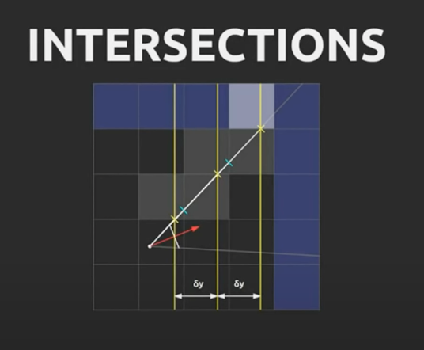
> 


## 22.07.31 : SwiftUI DocumentGroup, Settings
> 
> ## DocumentGroup
> 
> DocumentGroup은 문서를 열고 편집하기 위한 사용자 인터페이스를 생성하는 Scene 타입이다. 문서 데이터 모델과 문서 내용을 표시하는 뷰 계층 구조를 초기화한다. [FileDocument](https://developer.apple.com/documentation/swiftui/filedocument?changes=latest_minor) 프로토콜을 준수하는 값 모델을 사용하거나 [ReferenceFileDocument](https://developer.apple.com/documentation/swiftui/referencefiledocument?changes=latest_minor) 프로토콜을 준수하는 참조 모델을 사용할 수 있다. 문서 기반 앱에서 필요한 다중 창 지원, 패널 열기 및 저장, 드래그 앤 드롭과 같은 표준 동작을 지원한다.  
> 
> ### Value type documents
> 
> - [protocol FileDocument](https://developer.apple.com/documentation/swiftui/filedocument?changes=latest_minor) : 문서를 직렬화하는데 사용되는 문서 모델  
> - [struct FileDocumentConfiguration](https://developer.apple.com/documentation/swiftui/filedocumentconfiguration?changes=latest_minor) : 열린 파일 문서의 속성  
> 
> ### Reference type documents
> 
> - [protocol ReferenceFileDocument](https://developer.apple.com/documentation/swiftui/referencefiledocument?changes=latest_minor) : 참조 유형 문서를 직렬화하는데 사용되는 문서 모델  
> - [struct ReferenceFileDocumentConfiguration](https://developer.apple.com/documentation/swiftui/referencefiledocumentconfiguration?changes=latest_minor) : 열린 참조 파일 문서의 속성  
> 
> ### Read and write configurations
> 
> - [struct FileDocumentReadConfiguration](https://developer.apple.com/documentation/swiftui/filedocumentreadconfiguration?changes=latest_minor) : 파일 읽기
> - [struct FileDocumentWriteConfiguration](https://developer.apple.com/documentation/swiftui/filedocumentwriteconfiguration?changes=latest_minor) : 파일 쓰기
> 
> ## Settings
> 
> Settings는 앱의 설정을 보거나 수정하기 위한 Scene이다.  
> 
> ### 선언
> 
> ```swift
> struct Settings<Content> where Content : View
> ```
> 
> ### 개요
> 
> App 프로토콜을 사용하여 앱을 선언할 때 SwiftUI가 View를 앱의 설정대로 관리하도록 한다. 다음 예시는 macOS에서만 설정 Scene을 컴파일한다.  
> 
> ```swift
> @main
> struct MyApp: App {
>     var body: some Scene {
>         WindowGroup {
>             ContentView()
>         }
>         #if os(macOS)
>         Settings {
>             SettingsView()
>         }
>         #endif
>     }
> }
> ```
> 
> View를 Settings Scene의 인수로 전달하면 SwiftUI가 앱의 설정 메뉴 항목을 활성화한다. SwiftUI는 사용자가 Settings를 나타나게 하거나 사라지게 할 수 있도록 관리한다. 다음은 설정뷰에서 AppStorage 값을 변경하는 예시이다. 설정을 하나의 View에서 정의하거나 TabView를 사용하여 다른 컬렉션으로 그룹화할 수 있다.  
> 
> ```swift
> struct GeneralSettingsView: View {
>     @AppStorage("showPreview") private var showPreview = true
>     @AppStorage("fontSize") private var fontSize = 12.0
> 
>     var body: some View {
>         Form {
>             Toggle("Show Previews", isOn: $showPreview)
>             Slider(value: $fontSize, in: 9...96) {
>                 Text("Font Size (\(fontSize, specifier: "%.0f") pts)")
>             }
>         }
>         .padding(20)
>         .frame(width: 350, height: 100)
>     }
> }
> ```
> 
> ```swift
> struct SettingsView: View {
>     private enum Tabs: Hashable {
>         case general, advanced
>     }
>     var body: some View {
>         TabView {
>             GeneralSettingsView()
>                 .tabItem {
>                     Label("General", systemImage: "gear")
>                 }
>                 .tag(Tabs.general)
>             AdvancedSettingsView()
>                 .tabItem {
>                     Label("Advanced", systemImage: "star")
>                 }
>                 .tag(Tabs.advanced)
>         }
>         .padding(20)
>         .frame(width: 375, height: 150)
>     }
> }
> ```
> 


## 22.07.30 : SwiftUI WindowGroup

> ## WindowGroup
> 
> 동일한 구조의 Window 그룹을 표시하는 Scene이다.
> 
> ### 선언
> 
> ```swift
> struct WindowGroup<Content> where Content : View
> ```
> 
> ### 개요
> 
> App에서 View 계층 구조의 컨테이너로 사용한다. 그룹 컨텐츠로 선언한 계층 구조는 App이 해당 Group에서 생성하는 각 Window에 대한 템플릿 역할을 한다.  
> 
> ```swift
> @main
> struct Mail: App {
>     var body: some Scene {
>         WindowGroup {
>             MailViewer() // Declare a view hierarchy here.
>         }
>     }
> }
> ```
> 
> SwiftUI는 특정 플랫폼별 동작을 처리한다. 예를 들어 macOS 및 iPadOS와 같은 플랫폼에서 사용자는 그룹에서 동시에 둘 이상의 창을 열 수 있다. macOS에서 사용자는 탭 인터페이스에서 열린 창을 함께 모을 수 있다. 또한 macOS에서 창 그룹은 표준 창 관리를 위한 명령을 자동으로 제공한다.  
> 
> 그룹에서 생성된 모든 창은 독립적인 상태를 유지한다. 그룹에서 생성된 각각의 새 창에 대해 시스템은 Scene의 View 계층 구조에 의해 인스턴스화된 State 또는 StateObject 변수에 대해 새 저장소를 할당한다.  
> 
> 일반적으로 문서 기반의 앱이 아니라면 WindowGroup을 사용하고, 맞다면 DocumentGroup을 사용한다.  
> 
> Hashable과 Codable을 모두 준수하는 지정된 유형의 데이터를 표시하도록 WindowGroup을 선택적으로 정의할 수 있다. openWindow 동작과 함께 사용하면 그룹에 대한 Window가 열리고 루트 View는 제시된 값에 대한 바인딩을 전달한다. 바인딩이 표시되는 것과 동일한 값을 갖는 창이 이미 존재하는 경우 해당 창이 대신 앞으로 표시된다. 바인딩 값은 State 복원을 위해 유지되고 Window가 복원될 때 디코딩된다. 그러면 바인딩이 디코딩된 값으로 설정된다. 디코딩 과정에서 오류가 발생하면 바인딩이 기본값 또는 nil로 설정된다. 일반적으로 보여주는 값은 가벼운 데이터를 사용하는 것이 좋다. Identifiable을 준수하는 구조화된 모델 값의 경우 값의 식별자가 잘 작동한다. 다음 예시는 새 창에서 지정된 메모 항목을 여는 버튼을 정의한다.  
> 
> ```swift
> @main
> struct Notes: App {
>     var body: some Scene {
>         ...
>         WindowGroup(for: Note.ID.self) { $noteID in
>             ...
>         }
>     }
> }
> 
> struct NewNoteWindow: View {
>     var note: Note
>     @Environment(\.openWindow) private var openWindow
> 
>     var body: some View {
>         Button("Open Note In New Window") {
>             openWindow(value: note.id)
>         }
>     }
> }
> ```


## 22.07.29 : SwiftUI Lifecycle
> 
> ## ScenePhase
> 
> [SwiftUI App lifecycle 정리](https://huniroom.tistory.com/entry/iOS14SwfitUI-SwiftUI-life-cycle-%EC%97%90%EC%84%9C-%EB%94%A5%EB%A7%81%ED%81%AC-%EC%B2%98%EB%A6%AC)
> 
> 애플이 iOS14부터 ScenePhase를 제공했다. ScenePhase는 @Environment 속성 래퍼를 사용하여 가져오고, onChange(of:) 수정자를 사용하여 변경사항을 받을 수 있다.  
> 
> ```swift
> import SwiftUI
> 
> @main
> struct TestApp: App {
>     @Environment(\.scenePhase) var scenePhase
> 
>     var body: some Scene { 
>         WindowGroup {
>             ContentView()
>         }.onChange(of: scenePhase) { newScenePhase in
>             switch newScenePhase {
>             case .active:
>               print("App is active")
>             case .inactive:
>               print("App is inactive")
>             case .background:
>               print("App is in background")
>             @unknown default:
>               print("Oh - interesting: I received an unexpected new value.")
>             }
>           }
>     }
> }
> ```
> 
> - App is active : 앱이 켜진 직후
> - App is inactive : 앱 스위칭 할 수 있게 올린 상태
> - App is in baskgroud : 아이폰 홈 화면으로 나온 상태
> 
> 

## 22.07.28 : c++ loops, SwiftUI Lifecycle
> 
> 어떤 반복문을 사용해야 하는지 의문이 들었다. index를 사용한 반복문이 iterator를 사용한 반복문보다 빠르다는 사실을 알게된 이후로 생긴 의문이다. 검색해보니 컨테이너에서 반복문을 사용하는 방법을 정리한 글을 찾게 되었다.  
> 
> [c++ loops](https://stackoverflow.com/questions/14373934/iterator-loop-vs-index-loop)
> 
> 1. index-based iteration
> 
> ```c++
> for (std::size_t i = 0; i != v.size(); ++i) {
>     // access element as v[i]
> 
>     // any code including continue, break, return
> }
> ```
> 
> 장점: C 스타일로 친숙하며, 다른 보폭으로 루프가 가능하다 (예를 들어 `i += 2`)  
> 단점: 순차 랜덤 액세스 컨테이너(`vector`, `array`)의 경우에만 작동하고, 연관 컨테이너(`deque`)에서는 작동하지 않는다. 루프 제어가 약간 장황하다(초기화, 확인, 증가).  
> 
> 2. iterator-based iteration
> 
> ```c++
> for (auto it = v.begin(); it != v.end(); ++it) {
>     // if the current index is needed:
>     auto i = std::distance(v.begin(), it); 
> 
>     // access element as *it
> 
>     // any code including continue, break, return
> }
> ```
> 
> 장점: 모든 컨테이너에서 작동한다. 연관 컨테이너에서도 사용할 수 있다. 다른 보폭으로 루프가 가능하다. (std::advance(it, 2))  
> 단점: 현재 요소의 인덱스를 가져오려면 추가 작업이 필요하다. 루프 제어가 약간 장황하다. (초기화, 확인, 증가)  
> 
> 3. STL for_each algorithm + lambda
> 
> ```c++
> std::for_each(v.begin(), v.end(), [](T const& elem) {
>      // if the current index is needed:
>      auto i = &elem - &v[0];
> 
>      // cannot continue, break or return out of the loop
> });
> ```
> 
> 장점: iterator-based iteration과 같으며 루프 제어에서 확인과 증가를 하지 않아도 되기 때문에 버그 비율을 줄일 수 있다. (잘못된 초기화, 확인 또는 증가, 하나씩 오류)  
> 단점: 명시적 반복자 루프와 동일하고 루프의 흐름 제어에 대한 제한된 가능성(continue, break, return 사용 불가) 및 다른 보폭이 대한 옵션이 없다.  
> 
> 4. range-for loop
> 
> ```c++
> for (auto& elem: v) {
>      // if the current index is needed:
>      auto i = &elem - &v[0];
> 
>     // any code including continue, break, return
> }
> ```
> 
> 장점: 매우 컴팩트한 루프 제어, 현재 요소에 대한 직접 액세스.  
> 단점: 인덱스를 얻기 위한 추가 명령문. 다른 보폭을 사용할 수 없다.  
> 
> **그래서 무엇을 사용해야 하는가?**
> 
> std::vector의 경우에 index가 필요하거나 다른 보폭이 필요한 경우에 indexed-loop, 아니면 range-for 루프를 사용한다.  
> 일반 컨테이너에 대한 일반 알고리즘의 경우, 루프 내부에 흐름 제어가 필요하고 다른 보폭이 필요하다면 iterator-loop, 아니면 `for_each + a lambda`를 사용한다.  
> 
> # SwiftUI Scene
> 
> ## Scene
> 
> Scene은 시스템에서 관리하는 수명 주기가 있는 App 사용자 인터페이스의 일부를 나타낸다. App 인스턴스는 포함된 장면을 표시하지만 각 Scene은 뷰 계층 구조의 루트 요소 역할을 한다.  
> 
> 시스템은 Scene의 타입, 플랫폼 및 컨텍스트에 따라서 다양한 방식으로 Scene을 제시한다. Scene은 전체 디스플레이, 디스플레이의 일부, 창, 창의 탭 등을 채울 수 있다. 경우에 따라 앱이 한 번에 둘 이상의 Scene 인스턴스를 표시할 수도 있다.  
> 
> 뷰를 구성하는 방법과 유사하게 수정자를 사용하여 Scene을 구성한다. 예를 들어 Scene이 포함된 창의 모양을 windowStyle 수정자로 조정할 수 있다.  
> 
> App의 body에 Scene protocol을 준수하는 하나 이상의 인스턴스를 결합하여 App을 만든다. SiwftUI가 제공하는 기본 Scene을 사용하거나 다른 Scene에서 구성한 사용자 지정 Scene을 포함할 수 있다. 사용자 정의 Scene을 만들려면 Scene protocol을 준수하는 유형을 선언하면 된다.  
> 
> ```swift
> struct MyScene: Scene {
>     var body: some Scene {
>         WindowGroup {
>             MyRootView()
>         }
>     }
> }
> ```
> 
> Scene은 사용자에게 표시하여는 뷰 계층 구조의 컨테이너 역할을 한다. 시스템은 앱의 현재 상태에 따라 사용자 인터페이스에 뷰 계층 구조를 표시할 시기와 방법을 결정한다. 예를 들어 창 그룹의 경우 시스템에서 사용자가 macOS 및 iPadOS와 같은 플랫폼에 포함된 창을 생성하거나 제거할 수 있다. 다른 플랫폼에서는 동일한 뷰 계층 구조가 활성 상태일 때 전체 디스플레이를 사용할 수 있다.  
> 
> Scene 또는 해당 View 중 하나에서 환경 값을 읽어서 장면이 활성 상태인지 아니면 다른 상태인지 확인할 수 있다. 환경 속성을 사용하여 Scene의 단계를 포함하는 속성을 만들 수 있다.  
> 
> ```swift
> struct MyScene: Scene {
>     @Environment(\.scenePhase) private var scenePhase
> 
>     // ...
> }
> ```
> 
> Scene protocol은 Scene을 구성하는데 사용하는 기본 수정자를 제공한다. 이 수정자는 프로토콜 메서드로 정의되어 있다. 예를 들어 onChange 수정자를 사용하여 값이 변경되는 작업을 트리거할 수 있다. 그리고 창 그룹의 모든 Scene이 배경으로 이동할 때 캐시를 비운다.  
> 
> ```swift
> struct MyScene: Scene {
>     @Environment(\.scenePhase) private var scenePhase
>     @StateObject private var cache = DataCache()
> 
>     var body: some Scene {
>         WindowGroup {
>             MyRootView()
>         }
>         .onChange(of: scenePhase) { newScenePhase in
>             if newScenePhase == .background {
>                 cache.empty()
>             }
>         }
>     }
> }
> ```
> 
> ## ScenePhase
> 
> Scene의 작동 상태를 나타낸다.  
> 시스템은 장면의 작동 상태를 반영하는 단계를 통해 앱의 Scene 인스턴스를 이동시킨다. 단계 변경을 트리거하여 사용할 수 있다. 다음 예제는 Environment에서 scenePhase 값을 관찰하여 현재 단계를 읽는다.
> 
> ```swift
> @Environment(\.scenePhase) private var scenePhase
> ```
> 
> 값을 해석하는 방법은 값을 읽은 위치에 따라 다르다.  
> View 인스턴스 안에서 scenePhase를 읽으면 View가 포함된 scene의 단계를 반영하는 값을 얻는다. 다음 예제는 onChange 메서드를 사용하여 둘러싸이는 scene이 ScenePhase.active 단계에 들어갈 떄마다 타이머를 활성화하고 다른 단계에 들어갈 때 타이머를 비활성한다. 
> 
> ```swift
> struct MyView: View {
>     @ObservedObject var model: DataModel
>     @Environment(\.scenePhase) private var scenePhase
> 
>     var body: some View {
>         TimerView()
>             .onChange(of: scenePhase) { phase in
>                 model.isTimerRunning = (phase == .active)
>             }
>     }
> }
> ```
> 
> 만약에 App 인스턴스 안에서 scenePhase를 읽으면 모든 scene의 단계를 반영하는 집계 값을 얻는다. 앱은 활성화된 scene이 있는 경우 ScenePhase.active 값을 보고하고, 아닌 경우에는 ScenePhase.inactive 값을 보고한다. 여기에는 단일 scene 선언에서 생성된 여러 scene 인스턴스가 포함된다. WindowGroup에서 ScenePhase.backgroud 단계에 들어가면 앱이 곧 종료된다고 예상할 수 있다. 
> 
> ```swift
> @main
> struct MyApp: App {
>     @Environment(\.scenePhase) private var scenePhase
> 
>     var body: some Scene {
>         WindowGroup {
>             MyRootView()
>         }
>         .onChange(of: scenePhase) { phase in
>             if phase == .background {
>                 // Perform cleanup when all scenes within
>                 // MyApp go to the background.
>             }
>         }
>     }
> }
> ```
> 
> 만약에 custom Scene에서 읽는다면 값은 custom scene을 구성하는 모든 scene의 집계를 유사하게 반영한다.  
> 
> ```swift
> struct MyScene: Scene {
>     @Environment(\.scenePhase) private var scenePhase
> 
>     var body: some Scene {
>         WindowGroup {
>             MyRootView()
>         }
>         .onChange(of: scenePhase) { phase in
>             if phase == .background {
>                 // Perform cleanup when all scenes within
>                 // MyScene go to the background.
>             }
>         }
>     }
> }
> ```
> 
> ### Getting scene phase
> 
> - `case active` : scene이 앞에 있으며 반응하고 있다.
> - `case inactive` : scene이 앞에 있지만 작업이 중단되어 있다. 
> - `case background` : scene의 현재 UI가 보이지 않는다. 
> 
> 
> # SwiftUI Lifecycle
> 
> [SwiftUI’s New App Lifecycle and Replacements for AppDelegate and SceneDelegate in iOS 14](https://betterprogramming.pub/swiftuis-new-app-lifecycle-and-replacements-for-appdelegate-and-scenedelegate-in-ios-14-c9cf4a2367a9)  
> 
> SwiftUI는 UIKit의 AppDelegate와 SceneDelegate에서 벗어나기 위해서 새로운 라이프 사이클을 가진다. 이를 위해 iOS 14는 App Protocol, SceneBuilder, scenePhase enumerator, UIApplicationDelegateAdapter를 제공한다. 이들을 살펴보기 전에 SceneDelegate를 빠르게 훑어본다.  
> 
> SceneDelegate는 iOS 13에 iPadOS의 다중 창 지원을 해결하기 위해 도입되었다. 이는 window 개념에서 scene 개념으로 전환되며 AppDelegate의 책임이 분리되었다.  
> 
> iOS 14에서부터 새로운 SwiftUI 애플리케이션 프로젝트를 생성할 때 `SwiftUI App Lifecycle`과 `UIKit App Delegate` 중에서 선택할 수 있게 되었다. 후자를 사용하는 경우에는 예전과 같이 AppDelegate와 SceneDelegate 보일러 플레이트 코드와 UIHostingController가 SwiftUI View를 포함하는데 사용된다. 하지만 전자를 사용하면 완전히 새로운 출발점의 SwiftUI를 맞이하게 된다.  
> 
> ## SwiftUI App Protocol: 새로운 시작점
> 
> ```swift
> @main
> struct ProjectName: App {
>     var body: some Scene {
>         WindowGroup {
>             ContentView()
>         }
>     }
> }
> ```
> 
> 위의 코드는 짧지만 많은 작업이 자동으로 이루어진다. 기본적으로 구조체는 Scene과 View을 한 곳에 통합하여 SwiftUI 애플리케이션 계층 구조에 대한 조감도를 제공한다. 코드를 작성하는데 주의할 점은 다음과 같다.  
> 
> - `@main` 속성은 위의 구조체가 SwiftUI 애플리케이션의 시작점임을 나타낸다.  
> - App protocol을 준수하며 하나 이상의 scene을 구성하기위한 SceneBuilder를 구현해야 한다. 
> - 위의 예에서 WindowGroup은 SwiftUI view를 감싸는 컨테이너 scene이다. iPadOS나 macOS는 위의 애플리케이션을 실행하며 여러 WindowGroup scene을 생성하는 기능을 지원한다. 
> 
> WindowGroup 외에도 DocumentGroup을 사용하거나 WKNotificationScene와 같은 scene 타입을 사용할 수 있다.  
> 
> WindowGroup scene에서 명령어 수정자를 사용하여 단축키를 설정할 수 있다. 이를 위해서는 새로운 CommandBuilder를 활용하여 Commands protocol을 사용하는 CommandMenu를 그룹화해야 한다.  
> 
> 복잡한 Scene을 구성할 때는 계산된 속성을 @SceneBuilder로 반드시 설정해야 한다. 예를 들어 아래의 코드는 macOS 플랫폼에 대한 환경 설정 메뉴 장면을 생성한다.  
> 
> ```swift
> @main
> struct SwiftUITestApp: App {
> 	@SceneBuilder var body: some Scene {
> 		WindowGroup {
> 			ContentView()
> 		}
> 		
> 		#if os(macOS)
> 			Settings {
> 				ContentView()
> 			}
> 		#endif
> 	}
> }
> ```
> 
> ## How to Listen to SceneDelegate Lifecycle Methods?
> 
> SceneDelegate에서와 같이 scene의 수명 주기 업데이트를 수신하기 위해서는 scenePhase 열거자를 사용한다. 이를 환경 속성 래퍼 및 onChange 수정자에 사용하여 scene의 상태 변경을 수신할 수 있다.  
> 
> ```swift
> @main
> struct MyApp: App {
>     @Environment(\.scenePhase) private var scenePhase
> 
>     var body: some Scene {
>         WindowGroup {
>             ContentView()
>         }
>         .onChange(of: scenePhase) { phase in
>             if phase == .background {
>                //perform cleanup
>             }
>         }
>     }
> }
> ```
> 
> ## How to Use AppDelegate With SwiftUI App Protocol
> 
> AppDelegate 클래스는 애플리케이션의 중요한 부분이다. 알림 처리를 하든지 Firebase 처리를 하든지 다양한 수명 주기 방식으로 중요한 역할을 한다.  
> 
> AppDelegate 기능을 연결하기 위해서 UIKit을 SwiftUI 애플리케이션으로 가져와야 한다. SwiftUI는 새로운 속성 래퍼인 UIApplicationDelegateAdaptor를 제공한다. 이를 통해 AppDelegate를 SwiftUI 구조에 주입할 수 있다.  
> 
> ```swift
> class AppDelegate: NSObject, UIApplicationDelegate {
>     func application(_ application: UIApplication, didFinishLaunchingWithOptions launchOptions: [UIApplication.LaunchOptionsKey : Any]? = nil) -> Bool {
>         return true
>     }
> }
> 
> @main
> struct MyApp: App {
> 
>     @UIApplicationDelegateAdaptor(AppDelegate.self) var appDelegate
> 
>     var body: some Scene {
>         WindowGroup {
>             ContentView()
>         }
>     }
> }
> ```
> 
> 


## 22.07.27 : SwiftUI App

> # App structure and behavior
> 
> SwiftUI는 UIKit의 AppDelegate와 SceneDelegate 대신에 다른 라이프 사이클을 가진다. `App protocol`을 준수하는 타입을 만들고 이를 사용하여 유저 인터페이스를 구성한다. 데이터 모델 객체를 관리하기 위해서 `StateObject`를 사용하여 객체를 인스턴스화하고 앱 구조를 감싼다.  
> 
> 라이프 사이클 반응에 대한 작업을 해야하는 경우에는 적절한 scene에 onChange같은 수정자를 추가하여 scene의 변화를 확인할 수 있다. view에서도 마찬가지로 수정자를 사용할 수 있다.  
> 
> 만약에 UIKit이나 AppKit, WatchKit에서 구현하듯이 앱의 delegate를 만들어 callback에 응답해야한다면 적절한 delegate adaptor 속성 레퍼를 사용할 수 있다.  
> 
> ## App
> 
> 앱의 구조와 동작을 나타내는 타입이다.  
> 
> ```swift
> @main
> struct MyApp: App {
> 	var body: some Scene {
> 		WindowGroup {
> 			Text("Hello, world!")
> 		}
> 	}
> }
> ```
> 
> `App` 프로토콜을 준수하는 구조를 선언하여 앱을 만든다. `body`는 앱의 콘텐츠를 정의하는데 필요한 속성을 계산한다.  
> 
> `@main`은 앱의 진입점을 나타낸다. `App protocol` 구조체 선언 앞에 붙여서 시스템이 앱을 시작하기 위한 메서드에 기본 구현을 알려준다. 앱 파일은 단 하나의 진입점을 가질 수 있다.  
> 
> `Scene protocol`을 준수하는 인스턴스에서 앱의 body를 구성한다. 각각의 scene은 계층 구조의 루트뷰를 포함하고 있으며, 시스템에서 관리하는 라이프 사이클이 있다. 기본적으로 제공하는 scene 타입이 있으며, 사용자 지정 scene을 만들 수 있다.  
> 
> ```swift
> @main
> struct Mail: App {
> 	var body: some Scene {
> 		WindowGroup {
> 			MailViewer()
> 		}
> 		Settings {
> 			SettingView()
> 		}
> 	}
> }
> ```
> 
> 앱에서 상태를 선언하여 앱의 모든 scene에서 공유할 수 있다. 다음의 코드와 같이 `StateObject` 속성을 사용하여 데이터 모델을 선언하고, 모델을 `ObservedObject`로 뷰의 인자로 제공하거나 `EnvironmentObject`로 환경을 통해 제공할 수 있다.  
> 
> ```swift
> @main
> struct Mail: App {
>     @StateObject private var model = MailModel()
> 
>     var body: some Scene {
>         WindowGroup {
>             MailViewer()
>                 .environmentObject(model) // Passed through the environment.
>         }
>         Settings {
>             SettingsView(model: model) // Passed as an observed object.
>         }
>     }
> }
> ```
> 


## 22.07.17 : iterator

> ## iterator
> 
> 반복자는 어떤 컨테이너에 접근하든 동일한 방법으로 접근하기 위해 제공되는 객체이다.  
> 원소의 위치를 가지고 있는 포인터와 비슷한 형태이다.  
> vector는 연속된 메모리 공간을 가지고 있어서 인덱스 연산으로 임의 접근이 가능하고, 증가시키며 순회도 가능하다. 하지만 list의 경우에는 연속된 메모리 공간을 가지고 있지 않고, 현재 가리키고 있는 노드에서 다음 노드의 주소로 갱신하는 방식으로 순회를 진행한다. 이렇게 컨테이너마다 요소에 접근하는 방식이 다르므로 반복자를 사용하여 컨테이너의 내부 구조를 몰라도 어떤 컨테이너든지 통일된 인터페이스를 가지게 된다.  
> 
> ### iterator categories
> 
> 반복자는 지원하는 속성에 따라 5가지로 분류된다. (입력, 출력, 순방향, 양방향, 임의 액세스)  
> 
> - 입력 반복자 : 순차 입력 작업에 사용할 수 있는 반복자이며, 반복자가 가리키는 각 값은 한번 읽은 다음 반복자가 증가한다.  
> - 출력 반복자 : 순차 출력 작업에 사용할 수 있는 반복자이며, 반복자가 가리키는 각 값은 한번 쓴 다음 반복자가 증가한다.  
> - 순방향 반복자 : 시작에서 끝으로 가는 방향으로 범위의 요소 시퀀스에 엑세스하는 데 사용할 수 있는 반복자이다. 여러 복사본을 사용하여 동일한 반복자 값을 두번 이산 전달할 수 있다. 증가만 지원하고 감소는 지원하지 않는다.  
> - 양방향 반복자 : 범위의 요소 시퀀스에 양방향으로 액세스하는 데 사용할 수 있는 반복자이다. 순방향 반복자와 동일한 속성을 가지며 감소할 수 있다.  
> - 임의 엑세스 반복자 : 어떠한 요소의 위치에서 임의 오프셋 위치에 있는 요소에 접근할 수 있다. 
> 
> ### iterator range
> 
> range란 컨테이너에 담긴 값들의 시퀀스를 말한다. 한 쌍의 반복자는 이 시퀀스의 시작과 끝을 가리켜서 값들의 구간을 설정하는데 사용될 수 있다. 두개의 반복자는 같은 컨테이너로부터 생성되어야 하며, 첫번째 반복자는 두번째 반복자의 앞에 와야한다. 
> 
> ### end()
> 
> `end` 함수는 컨테이너의 마지막 반복자를 생성하기 위해 호출된다. 이 반복자는 컨테이너의 마지막 원소를 가리키지 않고, 마지막 원소의 다음 공간을 가리킨다. 아무 의미가 없는 공간을 가리키고 있으므로 참조하면 오류가 발생된다.  
> 
> 

## 22.07.15 : container, template specialization
>
>## Container
>
>- Standard sequence container (vector, deque, list)
>- vector : 크기가 변할 수 있는 배열을 나타내는 시퀀스 컨테이너이다. 
>    - 배열과 달리 크기가 동적으로 변경될 수 있으며 저장공간은 컨테이너에서 자동으로 처리된다.
>    - 내부적으로 vector는 동적으로 할당된 배열을 사용하여 요소를 저장한다.  
>    - 새 요소가 삽입될 때 크기를 늘려야 한다면 새 배열을 할당하고 모든 요소를 옮긴다.  
>
>    - 컨테이너 속성
>    - Sequence : 요소는 엄격한 선형 시퀀스로 정렬된다. 개별 요소에 해당 위치로 접근된다. 
>    - Dynamic array : 포인터로 모든 요소에 직접 접근할 수 있으며, 끝에 추가/제거를 빠르게 할 수 있다. 
>    - Allocator-aware : 저장공간을 동적으로 처리한다.
>
>- deque(double ended queue) : 양방향 큐는 양쪽 끝에서 확장하거나 축소할 수 있는 동적 크기의 시퀀스 컨테이너이다. 
>    - 일반적으로 동적 배열의 일부 형태로 다양한 방식으로 구현될 수 있다.
>    - 개별 요소는 임의 접근 반복자를 통해 직접 접근할 수 있다.
>    - 필요에 따라서 컨테이너를 확장 및 축소하여 저장 공간을 자동으로 처리할 수 있다. 
>    - vector와 유사하지만 시작 부분에도 요소를 효율적으로 삽입/삭제한다. 
>    - 모든 요소가 인접한 저장 위치에 저장된다고 보장하지 않으므로 다른 요소에 대한 포인터를 오프셋하여 접근하면 정의되지 않은 동작이 발생한다.
>    - 시작과 끝이 아닌 위치에 요소를 삽입/제거하는 작업의 경우에 list보다 성능이 저하되고 반복자와 참조의 일관성이 떨어진다.
>
>- list : 시퀀스 내에서 어느 곳에나 삽입/제거를 일정한 시간에 수행하고 양방향으로 반복할 수 있는 시퀀스 컨테이너이다. 
>    - list는 이중 연결 리스트로 구현된다. 
>    - 이중 연결 리스트는 서로 관련 없는 저장 위치에 포람된 각 요소를 저장할 수 있다. 
>    - list는 일반적으로 반복자가 이미 확보된 컨테이너 내의 모든 위치에서 요소의 삽입/추출/이동에서 좋은 성능을 보이기 때문에 이러한 속성을 사용하는 알고리즘에서 수행된다. 
>    - 주요 단점은 위치별로 요소에 직접 접근할 수 없다. 시작이나 끝같은 위치에서 해당 위치까지 반복해야 하므로 선형 시간이 걸린다. 
>
>## Template specialization
>
>템플릿의 특정 패턴에 대해서 별도의 처리가 하고 싶은 경우에 사용할 수 있다.  
>예를 들어 다음과 같은 상황이 있을 수 있다.  
>
>```cpp
>template <typename T>
>T Max(const T a, const T b)
>{
>    return (a > b ? a : b);
>}
>
>int main(void)
>{
>    std::cout << Max<int>(100, 200) << std::endl;
>    std::cout << Max<const char*>("one", "two") << std::endl;
>    return (0);
>}
>```
>
>`int` 타입인 경우에는 정상적으로 크기를 비교하지만, `const char *` 타입인 경우에는 단순히 주소를 비교하여 출력된다.  
>위의 코드에 특수화를 사용하여 제대로 동작하도록 수정하면 다음과 같다.  
>
>```cpp
>template <typename T>
>T Max(const T a, const T b)
>{
>    return (a > b ? a : b);
>}
>
>// char* 타입에 대한 특수화
>template <>
>char* Max<char*>(char* a, char* b)
>{
>    return (strcmp(a, b) > 0 ? a : b);
>}
>
>// const char* 타입에 대한 특수화
>template <>
>const char* Max<const char*>(const char* a, const char* b)
>{
>    return (stdlen(a) > strlen(b) ? a : b);
>}
>
>int main(void)
>{
>    std::cout << Max<int>(100, 200) << std::endl;
>    std::cout << Max<const char*>("one", "two") << std::endl;
>    return (0);
>}
>```
>
>`char*`, `const char*` 타입의 함수를 직접 명시하므로 컴파일러가 해당 타입 함수가 필요할 때 임의대로 만들지 않고 명시된 함수를 사용하도록 만든다.  
>

## 22.07.13 : template

>template는 함수나 클래스를 개별적으로 다시 작성하지 않아도, 여러 자료형으로 사용할 수 있도록 만들어 놓은 틀이다.  
>template는 Function Template와 Class Template로 나뉘어진다.  
>template 매개변수는 타입을 인수로 전달하는데 사용할 수 있는 특별한 종류의 매개변수이다. 
>template를 선언하는 형식은 다음과 같다. 
>
>```cpp
>template <class identifier> function_declaration;
>template <typename identifier> function_declaration;
>```
>
>### Function Template
>
>함수를 정의할 때, 함수의 기능은 명확하지만 자료형을 모호하게 둔다. 
>c++에서는 다형성의 오버로딩 특성에 의해서 함수 이름이 같아도 되기 때문에 다음과 같이 함수를 정의하게 된다.  
>
>```cpp
>int sum(int a, int b)
>{
>    return (a + b);
>}
>
>double sum(double a, double b)
>{
>    return (a + b);
>}
>```
>
>인자의 타입을 다르게 하여 같은 이름의 함수를 반복적으로 정의해야 한다. 이렇게 반복해야하는 문제를 해결하기 위해 template를 사용한다. 다음은 위의 코드를 template로 작성한 코드이다.  
>
>```cpp
>template <typename T>
>T sum(T a, T b)
>{
>    return (a + b);
>}
>```
>
>두개의 인자가 타입이 다른 경우
>
>```cpp
>template <class T1, class T2>
>void printAll(T1 a, T2 b)
>{
>    cout << "T1: " << a << endl;
>    cout << "T2: " << b << endl;
>}
>```
>
>이 함수 템플릿을 사용하기 위해서는 다음과 같은 형식을 사용한다.
>
>```cpp
>function_name <type> (parameters);
>```
>
>만약에 위에 구현된 함수를 호출하는 경우에는 다음과 같이 작성할 수 있다. 
>
>```cpp
>int x, y;
>sum <int> (x, y);
>```
>
>컴파일러는 템플릿 함수에 대한 호출을 만나면 실제 템플릿 매개 변수로 전달된 타입으로 대체하는 함수를 자동으로 생성한 다음 호출한다. 
>
>```cpp
>
>template <class T>
>T sum(T a, T b)
>{
>    T   result;
>    result = a + b;
>    return (result);
>}
>
>int main(void)
>{
>    int i=5, j=10, k;
>    long x=5, y=10, z;
>
>    k = sum<int>(i, j);
>    z = sum<long>(x, y);
>
>    std::cout << k << std::endl;
>    std::cout << z << std::endl;
>    return (0);
>}
>```
>
>위의 예에서는 함수 템플릿 sum()을 두번 사용했다. 처음에는 int 타입의 인수를 사용하고, 다음은 long 타입의 인수를 사용했다. 컴파일러는 적절한 함수를 인스턴스화한 다음에 호출한다. `T` 타입이 sum() 템플릿 함수안에서 객체를 선언하는 데에도 사용된다.  
>
>컴파일러는 각 호출에 필요한 타입을 자동으로 결정한다. 템플릿 함수가 동일한 타입의 인수가 들어올 것이라고 예상하고 있기 때문에 다른 타입의 인수를 보내면 컴파일 에러가 발생한다. 만약에 두 인수의 타입을 다르게 한다면 다음과 같이 둘 이상의 타입 매개 변수를 허용하는 함수 템플릿을 정의할 수도 있다.  
>
>```cpp
>template <class T, class U>
>T GetMin(T a, U b)
>{
>    return (a<b?a:b);
>}
>```
>
>이 경우에 다른 두 매개변수를 허용하고 함수는 T 유형의 객체를 반환한다.  
>
>### 클래스 템플릿
>
>클래스 템플릿을 작성하여 템플릿 매개변수를 유형으로 사용하는 멤버를 가질 수 있다.  
>
>```cpp
>template <class T>
>class mypair {
>    T values [2];
>  public:
>    mypair (T first, T second)
>    {
>      values[0]=first; values[1]=second;
>    }
>};
>```
>
>이 클래스의 객체를 선언하여 사용하려면 다음과 같이 작성할 수 있다. 
>
>```cpp
>mypair<int> myobject (115, 36);
>
>mypair<double> myfloats (3.0, 2.18);
>```
>
>클래스 템플릿 선언의 외부에 함수 멤버를 정의한다면 정의 앞에 템플릿 <...> 점두사를 붙여야 한다.  
>
>```cpp
>// class templates
>#include <iostream>
>using namespace std;
>
>template <class T>
>class mypair {
>    T a, b;
>  public:
>    mypair (T first, T second)
>      {a=first; b=second;}
>    T getmax ();
>};
>
>template <class T>
>T mypair<T>::getmax ()
>{
>  T retval;
>  retval = a>b? a : b;
>  return retval;
>}
>
>int main () {
>  mypair <int> myobject (100, 75);
>  cout << myobject.getmax();
>  return 0;
>}
>```
>
>### 템플릿 전문화
>
>다음은 클래스 템플릿 전문화에 사용되는 구문이다.
>
>```cpp
>template <> class mycontainer <char> { ... };
>```
>
>클래스 템플릿 이름 앞에 빈 template<> 매개변수 목록이 된다. 템플릿 전문화를 명시적으로 선언하는 것이다. 이 접두사보다 더 중요한 것은 클래스 템플릿 이름 위에있는 <char> 매개변수이다. 이 특수화 매개변수 자체는 템플릿 클래스 특수화를 선언할 유형을 식별한다. 일반 클래스 템플릿과 전문화 간의 차이점을 확인할 수 있다. 
>
>```cpp
>template <class T> class mycontainer { ... };   // 일반 템플릿
>template <> class mycontainer <char> { ... };   // 전문화
>```
>
>### 템플릿에 대한 비유형 매개변수
>
>유형을 나타내는 class 또는 typename 키워드 대신에 일반 타입 매개변수를 가질 수도 있다. 일반 타입 매개변수를 설정하면 다음과 같이 정의된다.
>
>```cpp
>template <class T=char, int N=10> class mysequence { ... };
>```
>
>

[template에 관하여](https://blockdmask.tistory.com/43)
[template](https://m.blog.naver.com/PostView.naver?isHttpsRedirect=true&blogId=4roring&logNo=221145837492)

## 22.07.12 : 왜 예외를 쓰는 게 좋을까요?
> 
> c++에 예외가 도입된 이유를 생각해볼 필요가 있다. Java와 c# 같은 언어가 c++의 예외를 물려받은 이유는 결함내성 소프트웨어를 쉽게 작성하기 위함이다. 에러 처리를 한 후에도 일관성있는 상태를 유지해야 한다는 사실은 결함 내성을 달성하기 까다롭게 만든다.  
> 
> 어떤 파일을 열고 데이터를 읽어들이는 C코드를 생각해본다.
> 
> ```cpp
> char*
> OpenAndRead(char* fn, char* mode)
> {
>   FILE* fp = fopen(fn, mode);
>   char *buf = malloc(BUF_SZ);
>   fgets(buf, BUF_SZ, fp);
>   return buf;
> }
> ```
> 
> OpenAndRead()는 모든 서브루틴이 잘 수행된다는 가정을 한다면 잘 작동하고 읽기 쉽다. 하지만 fn 파일이 없는 경우, malloc()이나 fgets()가 실패되어 에러가 발생할 가능성이 있다. 이 코드를 결함내성이 있게 만드려면 각 서브루틴이 호출된 후에 에러가 발생하는지 확인하고, 어떤 행동을 해야하는지 결정해야한다. 단순히 에러 메시지를 출력하고 자원을 해제한 후에 -1을 반환하도록 바꾸어 보면 다음과 같을 것이다.  
> 
> ```cpp
> int
> OpenAndRead(char* fn, char* mode, char** data)
> {
>   *data = NULL;
>   char* buf = NULL;
>   FILE* fp = fopen(fn, mode);
>   if (!fp) {
>     printf("Can't open %s\n", fn);
>     return -1;
>   }
>  
>   buf = malloc(BUF_SZ);
>   if (!buf) {
>     printf("Can't allocate memory for data\n");
>     fclose(fp);
>     return -1;
>   }
>  
>   if (!fgets(buf, BUF_SZ, fp)) {
>     printf("Can't read data from %s\n", fn);
>     free(buf);
>     fclose(fp);
>     return -1;
>   }
>  
>   *data = buf;
>  
>   return 0;
> }
> ```
> 
> 이 코드는 에러를 처리하지만 읽기 어렵다. 알고리즘과 에러 처리가 섞여있기 때문인데 이 문제를 예외를 발생시키는 방법으로 변경할 수 있다.  
> 
> ```cpp
> int
> OpenAndRead(char* fn, char* mode, char** data)
> {
>   *data = NULL;
>   char* buf = NULL;
>   FILE* fp = NULL;
>   try {
>     fp = fopen(fn, mode);
>     buf = malloc(BUF_SZ);
>     fgets(buf, BUF_SZ, fp);
>     *data = buf;
>     return 0;
>   }
>   catch (const FileDoesNotExist&) {
>     printf("Can't open %s\n", fn);
>   }
>   catch (const FileNotAccessible&) {
>     printf("The access %s is not permissible for %s\n", mode, fn);
>   }
>   catch (const MemoryExhausted&) {
>     printf("Can't allocate memory for data\n");
>     fclose(fp);
>   }
>   catch (const EndOfFile&) {
>     printf("Can't read data from %s\n", fn);
>     fclose(fp);
>     free(buf);
>   }
>  
>   return -1;
> }
> ```
> 
> OpenAndRead() 주 제어 흐름이 에러 처리와 분리되어 읽기 쉬워졌다. 하지만 아직 라인 수가 많다. 여기에서 예외가 발생했을 때 이루어지는 스택 풀기 과정을 이해하면 코드 라인 수를 줄일 수 있다.  
> 
> 스택 풀기는 예외가 발생하면 예외 처리기를 만나기 전까지 스택을 풀어가는 과정을 말한다. c++ 에서는 try 영역에서 생성된 모든 자동 객체들에 대해 소멸자를 불러온다. 자동 객체들은 생성되었던 반대 순서로 소멸된다.  
> 
> 자원을 소유하는 객체들을 자동 객체로 정의하면 예외가 발생하더라도 자동적으로 소멸된다. 이런 프로그래밍을 가능하게 만드는 자원 소유 객체들이 파일이나 메모리에 이미 정의되어 있다. 파일 자원용으로 std::fstream, 메모리 자원용으로는 boost::scoped_ptr을 사용할 수 있다. 이 객체를 사용하면 다음과 같이 구현할 수 있다.  
> 
> ```cpp
> char*
> OpenAndRead(const std::string& fn, std::ios_base::openmode mode)
> {
>   try {
>     std::fstream fs(fn.c_str(), mode);
>     boost::scoped_ptr buf(new char[BUF_SZ+1]);
>     fs.getline(buf.get(), BUF_SZ);
>     return buf.get();
>   }
>   catch (const std::ios_base::failure&) {
>     std::cout << "Can't open or read data from " << fn << std::endl;
>   }
>   catch (const std::bad_alloc&) {
>     std::cout << "Can't allocate memory for data" << std::endl;
>   }
>  
>   return 0;
> }
> ```
> 
> c++ 런타임이 모든 자원 해제를 알아서 해주기 때문에 에러 코드에 자원 해제 코드를 추가하지 않아도 된다. OpenAndRead()가 상당히 간단해졌다.  
> 
> 예외를 사용하는 경우에 다음과 같은 문제도 해결할 수 있다. 만약에 에러가 발생한 원인을 알고 싶지만 OpenAndRead를 호출하는 시점이 멀리 떨어져 있다면 어떻게 원인을 알 수 있는지 생각할 수 있다. 다음과 같은 상황에서는 원인을 파악할 수 없다.
> 
> ```cpp
> int
> OpenAndRead(char* fn, char* mode, char** data)
> {
>   *data = NULL;
>   char* buf = NULL;
>   FILE* fp = fopen(fn, mode);
>   if (!fp) {
>     printf("Can't open %s\n", fn);
>     return -1;
>   }
>  
>   buf = malloc(BUF_SZ);
>   if (!buf) {
>     printf("Can't allocate memory for data\n");
>     fclose(fp);
>     return -2;
>   }
>  
>   if (!fgets(buf, BUF_SZ, fp)) {
>     printf("Can't read data from %s\n", fn);
>     free(buf);
>     fclose(fp);
>     return -3;
>   }
>  
>   *data = buf;
>  
>   return 0;
> }
>  
> char* foo(char* fn, char* mode)
> {
>   char* data = 0;
>   if (OpenAndRead(fn, mode, &data) >= 0)
>     return data;
>   else
>     return 0;
> }
>  
> void bar()
> {
>   ...... // fn과 mode를 얻어낸다
>   char* data = foo(fn, mode);
>   if (data) {
>     ...... // 정상 처리
>   }
>   else {
>     ...... // bar()가 뭘 할 수 있을까요?
>   }
> }
> ```
> 
> OpenAndRead()는 반환 코드를 통해서 에러를 구분하려 하지만 foo()에서 무시하여 bar()는 무슨 일이 일어났는지 알 수 없다. bar()가 할 수 있는 일은 에러 메시지를 출력하고 종료하거나 에러를 무시할 수 밖에 없다. 이런 문제는 예외를 사용하여 해결할 수 있다. 호출 경로상의 어떤 함수가 예외를 처리하지 않고 무시하면 된다. OpenAndRead()와 foo()는 예외를 어떻게 처리해야 할지 모른다고 가정하고, bar()는 처리할 수 있다고 가정한다면 다음과 같이 구현된다.  
> 
> ```cpp
> char*
> OpenAndRead(const std::string& fn, std::ios_base::openmode mode)
> {
>   std::fstream fs(fn.c_str(), mode); // std::ios_base::failure() 가 발생할지 모릅니다.
>   boost::scoped_ptr buf(new char[BUF_SZ+1]);  // std::bad_alloc() 가 발생할지 모릅니다
>   fs.getline(buf.get(), BUF_SZ);
>   return buf.get();
> }
>  
> char* foo(char* fn, char* mode)
> {
>   // 아무런 예외도 잡지 않고 있습니다
>   return OpenAndRead(fn, mode);
> }
>  
> void bar()
> {
>   ...... // fn과 mode를 알아냅니다
>   try {
>     char* data = foo(fn, mode);
>   }
>   catch (const std::ios_base::failure&) {
>     std::cout << "Can't open or read data from " << fn << std::endl;
>     // 왜 fn 열어서 데이터를 읽으려고 했는지를 안다면 좀 더 정확한 진단 메시지를 출력하고,
>     // 사용자에게 뭔가 조치를 취하라고 알려줄 수 있습니다
>   }
>   catch (const std::bad_alloc&) {
>     std::cout << "Can't allocate memory for data" << std::endl;
>     // 이런 경우를 대비해 메모리를 미리 따로 마련해 놓았다면 bad_alloc()를 
>     // 좀 더 부드럽게 처리할 수도 있을 것입니다.
>   }
> }
> ```
> 
> 이제는 OpenAndRead()와 foo()가 다시 간단해졌고, bar()만 에러 처리에 관여하고 있다. 그리고 예외가 무엇을 의미하는지 알고 충분한 상황 정보가 있기 때문에 예외를 잘 처리할 수 있다.  
> 
> 또 한가지 예외의 장점은 객체라는 점이다. 객체이기 때문에 많은 정보를 담아서 발생시키면 정확한 에러 상황을 알 수 있다. 예외 처리기는 그 정보들이 접근하여 어떤 일이 벌어지고 있는지 정확히 알아내는데 도움이 된다.  
> 
> 
> ## intptr_t, uintptr_t
> 
> intptr_t와 uintptr_t는 포인터의 주소를 저장하는데 사용된다.  
> 안전한 포인터 선언 방법으로 제공하기 때문에 포인터를 정수 표현으로 변환할 때 유용하게 사용할 수 있다. 포인터 주소를 정수값으로 가지고 있기 때문에 연산이 가능하다. 특히 비트연산을 하는 경우에 사용된다. 비트 연산은 unsigned에서 더 잘 수행되기 때문에 uintptr_t를 하면 된다.  
> 
> 다음 예시는 포인터가 포인터 배열인지 테스트한다.
> ```cpp
> #define N  10
> char special[N][1];
> 
> // UB as testing order of pointer, not of the same array, is UB.
> int test_special1(char *candidate) {
>   return (candidate >= special[0]) && (candidate <= special[N-1]);
> }
> 
> // OK - integer compare
> int test_special2(char *candidate) {
>   intptr_t ca = (intptr_t) candidate;
>   intptr_t mn = (intptr_t) special[0];
>   intptr_t mx = (intptr_t) special[N-1];
>   return (ca >= mn) && (ca <= mx);
> }
> ```
> 
> [what is the use of intptr_t?](https://stackoverflow.com/questions/35071200/what-is-the-use-of-intptr-t)
> 


## 22.07.09 : Overloading, Overriding
> 
> overloading과 overriding은 이름이 비슷해서 헷갈리는 경우가 있다.  
> overloading은 같은 이름의 함수를 여러개 정의하고, 매개변수의 유형과 개수를 다르게하여 다양한 유형의 호출에 응답할 수 있게 만든다.  
> overriding은 상위 클래스가 가지고 있는 멤버함수를 하위 클래스의 메서드로 재정의해서 사용한다. 부모 클래스의 메서드를 무시하고 자식 클래스의 메서드 기능을  사용한다.  
> 
> overloading은 매서드의 이름만 같고, 매개변수와 리턴 타입이 달라도 되지만 override는 메서드 이름과 매개변수, 리턴타입이 모두 같아야 한다.  
> 
> [오버로딩과 오버라이딩의 차이와 예제](https://private.tistory.com/25)
> 
## 22.07.05 : this 포인터
> 
> c++에서 클래스의 멤버 함수를 호출할 때 객체를 어떻게 찾을까?  
> 숨겨진 포인터인 this를 사용한다. 멤버 함수를 컴파일 단계에서 다음과 같이 변환한다.  
> 
> ```cpp
> void func(int i)
> {
> 	val = i;
> }
> 
> obj.func(10);
> ```
> 
> ```cpp
> void func(Simple* const this, int i)
> {
> 	this->val = i;
> }
> 
> obj.func(&obj, 10);
> ```
> 
> 멤버 함수의 인수로 객체의 주소가 전달된다. 멤버 함수의 정의도 컴파일러에 의해 변환된다. 객체에 this 포인터를 추가하여 멤버 함수 안의 변수가 멤버 함수를 호출한  객체를 참조하도록 한다.  
> 그러나 명시적으로 this를 참조해야하는 경우가 있다.  
> 
> 1. 멤버 변수와 이름이 같은 매개 변수를 가진 멤버 함수
> 
> ```cpp
> void func(int val)
> {
> 	this->val = val;
> }
> 
> // this->val : 멤버 변수
> // val       : 매개 변수
> ```
> 
> 2. 멤버 함수 체이닝 기법
> 
> 멤버 함수가 this를 반환하면 체이닝 기능이 있는 함수를 만들 수 있다.  
> 
> ```cpp
> Simple& func(int val)
> {
> 	this->val += val;
> 	return (*this);
> }
> ```
> 
> ```cpp
> int main(void)
> {
> 	Simple obj;
> 	
> 	obj.func(10).func(5).func(1);
> 	std::cout << obj.getValue() << std::endl;
> 	return (0);
> }
> ```
> 
> [this 포인터](https://boycoding.tistory.com/250)
> 


## 22.07.03 : 고정 소수점의 사칙연산
> 
> 소수점 연산을 빠르게 처리해야하는 상황에서 고정 소수점 연산은 부동 소수점 연산에 비해 2~3배 이상 속도 차이가 난다.  
> 부동 소수점 연산은 실수형 숫자를 저장하는 방식이 정수형에 비해 매우 복잡하다.  
> 그래픽에서 부동 소수 계산은 필수적이고 계산량이 많기 때문에 빠르게 부동 소수를 처리하는 방법을 고안했다.  
> 그 방법이 고정 소수점 연산이다.  
> 
> 고정 소수점 연산이란 정수형을 이용하여 소수의 정수부와 소수부를 저장하도록 하는 수치해법적인 방법이다.  
> 복잡한 실수형 연산을 단순한 정수의 사칙연산으로 간소화하는 방법이다.  
> 
> ### 고정 소수점
> 
> 고정 소수점은 특정 숫자의 소수점 위치를 고정하는 방식이다.  
> 소수점 위치의 설정은 사용자가 임의대로 정하면 된다.  
> 
> 
> 
> Sign - 부호를 표현하기 위한 비트
> IWL - Integer Word Length, 정수부를 표현하는 비트 수
> FWL - Fractional Word Length, 소수부를 표현하는 비트 수
> WL - Word Length, 전체 비트 수
> 
> ### 사칙 연산
> 
> 고정 소수점의 덧셈, 뺄셈은 정수의 덧셈, 뺄셈과 완전히 동일하다. 따라서 다른 구현이 필요하지 않다.  
> 그러나 곱셈과 나눗셈의 경우는 그렇지 않다. 고정 소수점의 곱셈과 나눗셈의 과정에서 손실없이 정확한 결과를 얻기 위해서는 다른 방법을 사용해야 한다.  
> 16비트의 공간을 사용한 고정 소수점은 연산을 위해 2배인 32비트 크기의 여분 공간을 활용하여 진행한다.  
> 곱셈과 나눗셈의 과정을 보면 복잡하지만 결과값의 소수점 위치에 집중한다면 간단하게 구현할 수 있다.  
> 
> 같은 IWL을 가진 고정 소수점 끼리의 연산을 가정한다. 그렇다면 이들은 FWL도 같다.  
> FWL을 L이라고 정하고, 소수점을 찍지 않은 상태의 정수 값을 각각 a, b라고 한다면 다음과 같이 고정 소수점 수를 분수로 나타낼 수 있다.  
> 
>   
>   
> 
> 그림에서 보이듯이 덧셈과 뺄셈은 정수와 동일하게 진행되지만 곱셉과 나눗셈의 경우에는 추가적인 연산이 필요하다. 그리고 연산 과정 중에 데이터 손실이 일어날 수 있다.  
> 곱셈은 $a \times b$ 에 $2^L$ 을 나누어주고, 나눗셈은 $a \times 2^L$ 를 계산하고  $b$ 를 나누어준다.  
> 이때 연산을 위한 여분의 공간이 없다면 overflow가 발생하여 원하는 값을 얻지 못할 수 있다.  
> 
> 64bit를 지원하지 않는 컴파일러를 사용해야하는 상황에서 32bit로 이 문제를 해결해본다.  
> bit shift를 이용하여 곱셈과 나눗셈을 한다면 두개의 32bit를 연결할 수 있다.  
> 
> 
> 
> [게임 프로그래밍을 위한 고정 소수점 연산](https://m.blog.naver.com/PostView.naver?isHttpsRedirect=true&blogId=lhj321&logNo=50102267173)  
> [고정 소수점의 사칙 연산](http://arkainoh.blogspot.com/2017/11/fixed-point.html#:~:text=%EA%B3%A0%EC%A0%95%20%EC%86%8C%EC%88%98%EC%A0%90%EC%9D%98%20%EC%82%AC%EC%B9%99%EC%97%B0%EC%82%B0&text=%EB%B3%B5%EC%9E%A1%ED%95%9C%20%EC%8B%A4%EC%88%98%EC%9D%98%20%EC%82%AC%EC%B9%99%EC%97%B0%EC%82%B0,%EC%9D%98%20%EA%B2%BD%EC%9A%B0%EB%8A%94%20%EA%B7%B8%EB%A0%87%EC%A7%80%20%EC%95%8A%EB%8B%A4.)  

## 22.07.01 : 이진 나눗셈
> 
> 이진 나눗셈이 십진수의 나눗셈과 큰 차이가 있지는 않지만 알고리즘이 생각만큼 이해하기 쉽지 않다.  
> 특히 음수와 양수의 나눗셈, 혹은 음수끼리의 나눗셈까지 고려해야한다면 더욱 그렇다.  
> 
> $13 \div 5$ 를 5bit의 이진수로 간단히 나타내보면 $01101 \div 00101$ 이다.  
> 이를 Shift Operator를 이용하여 계산해본다.  
> 
> 몫은 Quotient이므로 $Q$로 나타내고, 제수는 Divisor이므로 $D$, 나머지는 Reminder이므로 $R$로 나타낸다.  
> $D$가 5bit이면 $Q$와 $R$을 5bit로 정할 수 있다.  
> 
> |  $R$  |  $Q$  |  $D$  |
> | :---: | :---: | :---: |
> | 00000 | 01101 | 00101 |
> 
> $R$ 과 $Q$ 가 구분되어 있지만 사실은 아래처럼 연결되어 있는 상태이며, 계산 과정에서도 아래와 같은 상황에 있다고 생각해야 한다.  
> 
> |   $R, Q$    |  $D$  |
> | :---------: | :---: |
> | 00000 01101 | 00101 |
> 
> ## Step 1
> 
> $R$ 과 $Q$ 를 왼쪽으로 1비트씩 움직인다.  
> ( $00000\;01101 << 1 = 00000\;11010$ )
> 
> |  $R$  |  $Q$  |  $D$  |
> | :---: | :---: | :---: |
> | 00000 | 11010 | 00101 |
> 
> $R$ 과 $D$ 를 비교해보면 $R$ 이 더 작으므로 넘어간다.  
> 
> ## Step 2
> 
> $R$ 과 $Q$ 를 왼쪽으로 1비트씩 움직인다.  
> ( $00000\;11010 << 1 = 00001\;10100$ )
> 
> |  $R$  |  $Q$  |  $D$  |
> | :---: | :---: | :---: |
> | 00001 | 10100 | 00101 |
> 
> $R$ 과 $D$ 를 비교해보면 $R$ 이 더 작으므로 넘어간다.  
> 
> ## Step 3
> 
> $R$ 과 $Q$ 를 왼쪽으로 1비트씩 움직인다.  
> ( $00001\;10100 << 1 = 00011\;01000$ )
> 
> |  $R$  |  $Q$  |  $D$  |
> | :---: | :---: | :---: |
> | 00011 | 01000 | 00101 |
> 
> $R$ 과 $D$ 를 비교해보면 $R$ 이 더 작으므로 넘어간다.  
> 
> ## Step 4
> 
> $R$ 과 $Q$ 를 왼쪽으로 1비트씩 움직인다.  
> ( $00011\;01000 << 1 = 00110\;10000$ )
> 
> |  $R$  |  $Q$  |  $D$  |
> | :---: | :---: | :---: |
> | 00110 | 10000 | 00101 |
> 
> $R$ 과 $D$ 를 비교해보면 $R >= D$ 이므로 $Q$ 의 첫째자리 bit를 1로 바꾼다.  
> 
> |  $R$  |   $Q$   |  $D$  |
> | :---: | :-----: | :---: |
> | 00110 | 1000`1` | 00101 |
> 
> $R$ 를 $D$ 만큼 빼준다.
> 
> |   $R$   |  $Q$  |  $D$  |
> | :-----: | :---: | :---: |
> | `00001` | 10001 | 00101 |
> 
> ## Step 5
> 
> $R$ 과 $Q$ 를 왼쪽으로 1비트씩 움직인다.  
> ( $00001\;10001 << 1 = 00011\;00010$ )
> 
> |  $R$  |  $Q$  |  $D$  |
> | :---: | :---: | :---: |
> | 00011 | 00010 | 00101 |
> 
> $R$ 과 $D$ 를 비교해보면 $R$ 이 더 작으므로 넘어간다.  
> $D$ 가 5bit이므로 5번째 연산에서 멈춘다.  
> 이렇게 비트연산을 통하여 나머지와 몫을 구할 수 있다.  
> 
