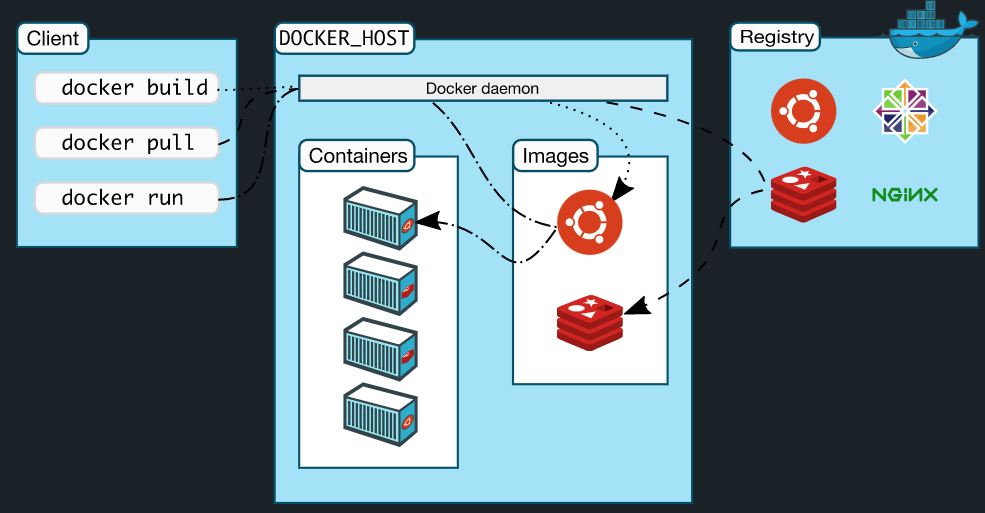

# Today I Learned <!-- omit in toc -->

* [22.12.02](#221202)
  * [Docker](#docker)
    * [Docker Architecture](#docker-architecture)
  * [alpine linux](#alpine-linux)
* [22.12.01](#221201)
  * [Container](#container)
    * [Container란](#container란)
    * [Container Image란](#container-image란)
    * [Kernel Space](#kernel-space)
      * [chroot](#chroot)
      * [Linux namespace](#linux-namespace)
      * [namespace API](#namespace-api)
        * [clone](#clone)
        * [unshare](#unshare)
        * [setns](#setns)
        * [proc](#proc)
      * [namespace](#namespace)
        * [mnt](#mnt)
        * [uts](#uts)
        * [ipc](#ipc)
        * [pid](#pid)
        * [net](#net)
        * [user](#user)
        * [cgroup](#cgroup)
* [22.11.30](#221130)
  * [Docker](#docker-1)
    * [Layer](#layer)
    * [Image url](#image-url)
    * [Dockerfile](#dockerfile)
* [22.11.29](#221129)
  * [Docker](#docker-2)
    * [Container](#container-1)
    * [Image](#image)
* [22.11.25](#221125)
  * [변환 생성자의 묵시적 변환](#변환-생성자의-묵시적-변환)
* [22.11.24](#221124)
  * [exception guarantees](#exception-guarantees)
* [22.11.17](#221117)
* [Red-Black Tree Removal](#red-black-tree-removal)
* [22.11.13](#221113)
  * [포인터의 레퍼런스](#포인터의-레퍼런스)
* [22.11.10](#221110)
  * [Tree iterator](#tree-iterator)

---

## 22.12.02

### Docker

Docker는 컨테이너라고 하는 격리된 환경에서 애플리케이션을 패키징하고 실행할 수 있는 기능을 제공한다. 격리 및 보안을 통해 지정된 호스트에서 여러 컨테이너를 동시에 실행할 수 있다. 컨테이너는 가볍지만 애플리케이션을 실행하는 데 필요한 모든 것을 포함하므로 호스트에 현재 설치된 항목에 의존할 필요가 없다. 작업하는 동안 컨테이너를 쉽게 공유할 수 있으며 공유하는 모든 사람이 동일한 방식으로 작동하는 동일한 컨테이너를 갖게 된다.  

Docker는 다음과 같은 상황에서 사용할 수 있다. 
- 로컬에서 코드를 작성하고 Docker 컨테이너를 사용하여 동료와 작업을 공유한다.
- Docker를 사용하여 애플리케이션을 테스츠 환경에 푸시하고 자동 및 수동 테스트를 실행한다.
- 개발자가 버그를 발견하면 개발 환경에서 버그를 수정하고 테스트 및 검증을 위해 테스트 환경에 재배보할 수 있다.
- 테스트가 완료되면 고객에게 수정 사항을 제공하는 것은 업데이트된 이미지를 프로덕션 환경에 푸시하는 것만큼 간단하다.

#### Docker Architecture

Docker는 클라이언트-서버 아키텍처를 사용한다.  
Docker 클라이언트는 컨테이너 빌드. 실행 및 배포하는 Docker 데몬과 통신한다. 이들은 동일한 시스템에서 실행되거나 클라이언트를 원격 데몬에 연결할 수 있다.  
Docker 클라이언트와 데몬은 UNIX 소켓 또는 네트워크 인터페이스를 통해 REST API를 사용하여 통신한다.  
또 다른 Docker 클라이언트는 컨테이너 세트로 구성된 애플리케이션으로 작업할 수 있는 Docker Compose이다.  

  


### alpine linux

리눅스 커널을 기반으로 한 리눅스 배포판 가운데 하나이다. Musl과 BusyBox를 기반하고 있다. alpine linux는 작고, 보안이 뛰어나고, 간단함을 염두하여 만들어졌다. 이 장점이 두드러져서 배포판의 용량이 커널을 제외하고 8MB 밖에 되지 않으며, 수많은 패키지들을 설치할 수 있다.  

기본적으로 다른 리눅스 배포판보다 훨씬 가볍고 깔끔한 것이 장점이기 때문에 Docker 컨테이너에 사용되는 예시가 많고 유명하다. 주로 호스트 환경보다 특정 애플리케이션을 서비스하는 컨테이너 환경에서 사용할 수 있으면 되기 대문에 미러 서버의 규모가 다른 배포판에 비해 크지는 않다. 


## 22.12.01

### Container

#### Container란

컨테이너는 호스트 시스템의 다른 모든 프로세스와 격리된 시스템의 샌드박스 프로세스이다. 오랫동안 Linux에 있던 기능인 kernel namespace와 cgroups를 활용하여 프로세스를 격리시킨다.  

다음과 같이 컨테이너를 요약할 수 있다.  
- 이미지의 실행 가능한 인스턴스이다.
- DockerAPI 또는 CLI를 사용하여 컨테이너를 생성, 시작, 중지, 이동 또는 삭제할 수 있다.
- 로컬 머신, 가상 머신에서 실행하거나 클라우드에 배포할 수 있다.
- 모든 OS에서 실행할 수 있다. 
- 다른 컨테이너와 격리되며 자체 소프트웨어, 바이너리 및 구성을 실행한다. 

#### Container Image란

컨테이너는 실행할 때 격리된 파일 시스템을 사용한다. 이 사용자 지정 파일 시스템은 컨테이너 이미지에서 제공된다. 이미지에는 컨테이너의 파일 시스템이 포함되어 있으므로 애플리케이션을 실행하는 데 필요한 모든 것이 포함되어야 한다. 이미지에는 환경 변수, 실행할 기본 명령 및 기타 메타 데이터와 같은 컨테이너에 대한 기타 구성도 포함된다. chroot는 2000년대 초반에 마이크로서비스라고 부르는 애플리케이션을 실행했으며, 현재에는 다양한 응용 프로그램에서 사용된다.  

#### Kernel Space

##### chroot

대부분의 모든 UNIX 운영 체제는 현재 실행 중인 프로세스의 루트 디렉터리를 변경할 수 있다. UNIX 버전 7에서 chroot가 처음 등장한 것에서 비롯되었으며, Linux에서는 시스템 호출 또는 해당 독립 실행형 래퍼 프로그램으로 chroot를 사용할 수 있다. chroot는 1991년에 어떤 사람이 보안 해커를 감시하기 위해 허니팟으로 사용했기 때문에 "감옥"이라고도 한다.  

```bash
> mkdir -p new-root/{bin,lib64}
> cp /bin/bash new-root/bin
> cp /lib64/{ld-linux-x86-64.so*,libc.so*,libdl.so.2,libreadline.so*,libtinfo.so*} new-root/lib64
> sudo chroot new-root
```

자체 chroot 환경을 실행하려면 새로운 루트 디렉터리를 생성하고, bash 쉘과 해당 의존 항목을 복사하고 chroot를 실행한다. 빌트인 함수만을 가지고 있기 때문에 아직 쓸모가 없는 bash이다.  

현재 작업 디렉토리는 chroot가 호출된 때에서 변경되지 않지만, 상대 경록는 여전히 새 루트 외부의 파일을 참조할 수 있다. 이 호출이 루트 경로만 변경하고 다른 것은 변경하지 않기 때문이다. 그래서 루트 사용자는 다음과 같은 프로그램을 실행하여 감옥에서 쉽게 탈출할 수 있다.  

```c
#include <sys/stat.h> 
#include <unistd.h> 

int main(void) 
{ 
    mkdir(".out", 0755); 
    chroot(".out"); 
    chdir("../../../../../"); 
    chroot("."); 
    return execl("/bin/bash", "-i", NULL); 
}
```

현재 감옥을 덮어써서 새로운 감옥을 만들고 작업을 chroot 외부 환경에 상대 경로로 직접 변경한다. chroot 호출은 다른 bash 쉘을 생성하여 감옥 외부로 이동된다.  

그렇기 때문에 유용한 감옥을 사용하려면 적절한 루트 파일 시스템이 필요하다. 여기에는 모든 바이너리, 라이브러리 및 필요한 파일 구조가 포함된다. 다음 코드는 루트 파일 시스템을 skopeo와 umoci를 사용하여 가져온다.  

```bash
> skopeo copy docker://opensuse/tumbleweed:latest oci:tumbleweed:latest 
[output removed] 
> sudo umoci unpack --image tumbleweed:latest bundle 
[output removed]
```

새로 다운로드하고 추출한 rootfs에 chroot를 사용하여 감옥을 설정할 수 있다.  

```bash
> sudo chroot 번들/rootfs 
#
```

그러나 아직 프로세스 관점에서 감옥을 외부에서 몰래 들여다볼 수 있다. 심지어 감옥에서 실행되는 프로그램을 외부에서 죽일 수도 있다. 

```bash
> mkdir /proc 
> mount -t proc proc /proc 
> ps aux 
[출력 제거됨]
```

네트워크 격리도 없다. 감옥에 누락된 격리는 많은 보안 관련 문제로 이어진다. 

```bash
> mkdir /sys 
> 마운트 -t sysfs sys /sys 
> ls /sys/class/net 
eth0 lo
```

이 문제를 해결하기 위해 Linux namespace가 사용된다.  

##### Linux namespace

namespace는 2002년 Linux2.4.19와 함께 도입된 커널 기능이다. namespace는 추상화 계층에서 특정 글로벌 시스템 리소스를 래핑한다. 이는 namespace 내의 프로세스가 자체적으로 격리된 리소스 인스턴스를 갖는 것처럼 보인다. 커널 namespace 추상화를 통해 서로 다른 프로세스 그룹이 시스템에 대해 서로 다른 뷰를 가지게 된다.  

##### namespace API

namespace API는 세가지 주요 시스템 호출로 구성된다. 

###### clone

clone API 함수는 fork와 비슷하게 새로운 자식 프로세스를 생성한다. 그러나 fork와 다르게 clone API는 자식 프로세스에게 메모리 공간, 파일 디스크립트 테이블, 시그널 핸들러 같은 실행 컨텍스트의 일부를 호출 프로세스와 공유한다. 그리고 다른 namespace 플레그를 넘겨주어 자식 프로세스에 새로운 namespace를 생성할 수 있다.  

###### unshare

unshare 함수는 현재 프로세스가 다른 프로세스와 공유 중인 실행 컨텍스트의 일부를 연결 해제할 수 있다.  

###### setns

setns 함수는 호출 thread를 제공된 namespace 파일 디스크립터와 다시 연결한다. 기존 namespace를 합치는데 사용할 수 있다.  

###### proc

proc 파일 시스템은 추가 namespace 관련 파일을 채운다. Linux3.8 이후로, /proc/$PID/ns 파일은 "매직" 링크이다. 참조된 namespacee에 대한 작업을 수행학기 위한 핸들로 사용할 수 있다.  

```bash
> ls -Gg /proc/self/ns/
total 0
lrwxrwxrwx 1 0 Feb  6 18:32 cgroup -> 'cgroup:[4026531835]'
lrwxrwxrwx 1 0 Feb  6 18:32 ipc -> 'ipc:[4026531839]'
lrwxrwxrwx 1 0 Feb  6 18:32 mnt -> 'mnt:[4026531840]'
lrwxrwxrwx 1 0 Feb  6 18:32 net -> 'net:[4026532008]'
lrwxrwxrwx 1 0 Feb  6 18:32 pid -> 'pid:[4026531836]'
lrwxrwxrwx 1 0 Feb  6 18:32 pid_for_children -> 'pid:[4026531836]'
lrwxrwxrwx 1 0 Feb  6 18:32 user -> 'user:[4026531837]'
lrwxrwxrwx 1 0 Feb  6 18:32 uts -> 'uts:[4026531838]'
```

이를 통해 특정 프로세스가 상주하는 namespace를 추적할 수 있다. 여기에는 시스템 호출에 대한 전용 래퍼 프로그램이 포함되어 있다. 현재 액세스 가능한 모든 namespace 또는 주어진 단일 namespace에 대한 유용한 정보를 나열한다.  

##### namespace

###### mnt

mnt namespace를 사용하여 Linux는 일련의 마운트 지점을 프로세스 그룹별로 분리할 수 있다. 감옥과 유사하지만 더 안전한 방식으로 환경을 만들 수 있다. 다음과 같이 API 시스템 호출이나 unshare 명령 라인 툴로 쉽게 수행할 수 있다.  

```bash
> sudo unshare -m
# mkdir mount-dir
# mount -n -o size=10m -t tmpfs tmpfs mount-dir
# df mount-dir
Filesystem     1K-blocks  Used Available Use% Mounted on
tmpfs              10240     0     10240   0% <PATH>/mount-dir
# touch mount-dir/{0,1,2}
```

```bash
> ls mount-dir
> grep mount-dir /proc/mounts
>
```

호스트 시스템 레벨에서 사용할 수 없는 tmpfs이 성공적으로 마운트된 것을 볼 수 있다.  

마운트 지점에 사용되는 실제 메모리는 가상 파일 시스템(VFS)이라는 추상화 계층에 있다. 이 계층은 커널의 일부이며 다른 모든 파일 시스템의 기반이 된다. namespace가 파괴되면 마운트 메모리는 복구할 수 없게 손실된다. mount namespace 추상화는 루트 권한 없이도 루트 사용자인 전체 가상 환경을 생성할 수 있는 가능성을 제공한다.  

호스트 시스템에서 proc 파일 시스템 내부의 mountinfo 파일을 통해 마운트 지점을 볼 수 있다.  

```bash
> grep mount-dir /proc/$(pgrep -u root bash)/mountinfo
349 399 0:84 / /mount-dir rw,relatime - tmpfs tmpfs rw,size=1024k
```

프로그램은 사용된 namespace를 참조하는 해당 /proc/$PID/ns/mntt 파일에 파일 핸들을 유지하는 경향이 있다. mount namespace 관련 구현 시나리오는 복잡할 수 있지만 유연한 컨테이너 파일 시스템 트리를 생성할 수 있는 기능을 제공한다. 마운트는 다양한 특징을 가질 수 있다. 이는 Linux 커널의 [공유 하위 트리 문서](https://www.kernel.org/doc/Documentation/filesystems/sharedsubtree.txt)에서 잘 설명된다. 

###### uts

uts namespace는 현재 호스트 시스템에서 도메인 및 호스트 이름의 공유를 해제할 수 있다. 다음과 같이 사용한다.  

```bash
> sudo unshare -u
# hostname
nb
# hostname new-hostname
# hostname
new-hostname
```

```bash
> hostname
nb
```

시스템 레벨에서는 아무것도 변경되지 않았다. uts namespace는 특히 컨테이너 네트워킹과 관련하여 컨테이너화의 추가 기능이다. 

###### ipc

ipc namespace는 프로세스 간 통신 리소스를 격리한다. 특히 System V IPC 객체와 POSIX 메시지 대기열이다. 한 가지 예시로 오용을 방지하기 위해 두 프로세스 간의 공유 메모리(SHM)를 분리한다. 대신에 각 프로세스는 공유 메모리 세그먼트에 대해 동일한 식별자를 사용하고 두 개의 개별 영역을 생성할 수 있다. ipc namespace가 소멸되면 namespace의 ipc 객체도 자동으로 소멸된다.  

###### pid

pid namespace는 프로세스에 독립적인 프로세스 식별자(PID) 세트를 제공한다. 즉, 서로 다른 namespace에 있는 프로세스가 동일한 PID를 소유할 수 있다. 결국 프로세스에는 두가지 PID, namespace 내부의 PID와 호스트 시스템의 PID가 있다. pid namespace는 중첩될 수 있으므로 새 프로세스가 생성되면 현재 namespace에서 초기 PID namespace까지 각 namespace에 대한 PID를 가지게 된다.  

PID namespace에서 생성된 첫 번째 프로세스는 숫자 1을 얻고 일반 초기화 프로세스와 동일한 특수 처리를 모두 얻는다. 예를 들어 namespace 내의 모든 프로세스는 호스트 PID 1이 아닌 namespace의 PID 1로 부모가 변경된다. 또한 이 프로세스를 종료하면 PID namespace의 모든 프로세스와 모든 하위 프로세스가 즉시 종료된다. 다음은 새로운 PID namespace를 만든다.  

```bash
> sudo unshare -fp --mount-proc
# ps aux
USER       PID %CPU %MEM    VSZ   RSS TTY      STAT START   TIME COMMAND
root         1  0.4  0.6  18688  6608 pts/0    S    23:15   0:00 -bash
root        39  0.0  0.1  35480  1768 pts/0    R+   23:15   0:00 ps aux
```

잘 분리된 것을 볼 수 있다. 새 namespace에서 proc 파일 시스템을 다시 마운트하려면 --mount-proc 플래그가 필요하다. 그렇지 않으면 namespace에 해당하는 PID 하위 트리를 볼 수 없다. 

###### net

net namespace는 네트워크 스택을 가상화하는데 사용할 수 있다. 각 네트워크 namespace는 /proc/net에 자체 리소스 속성을 포함한다. 또한 네트워크 namespace는 초기 생성 시 루프백 인터페이스만 포함한다.  

```bash
> sudo unshare -n
# ip l
1: lo: <LOOPBACK> mtu 65536 qdisc noop state DOWN mode DEFAULT group default qlen 1000
    link/loopback 00:00:00:00:00:00 brd 00:00:00:00:00:00
```

모든 네트워크 인터페이스(물리적 또는 가상)는 namespace당 정확히 한 번만 존재한다. namespace 간에 인터페이스를 이동할 수 있다. 각 namespace에는 비공개 IP 주소 집합, 자체 라우팅 테이블, 소켓 목록, 연결 추적 테이블, 방화벽 및 기타 네트워크 관련 리소스가 포함되어 있다.  

네트워크 namespace를 제거하면 모든 가상이 제거되고 그 안에 있는 모든 물리적 인터페이스가 다시 초기 네트워크 namespace로 이동된다.  

net namespace의 예시로는 가상 이더넷(veth) 인터페이스 쌍을 통해 소프트웨어 정의 네트워크(SDN)를 생성하는 것이다. 네트워크 쌍의 한 쪽은 브리지 인터페이스에 연결되고, 다른 쪽은 대상 컨테이너에 할당된다.  

###### user

user namespace는 사용자 및 그룹 ID를 격리한다. Linux 3.8에서는 실제로 권한이 없어도 user namespace를 생성할 수 있다. user namespace를 사용하면 프로세스의 사용자 및 그룹 ID가 namespace 외부와 다를 수 있다.  

namespace 생성 후 /proc/$PID/{u, g}id_map 파일은 PID의 사용자 및 그룹 ID에 대한 매핑을 노출한다. 일반적으로 이러한 파일 내의 각 중에는 두 사용자 namespacee 간의 연속적인 사용자 ID 범위에 대한 일대일 매핑이 포함되며 다음과 같이 표시될 수 있다.  

```bash
> cat /proc/$PID/uid_map
0 1000 1
```

시작 사용자 ID가 0인 namespace는 ID 1000에서 시작하는 범위에 매핑된다. 정의된 길이가 1이므로 ID가 1000인 사용자에게만 적용된다.  

이제 프로세스가 파일에 액세스하려고 하면 권한 확인을 위해 해당 사용자 및 그룹 ID가 초기 사용자 namespace에 매핑된다. 프로세스가 파일 사용자 및 그룹 ID를 검색할 때(stat(2)를 통해) ID는 반대 방향으로 매핑된다.  

/proc/$PID/setgroups 파일에는 user namespace 내에서 setgroups을 시스템 호출할 수 있는 권한을 활성화 또는 비활성화하는 허용 또는 거부가 포함되어 있다. 이 파일은 user namespace에 도입된 추가 보안 문제를 해결하기 위해 추가되었다. 권한이 없는 프로세스가 사용자에게 모든 권한이 있는 새 namespace를 생성할 수 있다. 이전에 권한이 없었던 이 사용자는 이전에 가지고 있지 않았던 파일에 접근하기 위해 setgroups를 통해 그룹을 삭제할 수 있다.  

###### cgroup

cgroup namespace는 리소스 제한, 우선순위 지정 및 제어를 지원한다. 호스트 정보가 namespace로 유출되는 것을 방지하기 위해 추가되었다. 기본적으로 커널은 /sys/fs/cgroup에 cgroup을 노출한다. 새 cgroup을 생성하려면 해당 위치에 새 하위 디렉터리를 생성하면 된다.  

```bash
> sudo mkdir /sys/fs/cgroup/memory/demo
> ls /sys/fs/cgroup/memory/demo
cgroup.clone_children
cgroup.event_control
cgroup.procs
memory.failcnt
memory.force_empty
memory.kmem.failcnt
memory.kmem.limit_in_bytes
memory.kmem.max_usage_in_bytes
memory.kmem.slabinfo
memory.kmem.tcp.failcnt
memory.kmem.tcp.limit_in_bytes
memory.kmem.tcp.max_usage_in_bytes
memory.kmem.tcp.usage_in_bytes
memory.kmem.usage_in_bytes
memory.limit_in_bytes
memory.max_usage_in_bytes
memory.move_charge_at_immigrate
memory.numa_stat
memory.oom_control
memory.pressure_level
memory.soft_limit_in_bytes
memory.stat
memory.swappiness
memory.usage_in_bytes
memory.use_hierarchy
notify_on_release
tasks
```

이미 몇가지 기본값이 있음을 알 수 있다. 여기에서 해당 cgroup에 대한 메모리 제한을 설정할 수 있다.  

```bash
> sudo su
# echo 100000000 > /sys/fs/cgroup/memory/demo/memory.limit_in_bytes
# echo 0 > /sys/fs/cgroup/memory/demo/memory.swappiness
```

cgroup에 프로세스를 지정하기 위해 cgroup.procs 파일에 해당 PID를 작성할 수 있다.  

```bash
# echo $$ > /sys/fs/cgroup/memory/demo/cgroup.procs
```

이제 애플리케이션을 실행하여 허용된 100MB 이상의 메모리를 사용해볼 수 있다.  


참조 : https://docs.docker.com/get-started/, https://medium.com/@saschagrunert/demystifying-containers-part-i-kernel-space-2c53d6979504  


## 22.11.30

### Docker

#### Layer

만약에 도커 이미지가 수정된다면 이미지를 다시 다운받아야 한다. 이 문제를 위해 도커는 레이어라는 개념을 사용한다. 유니온 파일 시스템을 이용하여 여러개의 레이어를 하나의 파일 시스템으로 사용할 수 있게 해준다. 이미지는 여러개의 읽기 전용 레이어로 구성되고 파일이 추가되거나 수정되면 새로운 레이어가 생성된다.  

예를 들어, ubuntu 이미지가 A + B + C의 집합이라면 ubuntu 이미지를 베이스로 만든 nginx 이미지는 A + B + C + nginx 가 된다. webapp 이미지를 nginx 이미지 기반으로 만들었다면 A + B + C + nginx + source 레이어로 구성된다. 만약에 webapp 소스를 수정한다면 A, B, C, nginx 레이어를 제외한 레이어를 다운받으면 된다.  

컨테이너는 생성될 때 기존의 이미지 레이어 위에 read-write 레이어를 추가한다. 이미지 레이어를 그대로 사용하고, 변경된 내용은 read-write 레이어에 저장되기 때문에 여러개의 컨테이너를 생성해도 최소한의 용량만을 사용한다.  

#### Image url

이미지는 url 방식으로 관리하며 태그를 붙일 수 있다.  

예를 들어, ubuntu 14.04 이미지는 docker.io/library/ubuntu:14.04 또는 docker.io/library/ubuntu:trusty 이다. 태그 기능을 잘 이용하면 테스트나 롤백도 쉽게 할 수 있다.  

#### Dockerfile

도커는 이미지를 만들기 위해 Dockerfile 이라는 파일을 생성한다. 파일은 DSL이라는 자체 언어를 이용하고, 이미지 생성 과정을 알 수 있다. 서버에 프로그램을 설치하기 위해 의존성 패키지를 설치하고 설정 파일을 만든 과정을 Dockerfile 로 작성하면 소스와 함께 버전 관리된다.  


## 22.11.29

### Docker

도커는 컨테이너 기반의 오픈소스 가상화 플랫폼이다. 다양한 프로그램, 실행 환경을 컨테이너로 추상화하고 동일한 인터페이스를 제공하여 프로그램의 배포 및 관리를 단순하게 해준다. 어떤 프로그램이든지 컨테이너로 추상화할 수 있고, 어디에서든 실행할 수 있다.  

#### Container

컨테이너는 격리된 공간에 프로세스가 동작하는 기술이다.  

기존에는 주로 OS를 가상화했다. 이 방식은 비교적 사용법이 간단하지만 무겁고, 느려서 운영환경에서는 사용할 수 없었다. 상황을 개선하기 위해 CPU 가상화 기술을 이용하거나 반가상화 방식이 등장한다. 이 방식은 전체 OS를 가상화하지 않고 게스트 OS를 사용하여 호스트형 가상화 방식에 비해 성능이 향상된다. 그러나 반가상화도 추가적인 OS를 설치하여 가상화하기 때문에 성능문제가 있었다. 그래서 프로세스를 격리하는 방식이 등장한다.  

리눅스에서는 단순히 프로세스를 격리시키기 때문에 가볍고 빠르게 동작한다. 프로세스가 필요한 만큼만 CPU나 메모리를 사용하며 성능적으로 손실이 거의 없다. 하나의 서버에 여러개의 컨테이너를 실행하여도 독립적으로 실행되기 때문에 가벼운 가상머신을 사용하는 듯하다.  

#### Image

이미지는 컨테이너 실행에 필요한 파일과 설정값 등을 포함하고 있다.  

이미지는 상태값을 가지지 않고, 변하지 않는다. 컨테이너는 이미지를 실행한 상태라고 볼 수 있다. 추가되거나 변하는 값은 컨테이너에 저장된다. 같은 이미지에서 여러개의 컨테이너를 생성할 수 있고 컨테이너의 상태가 바뀌거나 컨테이너가 삭제되더라도 이미지는 변하지 않고 그대로 남아있다.  

이미지는 컨테이너를 실행하기 위한 모든 정보를 가지고 있다. 예를 들어 MySQL 이미지는 MySQL을 실행하는데 필요한 파일과 실행 명령어, 포트 정보 등을 가지고 있다. 만약에 새로운 서버가 추가된다면 미리 만들어 놓은 이미지를 다운받고 컨테이너를 생성하면 된다.  


참조 : https://subicura.com/2017/01/19/docker-guide-for-beginners-1.html


## 22.11.25

### 변환 생성자의 묵시적 변환

c++에서는 변환 생성자에서 묵시적으로 형변환이 일어나는 경우가 있다. 컴파일러가 자동으로 임시 객체를 생성하여 형변환을 일으킨다. 묵시적 변환 생성자가 사용자 모르게 호출될 가능성을 차단하려면 explict 키워드를 사용하면 된다.  

const 변수를 사용하다보면 non-const 변수와 함께 함수의 인자로 들어가는 경우가 있다. 

참조 : https://swblossom.tistory.com/12


## 22.11.24

### exception guarantees

1. No-throw Guarantee
	함수가 예외를 발생하지 않음을 보장하고 항상 성공적으로 수행을 마친다.
	
2. Strong Guarantee
   데이타베이스에서 rollback 하는 것과 같이 예외가 발생했을때, 객체의 상태가 함수 수행 전과 같이 보존되는것을 보장한다. Transactional Guarantee라고도 한다. 

3. Basic Guarantee
	예외가 발생했을때 객체가 함수 수행 이전과 다른 값을 가질 수 있고, side effects 가 있을 수 있다. 하지만 오브젝트의 invariants 가 보존되고 resource leak 이 없는 상태이다.

4. No Guarantee (exception unsafe)
	이것은 exception 발생시 resource leak 을 포함하여 오브젝트의 상태에 대해서 어떤 보증도 없는 상태이다.

참조 : https://m.blog.naver.com/PostView.naver?isHttpsRedirect=true&blogId=mug896&logNo=140168091611

## 22.11.17

## Red-Black Tree Removal

이진 검색 트리에서 2개의 `자식`을 가진 노드를 제거할 때, `노드 왼쪽의 최댓값`이나 `노드 오른쪽의 최솟값`을 찾아서 제거하려는 노드의 자리로 옯긴다.  
여기에서 자리로 옯긴다는 말은 단순한 값의 복사를 의미하며, 복사한 뒤에 노드는 제거된다.  
값을 대체하고 제거되는 노드는 무조건 2개보다 적은 `자식`을 가지고 있다. 왜냐하면 이 노드는 `최댓값` 또는 `최솟값`으로 자신보다 큰 값이 없거나, 자신보다 작은 값이 없기 때문이다.  
이와 같은 이유로 2개의 `자식`을 가진 노드의 제거도 1개의 `자식`을 가진 노드의 제거로 볼 수 있다. 그러므로 1개의 `자식`을 가진 노드를 제거하는 방법만 알면 모두 해결할 수 있다.  

`M`을 삭제하고자 하는 노드, `C`를 `M`의 선택된 자식이라고 부르겠다.  

- `M`이 `RED`인 경우 : `M`을 `C`로 치환
- `M`이 `BLACK`이고, `C`가 `RED`인 경우 : 치환하고, `C`를 `BLACK`으로 변경
- `M`이 `BLACK`이고, `C`도 `BLACK`인 경우 : `Double Black`

`Double Black` 상태에서 노드 하나를 제거하면 양 쪽의 검은 노드의 갯수가 달라지기 때문에 해결할 방법이 필요하다.  
`M`을 `C`로 치환하여 `N`으로 부르고, `N`의 형제를 `S`, `N`의 부모를 `P`, `S`의 왼쪽 자식을 `SL`, `S`의 오른쪽 자식을 `SR`이라고 부르겠다.  
`Double Black`인 경우에 다음과 같은 상황이 있다.  

1. `P`, `S`, `SL`, `SR`이 `BLACK`인 경우
  - `S`를 `RED`로 변경
  - `P`를 `N`으로 정함
  - 다음 단계를 진행

2. `N`이 새로운 `root`인 경우
  - 제거 수정 완료

3. `S`가 `RED`인 경우
  - `P`를 왼쪽으로 회전
  - `P`는 `BLACK`, `S`는 `RED`로 색을 변경
  - `N`의 새로운 형제를 `S`로 정함
  - 다음 단계를 진행
    - `SR`이

4. `P`가 `RED`이고, `S`, `SL`, `SR`이 `BLACK`인 경우
  - `P`와 `S`의 색을 변경

5. `S`가 `BLACK`이고, `SL`이 `RED`, `SR`이 `BLACK`인 경우
  - `S`와 `SL`의 색을 변경
  - `S`를 오른쪽으로 회전
  - `SL`을 새로운 `S`로 정하여 다음을 진행

6. `S`가 `BLACK`이고, `SR`이 `RED`, `N`이 `P`의 왼쪽 자식인 경우
  - `P`를 왼쪽으로 회전
  - `P`와 `S`의 색을 변경
  - `SR`를 `BLACK`으로 변경


참조 - https://ko.wikipedia.org/wiki/%EB%A0%88%EB%93%9C-%EB%B8%94%EB%9E%99_%ED%8A%B8%EB%A6%AC

## 22.11.13

map 컨테이너의 메서드 중에서 `insert`는 삽입하려는 값이 존재하는지 먼저 확인한다. 이후에 값을 특정 위치에 삽입한다. 이 과정은 불필요하게 컨테이너의 요소를 두번 탐색한다. 한번의 탐색으로 동작이 완료되도록 최적화가 필요하다.  
삽입하려는 값의 존재를 확인하는 과정에서 삽입되어야하는 위치를 얻을 수 있다. 값이 존재하지 않으면 그 위치에 새로운 요소를 연결한다. 새로운 요소를 연결하는 과정에서 포인터의 레퍼런스를 사용하면 포인터 값을 깔끔하게 정리할 수 있다.  

### 포인터의 레퍼런스

포인터의 레퍼런스는 이중 포인터와 비슷하다.  
만약에 함수 내에서 인자를 이중 포인터로 받으면 두가지를 변경할 수 있다.  

- 이중 포인터가 가리키는 포인터의 값
- 이중 포인터가 가리키는 포인터가 가리키는 값

이중 포인터 대신에 포인터의 레퍼런스를 인자로 받는 경우에도 마찬가지로 두가지를 변경할 수 있다.  

- 포인터 레퍼런스가 가리키는 포인터의 값
- 포인터 레퍼런스가 가리키는 포인터가 가리키는 값

```cpp
void	func(int*& x, int* y)
{
	x = y;
}

int main(void) 
{
	int   a = nullptr;
	int*  b = 10;

	func(a, &b);

	std::cout << *a << ' ' << b << std::endl;
}

/* prints
10 10
*/
```

다음은 이진 트리에 노드를 삽입하는 함수이다.  
`new_node`의 `parent` 포인터를 변경하고, `child` 포인터 값을 `new_node`로 변경한다.  
포인터 레퍼런스를 사용하였기 때문에 `new_node`가 `parent`의 `left`인지 `right`인지 몰라도 된다.  

```cpp
void insert_node_at(__node_pointer parent, __node_pointer& child, __node_pointer new_node)
{
	new_node->left = nullptr;
	new_node->right = nullptr;
	new_node->parent = parent;
	child = new_node;
}
```


## 22.11.10

### Tree iterator

Red-Black Tree의 반복자를 구현해본다.  
tree에서 제공되는 반복자는 `bidirectional iterator`이므로 `++` 또는 `--` 연산자로 반복자를 이동시킬 수 있다.  
호출된 연산자는 tree에서 다음 node를 찾게 된다. 예를 들어, `++` 연산자는 다음과 같은 과정을 거친다.  

- 현재 위치의 node에게 right child가 있는지 확인한다. 
  - right child가 있다면, 이 node에서 시작하여 가장 left에 있는 node를 찾은 후 반환한다.
  - right child가 없다면, 자신의 parent에게 자신이 left child인지 확인한다.
    - 자신이 left child이라면, parent를 반환한다.
    - 자신이 left child가 아니라면, 자신이 parent가 되어 left child인지 확인하는 과정을 반복한다.

컨테이너의 `end()` 멤버함수는 마지막 원소의 다음 공간을 가리키는 반복자를 반환한다.  
이를 위해서 tree에 end_node를 추가해야한다. end_node는 tree의 parent이며, tree는 end_node의 left child이어야 한다.  
다음과 같은 이유로 end_node의 left child는 tree이어야 한다.  
연산자가 다음 node를 찾는 과정에서 child가 없다면 parent를 확인하며 올라가다가 root에 닿는다.  
예를 들어, 마지막 원소를 가리키는 반복자의 `++` 연산자를 호출하면 자신이 left child일때까지 parent를 확인하며 올라간다.  
결국 마지막에 root는 end_node의 left child이기 때문에 end_node를 반환하게 된다.  
반대로 가장 앞의 원소에서 반복자의 `--` 연산자를 호출하면 자신이 right child인지 확인하기 때문에 end_node를 반환하지 않는다.  

