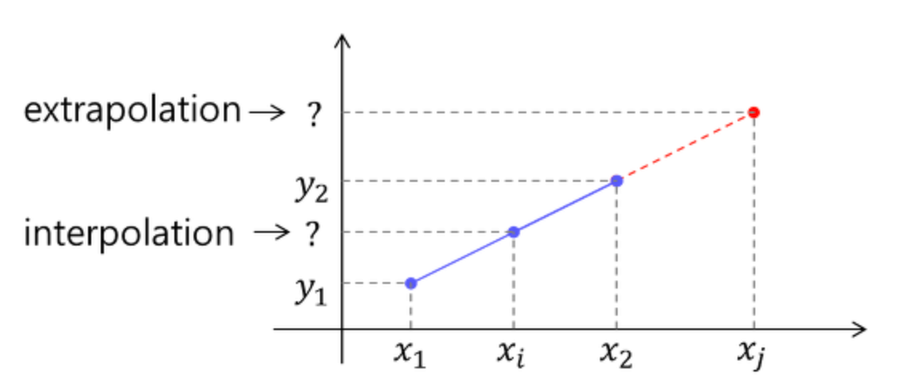
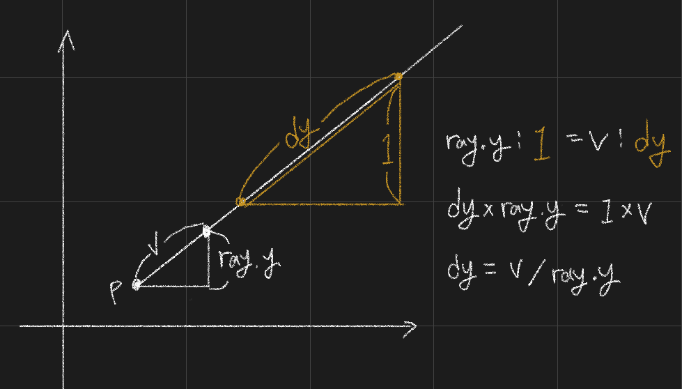
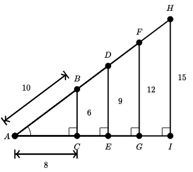
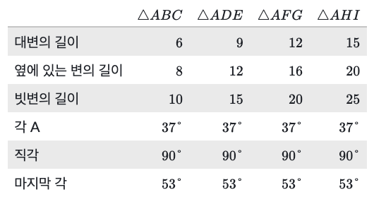
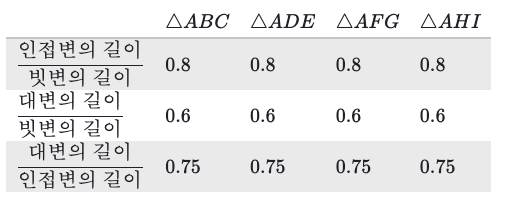

## 22.08.25 : 그래픽스 찍먹하기 

> # 그래픽스 찍먹하기(3차원 모델이 랜더링되는 과정을 살펴봅시다) - 42서울 청년멘토 deal
> 
> ## 삼각형
> 
> 모든 입체도형은 잘게 쪼개서 삼각형으로 표현할 수 있다.  
> 
> ## 모델링
> 
> 모델링에는 크게 폴리곤, 넙스, 섭디비젼, 스컬핑 방식으로 나뉜다. 각 방식의 특성 때문에 분야마다 다른 방식을 선택하여 사용한다. 게임 분야에서는 `폴리곤`, 애니메이션에서는 `섭디비젼`, 제품이나 건축에서는 `넙스`를 사용한다. 그리고 `스컬핑` 모델링은 다른 모델링을 서포트해주는 상호보완적인 모델링이다.  
> 
> ## 폴리콘 (Polygon)
> 
> 폴리곤은 형태를 구성하는 점, 선, 면의 집합으로 메쉬를 제작하는 방식이다. 폴리곤의 최소 단위는 삼각형이고, 모델링을 할 때에는 작업하기 편하도록 사각형을 기본 단위로 한다. 쉽고 직관적이지만 곡선 표현이 부족하기 때문에 엘리어싱이 발생된다. 곡선을 표현하기 위해서 폴리곤의 갯수를 늘린다면 높은 하드웨어 성능을 요구하게 된다. 폴리곤 갯수에 따라서 로우 폴리곤과 하이 폴리곤으로 나뉜다. 게임 엔진에서 실시간으로 렌더링할 수 있는 수준의 폴리콘 모델링을 로우 폴리곤이라고 한다.  
> 
> ## 넙스 (Nurbs)
> 
> Nurbs는 Non-Uniform Rational B-spline의 약자로 폴리곤의 단점을 보완하기 위해 만들어졌다. 선을 이용하여 형태를 갖추고 선들을 LOFT시켜서 면을 만든다. 화면 정보량은 폴리곤보다 단순하지만 모델링이 까다롭고, 텍스쳐 맵핑을 할 수 없으며 렌더링시에 하이 폴리곤으로 전환되며 데이터 데이터가 무거워진다.  
> 
> ## 섭디비전 (Subdivision)
> 
> 애니메이션 회사인 픽사에서 개발된 모델링 기술이다. 직관적인 폴리곤의 장점과 곡선이 완벽한 넙스의 장점을 모두 가지고 있다. 폴리곤 모델링을 기본으로 완만한 곡선이 계산되어 곡선 형태를 이룬다. 폴리곤의 점이 곡선에 영향을 미치는 컨트롤러가 되어서 이를 조절하여 모델링을 할 수 있다. UV 좌표도 함께 계산되기 때문에 텍스처 맵핑을 할 수 있다.  
> 
> ## 스컬핑 (Sculpting)
> 
> 스컬핑 방식은 점토로 석상을 만드는 과정을 3D로 옮겨왔다. 점토를 빚듯이 모델링을 하기 때문에 직관적이고 독립적인 결과물을 만들어 낼 수 있다. 하지만 게임이나 애니메이션에 사용하기 위해서 겉 표면을 폴리곤으로 재가공하는 과정이 필요하다. 스컬핑은 하이 폴리곤이기 때문에 폴리곤 수를 낮출 수 있는 대안적인 기술인 노말 맵이 등장하였다.  
> 노말 맵은 겉표면의 3차원 방향정보를 가진 2차원 이미지로 빛 반사 값을 조절하여 눈을 속이는 방식이다. 하이 폴리곤 모델에서 노말맵을 생성하고, 로우 폴리곤에 노말맵을 겹치면 표면의 굴곡을 하이폴리곤처럼 디테일하게 표현할 수 있다. 이 방식은 데이터를 많이 사용하지 않으며 디테일한 부분도 채울 수 있는 합리적인 방식이다.  
> 
> # 선형 보간
> 
> [선형 보간법](https://darkpgmr.tistory.com/117)  
> 
> ## Interpolation과 Extrapolation
> 
> 보간(Interpolation)이란 알려진 지점의 값 사이에 위치한 값을 알려진 값으로부터 추정하는 것을 말한다. 외삽(Extrapolation)은 알려진 값들 사이의 값이 아닌 범위를 벗어난 외부의 위치에서의 값을 추정하는 것을 말한다. 아래의 그림에서 x1, x2 값을 알고 있을때, x1 <= xi <= x2 에서 값의 추정을 interpolation, 범위 밖인 xj에서 값 추정을 extrapolation이라고 한다.  
> 
>   
> 
> ## 1D Linear Interpolation
> 
> 선형 보간법은 두 지점 사이의 값을 추정할 때 그 값을 두 지점과의 직선 거리에 따라 선형적으로 결정하는 방법이다.  
> 
>   
> 
> 위의 그림에서 양쪽의 두 점에서 임의의 지점 데이터 값을 구하는 식은 다음과 같다.  
> 
> $$
> f(x) = \frac{d_2}{d_1 + d_2}f(x_1) + \frac{d_1}{d_1 + d_2}f(x_2)
> $$  
> 
> 만약에 거리비의 합이 1이라고 정규화한다면 다음과 같이 단순화될 수 있다.  
> 
> $$
> \alpha = \frac{d_1}{d_1 + d_2}
> $$
> $$
> \beta = \frac{d_2}{d_1 + d_2}
> $$
> $$
> \alpha + \beta = 1
> $$
> $$
> f(x) = \beta f(x_1) + \alpha f(x_2)
> $$


## 22.08.23 : NSItemProvider
> 
> [Data Delivery with Drag and Drop](https://velog.io/@inwoodev/July-02-2021-TIL-Today-I-Learned-Data-Delivery-with-Drag-and-Drop)  
> [Action Extension](https://g-y-e-o-m.tistory.com/91)  
> 
> 
> 끌어서 놓기 또는 복사/붙여넣기 작업으로 데이터 또는 파일을 전달하기 위한 아이템 공급자이다. 데이터 또는 파일을 호스트 앱에서 다른 앱으로 전달하거나, 다른 프로세스로 전달할 수 있다.  
> 
> ```swift
> class NSItemProvider : NSObject
> ```
> 
> NSItemProvider는 앱 확장의 개체인 `NSExtensionItem`에서 `attachments` 속성을 검사할 때 만난다.
> 검사 중에 `hasItemConformingToTypeIdentitfier(_:)` 메서드를 사용하여 인식하는 데이터를 찾을 수 있다.  
> 아이템 공급자는 UTI( Uniform Type Identifier ) 값을 사용하여 포함된 데이터를 식별한다.  
> 확장에서 사용할 수 있는 데이터를 찾은 후에 `loadItem(forTypeIdentifier:options:completionHandler:)` 메서드를 호출하여 completion 핸들러에 전달되는 실제 데이터를 로드한다.  
> 아래의 예시는 액션 확장을 구현한 코드이다. 텍스트 뷰에 있는 텍스트 데이터 값을 `UIActivityViewController`에 보내고, 해당 확장에서 작업 후에 핸들러를 통해 값을 가져와서 다시 활용한다.  
> 
> ```swift
> import UIKit
> import MobileCoreServices
> 
> class ViewController: UIViewController {
> 
>     @IBOutlet weak var textView: UITextView!
>     override func viewDidLoad() {
>         super.viewDidLoad()
>         // Do any additional setup after loading the view, typically from a nib.
>     }
>     @IBAction func btnClicked(_ sender: UIButton) { var objectsToShare = [String]()
>         
>         if let text = textView.text {
>             objectsToShare.append(text)
>         }
>         let activityVC = UIActivityViewController(activityItems: objectsToShare, applicationActivities: nil)
>         activityVC.excludedActivityTypes = [UIActivityType.airDrop, UIActivityType.addToReadingList]
>         self.present(activityVC, animated: true, completion: nil)
>         
>         activityVC.completionWithItemsHandler =
>             { (activityType, completed, returnedItems, error) in
>                 
>                 if returnedItems!.count > 0 {
>                     
>                     let textItem: NSExtensionItem =
>                         returnedItems![0] as! NSExtensionItem
>                     
>                     let textItemProvider =
>                         textItem.attachments![0] as! NSItemProvider
>                     
>                     if textItemProvider.hasItemConformingToTypeIdentifier(
>                         kUTTypeText as String) {
>                         
>                         textItemProvider.loadItem(
>                             forTypeIdentifier: kUTTypeText as String,
>                             options: nil,
>                             completionHandler: {(string, error) -> Void in
>                                 let newtext = string as! String
>                                 DispatchQueue.main.async {
>                                     self.textView.text = newtext
>                                 }
>                         })
>                     }
>                 }
>         }
>     }
> }
> ```
> 
> 아이템 공급자를 생성하여 다른 프로세스에 데이터를 전달할 수 있다. 원래 데이터 아이템을 수정하는 확장은 호스트 앱으로 다시 보낼 새 NSItemProvider 개체를 만들 수 있다. 데이터 아이템을 생성할 때 데이터 개체와 해당 개체의 유형을 지정한다. 선택적으로 `previewImageHandler` 속성을 사용하여 데이터에 대한 미리보기 이미지를 생성할 수 있다. 
> 
> 단일 아이템 제공자는 사용자 정의 블록을 사용하여 다양한 형식으로 데이터를 제공할 수 있다.  
> 아이템 제공자를 구성할 때 registerItem(forTypeIdentifier:loadHandler:) 메소드를 사용하여 블록과 각 블록이 지원하는 형식을 등록하면 된다.  
> 클라이언트가 특정 형식의 데이터를 요청하면 아이템 공급자가 해당 블록을 실행하고 해당 블록은 데이터를 적절한 유형으로 강제 변환하여 클라이언트에게 반환하는 역할을 한다.  
> 
> 
> ## Providing Data
> 
> ```swift
> let image = UIImage(named: "Photo")
> let itemProvider = NSItemProvider(object: image!)
> ```
> 
> ## Retrieving Data
> 
> ```swift
> itemProvider.loadObject(ofClass: UIImage.self) { (object, error) in
> 	if let image = object as? UIImage {
> 		DispatchQueue.main.async {
> 			// Update UI
> 		}
> 	}
> }
> ```
> 
> ## Progress and Cancellation
> 
> ```swift
> let progress = itemProvider.loadObject(ofClass: UIImage.self) { // returns progress
> 	(object, error) in
> 	
> 	// ...
> 	
> }
> 
> let progressSoFar = progress.fractionCompleted
> let isFinished = progress.isFinished
> 
> progress.cancel()
> ```
> 
> # Uniform Type Identifiers
> 
> UTI는 변환되는 각 타입 포멧에 태그 값으로 주어서 드래그 된 아이템이 어떤 데이터 타입인지 식별할 수 있게 한다.  
> 네이티브 파일 포맷의 경우에는 문자열로 태그를 줄 수 있고, kuttype을 활용하여 태그 값을 줄 수 있다.  
> 

## 22.08.20 : SwiftUI onDrag, onDrop, itemProvider, DropDelegate

> # onDrag
> 
> 해당 View를 끌어서 놓기 작업의 소스로 활성화한다.  
> 
> ```swift
> func onDrag(
> 	_ data: @escaping () -> NSItemProvider
> ) -> some View
> 
> func onDrag<V>(
> 	_ data: @escaping () -> NSItemProvider, 
> 	preview: () -> V
> ) -> some View where V : View
> ```
> 
> ## Parameters
> 
> - `data` : 해당 View에서 드래그 가능한 데이터를 나타내는 하나의 [NSItemProvider](https://developer.apple.com/documentation/foundation/nsitemprovider)를 반환하는 클로저 함수이다. NSItemProvider는 프로세스 간에 데이터 또는 파일을 전달하기 위한 item provider이다.  
> - `preview` : 그래그가 시작될 때 미리보기 소스가 되는 View를 반환한다. 미리보기는 소스 view의 중앙에 있다. 
>   
> # onDrop
> 
> 끌어서 놓기 작업의 대상을 정의한다. 지정된 클로저로 놓아진 컨텐츠를 처리한다.  
> 
> ```swift
> func onDrop(
>     of supportedContentTypes: [UTType],
>     isTargeted: Binding<Bool>?,
>     perform action: @escaping ([NSItemProvider]) -> Bool
> ) -> some View
> 
> func onDrop(
>     of supportedContentTypes: [UTType],
>     isTargeted: Binding<Bool>?,
>     perform action: @escaping ([NSItemProvider], CGPoint) -> Bool
> ) -> some View
> 
> func onDrop(
> 	of supportedContentTypes: [UTType],
> 	delegate: DropDelegate
> ) -> some View
> ```
> 
> ## Parameters
> 
> - `supportedContentTypes` : 끌어서 놓기를 통해 수락할 수 있는 컨텐츠 유형을 설명하는 유형 식별자이다. 작업에 지원되는 유형이 없으면 놓기 대상이 활성화 되지 않고, 업데이트되지 않는다.  
> - `isTargeted` : 끌어서 놓기 작업이 놓기 대상 영역에 들어오거나 나갈 때 업데이트되는 바인딩이다. 바인딩 값이 true이면 커서가 영역 내부에 있고, false라면 커서가 외부에 있다.  
> - `action` : 놓아진 컨텐츠를 가져와서 적절하게 응답하는 클로저이다. action의 첫번째 매개변수인 [NSItemProvider]는 `supportedContentTypes`에 의해 지정된 유형과 함께 삭제된 항목 포함된다. 두번째 매개변수는 View의 좌표 공간에서 놓은 위치를 포함한다. 놓기 작업이 성공하면 true, 아니면 false를 반환한다.  
> - `delegate` : DropDelegate 프로토콜을 준수하는 유형이다. 대리자를 사용하여 놓기 동작을 포괄적으로 제어할 수 있다. 
> 
> 
> # itemProvider
> 
> 특정 데이터 요소에 사용할 드래그 표현을 반환하는 클로저를 제공한다.  
> 
> ```swift
> func itemProvider(_ action: Optional<() -> NSItemProvider?>) -> some View
> ```
> 
> # DropDelegate
> 
> 수정된 뷰에서 놓기 작업과 상호 작용하기 위해 구현하는 인터페이스이다.  
> DropDelegate 프로토콜은 놓기 동작과 포괄적이고 유연하게 상호 작용하는 방법을 제공한다. `onDrop(of:delegate:)` 메서드로 놓기를 허용하도록 View를 수정할 때 dropDelegate를 지정한다.  
> 또는 dropDelegate를 요구하지 않는 간단한 방법으로 `onDrop(of:isTargeted:perform:)`이나 `onDrop(of:isTargeted:perform:)` 메서드를 사용할 수 있다. 이 메서드들은 클로저를 사용하여 놓기 수정자의 일부 기능을 제공한다.  
> 
> ## Receiving drop infomation
> 
> - `func dropEntered(info: DropInfo)` : 수정된 View에 drop이 들어왔음을 delegate에게 알린다.
> - `func dropExited(info: DropInfo)` : 수정된 View에서 drop이 나갔음을 delegate에게 알린다.
> - `func dropUpdated(info: DropInfo) -> DropProposal?` : 수정된 View 안에서 drop이 움직임을 delegate에게 알린다.
> - `func validateDrop(info: DropInfo) -> Bool` : 예상 유형 중 하나를 준수하는 항목을 포함하는 drop이 허용되는 View에 들어갔음을 delegate에게 알린다.
> - `func performDrop(info: DropInfo) -> Bool` : 지정된 정보에서 항목 공급자 데이터를 요청할 수 있을을 delegate에게 알린다. 
> 
> # DropInfo
> 
> drop의 현재 상태이다.  
> 
> ```swift
> struct DropInfo
> ```  
> 
> - `var location: CGPoint` : drop View의 좌표 공간에서 드래그의 위치이다.
> - `func hasItemsConforming(to: [UTType]) -> Bool` : 하나 이상의 항목이 지정된 균일 유형 식별자 중 하나 이상을 준수하는지 여부를 나타낸다.
> - `func itemProviders(for: [UTType]) -> [NSItemProvider]` : 지정된 균일 유형 식별자 중 하나 이상을 준수하는 항목 공급자를 찾는다. 
> 
> 
> # UTType
> 
> 로드, 전송 또는 수신할 데이터 유형을 나타내는 구조체이다.  
> UTType 구조체는 데이터에 대한 유형 정보를 설명한다. 유형에는 고유한 identifier가 있으며, 선호하는 파일 이름 확장명 또는 MIME 유형을 조회하는 방법을 제공한다.  
> 시스템에는 식별자, 파일 이름 확장자 또는 MIME 유형별로 조회할 수 있는 많은 공통 유형에 대한 정적 선언이 포함되어 있다.  
> UTType 구조체는 유형과 관련된 추가 정보를 제공할 수 있다. 추가 정보의 예로는 현지화된 사용자 대면 설명, 유형에 대한 기술 문서를 실벽하는 참조 URL 또는 유형의 버전 번호가 있다. 사용 사례와 관련된 유형 또는 유형 목록을 얻기 위해 적합성에 따라 유형을 조회할 수도 있다.  
> 
> [공식 문서 UTType](https://developer.apple.com/documentation/uniformtypeidentifiers/uttype)  
> 


## 22.08.18 : SwiftUI LazyVGrid

> [ios13과 ios14에서 그리드 레이아웃을 구현하는 방법](https://betterprogramming.pub/the-swiftui-equivalents-to-uicollectionview-60415e3c1bbe)  
> 
> SwiftUI는 CollectionView을 지원하지 않기 때문에 UIKit에서 CollectionView를 가져와서 사용하거나 VStack, HStack으로 구현해야했다. 그러나 ios14 버전부터 LazyVGrid, LazyHGrid 라는 그리드 컨테이너를 지원한다.  
> 
> # LazyVGrid
> 
> 수직 방향의 그리드에 자식 뷰를 정렬하여 필요한 만큼만 항목을 생성하는 컨테이너 뷰이다.  
> 
> ```swift
> init(
> 	columns: [GridItem],
> 	alignment: HorizontalAlignment,
> 	spacing: CGFloat?,
> 	pinnedViews: PinnedScrollableViews,
> 	content: () -> Content
> 	)
> ```  
> 
> - columns: 그리드의 각 행의 크기와 위치를 지정하기 위한 GridItem의 배열
> - alignment: 상위 뷰 내에서 그리드의 정렬
> - spacing: 그리드와 상위 뷰의 다음 항목 사이의 간격
> - pinnedViews: 부모 스크롤 뷰의 경계에 고정할 뷰
> - content: 그리드의 내용 
> 
> 클로저에 제공하는 첫번째 content는 그리드의 맨 위 행에 나타난다. 첫번째 행을 선행 가장 자리에서 후행 가장자리로 채운 다음 두번째 행을 채우는 식으로 계속된다. 행의 수는 무제한으로 증가할 수 있지만 열의 수는 인자로 받은 GridItem 인스턴스에 따라서 지정된다.  
> 
> ```swift
> struct VerticalSmileys: View {
>     let columns = [GridItem(.flexible()), GridItem(.flexible())]
> 
>     var body: some View {
>          ScrollView {
>              LazyVGrid(columns: columns) {
>                  ForEach(0x1f600...0x1f679, id: \.self) { value in
>                      Text(String(format: "%x", value))
>                      Text(emoji(value))
>                          .font(.largeTitle)
>                  }
>              }
>          }
>     }
> 
>     private func emoji(_ value: Int) -> String {
>         guard let scalar = UnicodeScalar(value) else { return "?" }
>         return String(Character(scalar))
>     }
> }
> ```  
> 
>   
> 
> ## GridItem
> 
> lazy grid의 항목 레이아웃을 GridItem 인스턴스 배열을 사용하여 구성할 수 있다. 각각의 GridItem은 size와 spacing과 같은 레이아웃 속성을 지정한다.  
> 
> ```swift
> struct GridItemDemo: View {
>     let rows = [
>         GridItem(.fixed(30), spacing: 1),
>         GridItem(.fixed(60), spacing: 10),
>         GridItem(.fixed(90), spacing: 20),
>         GridItem(.fixed(10), spacing: 50)
>     ]
> 
>     var body: some View {
>         ScrollView(.horizontal) {
>             LazyHGrid(rows: rows, spacing: 5) {
>                 ForEach(0...300, id: \.self) { _ in
>                     Color.red.frame(width: 30)
>                     Color.green.frame(width: 30)
>                     Color.blue.frame(width: 30)
>                     Color.yellow.frame(width: 30)
>                 }
>             }
>         }
>     }
> }
> ```  
> 
> LazyHGrid는 열에서 가장 넓은 셀을 기준으로 각 열의 너비를 설정한다. 주어진 열의 모든 View에 한 번에 접근할 수 있기 때문에 이 작업을 수행할 수 있다. 위의 예에서 Color View는 항상 동일한 고정 너비를 가지므로 전체 그리드에서 열 너비가 균일하다.  
> 
> 그러나 LazyVGrid는 사람들이 앱의 정보를 스크롤할 때 새 셀을 생성하기 때문에 일반적으로 행의 모든 View에 액세스할 수 없다. 대신 각 행에 대한 정보는 그리드 항목에 의존한다. 위의 예는 각 행에 대해 서로 다른 고정 높이를 나타내고 각 행 뒤에 표시할 간격을 다르게 설정한다.  
> 
>   
> 
> 


## 22.08.16 : 픽셀 단위 원 그리기

> [Bresenham 알고리즘으로 원 그리기](https://reitbe.github.io/computergraphics/2022/07/30/CG-03-bresenham-algorithm-circle-drawing.html)
> 
> ## 브레젠험 알고리즘으로 원 그리기
> 
> 이 알고리즘으로 직선을 그릴 때에는 (0 < m < 1) 조건에서 x를 증가시키며 y의 중간값을 검사했다.  
> 원은 (0, 반지름) 좌표에서 시작하여 x를 1씩 증가시키며 y의 중간값이 원의 내부에 있는지 확인한다.  
> 원의 공식은 다음과 같다.  
> 
> $$
> x^2 + y^2 = r^2
> $$
> $$
> \therefore d = x^2 + y^2 - r^2
> $$  
> 
> - d > 0 : 원의 바깥에 점이 있다.
> - d < 0 : 원의 내부에 점이 있다.
> - d = 0 : 원의 둘레에 점이 있다.
> 
> 이 판별식에 중간점을 대입하여 중간점이 어디에 있는지 확인할 수 있다.  
> 
> $$
> d = x^2 + (y - \frac{1}{2})^2 - r^2
> $$  
> 
> - d > 0 : 다음 점에서 y 감소
> - d < 0 : 다음 점에서 y 유지
> 
> 분기에 따라서 y값이 다르기 때문에 다음과 같은 식을 얻을 수 있다.  
> 
> $$
> d_1 = (x + 1)^2 + ((y - 1) - \frac{1}{2})^2 - r^2
> $$
> $$
> d_2 = (x + 1)^2 + (y - \frac{1}{2})^2 - r^2
> $$
> 
> 
> 그러나 이대로 코드를 구현하면 많은 연산을 해야하기 때문에 공식을 정리한다. 초기 값을 받고, 변화시키는 방법으로 나타낸다면 다음과 같다.  
> 
> $$
> d_1 = d + \Delta d_1 \\  
> d_2 = d + \Delta d_2
> $$
> $$
> \Delta d_1 = d_1 - d \\  
> \Delta d_2 = d_2 - d
> $$
> $$
> \Delta d_1 = (x^2 + ((y - 1) - \frac{1}{2})^2 - r^2) - ((x + 1)^2 + (y - \frac{1}{2})^2 - r^2) \\  
> \Delta d_2 = (x^2 + ((y - 1) - \frac{1}{2})^2 - r^2) - ((x + 1)^2 + (y - \frac{1}{2})^2 - r^2)
> $$
> $$
> \Delta d_1 = 2(x - y) + 3 \\  
> \Delta d_2 = 2x + 1
> $$
> 
> 공식을 바탕으로 코드를 작성하면 다음과 같다.  
> 
> ```c
> // 의사코드
> x=0, y=r
> d = 1-r
> 
> while(x<y)
> {
> 	x=x+1
> 	if(d>0){ // 중간점이 원의 바깥에 있다. -> y값 감소
> 		d=d+2(x-y)+3
> 		y=y-1
> 	}
> 	else d=d+2x+1 // 중간점이 원의 내부에 있다 -> y값 유지
> 	plot8(x,y) // 대칭되는 8개 점을 그린다.
> }
> ```
> 


## 22.08.15 : DDA 알고리즘, 레이캐스팅
> 
> # Digital Differential Analyzer
> 
> DDA 알고리즘은 중간값을 취하지 않고 데이터를 한 자리씩 다루어서 정밀도를 높이는 알고리즘이다.  
> 
> ## 조건
> 
> 1. 먼저, 직선 기울기의 절대값을 확인한다.
> 2. 기울기가 1보다 작으면 x축을 기준으로, 1보다 크면 y축을 기준으로 잡는다.
> 3. 기준으로 잡은 축을 1씩 이동시키고, 다른 축에는 기울기를 더한다.
> 4. 나온 값이 실수라면 반올림을 한 좌표에 점을 찍는다.
> 
> ## 레이캐스팅
> 
> DDA 알고리즘으로 좌표 상에 그려지는 광선을 추적하며 충돌하는 벽을 확인할 수 있다.  
> 
> 1. 반복문을 실행할 때마다 누적될 직선의 기울기 절대값을 확인한다.  
> 2. x축 또는 y축으로 1씩 이동하며, 기울기 값을 더한다.  
> 3. 이동된 좌표에 벽이 있는지 확인하고, 존재한다면 충돌되어 이동을 멈춘다.  
> 
>   
> 
> 위의 그림과 같이 sideDistX와 sideDistY에 deltaDist 값이 각각 더해진다. 값이 더해지는 순서는 sideDist 값을 비교하여 정한다.  
> sideDistX가 sideDistY보다 작다면 sideDistX에 deltaDistX가 더해지며, x축으로 1만큼 이동시킨다.  
> sideDistY가 sideDistX보다 작다면 sideDistY에 deltaDistY가 더해지며, y축으로 1만큼 이동시킨다.  
> 이렇게 x축 또는 y축으로 1씩 이동시키며 해당 좌표에 벽이 있는지 확인한다.  
> 
> ## deltaDist  
> 
> 두 직각 삼각형이 닮음이라면, 대응되는 변의 길이에 대한 비율은 같다. 이를 활용하여 다음과 같이 delta 값을 구한다.  
> 
>   
>   
> 
> - 광선의 방향벡터인 ray로 하나의 삼각형을 그린다.
> - delta 값을 빗변의 길이로 가지는 삼각형을 그린다.
> - 두 직각 삼각형은 예각의 각도가 같으므로 대응하는 변의 길이의 비가 같다.
>   - $ray.x : 1 = v : dx$
> - 그러므로 다음과 같은 공식이 만들어진다.
>   - $dx = v / ray.x$
> - delta 값은 앞으로 비율로써 계산하기 때문에 $v$를 1이라고 할 수 있다.
>   - $dx = 1 / ray.x$
> - delta 값은 절대값으로 충돌 지점을 만나기 전까지 누적된다.
>   - $dx = |\ 1 / ray.x\ |$
> - 코드로 구현하면 다음과 같다.
>     ```c
>     double delta_dist_x = abs(1 / ray_dir_x);
>     double delta_dist_y = abs(1 / ray_dir_y);
>     ```  
> 
> ## sideDist  
> 
> deltaDist를 구하는 방식처럼 닮음 조건을 활용하여 sideDist 값을 구할 수 있다.  
> 
>   
>   
> 
> - delta 값을 구한 방식처럼 두 직각 삼각형의 변의 길이의 비율로 side 값을 구한다. 그러면 다음과 같은 식이 나온다.
>     - $sideX = x \times dx$
>     - $sideY = y \times dy$
> - 시작점과 그리드 상의 좌표로 $x, y$를 구할 수 있다.
>     - 광선방향X가  
>     0보다 작다면 ( $x = posX - mapX$ ),  
>     0보다 크다면 ( $x = mapX + 1.0 - posX$ )
>     - 광선방향Y가  
>     0보다 작다면 ( $y = posY - mapY$ ),  
>     0보다 크다면 ( $y = mapY + 1.0 - posY$ )  
> - $x, y$를 이전의 공식에 대입하면 다음과 같다.
>     - 광선방향X가  
>     0보다 작다면 ( $sideX = (posX - mapX) \times dx$ ),  
>     0보다 크다면 ( $sideX = (mapX + 1.0 - posX) \times dx$  )  
>     - 광선방향Y가  
>     0보다 작다면 ( $sideY = (posY - mapY) \times dy$ ),  
>     0보다 크다면 ( $sideY = (mapY + 1.0 - posY) \times dy$ )  
>     
> 
> 


## 22.08.13 : SwiftUI

> # 동적으로 미리보기 생성
> 
> PreviewProvider에 코드를 추가하여 다양한 장치 크기에서 미리보기를 렌더링할 수 있다. 기본적으로 미리보기는 활성화된 scheme의 크기로 렌더링된다. Device() 수정자를 호출하여 미리보기 장치를 변경할 수 있다.  
> 
>   
> 
> 아래의 코드는 현재 리스트 미리보기를 iPhone SE 사이즈로 변경한다. Xcode의 scheme 메뉴에 있는 장치 이름을 넘겨주면 된다.  
> 
> ```swift
> // ...
> 
> struct LandmarkList_Previews: PreviewProvider {
>     static var previews: some View {
>         LandmarkList()
>             .previewDevice(PreviewDevice(rawValue: "iPhone SE (2nd generation)"))
>     }
> }
> ```  
> 
> LandmarkList에 장치 이름 배열을 데이터로 사용할 수 있다. ForEash는 list와 동일한 방식으로 컬렉션에서 작동한다. 모든 child View를 사용하는 모든 곳에 사용할 수 있다. '\\.self' 데이터 요소가 여기에 사용하는 문자열과 단순한 값 유형인 경우 식별자에 대한 키 경로로 사용할 수 있다. 
> 
> ```swift
> // ...
> 
> struct LandmarkList_Previews: PreviewProvider {
>     static var previews: some View {
>         ForEach(["iPhone SE (2nd generation)", "iPhone XS Max"], id: \.self) { deviceName in
>             LandmarkList()
>                 .previewDevice(PreviewDevice(rawValue: deviceName))
>         }
>     }
> }
> ```
> 


## 22.08.11 : 직각삼각형의 비
> 
> 두 직각삼각형의 예각의 각도가 같다면 그 삼각형 안의 대응하는 변의 길이의 비도 같다.  
> 합동에 대해 공부하면, 두 개의 각과 그 사이의 변의 길이가 같은 경우 다른 모든 조건(길이와 각의 크기)이 같다는 것을 알 수 있다.  
> 
>   
> 
> 다음 4개의 삼각형은 모두 각A가 공통이고, 모두 직각을 가지고 있다. 그러므로 삼각형은 AA 닮음 조건에 의해 닮음이다.  
> 
>   
> 
> 4개의 삼각형의 데이터는 다음과 같다.  
> 
>   
> 
> 데이터를 가지고 비율표를 작성하면 다음과 같다.  
> 
>   
> 
> 즉, 삼각형이 전부 다른 크기를 가지고 있지만 대응되는 변의 길이에 대한 비율은 다 같다.  
> 
> 직각삼각형의 변의 비를 구하는 방법으로 DDA 알고리즘에서 delta 값을 구했다.  
> 
>   
>   
> 
> 


## 22.08.09 : atan2
> 
> [두 점 사이의 절대각도를 재는 atan2](https://spiralmoon.tistory.com/entry/%ED%94%84%EB%A1%9C%EA%B7%B8%EB%9E%98%EB%B0%8D-%EC%9D%B4%EB%A1%A0-%EB%91%90-%EC%A0%90-%EC%82%AC%EC%9D%B4%EC%9D%98-%EC%A0%88%EB%8C%80%EA%B0%81%EB%8F%84%EB%A5%BC-%EC%9E%AC%EB%8A%94-atan2)
> 
> atan2는 역탄젠트를 계산하는 함수이다. 아크탄젠트(arctangent)는 역탄젠트라고도 하며 탄젠트의 역함수이다. 아크탄젠트를 이용하면 𝞱각도를 구할 수 있다. 모든 프로그래밍 언어에는 아크탄젠트를 계산할 수 있도록 Math 모듈에 atan(y/x), atan2(y, x) 함수를 지원한다.  
> 
> ## atan, atan2 차이점
> 
> 두 함수는 𝞱의 절대각을 구하는 함수이지만 두가지로 나뉘었다.  
> atan은 두 점 사이의 탄젠트값을 받아서 절대각을 -π/2 ~ π/2의 라디안 값으로 반환한다.  
> atan2는 두 점 사이의 상대좌표를 받아서 절대각을 -π ~ π의 라디안 값으로 반환한다.
> 
> ## atan2를 사용하는 이유
> 
> 양수와 음수를 표시하는 데카르트 좌표계에서 사용할 때 유용하다.  
> atan2 함수는 점 A로 부터 점 B가 상대적으로 어느 위치에 있는지 인자로 받는다. 상대적인 위치를 받기 때문에 음수인 x, y를 받을 수 있다. 
> 


## 22.08.04 : 픽셀 위에 직선을 그리는 알고리즘
> 
> [2차원 그래픽스 기본요소와 그리기](https://robodream.tistory.com/207)
> 
> 픽셀로 이루어진 화면에 직선을 그리기 위한 알고리즘이다. 만약에 직선을 그린다면 연속된 픽셀이 끊기지 않고 최대한 직선에 가깝게 표현되어야 한다. 픽셀의 중심이 좌표의 정수 부분이 된다.  
> 
> # DDA 알고리즘 (Digital Differential Analyzer Algorithm)
> 
> DDA 알고리즘은 양 끝점이 주어졌을 때 화면 위 직선을 그릴 수 있는 알고리즘이다.  
> 
> 선의 양끝 점인 $(X_a, Y_a)$, $(X_b, Y_b)$에서 다음과 같은 공식을 구하게 된다.  
> $$
> y = mx + c
> $$
> $$
> m = \frac{y_b - y_a}{x_b - x_a} = \frac{\Delta x}{\Delta y}
> $$
> 
> - 기울기 $m$이 $0 <= m <= 1$ 인 경우에는 $x$를 1씩 증가시킬 때 $y$는 기울기 값인 $m$만큼 증가한다.  
> - 기울기 $m$이 1보다 큰 경우에 $x$를 1씩 증가시키면 $y$가 증가하는 $m$ 값이 1보다 크므로 픽셀의 사이가 멀어져 끊어진다. 따라서 $m$이 1보다 큰 경우에는 $x$를 증가시키지 않고 $y$를 1씩 증가시킨다.  
> 
> 이러한 원칙을 적용하여 다음과 같이 공식을 유도할 수 있다.  
> 
> ## 1. 초기화
> 
> $
> \Delta x = x_b - x_a \\
> \Delta y = y_b - y_a
> $
> 
> $
> m = \frac{\Delta y}{\Delta x}\\
> $
> 
> $
> x_1 = x_a\\
> y_1 = y_a
> $
> 
> ## 2. 연산
> 
> - $m$이 $0 <= m <= 1$인 경우, 매번 $K + 1$번째 점$(1 \leq k \leq \Delta x)$에서  
> $
> x_{K+1} = x_k + 1 \\
> y_{K+1} = y_k + m \\
> y_{K+1}\ 's\ raster\ coordinate = Round(y_{k+1})
> $  
> 
> - $m$이 $-1 \geq m \ , \ m \geq 1$인 경우  
> $
> y_{K+1} = y_k + 1 \\
> x_{K+1} = x_k + 1/m \\
> x_{K+1}\ 's\ raster\ coordinate = Round(x_{k+1})
> $  
> 
> DDA 알고리즘은 증가하는 방향에 따라서 더하거나 빼서 알맞게 조정해서 사용할 수 있다. 하지만 소수점 계산을 해야하기 때문에 부담이 된다. 또한 매번 좌표를 구할 때마다 기울기 $m$ 또는 $1/m$을 더해서 반올림을 하기 때문에 오차가 누적되는 단점이 있다.  
> 
> # 브레젠헴 알고리즘 (Bresenham's Algorithm)
> 
> 소수점 연산이 필요한 DDA 알고리즘의 단점을 브레젠헴 알고리즘으로 해결할 수 있다. 이 알고리즘에서는 소수점 계산없이 정수의 더하기 연산화 시프트 연산으로 처리되므로 더욱 빠르다. 이 알고리즘의 기본 개념은 다음과 같다.  
> 
> $y = mx + c$ 선에서 $m$이 $0 <= m <= 1$이라고 가정하면 선을 구성하고 있는 어느 한 점의 다음 점은 반드시 오른쪽 또는 오른쪽 바로 위의 점이 된다.  
> 
> 
> 
> 위의 그림에서 보듯이 k번째 점인 $(x_k, y_k)$의 다음 점 $(x_{k+1}, y_{k+1})$은 $(x_{k} + 1, y_{k+1})$ 이거나 $(x_{k}+1, y_{k}+1)$ 이다.  
> 
> 이때 어느 점인지 판별하는 방법은 원래의 선과 K+1번째 점과의 차를 구하여 결정한다. $d1$과 $d2$ 값을 구하고, 차이값을 빼는 판별식은 다음과 같다.  
> 
> $
> d_1 - d_2 \\
> = \{m(x_k + 1) + c - y_k\} - \{y_k + 1 - m(x_k + 1) - c\}\\
> = 2m(x + 1) - 2y_k + 2c - 1
> $
> 
> 그리고 기울기 $m$의 값은 $m = \frac{\Delta y}{\Delta x}$이므로 양변에 $\Delta x$를 곱하여 다음과 같은 식을 만든다.    
> 
> $
> (d_1 - d_2) \Delta x = P_{k+1}
> $
> 
> 이를 판별식에 적용하면 다음과 같다.  
> 
> $
> P_{k+1} \\
> = 2 \Delta y (x_k + 1) + \Delta x (-2y_k + 2_c - 1)\\
> = 2 \Delta yx_k - 2 \Delta xy_k + 2 \Delta y + \Delta x(2_c - 1)
> $
> 
> 이 식에서 $P_{k+1}$에 $P_k$를 대입하면 $P_{k+1}$과 $P_k$의 관계식을 구할 수 있다.  
> 
> $
> P_k = 2 \Delta yx_{k-1} - 2 \Delta xy_{k-1} + 2 \Delta y + \Delta x (2c - 1)\\
> P_{k+1} - P_k = 2 \Delta y(x_k - x_{k-1}) - 2 \Delta x(y_k - y_{k-1})\\
> P_{k+1} = P_k + 2 \Delta y - 2 \Delta x (y_k - y_{k-1})
> $
> 
> 그리고 $(y_k - y_{k-1})$ 는 1또는 0이므로 다음과 같은 식을 2개 얻을 수 있다.  
> 
> $
> P_{k+1} = P_k + 2(\Delta y - \Delta x)\\
> P_{k+1} = P_k + 2 \Delta y
> $
> 
> 여기서 $2(\Delta y - \Delta x)$를 C1으로 하고, $2 \Delta y$를 C2로 하게 된다.  
> 선의 시작점은 $(x_a, y_a)$이므로 $P_{k+1}$의 공식으로부터 초기값 $P_1$을 다음과 같이 구한다.  
> 
> $
> P_1 \\
> = 2 \Delta yx_a - 2 \Delta xy_a + 2 \Delta y + \Delta x(2c - 1) \\
> = 2 \Delta yx_a - 2 \Delta x(mx_a + c) + 2 \Delta y + \Delta x (2c - 1) \\
> = 2 \Delta yx_a - 2(\Delta yx_a + \Delta xc) + 2 \Delta y + \Delta x (2c - 1) \\
> = 2 \Delta y - \Delta x
> $
> 
> 이 식에서 초기값 $P1$을 알면 $P2$를 구할 수 있고, $P_{k+1}$은 $P_k$를 통해서 구할 수 있다.  
> 따라서 정리하게 되면 브레젠헴 선그리기 알고리즘은 다음과 같다. (기울기를 $0 \leq |m| \leq 1$로 가정)  
> 
> ## 1. 초기화
> 
> 시작점의 좌표를 $(x_1, y_1)$로 하고 계산한다.  
> 
> $
> C1 = 2(\Delta y - \Delta x) \\
> C2 = 2 \Delta y \\
> P_1 = 2 \Delta y - \Delta x
> $
> 
> ## 2. 연산
> 
> $d_1 - d_2$의 판별식에서 $P_k$ 값에 따라 다음 점의 위치를 아래와 같이 구할 수 있다. ($1 \leq k \leq \Delta x$)
> 
> $P_k \lt 0$ 이라면 다음 픽셀 점은 $(x_k + 1\ , y_k)$ 이며, $P_{k+1} = P_k + C_1$ 이다.  
> $P_k \geq 0$ 이라면 다음 픽셀 점은 $(x_k + 1\ , y_k + 1)$ 이며, $P_{k+1} = P_k + C_2$ 이다.  
> 


## 22.08.02 : SwiftUI State and data flow

> # State and data flow
> 
> 앱 모델 내에서 데이터 흐름과 변경 사항을 제어하고 이에 대응한다. SwiftUI는 사용자 인터페이스 디자인에 대한 선언적 접근 방식을 제공한다. View 계층 구조를 구성할 때 View에 대한 데이터 종속성도 표시한다. 만약에 이벤트로 인해 데이터가 변경된다면 SwiftUI가 자동으로 업데이트해준다. 즉, 뷰컨트롤러의 작업을 프레임워크가 자동으로 수행한다.
> 
> 프레임워크는 앱의 데이터를 사용자 인터페이스에 연결하기 위한 상태 변수 및 바인딩과 같은 도구를 제공한다. 이러한 도구는 앱의 모든 데이터 조각에 대한 단일 정보 소스를 유지하는 데 도움이 된다. 상황에 맞게 도구를 사용하면 된다.  
> 
> - 값 유형을 State 속성으로 래핑하여 일시적인 UI 상태를 관리
> - ObservedObject 속성 래퍼를 사용하여 ObservableObject 프로토콜을 준수하는 외부 참조 모델 데이터에 연결한다. EnvironmentObject 속성 래퍼를 사용하여 환경에 저장된 관찰 가능한 개체에 액세스한다. StateObject를 사용하여 View에서 직접 관찰 가능한 개체를 인스턴스화한다. 
> - Binding 속성 래퍼를 사용하여 State 또는 Observable object와 같은 소스에 대한 참조를 공유한다.
> - Environment에 저장하여 앱 전체에 데이터를 배포한다.
> - PreferenceKey를 사용하여 하위 View에 데이터를 전달한다.
> - FetchRequest를 사용하여 CoreData에 저장된 영구 데이터를 관리한다. 
> 
> ## 속성 래퍼 활용
> 
> SwiftUI는 State 및 Binding과 같은 많은 데이터 관리 유형을 Swift 속성 래퍼로 구현한다.  
> 
> ```swift
> @State private var isVisible = true	// isVisible을 state 변수로 선언
> ```
> 
> SwiftUI의 상태 및 데이터 흐름 속성 래퍼는 데이터 변경 사항을 감시하고 필요에 따라 영향을 받는 View를 자동으로 업데이트한다. 코드에서 속성을 직접 참조할 때 래핑된 값에 액세스한다. 위의 예에서 isVisible 상태 속성의 경우 저장된 Boolean이다.  
> 
> ```swift
> if isVisible == true {
>     Text("Hello") // isVisible이 true인 경우에만 렌더링
> }
> ```
> 
> 또는 속성 이름 앞에 달러 기호($)를 붙여서 속성 래퍼의 예상 값에 액세스할 수 있다. SwiftUI 상태 및 데이터 흐름 속성 래퍼는 항상 Binding을 프로젝션하여 다른 View에서 단일 소스에 액세스하고 변경할 수 있도록 한다.  
> 
> ```swift
> Toggle("Visible", isOn: $isVisible) // 토글이 저장된 값을 변경
> ```
> 
> # Property Wrappers
> 
> 속성 래퍼는 속성이 저장되는 방식을 관리하는 코드와 속성을 정의하는 코드 사이에 분리 계층을 추가한다.  
> 
> 예를 들어 스레드 안전성 검사를 제공하거나 기본 데이터를 데이터베이스에 저장하는 속성이 있는 경우 모든 속성에 해당 코드를 작성해야 한다. 그러나 속성 래퍼를 사용하면 래퍼를 정의할 때 관리 코드를 한 번 작성한 다음 여러 속성에 적용하여 해당 관리코드를 재사용할 수 있다.  
> 
> 속성 래퍼를 정의하려면 wrappedValue로 정의된 struct, enum 또는 class를 만들어야 한다. 아래의 코드를 보면, TwelveOrLess 구조체가 감싸는 값이 항상 12보다 적거나 같게 된다. 만약에 더 큰 수를 저장한다면 12가 저장될 것이다.  
> 
> ```swift
> @propertyWrapper
> struct TwelveOrLess {
>     private var number = 0
>     var wrappedValue: Int {
>         get { return number }
>         set { number = min(newValue, 12) }
>     }
> }
> ```
> 
> 속성 앞에 래퍼의 이름을 속성으로 작성하여 속성에 래퍼를 적용한다. 다음은 TwelveOrLess 속성 래퍼를 사용하여 항상 12이하의 크기를 가지는 사각형을 저장하는 구조체이다.  
> 
> ```swift
> struct SmallRectangle {
>     @TwelveOrLess var height: Int
>     @TwelveOrLess var width: Int
> }
> 
> var rectangle = SmallRectangle()
> print(rectangle.height)
> // Prints "0"
> 
> rectangle.height = 10
> print(rectangle.height)
> // Prints "10"
> 
> rectangle.height = 24
> print(rectangle.height)
> // Prints "12"
> ```
> 
> 속성에 래퍼를 적용하면 컴파일러는 래퍼에 대한 저장소를 제공하는 코드와 애퍼를 통해 속성에 대한 액세스를 제공하는 코드를 합성한다. 다음은 @TwelveOrLess를 사용하는 대신 TwelveOrLess 구조체를 사용하여 래핑한다.  
> 
> ```swift
> struct SmallRectangle {
>     private var _height = TwelveOrLess()
>     private var _width = TwelveOrLess()
>     var height: Int {
>         get { return _height.wrappedValue }
>         set { _height.wrappedValue = newValue }
>     }
>     var width: Int {
>         get { return _width.wrappedValue }
>         set { _width.wrappedValue = newValue }
>     }
> }
> ```
> 
> 
> 


## 22.08.01 : c++ container(map), Ray Casting

> ## map
> 
> [[C++/STL]map,set 참조링크](https://sarah950716.tistory.com/6)
> 
> map은 key와 value의 쌍으로 이루어진 트리로써 연관된 두 값을 묶어서 관리할 수 있다. 검색, 삽입, 삭제 등의 속도를 빠르게 하기 위해 균형 이진 트리 중의 하나인 `레드 블랙 트리`로 구현되어 있다. key를 기준으로 정령된 상태이기 때문에 검색 속도가 특히 빠르다.  
> 
> map는 반복자(iterator)와 인덱스(key)를 이용하여 요소에 접근할 수 있다. 중복된 key를 사용할 수 없으며, 만약에 존재하는 key값을 가진 노드를 추가한다면 이미 존재하는 노드에 덮어씌워진다. 그렇기 때문에 유일한 key, value 쌍을 가진다.  
> 
> ### 멤버 함수
> 
> - `map.size()` : 노드 개수를 반환
> - `map.empty()` : 사이즈가 0인지 아닌지 확인
> - `map.begin()` : 첫번째 원소를 가리키는 iterator 반환
> - `map.end()` : 마지막 원소를 가리키는 iterator 반환
> - `map[key] = value` : (key, value) 노드를 추가
> - `map.insert(make_pair(key, value))` : (key, value) 노드를 추가
> - `map.erase(key)` : key를 찾아서 제거
> - `map.find(key)` : key를 찾고, 있다면 해당 노드를 가리키는 iterator 반환하고 없다면 마지막 원소 iterator 반환
> 
> ```c++
> int main(void)
> {
> 	map<char,int>	m;
> 
> 	m['A'] = 10;
> 	m.insert(make_pair('B', 20));
> 	
> 	// m : (A, 10), (B, 20)
> 	
> 	m.insert(make_pair('A', 30));
> 
> 	// m : (A, 30), (B, 20)
> 	
> 	map<char, int>::iterator	iter = m.find('B');
> 	
> 	if (iter != m.end())
> 	{
> 		cout << iter->first << endl;
>         cout << iter->second << endl;
> 	}
> 	
> 	return (0);
> }
> ```
> 
> [raycasting_tutorial](https://github.com/365kim/raycasting_tutorial/blob/master/2_basics.md)
> [raycasting_tutorial_원문](https://lodev.org/cgtutor/raycasting.html)
> 
> ## Ray Casting이란
> 
> 2차원 맵에서 3차원 원근감을 만드는 렌더링 기술이다. 
> 
> - 스크린의 모든 수직선에 대해 계산하여 속도가 빠르다. 
> - 과거의 느린 컴퓨터에서 3D를 구현하는 최초의 해결책이었다. 
> - 레이캐스팅 기술을 사용한 가장 유명한 게임은 'Wolfenstein 3D'이다. 
> 
> ## Ray Casting, Ray Tracing
> 
> - Ray Casting은 4MHz 그래픽 계산기에서도 실시간으로 빠르게 작동하는 semi-3D 기술이다.
> - Ray Tracing은 3D 장면의 반사, 그림자를 지원하여 현실감있게 렌더링하는 기술이며, 컴퓨터가 빨라진 후에 높은 해상도와 복잡한 장면을 실시간으로 처리할 수 있게 되었다. 
> 
> ## 기본적인 원리
> 
> - 2차원 정사각형 그리드 맵이 있다. 
> - 맵의 한 칸은 0과 양수로 벽의 존재와 특정 색상, 질감을 나타낸다.
> - 화면의 모든 x값(수직선)에 대해 플레이어 위치에서부터 시작하는 광선을 쏜다. 
> - 광선의 방향은 **플레이어가 바라보는 방향**, 화면의 **x좌표**에 의존한다.
> - 광선은 벽에 부딪힐때까지 직진하고 벽에 부딪히면 **적중지점**으로부터 **플레이어까지의 거리**를 구한다.
> - 거리에 따라서 **벽의 높이**가 화면에 어떻게 그려져야 하는지 결정된다. 
> - 벽의 높이는 거리가 멀수록 낮게, 가까울수록 높게 표시된다. 
> 
> 정리하면
> 1. 광선이 벽에 부딪힐때까지 직진하여 적중지점을 찾는다. (좌표)
> 2. 광선의 길이를 구한다.
> 3. 광선의 길이에 따라서 벽의 높이를 정한다.
> 
> - 광선은 검사지점의 간격만큼 직진한다.
> - 광선이 벽에 부딪혔는지 확인은 Ray Casting Algorithm으로 사각형 안에 포인트가 들어왔는지 확인한다.  
> - 아니면 광선이 닿는 벽의 모든 면을 검사하여 벽이 있어야 하는지 확인한다.  
> - 검사간격이 일정하지 않고, 다음 측면까지의 거리에 따라 달라진다.
> 
> ## DDA(Digital Differential Analysis)
> 
> [DDA 알고리즘을 이용한 Ray Casting](https://wonillism.tistory.com/199)
> 
> 2차원 그리드를 지나가는 선이 어떤 네모칸과 부딪히는지 찾을 때 일반적으로 사용되는 속도가 빠른 알고리즘이다. 이 알고리즘은 광선이 어떤 네모칸과 부딪히는지 찾고, 부딪힘이 확인되면 중단된다.  
> 
> 광선이 측면에 도달하면 벽에 적중했는지 확인하는 알고리즘이다. x축과 y축에 광선이 닿을때 확인하는데 현재 닿은 x축과 다음에 닿을 x축의 간격이 그 다음에 닿을 x축까지의 거리와 같으므로 이를 이용한다. 이 간격을 누적하며 벽을 확인한다.  
> 
> 
> 
