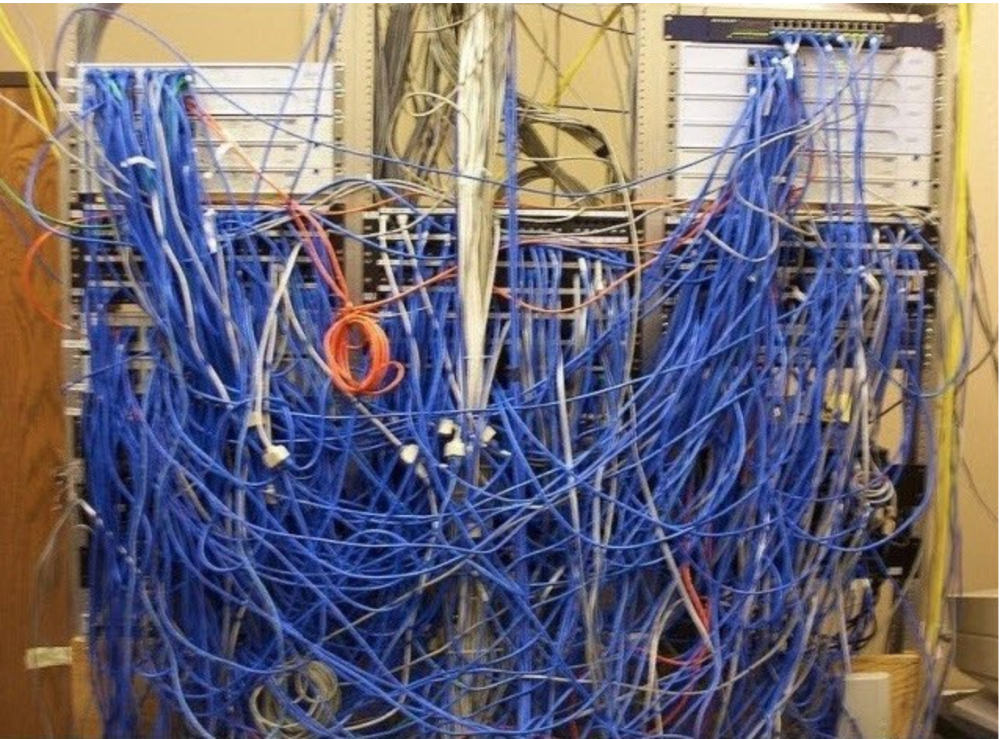
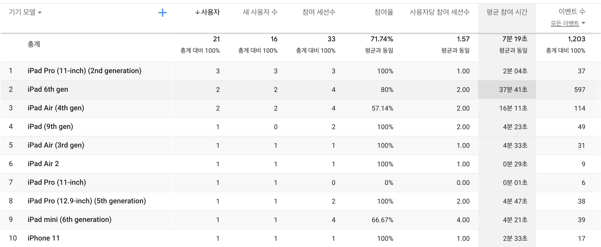

# Gridot  

### 22.08.20 : drag and drop View

UIKit에서 사용했던 CollectionView가 구현되어 있지 않다. 그래서 비슷한 기능을 가진 View를 찾아서 CollectionView를 구현하려 한다.  
가장 먼저 구현할 기능은 드래그 앤 그롭이다. SwiftUI에는 View의 메서드로 `onDrag`, `onDrop`가 있어서 이를 사용하여 컨텐츠 재배치를 구현하면 된다. 

### 22.07.23 : 초기화

- 코드 분석을 시작할 엄두가 나지않는다. 과거에 작성한 코드가 이해되지 않는 상황이 다가오면 문서 작성을 해야겠다는 다짐을 한다. 하지만 시간이 걸리는 작업이기 때문에 쉽지 않다.  
- 이전 코드를 수정하기보다 새롭게 시작하기로 한다. 새로운 SwiftUI 프로젝트를 생성하고, 이전의 코드를 참조하여 만들어 가기로 한다.  

### 22.07.21 : 준비

아이폰과 아이패드를 모두 지원하는 방법을 찾아야 한다. 그런데 한가지 문제가 있다. 아이패드를 지원하기 위해서는 스토리보드를 추가로 구현해야 하는데 스토리보드 정리가 안되어 있어서 추가하기 어렵다. 스토리보드가 개발 초기 단계에서는 편리하게 느껴졌지만 화면이 많아지며 관리하기 어려워졌다. 디자인 툴을 다루듯이 화면을 구성할 수 있지만 다양한 종류의 화면이 필요해지니 화면의 관계를 정리하기 어려워졌고, 화면을 계속 추가시키니 main storyboard 파일이 무거워졌다. 그래서 스토리보드를 버리고 SwiftUI를 사용하기로 한다. 스토리보드를 SwiftUI로 대체하는 과정은 쉽지 않아 보이지만 해보려 한다.  

그리고 개발 방식을 바꾸기로 했다. 테스트 케이스를 작성한 후에 기능을 구현하는 방식으로 진행할 예정이다. 이전에는 구현에만 신경을 쓰며 원하는 기능이 구현되면 다음으로 넘어갔다. 이런 방식은 속도가 빨라보이지만 언젠가 문제가 발생하여 다시 코드를 고쳐야한다. 다시 코드를 이해하고 문제를 해결하는 시간을 줄이기 위해서 테스트 케이스를 먼저 작성하기로 했다.  

SwiftUI로 변환하는 과정에서 중요한 점은 의존성 정리이다. 조그마한 기능을 가지고 있는 애플리케이션임에도 의존성이 복잡하게 얽혀있어서 클래스를 다른 곳에서 사용하기 어렵다. 최대한 유연하게 클래스 간의 의존성을 해결해야 한다.

### 22.06.30 : 문제 찾음

기획 단계의 생각이 잘못되었음을 알게 되었다.  
처음엔 단순하게 '아이폰으로 픽셀 그림을 그릴 수 있으면 좋겠다'라고 생각했다.  
하지만 앱을 출시하고 데이터를 보니 아이폰으로 그림을 그리는 사람은 아무도 없었다.  
지원하지 않는 아이패드로 다운받아 사용하고 있었다.  
그래서 다음 업데이트는 아이패드 지원이다.  

그리닷은 아이폰으로 픽셀 아트를 그리는 앱이다.  
하지만 데이터를 보니 아이패드에서 다운받는 유저가 더 많다.  

