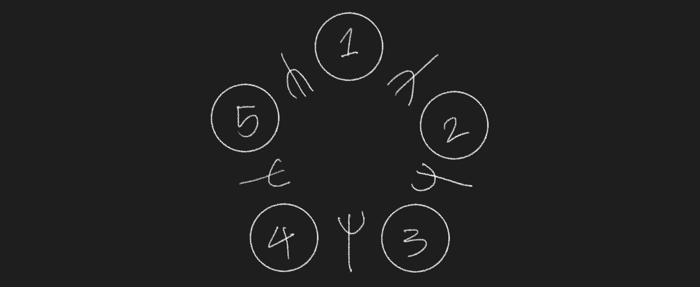
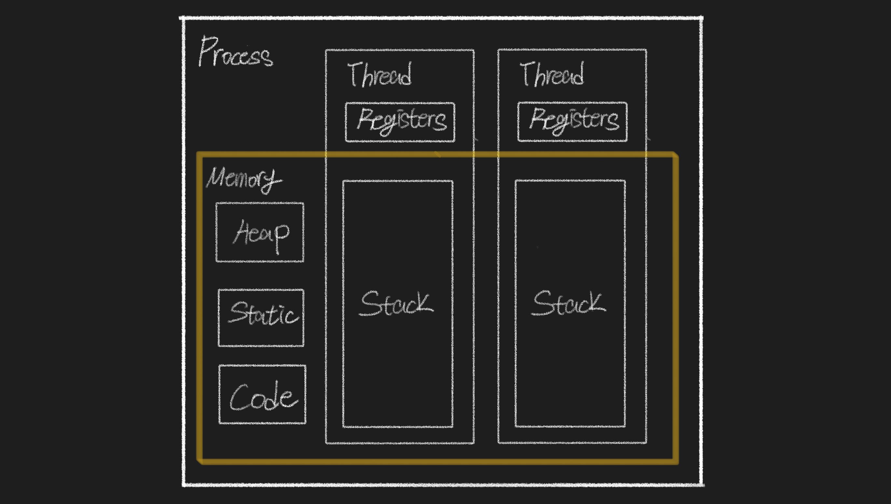
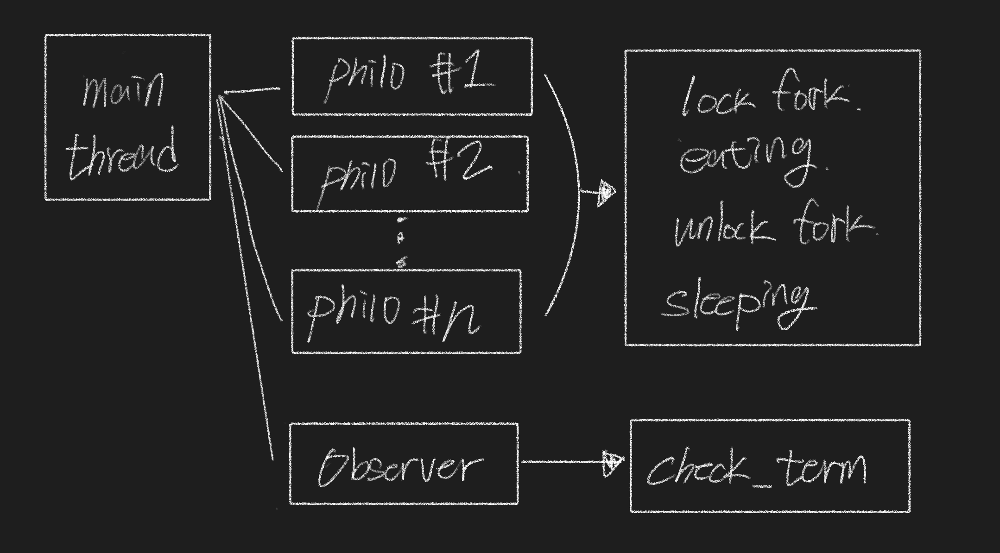
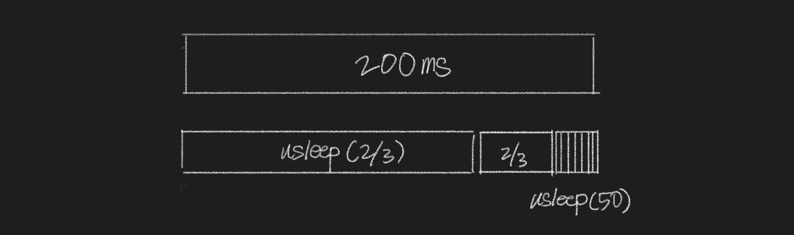

# Philosophers

# 식사하는 철학자

  

원탁에 둘러 앉아있는 철학자들이 최대한 굶어 죽지 않도록 구현하는 과제이다. 철학자는 2개의 포크를 가지고 식사를 해야한다. 그러나 두 철학자 사이에는 1개의 포크만 있기 때문에 철학자는 옆에 있는 철학자가 식사 중이라면 포크를 내려놓기 전까지 기다려야 한다. 만약에 철학자가 주어진 시간 안에 2개의 포크를 가지고 식사를 시작하지 않으면 굶어 죽게 되는 것이다.  

## 교착 상태 (deadlock)

  

철학자 과제에서 해결해야하는 문제는 교착상태로 철학자들이 옆사람의 식사가 끝나기를 기다리다가 아무런 동작을 하지 못하고 굶어 죽게된다. 교착 상태는 다중 프로그래밍의 주요 난점 중 하나로써 두 개 이상의 작업이 상대방의 작업이 끝나기만을 기다리다가 아무것도 완료되지 못하는 상태를 말한다. 교착 상태가 일어나려면 다음과 같은 네 가지 조건을 충족시켜야 한다.  

> 1. 상호 배제: 프로세스들이 필요로 하는 자원에 대해 배타적인 통제권을 요구한다.
>     - 포크는 한 철학자만 사용할 수 있다.
> 2. 점유 대기: 프로세스가 할당된 자원을 가진 상태에서 다른 자원을 기다린다.
>     - 한 포크를 가진 상태에서 다른 포크를 가지기위해 기다린다.
> 3. 순환 대기: 각 프로세스는 순환적으로 다음 프로세스가 요구하는 자원을 가지고 있다.
>     - 철학자들이 원탁에 둘러앉아 있고, 사이에 포크가 놓여져 있다.
> 4. 비선점: 프로세스가 어떤 자원의 사용을 끝낼 때까지 그 자원을 뺏을 수 없다.
>     - 포크를 강제적으로 뺏을 수 없다.

철학자 과제는 모든 조건을 충족하므로 교착 상태가 일어날 수 밖에 없다. 교착 상태는 조건 중 한 가지라도 만족하지 않으면 발생하지 않으므로 다음과 같은 방법 중에서 하나를 선택하여 교착 상태를 예방해야 한다.

> 1. 상호 배제 부정: 여러 개의 프로세스가 공유 자원을 사용할 수 있도록 한다.
> 2. 점유 대기 부정: 프로세스가 실행되기 전 필요한 모든 자원을 할당한다.
> 3. 순환 대기 부정: 자원에 고유한 번호를 할당하고 순서대로 자원을 요구하도록 한다. 
> 4. 비선점 부정: 자원을 점유하고 있는 프로세스가 다른 자원을 요구할 때 점유하고 있는 자원을 반납하고 요구한 자원을 사용하기 위해 기다리도록 한다.

## 교착 상태 해결

  

효율적인 예방 방법인 순환 대기를 막는 방법을 사용한다. 철학자에게 고유 번호를 부여하고 번호가 홀수인 경우에는 오른쪽 포크를 먼저 가져가며 짝수인 경우에는 왼쪽 포크를 먼저 가져가도록 한다. 만약에 1번 철학자가 오른쪽 포크를 가져가면, 2번 철학자는 1번 철학자가 그 포크를 내려놓기 전까지 기다려야 한다. 그리고 1번 철학자는 왼쪽 포크를 가져가며 식사를 시작한다. 만약에 철학자의 수가 홀수라면 마지막 번호의 철학자가 오른쪽 포크를 가져가려해도 먼저 포크를 잡기 시작한 1번 철학자가 가지고 있기 때문에 기다리게 된다.  

# 식사하는 철학자 구현

원탁에 앉아있는 철학자와 포크를 구현하기 위해 프로그램에서 철학자는 스레드로 구현되고, 포크는 한 사람씩 사용해야하기 때문에 뮤텍스로 보호한다. 

## 스레드 (thread)

  

스레드는 프로세스의 실행 단위이다. 스레드는 프로세스에 할당된 메모리, 자원을 공유하며 여러 실행 흐름을 동시에 진행시킨다. 응용 프로그램을 실행하면 코드는 코드 데이터 영역, 전역 변수는 데이터 영역, 지역 변수는 스택, 동적 할당은 힙 영역으로 나뉘어 메모리에 저장된다. 만약에 여러 흐름으로 작업을 수행해야하는 상황에서 별도의 프로세스를 이용하면, 메모리와 이외의 것들을 개별 공간에 가지게 되므로 높은 비용이 들며 자원을 공유하기 어렵다. 그러므로 프로세스의 메모리를 공유하여 사용해야하는 경우에 스레드를 생성하여 작업을 수행한다. 

기본 데이터  
  - 고유한 스레드 ID, 프로그램 카운터, 레지스터 집합, 스택
  - 코드, 데이터, 파일 등 기타 자원은 프로세스 내의 다른 스레드와 공유한다.  

특정 데이터  
  - 하나의 스레드에만 연관된 데이터로 개별 스레드만의 자료 공간이 필요하다.
  - 특별한 경우에 사용하는 개별 스레드만의 자료 공간

## 스레드의 종류
- 사용자 레벨 스레드
  - 사용자 레벨의 라이브러리를 통해 구현된다.
  - 스레드가 중단되면 나머지 모든 스레드가 중단된다.
- 커널 레벨 스레드
  - 운영체제가 지원하는 스레드 기능으로 구현된다.
  - 스레드가 도중에 중단되어도 커널은 다른 스레드를 중단시키지 않고 계속 실행시켜준다.

## 스레드의 동기화

- 임계 구역
  - 병렬 컴퓨팅에서 둘 이상의 스레드가 동시에 접근해서는 안되는 공유 자원을 접근하는 코드의 일부를 말한다. 어떤 스레드가 임계 구역에 들어가고자 한다면 대기해야 할 수도 있다. 스레드가 공유자원의 사용을 보장받기 위해서 임계 구역에 들어가거나 나올때 동기화 매커니즘이 사용된다.

- 스레드 동기화 방법
  - mutex (locking 매커니즘)
    - 스레드의 동시 접근을 허용하지 않고, 뮤텍스를 가지고 있어야 임계영역에 들어갈 수 있다.
    - 임계역역에 들어간 스레드가 뮤텍스를 이용하여 본인이 나오기 전까지 다른 스레드가 들어오지 못하게 잠근다.
    - wait를 호출한 스레드만이 signal을 호출할 수 있다.
  - semaphore (signaling 매커니즘)
    - 뮤텍스와 비슷하지만 동시 접근 동기화가 아닌 접근 순서 동기화에 관련있다.
    - 세마포어 카운터를 사용하며, wait를 호출하면 카운터를 1만큼 줄인다.
    - 카운터가 0보다 작거나 같아질 경우에 락이 실행된다.
    - 만약에 카운터를 1로 설정하면 mutex처럼 사용할 수 있다.

프로그램은 다음의 인자를 순서대로 받는다.  

- 철학자의 수  
- 철학자의 수명  
- 식사하는 데 걸리는 시간  
- 수면하는 데 걸리는 시간  
- [철학자의 최소 식사 횟수]  

모든 철학자가 최소 식사 횟수만큼 밥을 먹었다면 시뮬레이션이 종료되고, 최소 식사 횟수가 명시되지 않았다면 철학자가 한 명이라도 사망하기 전까지 계속된다.

컨텍스트 스위칭에 소요되는 시간으로 인해서 시간이 늘어간다.

스레드를 non-detached로 생성한 경우에는 pthread_join으로 자원을 메모리에서 해제해주어야 한다. 메인 스레드에서 pthread_join을 호출하면 인자로 넘긴 스레드가 종료될 때까지 기다린다.
스레드를 detached로 생성한 경우에는 join을 호출할 필요없이 스레드가 종료될때 자원이 자동으로 반환된다.  
[join과 detach의 차이점](https://m.blog.naver.com/PostView.naver?isHttpsRedirect=true&blogId=shlee7708&logNo=120113380564)

[참조]  
[식사하는 철학자 문제](https://m.blog.naver.com/hirit808/221788147057)

## todos

- [x]  argv 처리
- [x]  철학자 객체 생성
- [x]  mutex로 식사 구현
- [x]  옵저버 쓰레드 구현
    - [x]  철학자 구조체 배열을 넘겨받는다.
    - [x]  시간을 구하여 철학자가 죽어야 하는지 확인한다.
    - [x]  한 철학자가 죽게되면 모든 철학자 구조체에 알린다.
- [x]  출력 순서가 섞이지 않도록 동기화시킨다.
- [x]  mutex로 printf 구현
- [x]  시간 적용
    - [x]  철학자 수명 (밥을 먹고 일정 시간이 지나면 죽는다.)
    - [x]  밥먹는 시간 (밥먹는 시간)
    - [x]  잠자는 시간 (식사 후 잠을 자는데 소모되는 시간)
    - [x]  철학자의 상태를 출력 ( time | id | state )
- [x]  옵저버의 종료 조건
  - [x]  철학자의 수명이 다한 경우
  - [x]  모든 철학자가 최소 식사 횟수만큼 식사를 완료한 경우
    - [x]  옵저버에서 count한다.
    - [x]  철학자가 자신이 최소 식사를 마쳤음을 옵저버에게 알렸는지 확인하는 플래그를 가짐
    - [x]  모든 철학자가 식사를 완료하면 종료
- [x]  스레드를 모두 detached로 변경
- [x]  프로그램 종료 mutex를 생성
  - [x]  옵저버에 term_mutex를 넘긴다.
- [x]  옵저버의 프로그램 종료
  - [x]  종료 조건에 충족한 경우에 프로그램을 종료
  - [x]  term_mutex의 잠금을 해제
  - [x]  main에서 term_mutex를 받아서 프로그램을 종료
- [x]  리팩토링
  - [x]  코드 분할
  - [x]  파일 정리
  - [x]  구조 정리
- [x]  철학자가 최대한 죽지 않는 방법 (시간 지연 문제)
  - [x]  usleep 함수의 오차 해결
    - 반복문으로 목표 시간까지 시간을 계산해서 usleep 실행
    - ((목표 시간 - 현재 시간) / 3) * 2000
    - 만약에 (목표 시간 - 현재 시간)이 10ms 보다 적다면 usleep(50) 반복
- [x] mutex destroy
  - [x] 제거하기 전에 잠금을 해제한다.
  - [x] 출력은 종료 전까지만 실행되고, 종료 함수는 출력 mutex가 제거될 때까지 계속 mutex_destroy를 실행한다.
- [x] 메모리 누수
- [x] malloc guard
- [x] 파일 정리
- [x] norminette
- [x] 프로그램 인자
  - [x] validation 함수
- [x] 과제 설명 준비

