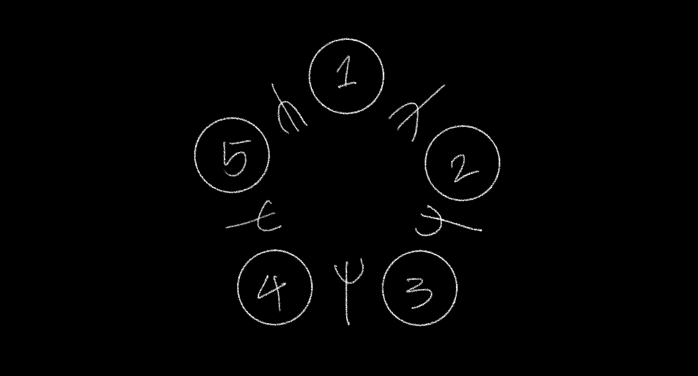
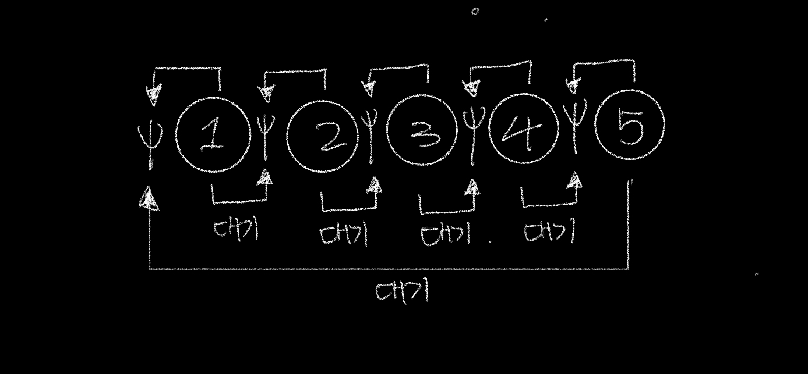
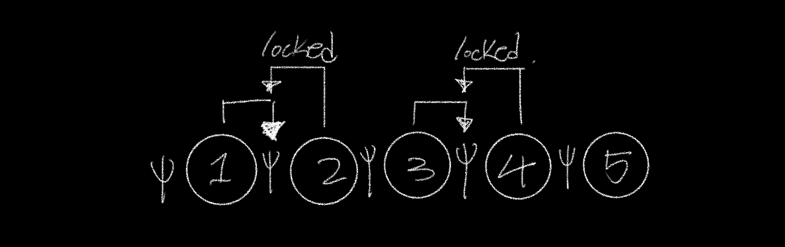
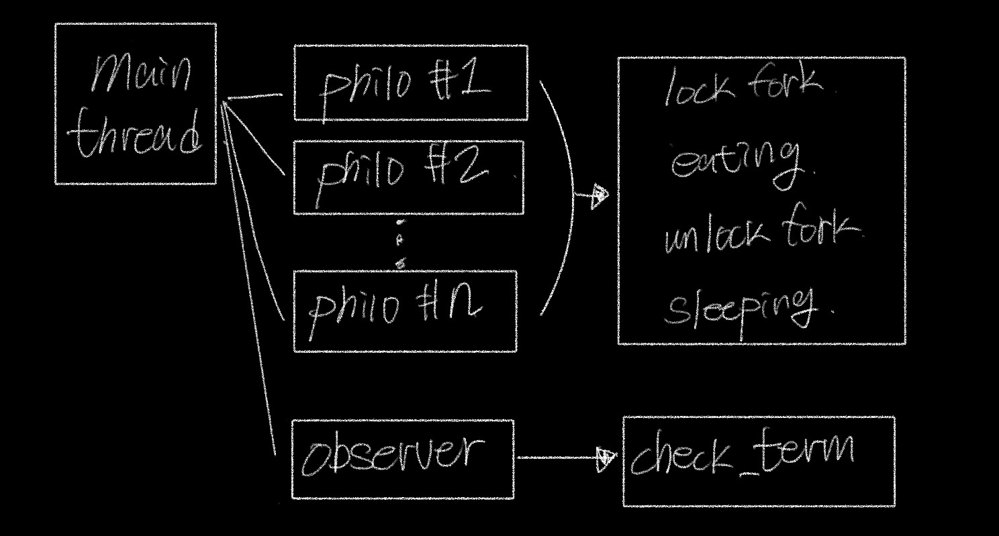
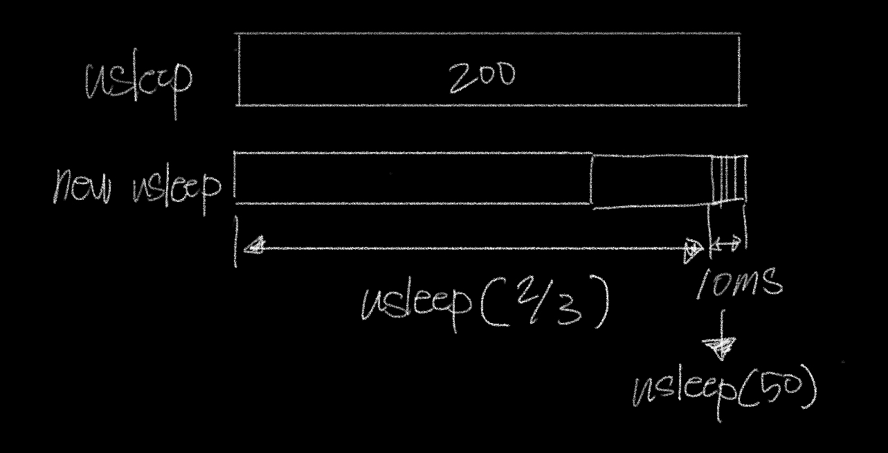

# Philosophers

## 식사하는 철학자 문제

  

원탁에 둘러 앉아있는 철학자들이 최대한 굶어 죽지 않도록 구현하는 과제이다. 철학자는 2개의 포크를 가지고 식사를 해야한다. 그런데 두 철학자 사이에는 1개의 포크만 있기 때문에 옆에 있는 철학자가 식사 중이라면 포크를 내려놓기 전까지 기다려야 한다. 만약에 기다리던 철학자가 주어진 시간 안에 2개의 포크를 가지고 식사를 시작하지 않으면 굶어 죽게 되는 것이다.  

## 교착 상태 (deadlock)

철학자 과제에서 해결해야하는 문제는 교착상태이다. 철학자들이 옆사람의 식사가 끝나기를 기다리다가 아무런 동작을 하지 못하고 굶어 죽게되는 상태이다. 교착 상태는 다중 프로그래밍의 주요 난점 중 하나로써 두 개 이상의 작업이 상대방의 작업이 끝나기만을 기다리고 있는 상태로 아무것도 완료되지 못하는 상태를 말한다. 교착 상태가 일어나려면 다음과 같은 네 가지 조건을 충족시켜야 한다.  

	상호 배제: 프로세스들이 필요로 하는 자원에 대해 배타적인 통제권을 요구한다.
	점유 대기: 프로세스가 할당된 자원을 가진 상태에서 다른 자원을 기다린다.
	순환 대기: 각 프로세스는 순환적으로 다음 프로세스가 요구하는 자원을 가지고 있다.
	비선점: 프로세스가 어떤 자원의 사용을 끝낼 때까지 그 자원을 뺏을 수 없다.

교착 상태은 위의 조건 중 한 가지라도 만족하지 않으면 발생하지 않는다. 다음과 같은 방법으로 교착 상태를 예방할 수 있다.

	상호 배제 부정: 여러 개의 프로세스가 공유 자원을 사용할 수 있도록 한다.
	점유 대기 부정: 프로세스가 실행되기 전 필요한 모든 자원을 할당한다.
	순환 대기 부정: 자원에 고유한 번호를 할당하고 순서대로 자원을 요구하도록 한다. 
	비선점 부정: 자원을 점유하고 있는 프로세스가 다른 자원을 요구할 때 점유하고 있는 자원을 반납하고 요구한 자원을 사용하기 위해 기다리도록 한다.

## 교착 상태 해결

교착 상태를 해결하기 위해서 철학자에게 먼저 가져가야할 포크의 위치를 정해준다. 철학자에게 고유 번호를 부여하고 홀수인 경우에는 오른쪽 포크를 먼저 가져가고, 짝수인 경우에는 왼쪽 포크를 먼저 가져가도록 하였다. 1번 철학자가 오른쪽 포크를 가져가고, 2번 철학자는 1번 철학자가 그 포크를 내려놓기 전까지 기다린다. 그리고 철학자들은 순서대로 생성되기 때문에 1번 철학자는 5번 철학자가 생성되기 전에 그 사이에 있는 포크를 잡고 식사를 한다.  

이 방법은 순환 대기 조건을 해결하여 교착 상태에 빠지지 않는다. 철학자 간에 먼저 포크를 잡는 철학자 그룹과 대기하는 그룹이 형성되어 순서대로 식사를 할 수 있게 된다.

프로그램은 다음의 인자를 순서대로 받는다.
- 철학자의 수
- 철학자의 수명
- 식사하는 데 걸리는 시간
- 수면하는 데 걸리는 시간
- 철학자의 최소 식사 횟수

모든 철학자가 최소 식사 횟수만큼 밥을 먹었다면 시뮬레이션이 종료됩니다. 만약에 해당 값이 없다면 철학자가 한 명이라도 사망할 때까지 계속된다.

컨텍스트 스위칭에 소요되는 시간으로 인해서 시간이 늘어간다.

스레드를 non-detached로 생성한 경우에는 pthread_join으로 자원을 메모리에서 해제해주어야 한다. 메인 스레드에서 pthread_join을 호출하면 인자로 넘긴 스레드가 종료될 때까지 기다린다.
스레드를 detached로 생성한 경우에는 join을 호출할 필요없이 스레드가 종료될때 자원이 자동으로 반환된다.  
[join과 detach의 차이점](https://m.blog.naver.com/PostView.naver?isHttpsRedirect=true&blogId=shlee7708&logNo=120113380564)

## todos

- [x]  argv 처리
- [x]  철학자 객체 생성
- [x]  mutex로 식사 구현
- [x]  옵저버 쓰레드 구현
    - [x]  철학자 구조체 배열을 넘겨받는다.
    - [x]  시간을 구하여 철학자가 죽어야 하는지 확인한다.
    - [x]  한 철학자가 죽게되면 모든 철학자 구조체에 알린다.
- [x]  출력 순서가 섞이지 않도록 동기화시킨다.
- [x]  mutex로 printf 구현
- [x]  시간 적용
    - [x]  철학자 수명 (밥을 먹고 일정 시간이 지나면 죽는다.)
    - [x]  밥먹는 시간 (밥먹는 시간)
    - [x]  잠자는 시간 (식사 후 잠을 자는데 소모되는 시간)
    - [x]  철학자의 상태를 출력 ( time | id | state )
- [x]  옵저버의 종료 조건
  - [x]  철학자의 수명이 다한 경우
  - [x]  모든 철학자가 최소 식사 횟수만큼 식사를 완료한 경우
    - [x]  옵저버에서 count한다.
    - [x]  철학자가 자신이 최소 식사를 마쳤음을 옵저버에게 알렸는지 확인하는 플래그를 가짐
    - [x]  모든 철학자가 식사를 완료하면 종료
- [x]  스레드를 모두 detached로 변경
- [x]  프로그램 종료 mutex를 생성
  - [x]  옵저버에 term_mutex를 넘긴다.
- [x]  옵저버의 프로그램 종료
  - [x]  종료 조건에 충족한 경우에 프로그램을 종료
  - [x]  term_mutex의 잠금을 해제
  - [x]  main에서 term_mutex를 받아서 프로그램을 종료
- [x]  리팩토링
  - [x]  코드 분할
  - [x]  파일 정리
  - [x]  구조 정리
- [x]  철학자가 최대한 죽지 않는 방법 (시간 지연 문제)
  - [x]  usleep 함수의 오차 해결
    - 반복문으로 목표 시간까지 시간을 계산해서 usleep 실행
    - ((목표 시간 - 현재 시간) / 3) * 2000
    - 만약에 (목표 시간 - 현재 시간)이 10ms 보다 적다면 usleep(50) 반복
- [x] mutex destroy
  - [x] 제거하기 전에 잠금을 해제한다.
  - [x] 출력은 종료 전까지만 실행되고, 종료 함수는 출력 mutex가 제거될 때까지 계속 mutex_destroy를 실행한다.
- [x] 메모리 누수
- [x] malloc guard
- [x] 파일 정리
- [x] norminette
- [x] 프로그램 인자
  - [x] validation 함수
- [x] 과제 설명 준비

