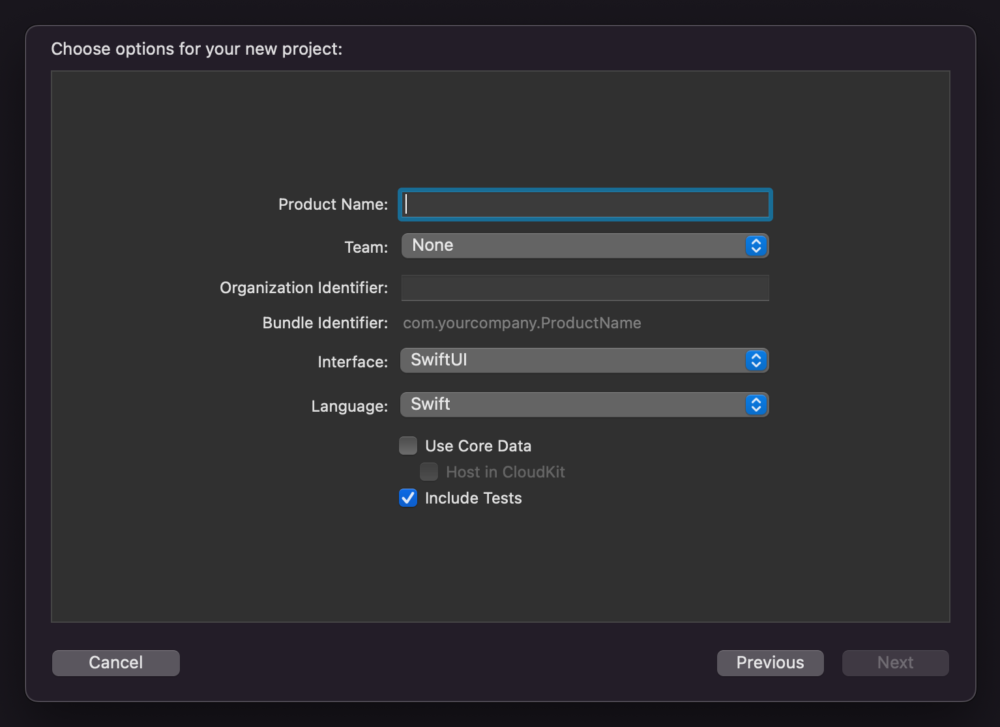

# 22.05 <!-- omit in toc -->

- [22.05.31 : c++ cout, cin, string, getline](#220531--c-cout-cin-string-getline)
- [22.05.30 : 리팩토링의 중요성](#220530--리팩토링의-중요성)
- [22.05.24 : destroy mutex while locked](#220524--destroy-mutex-while-locked)
- [22.05.23 : usleep 정확도, 멀티코어 프로그래밍 메모리 문제](#220523--usleep-정확도-멀티코어-프로그래밍-메모리-문제)
- [22.05.22 : Swift 반복문, Set 타입](#220522--swift-반복문-set-타입)
- [22.05.20 : thread와 process의 종료](#220520--thread와-process의-종료)
- [22.05.19 : Context Switching](#220519--context-switching)
- [22.05.17 : Mutex](#220517--mutex)
- [22.05.16 : Thread](#220516--thread)
- [22.05.14 : Swift Unit Test](#220514--swift-unit-test)
- [22.05.12 : 사용자 스토리](#220512--사용자-스토리)
- [22.05.08 : JavaScript Set](#220508--javascript-set)
- [22.05.07 : JavaScript 반복문](#220507--javascript-반복문)
- [22.05.06 : Swift Array, JavaScript String](#220506--swift-array-javascript-string)
- [22.05.05 : Swift String](#220505--swift-string)
- [22.05.04 : Swift String](#220504--swift-string)
- [22.05.03 : bash (if), diff](#220503--bash-if-diff)
- [22.05.02 : bash (read)](#220502--bash-read)
- [22.05.01 : gitbook](#220501--gitbook)

### 22.05.31 : c++ cout, cin, string, getline
> 
> ## cout
> 
> c++은 iostream 라이브러리에 있는 std::cout 객체를 사용하여 콘솔에 출력할 수 있다.  
> 
> ```cpp
> std:cout << [ 출력할 값 ]
> ```
> 
> 출력하려는 값의 타입에 상관없이 출력 연산자 뒤에 넣어주면 된다.  
> 데이터 타입을 나타내는 서식문자가 필요없다.
> 
> ```cpp
> #include <iostream>
> 
> int main(void)
> {
> 	int count = 0;
> 	
> 	std::cout << "counts: ";
> 	std::cout << count;
> 	return (0);
> }
> 
> // counts: 0
> ```
> 
> 개행을 사용하는 경우에는 개행 문자인 `\n`이나 `std::endl`을 사용하면 된다.
> 
> ```cpp
> #include <iostream>
> 
> int main(void)
> {
> 	int count = 0;
> 	
> 	std::cout << "counts: " << std::endl;
> 	std::cout << count;
> 	return (0);
> }
> 
> // counts:
> // 0
> ```
> 
> ## cin
> 
> `std::cin`으로 c++의 입력을 받을 수 있다.
> 
> ```cpp
> std::cin >> [ 입력값을 받을 변수 ]
> ```
> 
> `std::cin`로 `std::cout`과 마찬가지로 데이터 타입을 알려주는 서식이 필요없이 변수만 지정해주면 된다. 값을 받을때 `&`로 주소를 넘겨주지 않아도 된다.
> 
> ```cpp
> #include <iostream>
> 
> int main(void)
> {
> 	int	num;
> 	
> 	std::cout << "num: ";
> 	std::cin >> num;
> 	std::cout << "num is " << num << std::endl;
> }
> ```
> 
> ## namespace
> 
> namespace는 함수, 구조체, 클래스, 변수 등을 구분하기 위해 사용된다. 프로그램이 복잡해지고 여러 라이브러리가 포함될수록 충돌될 가능성이 높아진다. 이를 c++에서는 namespace를 사용하여 해결한다.
> 
> ```cpp
> namespace A
> {
> 	void print(void)
> 	{
> 		std::cout << "Hello" << std::endl;
> 	}
> }
> 
> void print(void)
> {
>   std::cout << "World" << std::endl;
> }
> 
> int main(void)
> {
> 	A::print();
> 	print();
> 	return (0);
> }
> 
> // Hello
> // World
> ```
> 
> ## std::string
> 
> c++에는 문자열 자료형이 내장되어 있다. 문자열을 사용하기위해 `<string>`을 포함시킨다.
> 
> ```cpp
> #include <string>
> 
> std::string	str;
> ```
> 
> 다음과 같이 문자열을 초기화할 수 있다.
> 
> ```cpp
> std::string str("Hello");
> str = "world";
> ```
> 
> `std:string`을 `std:cin`과 함께 사용하는 경우에는 주의해야 한다. 표준 입력으로 공백이 포함된 문자열을 받는다면 입력된 문자열을 한번에 받지 않고 공백으로 구분하여 하나씩 받는다.
> 
> ```cpp
> #include <iostream>
> #include <string>
> 
> int main(void)
> {
> 	std::string	first;
> 	std::string	last;
> 
> 	std::cout << "-> ";
> 	std::cin >> first;
> 	std::cout << "-> ";
> 	std::cin >> last;
> 
> 	std::cout << "first: " << first << std::endl;
> 	std::cout << "last: " << last << std::endl;
> }
> 
> // 공백이 없는 입력
> // -> nick
> // -> name
> // first: nick
> // last: name
> 
> // 공백이 있는 입력
> // -> nick name
> // -> first: nick
> // last: name
> ```
> 
> ## std::getline()
> 
> ```cpp
> #include <string>
> #include <iostream>
> 
> std::getline(input, str, [delim]);
> 
> // input - the stream to geet data from
> // str - the string to put the data into
> // delim - the delimiter character
> ```
> 
> [cout, cin 참조](https://blockdmask.tistory.com/475)  
> [namespace 참조](http://www.tcpschool.com/cpp/cpp_scope_namespace)  
> [string 참조](https://boycoding.tistory.com/178)  
> [basic string](https://en.cppreference.com/w/cpp/string/basic_string)  
> [getline 참조](https://en.cppreference.com/w/cpp/string/basic_string/getline)  
> [learn cpp](https://www.learncpp.com/cpp-tutorial/an-introduction-to-stdstring/)  
> 

### 22.05.30 : 리팩토링의 중요성
> 
> [마틴 파울러] 리팩토링의 중요성 feat.테스트 코드를 짜는 이유 ( [유튜브](https://www.youtube.com/watch?v=mNPpfB8JSIU) )
> 
> 우리는 2가지 모드로 프로그래밍을 한다.
> 1. Add Function
> 2. Refactoring
> 
> 리팩토링을 하는 도중에 기능을 변경하지 않아야 하기 때문에 한번에 한가지 프로그래밍 모드를 적용할 수 있다.
> 리팩토링의 종료는 다음과 같다.
> 1. TDD Refactoring
> 2. Litter-Pickup Refactoring
> 3. Comprehension Refactoring
> 4. Preparatory Refactoring
> 5. Planned Refactoring
> 6. Long-term Refactoring
> 
> ## 1. TDD Refactoring
> 
> 테스트 주도 프로그래밍 단계에서 포함되어있는 리팩토링이다.  
> 
> ## 2. Litter-Pickup Refactoring
> 
> 지저분하고 이상한 코드를 고치치는 리팩토링으로써 조금씩 지속적으로 수정하면 대부분 코드가 깨끗해진다.  
> 
> ## 3. Comprehension Refactoring
> 
> 무슨 동작을 하는지 모를 정도로 복잡한 코드를 정리하는 리팩토링이다. 개발자가 머릿속에서만 정리된 상태에서 코드를 작성하는데 그치지 않고 팀원들이 이해할 수 있도록 복잡한 코드를 정리한다.  
> 보통 이해하기 어려운 코드를 지저분하고 이상한 코드라고 부르기 때문에 `Litter-Pickup`과 비슷하다고 생각할 수 있지만 차이점이 있다.  
> 
> 지금 코드를 고쳐야하는 시점인지 결정하는 것이 중요하다.
> 
> 
> 
> ## 4. Preparatory Refactoring
> 
> 새로운 기능을 추가했는데 이전에 작성한 코드가 예상처럼 동작하지 않는 경우이다. 코드를 작성하는 도중에 동작이 이상하다면 리팩토링을 먼저 진행하고 새로운 기능을 개발해야 한다.  
> 보통 리팩토링을 하면 개발 속도가 느려진다고 하는데 지금과 같은 경우에는 리팩토링으로 준비하는게 새로운 기능을 더 빠르게 추가할 수 있다.
> 
> 
> 
> ## 5. Planned Refactoring
> 
> 프로젝트 계획에서 리팩토링을 추가하는 방법이다. 문제는 항상 리팩토링해야할 이유를 찾아야 한다는 것이다. 리팩토링은 많은 시간이 걸리면 안된다.
> 
> ## 6. Long-term Refactoring
> 
> 신경쓰지 못하고 묵혀둔 복잡한 모듈과 코드를 정리한다.
> 
> 어떻게 코드가 변경되어야 하는지 명확한 목표를 정해야 한다.
> 우리가 정한 목표를 향해서 조금씩 리팩토링을 진행해야한다.
> 조금씩 진행하면 커다란 리팩토링도 가능하다는 것을 알 수 있다.
> 좋은 리팩토링은 최대한 작은 단위로 리팩토링을 수행하는 것이다.
> 가능한 작은 단위로 진행해야 목표에 도달할 수 있다.
> 
> ## 왜 리팩토링을 해야하는가?
> 
> 리팩토링을 하는 시간이 쓸모없게 여겨질 수 있다.  
> 
> 소프트웨어 설계에 신경을 쓰지 않으면 계속 개발을 하면서 시간이 지날수록 개발 속도가 현저히 떨어진다. 개발자가 새로운 기능을 추가하기 위해 코드를 이해하느라 오랜 시간이 걸리게 된다.  
> 
> 반대로 좋은 소프트웨어 설계를 가진다면 새로운 기능을 추가하는 일은 굉장히 쉽다. 코드가 모듈별로 잘 쪼개져 있으면 매우 편리하게 새로운 기능을 추가할 수 있다.
> 
> 그래서 리팩토링은 좋은 소프트웨어를 만들기 위해 중요한 역할을 한다. 우리가 리팩토링을 해야하는 이유는 개발자가 더 많은 기능을 더 빠르게 적용하기 위함이다.
> 
> 한창 개발을 하는 시점에서는 개발 속도가 느리지 않기 때문에 필요성을 못느끼지만 작업을 하면 할수록 개발하는데 시간이 너무 오래걸린다고 생각되어 깔끔하게 만들고 싶어지는 코드가 바로 리팩토링리 필요한 코드이다. 
> 
> 리팩토링은 경제성때문에 해야한다.  
> 깔끔한 코드는 더 빠른 기능 개발을 할 수 있다.  

### 22.05.24 : destroy mutex while locked
> 
> mutex가 잠긴 상태에서 mutex_destroy함수를 실행시키면 어떻게 되는가?  
> 다음 예시에는 생성된 스레드가 mutex를 잠근 후에 메인에서 mutex_destroy를 실행한다. 이 경우에는 mutex_destroy함수가 에러 코드를 반환하며 mutex가 제거되지 않는다. 그러므로 메인은 다음 줄에서 mutex 잠금을 획득하기 위해 대기한다.
> ```c
> #include <stdio.h>
> #include <pthread.h>
> #include <sys/time.h>
> 
> int	count = 0;
> 
> void	*do_loop(void *param)
> {
> 	pthread_mutex_lock((pthread_mutex_t *)param);
> 	while (1)
> 	{
> 		count += 1;
> 		sleep(1);
> 	}
> }
> 
> int	main(void)
> {
> 	pthread_mutex_t	mtx;
> 	pthread_t		thread;
> 
> 	pthread_mutex_init(&mtx, NULL);
> 	pthread_create(&thread, NULL, do_loop, (void *)&mtx);
> 	usleep(1);
> 	pthread_mutex_destroy(&mtx);	// return 16
> 	pthread_mutex_lock(&mtx);
> 	while (1)
> 	{
> 		printf("count: %d\n", count);
> 		sleep(1);
> 	}
> 	return (0);
> }
> ```
> 
> 메인에 unlock함수를 추가하였다. mutex 잠금을 해제하고 mutex_destroy를 실행하면 mutex가 제거되어 잠기지 않는다. 즉, 임계 구역이 보호받지 못하고 아무나 들어갈 수 있게 된다.
> 
> ```c
> int	main(void)
> {
> 	pthread_mutex_t	mtx;
> 	pthread_t		thread;
> 
> 	pthread_mutex_init(&mtx, NULL);
> 	pthread_create(&thread, NULL, do_loop, (void *)&mtx);
> 	usleep(1);
> 	pthread_mutex_unlock(&mtx);	// unlock mtx
> 	pthread_mutex_destroy(&mtx);	// return 0
> 	pthread_mutex_lock(&mtx);	
> 	while (1)
> 	{
> 		printf("count: %d\n", count);
> 		sleep(1);
> 	}
> 	return (0);
> }
> ```

### 22.05.23 : usleep 정확도, 멀티코어 프로그래밍 메모리 문제
>
>## 지나치게 많은 스레드
>소프트웨어 스레드가 많으면 운영체제는 보통 라운드 로빈 스케줄링을 이용한다. 스케줄러는 소프트웨어 스레드마다 타임 슬라이스를 부여하여 하드웨어 스레드 중 하나에서 실행될 수 있게 한다. 타임 슬라이스가 떨어지면 스케줄러는 그 스레드를 멈추고 해당 하드웨어 스레드에 다른 소프트웨어 스레드를 돌린다. 멈춘 스레드는 다음 타임 슬라이스를 얻기 전까지 동결된다.
>
>타임 슬라이스 덕분에 모든 소프트웨어 스레드에게 하드웨어 스레드가 공정하게 분배된다. 하지만 이로 인해 오버헤드가 걸린다. 오버헤드의 종류는 다음과 같다.
>
>## 스레드 캐시 상태
>스레드의 캐시 상태를 저장하고 복구하는 오버헤드이다. 캐시에 데이터를 저장할 공간이 없다면 프로세서가 공간을 만뜰기 위해 캐시에서 데이터를 제거해야 한다. 제거할 데이터를 찾을 때 최근에 사용되지 않은 데이터를 고르며, 주로 이전 타임 슬라이스의 데이터가 선택된다. 즉, 스레드는 다른 스레드의 데이터를 제거하며 스레드가 너무 많다면 서로 캐시를 차지하려하기 때문에 성능이 저하된다. 
>
>## 가상 메모리 스레딩
>가상 메모리에서 일어나는 오버헤드이다. 캐시와 비슷하게 공간이 필요하면 최근에 사용되지 않은 데이터가 메모리에서 제거된다. 가상 메모리에서 타임 슬라이스는 실제 메모리를 두고 소프트웨어 스레드끼리 경쟁하도록 하여 성능을 떨어뜨린다.
>
>## Convoying
>잠금 하나를 두고 여러 소프트웨어 스레드가 쌓이는 현상이다. 스레드가 잠금을 가진 상태에서 타임 슬라이스가 만료되었다면 그 잠금을 기다리는 다른 스레드는 모두 기다리게 된다. 그 스레드가 다시 타임 슬라이스를 획득하여 잠금을 해제하기 전까지 뒤에 기다리는 스레드들이 멈추는 것이다.
>
>## 해결 방법
>가장 좋은 방법은 소프트웨어 스레드를 하드웨어 스레드의 개수와 외부 캐시의 개수에 맞추어 제한하는 방법이다.  입출력 스레드와 계산 스레드를 분리하는 방법도 있다. 계산 스레드는 외부 이벤트에 의해 차단되는 일이 없어야 하고, 작업 큐에서 일거리를 받아 계속 작업해야한다. 
>
>[usleep 정확도](https://www.notion.so/philosophers-VM-c60be9c836084edfbcd9c07e29b429c4)  
>[멀티코어 프로그래밍 메모리 문제](https://andromedarabbit.net/%EB%A9%80%ED%8B%B0%EC%BD%94%EC%96%B4-%ED%94%84%EB%A1%9C%EA%B7%B8%EB%9E%98%EB%B0%8D%EC%97%90%EC%84%9C-%ED%9D%94%ED%9E%88-%EB%B0%9C%EC%83%9D%ED%95%98%EB%8A%94-%EB%A9%94%EB%AA%A8%EB%A6%AC-%EB%AC%B8/)
>
### 22.05.22 : Swift 반복문, Set 타입
> 
> 반복문은 제어 구문으로써 특정 부분을 반복해서 실행합니다.
> 
> ## for
> for문은 초기식에 따라서 조건식을 판단하여 실행하고 변환식을 계산합니다.  
> ```swift
> let arr: [Int] = ["a", "b", "c"]
> 
> for ele in arr {
> 	print(ele)
> }
> // a
> // b
> // c
> 
> for idx in 0..<arr.count {
> 	print(idx)
> }
> // 0
> // 1
> // 2
> ```
> 
> ## while
> while문은 조건식이 거짓이 될 때까지 명령문을 실행한다.  
> ```swift
> let arr: [Int] = ["a", "b", "c"]
> var idx: Int = 0
> 
> while idx < arr.count {
> 	print(idx, arr[idx])
> 	idx += 1
> }
> // 0, a
> // 1, b
> // 2, c
> ```
> 
> ## Set
> Set 타입은 순서가 없으며, 요소가 중복되지 않는다. Set은 `Set<SomeType>`으로 작성된다.
> ```swift
> var strs = Set<String>()
> strs = []	// 빈 객체로 만들기
> ```
> 
> ```swift
> strs = Set(["a", "b", "c"])	// 값을 넣어서 초기화
> 
> strs.insert("d")	// 추가
> strs.remove("a")	// 제거
> strs.contains("a")	// 확인
> 
> // set 확인
> strs.isEmpty
> strs.count
> ```
> 
> ## Set 연산 작업
> 집합처럼 두 개의 Set을 연산하여 새로운 Set을 생성한다.  
> ```swift
> let a: Set = [1, 2, 3]
> let b: Set = [2, 3, 4]
> 
> // 합집합
> a.union(b)	// [1, 2, 3, 4]
> 
> // 차집합
> a.subtract(b)	// [1]
> 
> // 교집합
> a.intersect(b)	// [2, 3]
> 
> // 배타적 논리합 (XOR)
> a.exclusiveOr(b)	// [1, 4]
> 
> // a가 b에 포함인지
> a.isSubsetOf(b)
> 
> // a에 b가 포함되는지
> a.isSupersetOf(b)
> 
> // a와 b가 일치하지 않는지
> a.isDisjointWith(b)
> ```
>   

### 22.05.20 : thread와 process의 종료
>
>철학자 과제에서 모든 스레드의 종료를 위한 방법을 생각해본다.  
>철학자 스레드들이 있고 이를 관찰하고 있는 옵저버 스레드가 있는 경우에 두가지 방법이 있다. 
>	1. 옵저버 스레드가 종료 플래그를 올리면, 철학자들은 동작을 멈추고 종료
>		- 종료를 알린 시점에서 철학자들은 각기 다른 동작을 하고 있음에도 종료가 되었음을 알아야한다.  
>   	- 이때에 모든 동작에서 종료되었음을 확인하는 방법을 사용할 수 있지만 복잡해진다.  
>	2. 옵저버 스레드가 프로그램을 종료시킨다.
>   	- 실행되고 있는 스레드와 상관없이 프로그램을 종료하여도 문제가 발생하지 않는다면 사용할 수 있다.
>   	- 스레드가 어느 상황에 있더라도 상관없다.
>
>두번째 방법이 가능한지 확인해본다.  
>아래의 코드를 실행해보면 `thread_func`의 메시지가 출력되지 않는다. `thread_func`가 `main`이 종료되자마자 정리된다. 만약에 `pthread_detach`를 `pthread_join`으로 변경한다면 메시지가 출력되는 것을 볼 수 있다. 
>
>```c
>#include <stdio.h>
>#include <unistd.h>
>#include <pthread.h>
>
>void	*thread_func(void *param)
>{
>	(void)param;
>	
>	usleep(1000);
>	printf("Inside thread function");
>	return (0);
>}
>
>int main(void) 
>{ 
>	pthread_t	thread;
>	pthread_create(&thread, NULL, thread_func, NULL);
>	pthread_detach(thread);
>
>	return (0);
>}
>```
>
>Posix thread에는 non-detached(joinable)과 detach의 상태가 있다.  
>	- non-detached로 스레드를 생성한 경우에는 `pthread_join`으로 스레드의 자원을 해제해야 한다.  
>	- detached로 스레드를 생성한 경우에는 스레드의 자원이 종료와 함께 해제된다.  
>
>[main이 종료되면 분리된 스레드는 어떻게 되는가?](https://qa.apthow.com/archives/2168)  
>[posix 스레드에 join, detach 차이점](https://m.blog.naver.com/PostView.naver?isHttpsRedirect=true&blogId=shlee7708&logNo=120113380564)  
>  
>

### 22.05.19 : Context Switching
>
>## 프로세스
>컴퓨터에서 실행중인 프로그램을 의미한다. 
>프로그램은 코드와 리소스 등이 집합된 파일을 말하고, 
>프로세스는 메모리 상에서 프로그램이 실행되는 작업 단위를 말한다.
>
>## 프로세스의 상태
>
>커널 내에는 준비 큐, 대기 큐, 실행 큐등의 자료 구조가 있으며 커널은 이들을 이용하여 프로세스의 상태를 관리한다.
>	- 생성: 프로세스 생성
>	- 실행: 프로세스가 cpu를 차지하여 명령어들이 실행되고 있다.
>	- 준비: 프로세스가 cpu를 사용하지 않지만 사용할 수 있는 상태로 할당되기를 기다린다. 준비 상태의 프로세스 중에서 우선순위가 높은 프로세스가 cpu를 할당받는다.
>	- 대기: 프로세스가 어떤 사건을 기다리고 있는 상태이다. 
>	- 종료: 프로세스의 실행이 종료
>
>## 컨텍스트 스위칭
>
>하나의 프로세스가 cpu를 사용 중인 상태에서 다른 프로세스가 cpu를 사용하기 위해서 이전 프로세스의 상태를 보관하고 새로운 프로세스의 상태를 적재하는 작업을 말한다.
>
>	- cpu에 존재하는 레지스터들은 현재 실행중인 프로세스 관련 데이터들로 채워진다. 
>	- 실행 중인 프로세스가 변경되면 레지스터들의 값이 변경된다.
>	- 변경되기 전에 이전 프로세스를 나중에 이어서 실행하기 위해 데이터들을 저장해야 한다.
>	- 그리고 새로 실행되는 프로세스가 아니라면 이전에 실행될 때 레지스터들이 지니고 있던 데이터들을 불러와서 이어서 실행해야 한다.
>
>컨텍스트 스위칭과정은 시스템에 많은 부담을 주며, 레지스터의 개수가 많을수록, 데이터 종류가 많을수록 더 부담이 된다.
>컨텍스트 스위칭에 소요되는 시간을 줄이려면 저장하고 복원하는 컨텍스트 정보의 개수를 줄여야 한다.
>
>## 스레드의 컨텍스트 스위칭
>
>프로세스가 컨텍스트 스위칭이 일어나면 모든 데이터를 무너뜨리고 새로운 데이터를 쌓아야 한다.
>하지만 스레드는 공유하는 데이터의 영역이 많기 때문에 빠르게 컨텍스트 스위칭된다.
>

### 22.05.17 : Mutex
>
>mutex는 동기화를 달성하는 방법 중 하나이다. 공유 자원에 접근할 때에 lock, 끝났을 때에 unlock하므로 어떤 스레드는 먼저 들어간 스레드가 임계 구역에서 나오기 전까지 대기해야한다. 앞서 들어간 스레드가 unlock하며 임계 구역에서 나오면 대기하고 있던 스레드가 lock하며 임계 구역에 들어간다. 이처럼 접근 제어가 필요한 공간을 공간에 진입할 수 있는 시간을 제어하는 방식으로 동기화를 달성한다.
>
>```c
>// mutex 키 생성
>
>void *thread_one(void)	// 스레드 1 함수
>{
>	// 키 잠금
>	// 공유 자원에 접근
>	// 키 잠금 해제
>}
>
>void *thread_two(void)	// 스레드 2 함수
>{
>	// 키 잠금 (thread_one에서 이미 잠갔으므로 해체될 때까지 대기)
>	// 공유 자원에 접근
>	// 키 잠금 해제
>}
>
>void main(void)
>{
>	// thread_one 함수를 실행하는 스레드를 생성
>	// thread_two 함수를 실행하는 스레드를 생성
>}
>```
>
>### deadlock
>
>deadlock, 교착 상태는 다중 프로그래밍의 주요 난점 중 하나로써 두 개 이상의 작업이 상대방의 작업이 끝나기만을 기다리고 있는 상태로 아무것도 완료되지 못하는 상태를 말한다. 교착 상태가 일어나려면 다음과 같은 네 가지 조건을 충족시켜야 한다.
>
>	- 상호 배제: 프로세스들이 필요로 하는 자원에 대해 배타적인 통제권을 요구한다.
>	- 점유 대기: 프로세스가 할당된 자원을 가진 상태에서 다른 자원을 기다린다.
>	- 비선점: 프로세스가 어떤 자원의 사용을 끝낼 때까지 그 자원을 뺏을 수 없다.
>	- 순환 대기: 각 프로세스는 순환적으로 다음 프로세스가 요구하는 자원을 가지고 있다.
>
>교착 상태은 위의 조건 중 한 가지라도 만족하지 않으면 발생하지 않는다. 다음과 같은 방법으로 교착 상태를 예방할 수 있다.
>
>	- 상호 배제 부정: 여러 개의 프로세스가 공유 자원을 사용할 수 있도록 한다.
>	- 점유 대기 부정: 프로세스가 실행되기 전 필요한 모든 자원을 할당한다.
>	- 비선점 부정: 자원을 점유하고 있는 프로세스가 다른 자원을 요구할 때 점유하고 있는 자원을 반납하고 요구한 자원을 사용하기 위해 기다리도록 한다.
>	- 순환 대기 부정: 자원에 고유한 번호를 할당하고 순서대로 자원을 요구하도록 한다.  
> 
> 

### 22.05.16 : Thread
>
>응용 프로그램을 실행하면 코드는 코드 데이터 영역, 전역 변수는 데이터 영역, 지역 변수는 스택, 동적 할당은 힙 영역으로 나뉘어 메모리에 저장된다. 별도의 프로세스를 이용하면 메모리와 이외의 것들을 개별 공간에 가지게 되므로 높은 비용이 들고, 자원을 공유하기 어렵다. 그래서 하나의 프로세스에 여러개의 스레드를 만들어 사용한다.
>
>멀티 프로세스와 멀티 스레드는 모두 여러 흐름을 동시에 진행시키지만 차이점이 있다.
>	- 멀티 프로세스는 별개의 메모리를 차지하지만 멀티 스레드는 메모리를 공유하여 사용할 수 있다.
>	- 멀티 스레드는 각각의 스레드 중에 어떤 것이 먼저 실행되는지 순서를 알 수 없다.
>
>스레드의 종류
>	- 사용자 레벨 스레드
>		- 사용자 레벨의 라이브러리를 통해 구현된다.
>		- 스레드가 중단되면 나머지 모든 스레드가 중단된다.
>	- 커널 레벨 스레드
>		- 운영체제가 지원하는 스레드 기능으로 구현된다.
>		- 스레드가 도중에 중단되어도 커널은 다른 스레드를 중단시키지 않고 계속 실행시켜준다.
>
>	- 기본 데이터
> 		- 고유한 스레드 ID, 프로그램 카운터, 레지스터 집합, 스택
>		- 코드, 데이터, 파일 등 기타 자원은 프로세스 내의 다른 스레드와 공유한다.
>	- 특정 데이터
>		- 하나의 스레드에만 연관된 데이터로 개별 스레드만의 자료 공간이 필요하다.
>		- 특별한 경우에 사용하는 개별 스레드만의 자료 공간
>  
>	- 임계 구역
> 		 - 병렬 컴퓨팅에서 둘 이상의 스레드가 동시에 접근해서는 안되는 공유 자원을 접근하는 코드의 일부를 말한다. 어떤 스레드가 임계 구역에 들어가고자 한다면 대기해야 할 수도 있다. 스레드가 공유자원의 사용을 보장받기 위해서 임계 구역에 들어가거나 나올때 동기화 매커니즘이 사용된다.
>
>	- 스레드 동기화 방법
>  - mutex (locking 매커니즘)
>    - 스레드의 동시 접근을 허용하지 않고, 뮤텍스를 가지고 있어야 임계영역에 들어갈 수 있다.
>    - 임계역역에 들어간 스레드가 뮤텍스를 이용하여 본인이 나오기 전까지 다른 스레드가 들어오지 못하게 잠근다.
>    - wait를 호출한 스레드만이 signal을 호출할 수 있다.
>  - semaphore (signaling 매커니즘)
>    - 뮤텍스와 비슷하지만 동시 접근 동기화가 아닌 접근 순서 동기화에 관련있다.
>    - 세마포어 카운터를 사용하며, wait를 호출하면 카운터를 1만큼 줄인다.
>    - 카운터가 0보다 작거나 같아질 경우에 락이 실행된따.
>    - 만약에 카운터를 1로 설정하면 mutex처럼 사용할 수 있다.


### 22.05.14 : Swift Unit Test
>
>Unit Test는 소스 코드에서 특정 모듈이 의도대로 정확하게 작동하는지 테스트하는 과정이다. 함수와 메소드에 대한 테스트 케이스를 작성하면 변경된 코드에서 발생한 문제를 빠르게 파악할 수 있다. 테스크 케이스는 서로 분리되어야 한다. 이를 위해 가짜 객체(Mock object)를 생성하는 것도 좋은 방법이다.
>
>한마디로 Unit Test는 "의도대로 정확히 동작하는지 확인하는 절차"이다.
>
>Xcode에서는 프로젝트를 생성하며 Unit Test를 포함시킬 수 있다.
>
>
>기존 프로젝트에 테스트를 추가할 수 있다. Navigator View의 탭에서 New Unit Test Target을 클릭하면 생성된다.
>
>
>Unit Test 파일을 생성하면 다음과 같은 코드를 볼 수 있다. 가장 먼저 테스트를 진행할 프로젝트를 포함시켜준다. `@testable` 구문을 통해 프로젝트의 코드에 접근하여 사용할 수 있다. 테스트 클래스에 `setUpWithError`와 `tearDownWithError` 메서드를 볼 수 있다. 이 메서드들은 테스트 동작의 시작과 마지막에 실행되어 테스트 환경을 만들어 준다.
>
>```swift
>import XCTest
>@testable import ProjectName	// 테스트할 프로젝트를 포함시켜준다.
>
>class ProjectTests: XCTestCase {
>	override func setUpWithError() throws {
>		// 이 메서드는 클래스의 각 테스트 메서드를 호출하기 전에 호출된다.
>	}
>	
>	override func tearDownWithError() throws {
>		// 이 메서드는 클래스의 각 테스트 메서드를 호출한 후에 호출된다.
>	}
>}
>```
>
>테스트 메소드 이름은 테스트로 인식되기 위해서 반드시 test로 시작해야한다. 테스트는 given - when - then 구조로 작성하는 것이 좋다. 
>
>```swift
>func testAddTwoNums() {
>	// given - 필요한 값을 설정
>	let a = 10
>	let b = 20
>	
>	// when - 테스트 코드 실행
>	let result = addTwoNums(a, b)
>	
>	// then - 실행 결과 확인
>	XCTAssertEqual(result, 30, "Wrong calc")
>}
>```
>
>Unit Test를 실제 프로젝트에 도입하려면 모듈 분리 등 기존 코드에 많은 수정이 필요하고, 테스트 코드를 작성하는 데에도 원래 코드를 작성하는만큼의 시간이 소요될 수 있다.
>
>[Unit Test란?](https://silver-g-0114.tistory.com/142)  
>[UnitTest의 사용법](https://zeddios.tistory.com/48)

### 22.05.12 : 사용자 스토리
>
>유저, 가치, 그리고 우리가 작업할 수 있는 단위를 고민한다.
>- 유저에게 어떤 가치를 전달할 수 있는가
>- 가치를 전달하려면 무엇이 필요한가
>- 무엇을 만드는 효율을 어떻게 높일 수 있는가
>  
>우리는 무언가를 개발하여 누군가에게 가치를 전달해야 한다.
>사용자 스토리는 기능을 사용자의 관점에서 이야기하는 것이다.
>
>사용자 스토리는 '시스템 요구사항을 상세하게 설명하는 것'에서 '요구사항에 대해 이야기하는 것'으로 초점을 바꿀 수 있도록 도움을 준다. 사용자 스토리는 요구 사항을 다음과 같은 형식의 문장으로 표현된다. 
>### <사용자 유형>으로서, 나는 <어떤 욕구>를 원한다, <어떤 보상>을 받을 수 있도록
>이렇게 사용자 스토리를 작성하게 된다면 "어떻게" 대신에 "무엇"에 집중할 수 있다. 작성하는 경우에는 항상 사용자의 요구과 성취하려는 목적을 설정하고 집중해야 한다. 
>
>좋은 유저 스토리를 위해서는 잘 정의된 인수 기준이 필요하다. 인수 기준이란 유저 스토리가 수용되고, 걸러지는 기준을 말한다. 체크 리스트처럼 작동하여 만족하는 요건과 아닌 요건을 명시한다. 훌륭한 인수 기준을 위해서 준비 단계에서 기능 작동을 보여주는 방법에 대해 생각해야 한다. 인수 기준은 복잡해지고 많은 과정을 포함할 수 있지만 과다한 인수 기준이 있다면 애자일 방식이 아닐 것이다. 
>
> [사용자 스토리는 무엇인가?](https://yozm.wishket.com/magazine/detail/754/)
> 


### 22.05.08 : JavaScript Set
> ### 객체 Set
> Set 생성자를 사용하면 원시 값이나 객체 참조의 고유한 값을 저장하는 개체를 만들 수 있다. 
> ```javascript
> let obj = new Set([0])
>
> // 값 확인
> obj.has(0)	// true
> obj.has(2)	// false
> obj.size	// 1
>
> // 값 추가
> obj.add(1)	// [0, 1]
> obj.add(2)	// [0, 1, 2]
> obj.add(2)	// [0, 1, 2]
> 
> // 값 제거
> obj.delete(0)	// [1, 2]
> obj.has(0)	// false
> obj.has(1)	// true
> 
> ```
> Set 객체의 모든 값을 확인하는 방법
> ```javascript
> let obj = new Set([1, 2, 3])
>
> obj.forEach(ele => {
> 	console.log(ele)
> })
> // 1, 2, 3
> 
> let iterator = obj.values()
> console.log(iterator.next().value)	// 1
> console.log(iterator.next().value)	// 2
> console.log(iterator.next().value)	// 3
> console.log(iterator.next().value)	// undefined
> ```
> [JavaScript Set](https://developer.mozilla.org/en-US/docs/Web/JavaScript/Reference/Global_Objects/Set/values#try_it)

### 22.05.07 : JavaScript 반복문
> ### 반복문
> ```javascript
> // 배열
> let array = [1, 2, 3, 4, 5]
> 
> for (ele of array) {
> 	console.log(ele)	// 배열의 요소를 하나씩 출력
> }
> 
> // 객체
> let object = { a: 10, b: 20, c: 30 }
> 
> for (key in object) {
> 	console.log(key)	// 객체의 키를 하나씩 출력
> }
> ```
> [JavaScript 반복문](https://developer.mozilla.org/ko/docs/Web/JavaScript/Guide/Loops_and_iteration#for...of_%EB%AC%B8)
> <hr/>
> 
> ### 함수 인자 전달
> 함수에 전달되는 인자는 값이 복사되거나 주소가 복사되어 전달된다. JS에서 원시 데이터는 값이 복사되어 전달되고, 객체는 주소가 복사되어 전달된다. 배열도 객체이기 때문에 주소가 복사된다.
> ```javascript
> // 값의 복사
> function swap(a, b) {
> 	let tmp = a
> 	a = b
> 	b = tmp
> }
> 
> let a = 10
> let b = 20
> swap(a, b)
> console.log(a, b)	// 10, 20 (변경되지 않음)
>
> // 주소의 복사
> function swap_obj(c, d) {
> 	let tmp = c.val
> 	c.val = d.val
> 	d.val = tmp
> }
> 
> let c = { val: 10 }
> let d = { val: 20 }
> swap_obj(c, d)
> console.log(c.val, d.val)	// 20, 10 (변경됨)
> ```
> [JavaScript 함수 인자](https://lamarr.dev/javascript/2020/04/08/04.html)

### 22.05.06 : Swift Array, JavaScript String
> 배열 선언
> ```swift
> let numbers = [1, 2, 3, 4, 5]
> let strings = ["a", "b", "c", "d"]
> ```
> 배열 생성
> ```swift
> var doubles: [Double] = [] 
> 
> // 반복되는 문자가 포함된 배열 생성
> var digits = Array(repeating: 0, count: 10)
> print(digits) // [0, 0, 0, 0, 0, 0, 0, 0, 0, 0]
> ```
> 배열 추가
> ```swift
> var strings = ["a"]
> ```
> ```swift
> strings.append("b")
> strings.append(contentsOf: ["c", "d"])
> // ["a", "b", "c", "d"]
> string.insert("z", at: 2)
> // ["a", "b", "z", "c", "d"]
> ```
> [Swift Array](https://developer.apple.com/documentation/swift/array)
> <hr />
>
> ## JavaScript  
> 정수를 문자열로 변환하는 함수
> ```javaScript
> // toString()
> // toString(radix)
> 
> let num = 10
> 
> console.log(num.toString())  // '10'
> console.log(num.toString(2)) // '1010'
> ```
> [JavaScript number toString](https://developer.mozilla.org/en-US/docs/Web/JavaScript/Reference/Global_Objects/Number/toString)  
>
>
> 문자열을 정수로 변환하는 함수
> ```javaScript
> // parseInt(string)
> // parseInt(string, radix)
> 
> let str = '321'
> 
> console.log(parseInt(str))     // 321
> console.log(parseInt(str, 16)) // 801
> ```
> [JavaScript string parseInt](https://developer.mozilla.org/en-US/docs/Web/JavaScript/Reference/Global_Objects/parseInt)

### 22.05.05 : Swift String
> 문자열의 인덱스가 문자열 길이를 초과하면 에러가 발생된다.
> ```swift
> let str = "abc"
> var idx = str.startIndex
> while (idx < str.endIndex) {
> 	idx = str.index(idx, offsetBy: 2)  // Error
> }
> ```
> 인덱스 함수에 `limitedBy` 인자를 넘겨서 문제를 해결할 수 있다. 이때는 함수가 `String.Index?` 을 반환하기 때문에 옵셔널을 처리해주어야 한다.
> ```swift
> while (idx < str.endIndex) {
> 	idx = str.index(idx, offsetBy: 2, limitedBy: str.endIndex) ?? str.endIndex
> }
> ```
> [swift String.Index](https://developer.apple.com/documentation/swift/string/1784601-index)
>
> 문자열 split  
> 특정 문자나 문자열을 기준으로 문자열을 분해하여 배열로 반환하는 함수이다.
> ```swift
>func split(separator: Character, maxSplits: Int = Int.max, omittingEmptySubsequences: Bool = true) -> [Substring]
> ```
> ```swift
> let str = "a b c"
> 
> str.split(separator: " ")
> // ["a", "b", "c"]  
> 
> str.split(separator: " ", maxSplits: 1)
> // ["a", "b c"]
> ```
> [Swift split](https://developer.apple.com/documentation/swift/string/2894564-split)  
>
> 문자열을 특정 길이로 나누는 함수를 `index` 함수로 구현할 수 있다.
> ```swift
> extension String {
>	 func split_len(_ len:Int) -> [String] {
> 		var result: [String] = []
>		var start = self.startIndex
>	
>		while (start < self.endIndex) {
>			let end = self.index(start, offsetBy: len, limitedBy: self.endIndex) ?? self.endIndex
>			result.append(String(self[start..<end]))
>			start = end
>		}
>		return result
>	}
> }
> 
> ```
>  
> 문자열 join  
> 배열의 문자열들을 하나의 문자열로 합하여 반환한다. 만약에 문자열 사이에 구분자를 넣고 싶다면 `separator` 인자를 넘겨주면 된다. 
> ```swift
> ["a", "b", "c"].joined()
> // "abc"
>
> ["a", "b", "c"].joined(separator: ", ")
> // "a, b, c"
> ```
> [Swift join](https://developer.apple.com/documentation/swift/sequence/1641243-joined) 
>

### 22.05.04 : Swift String

> #### Swift
>
> 문자열에서 특정 위치의 문자를 가져오기
>
> ```
> let str = "abc"
> let char = str[0] // Error
> ```
>
> Swift에서는 문자열의 인덱스를 표현하기 위해 `String.Index` 라는 타입을 사용한다.
>
> ```swift
> let char = str[str.startIndex] // "a"
> ```
>
> `startIndex` 라는 값을 제공하여 문자열의 첫번째 위치를 나타낸다.\
> 만약에 정수로 문자에 접근하길 원한다면 `String.Index(_:offsetBy:)` 함수를 사용하면 된다.
>
> ```swift
> let index = str.index(str.startIndex, offsetBy: 1)
> let char = str[index]  // "b"
> ```
>
> [apple doc - index(\_:offsetBy:)](https://developer.apple.com/documentation/swift/string/1786175-index)
>
> 부분 문자열을 가져오기
>
> ```swift
> let str = "abcdef"
> let start = str.index(str.startIndex, offsetBy: 1)
> let end = str.index(str.endIndex, offsetBY: -2)
> let substr = str[start...end]  // "bcde"
> ```
>
> `String.Index`로 범위를 만들고, 문자열의 subscript를 이용하여 부분 문자열을 가져올 수 있다. 그러나 `substr`의 타입은 문자열이 아니라 부분 문자열을 담고 있는 특수한 타입이다. 그러므로 문자열로 변환하여 사용해야 한다.
>
> ```swift
> let newStr = String(substr)
> ```
>
> [문자열 다루기](http://seorenn.blogspot.com/2018/05/swift-string-index.html)

### 22.05.03 : bash (if), diff

> #### bash 문법
>
> 조건문
>
> ```bash
> if [ 조건 ]
> then
> 	# true
> else
> 	# false
> fi
> ```
>
> [if문](https://ansan-survivor.tistory.com/539)
>
> diff 명령어\
> 파일을 비교하는 명령어
>
> ```bash
> diff [옵션] file1 file2
> ```
>
> ```bash
> diff file1 file2
>
> # 1c2   
> # < aaaa
> # ---
> # > bbbb
> ```
>
> ```bash
> diff -u file1 file2
>
> # --- file1       2022-05-03 21:01:24.000000000 +0900
> # +++ file2       2022-05-03 21:01:30.000000000 +0900
> # @@ -1 +1 @@
> # -aaaa
> # +bbbb
> ```
>
> 파일 정보가 두 줄로 출력되는데 file1은 `-` 로 표시되고, file2는 `+` 로 표시된다는 내용이다. `@@ -1 +1 @@`는 `-` (file1)의 1 line과 `+` (file2)의 1 line의 내용이라는 뜻이다.
>
> [diff 사용법](https://muyu.tistory.com/entry/diff-%EC%82%AC%EC%9A%A9%EB%B2%95)

### 22.05.02 : bash (read)

> #### bash 문법
>
> 파일의 내용을 한 줄씩 가져오기
>
> ```bash
> path="/path/to/filename"
> while IFS= read -r line
> do
> 	command1 on $line
> 	command2 on $line
> 	..
> 	....
> 	commandN
> done < "$path"
> ```
>
> [while..do..done bash loop](https://bash.cyberciti.biz/guide/While\_loop)
>
> 함수 사용하기
>
> ```bash
> # function의 파라미터는 $n
> function test {
> 	echo $1
> 	echo $2
> }
> test "hello" "world"
> ```
>
> [function bash](https://www.fun25.co.kr/blog/bash-function-example/?category=005)

### 22.05.01 : gitbook

> 깃북과 깃허브를 동기화하여 TIL 페이지 생성
>
> * 동기화가 완료되면 깃허브에 마크다운 파일이 생성되고, 마크다운 파일을 수정하여 깃북을 업데이트할 수 있다.
