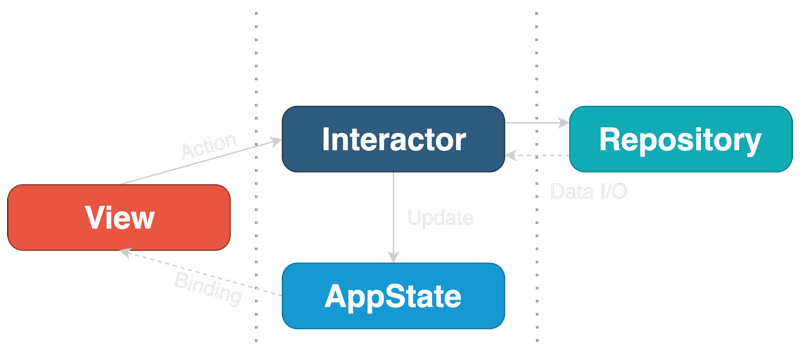

# 22.09 <!-- omit in toc -->

- [22.09.27 : SwiftUI Architecture](#220927--swiftui-architecture)
- [22.09.25 : MVC, MVP, MVVM 비교](#220925--mvc-mvp-mvvm-비교)
- [22.09.20 : Clean Architecture](#220920--clean-architecture)
- [22.09.19 : MVVM](#220919--mvvm)
- [22.09.18 : 프로그래밍 패러다임, Swift View UnitTest](#220918--프로그래밍-패러다임-swift-view-unittest)
- [22.09.14 : Swift Map, Filter, Reduce](#220914--swift-map-filter-reduce)
- [22.09.13 : safe index, Generic](#220913--safe-index-generic)
- [22.09.12 : UITest](#220912--uitest)
- [22.09.11 : @Binding](#220911--binding)
- [22.09.07 : 테스트 빌드](#220907--테스트-빌드)
- [22.09.06 : 테스트 케이스 및 테스트 방법 정의](#220906--테스트-케이스-및-테스트-방법-정의)
- [22.09.04 : VoiceOver와 친해지기](#220904--voiceover와-친해지기)
- [22.09.03 : Test](#220903--test)

<hr>

## 22.09.27 : SwiftUI Architecture
> 
> [SwiftUI를 위한 클린 아키텍처](https://gon125.github.io/posts/SwiftUI%EB%A5%BC-%EC%9C%84%ED%95%9C-%ED%81%B4%EB%A6%B0-%EC%95%84%ED%82%A4%ED%85%8D%EC%B2%98/)
> 
> #### 선언적 구문
> 
> SwiftUI는 선언적 구문을 사용한다. 선언형 프로그래밍은 화면에 "무엇"이 나타나야하는지 묘사하기 때문에 State 중심의 언어이다. 그래서 이벤트는 직접적으로 View를 변경할 수 없고, 대신에 View에 Binding 되어 있는 State를 변경시킨다.  
> SwiftUI의 모든 View는 구조체이며, UI를 렌더링하는 body 함수를 가지고 있다. body 함수는 State에 대한 참조를 유지하며 View를 출력한다. 그러므로 SwiftUI의 View는 하나의 함수에 불과하다.  
> 
> #### SwiftUI에 내재된 MVVM 아키텍처
> 
> SwiftUI의 View가 @State 변수와 함께 작동하는 방식은 MVVM 아키텍처와 유사하다. @State 변수는 @Binding을 제공하여 State가 변경될 때마다 UI가 리프레시될 수 있도록 한다. 만약에 비즈니스 로직을 캡슐화한다면 View가 외부의 ObservableObject를 참조하게 할 수 있다. SwiftUI 앱에서 MVVM이 적용되는 예시는 다음과 같다.  
> 
> ```swift
> // Model : 데이터 컨테이너
> struct Contry {
> 	let name: String
> }
> ```
> 
> ```swift
> // View : SwiftUI 뷰
> struct CountriesList: View {
>     
>     @ObservedObject var viewModel: ViewModel
>     
>     var body: some View {
>         List(viewModel.countries) { country in
>             Text(country.name)
>         }
>         .onAppear {
>             self.viewModel.loadCountires()
>         }
>     }
>     
> }
> ```
> 
> ```swift
> // ViewModel : 비스니스 로직을 캡슐화한 ObservableObject
> extension CountriesList {
>     class ViewModel: ObservableObject {
>         @Published private(set) var countries: [Country] = []
>         
>         private let service: WebService
>         
>         func loadCountires() {
>             service.getCountries { [weak self] result in
>                 self?.countries = result.value ?? []
>             }
>         }
>     }
> }
> ```
> 
> 위의 예시는 View가 화면에 나타나면 onAppear callback이 ViewModel의 loadContries()를 호출하고, WebService에 있는 데이터를 가져온다. ViewModel이 callback에 주어진 데이터를 받아서 @Published 변수인 contries에 업데이트를 하고, View가 변화를 알아차린다.  
> 
>   
> 
> 
> #### SwiftUI 클린 아키텍처
> 
> 1. SwiftUI는 Router가 필요없다.
> 2. View-State Binding의 네이티브 지원으로 Presenter가 필요없다.
> 3. 디자인 패턴의 모듈 수가 줄었기 때문에 Builder가 필요없다. 
> 
> 다양한 디자인 패턴들이 해결하려는 문제가 SwiftUI에는 존재하지 않기 때문에 다른 디자인 패턴을 사용해야 한다.  
> 
> 클린 아키텍처는 어플리케이션의 도메인에 따라 레이어 개수가 다르지만 3가지 레이어는 필요하다.  
> 
> - Presentation Layer
> - Business Logic Layer
> - Data Access Layer
> 
> 클린 아키텍처의 요구사항을 SwiftUI에 적용한다면 다음과 같은 구조가 만들어진다.  
> 
>   
> 
> 
> ## Composable Architecture
> 
> [Composable Architecture](https://green1229.tistory.com/138)  
> 
> Composable Architecture는 선언형 프레임워크인 SwiftUI에 적합한 View 업데이트 방식에 맞는 아키텍처이다. View의 변화를 작은 도메인으로 나누어 보여줄 수 있다. Combine 프레임 워크에 의존하기 때문에 iOS13 이상에서 가능하다.  
> 
> ### Composable Architecture 기본구성
> 
> - State : 기능 수행 및 UI 렌더링을 위한 데이터 타입
> - Action : 사용자 작업, 알림, 이벤트 소스 기능에서 발생할 수 있는 모든 작업을 나타내는 타입
> - Environment : API 클라이언트, 분석 클라이언트 등과 같이 기능에 필요한 종속성을 보유하는 타입
> - Reducer : 액션으로 상태 업데이트를 해주는 로직 함수로 모든 결과가 Effect 타입으로 반환
> - Store : 실제로 기능을 구동하는 런타임으로 스토어가 리듀서와 이펙트를 실행하도록 사용자의 액션을 스토어에 보내고 스토어에서 상태를 관찰하여 UI를 업데이트함
> 
> 

## 22.09.25 : MVC, MVP, MVVM 비교

> [[디자인 패턴] MVC, MVP, MVVM 비교](https://beomy.tistory.com/43)  
> 
> 유명하고 많이 쓰이는 디자인 패턴인 MVC 패턴과 MVC에서 파생된 MVP와 MVVM 패턴을 비교하며 어떤 패턴을 사용해야 하는지 생각해본다.  
> 디자인 패턴의 목적은 `역할의 분리`이다. 각각의 역할을 나누어 코드를 관리하면 유지보수와 개발 효율이 좋아지기 때문이다.  
> 
> ### MVC
> 
> MVC 패턴은 Model, View, Controller로 이루어진다.  
> 
> - View : 유저 인터페이스
> - Controller : 유저의 입력 처리
> - Model : 데이터 처리
> 
>   
> 
> MVC 패턴의 동작 순서는 다음과 같다.  
> - Controller에 유저의 Action이 들어온다.
> - Controller는 유저의 Action을 확인하고, Model을 업데이트한다.
> - Controller는 업데이트된 Model을 보여줄 View를 선택한다.
> - View는 Model을 화면에 보여준다.
> 
> MVC 패턴에서 View가 업데이트 되는 방법은 다음과 같다.
> - View가 Model을 이용하여 직접 업데이트
> - Model에서 View에 Notify하여 업데이트
> - View가 주기적으로 Model의 변경을 감자하여 업데이트
> 
> MVC 패턴은 가장 단순하며 보편적으로 많이 사용되는 디자인 패턴이다. 그러나 View와 Model의 높은 의존성 때문에 어플리케이션이 커질수록 복잡해지고 유지보수가 어렵다.  
> 
> ### MVP
> 
> MVP 패턴은 Model, View, Presenter로 이루어진다.  
> 
> - View : 유저 인터페이스
> - Presenter : Model을 가공하여 View에 전달하며 이어주는 역할
> - Model : 데이터 처리
> 
>   
> 
> MVP 패턴의 동작 순서는 다음과 같다.  
> - View에 유저의 Action이 들어온다.
> - View는 Presenter에 데이터를 요청하고, Presenter는 Model에 데이터를 요청한다.
> - Model은 Presenter에 데이터로 응답하고, Presenter는 View에 데이터로 응답한다.
> - View는 Presenter가 응답한 데이터를 화면에 보여준다. 
> 
> MVP 패턴은 View와 Model의 의존성이 없지만 View와 Presenter의 의존성이 높다. 어플리케이션이 복잡할 수록 View와 Presenter의 의존성이 강해진다.  
> 
> ### MVVM
> 
> MVVM 패턴은 Model, View, ViewModel로 이루어진다.  
> 
> - View : 유저 인터페이스
> - ViewModel : View를 표현하기 위한 데이터를 처리하는 Model
> - Model : 데이터 처리
> 
>   
> 
> MVVM 패턴의 동작 순서는 다음과 같다.  
> - View에 유저의 Action이 들어온다.
> - View는 Action을 Command 패턴으로 ViewModel에 Action을 전달한다.
> - ViewModel은 Model에 데이터를 요청한다.
> - Model은 ViewModel에 데이터로 응답한다.
> - ViewModel은 응답받은 데이터를 가공하여 저장한다.
> - View는 Data Binding된 ViewModel 데이터를 화면에 나타낸다.
> 
> MVVM 패턴은 Command 패턴과 Data Binding 패턴으로 View와 ViewModel의 의존성을 제거했다. 의존성을 제거하여 각각의 부분이 독립적이기 때문에 모듈화하여 개발할 수 있다.  
> 
> ### Command 패턴 
> 
> [[Design Pattern] 커맨드 패턴이란](https://gmlwjd9405.github.io/2018/07/07/command-pattern.html)  
> 
> Command 패턴은 실행될 기능을 객체 형태로 캡슐화한다. 주어진 여러 기능을 실행할 수 있는 재사용성이 높은 클래스로 설계한다. 사용자가 보낸 요청을 나중에 이용할 수 있도록 요청에 필요한 정보를 저장 또는 로깅, 취소할 수 있는 패턴이다.  
> 
> `행위(Behavioral) 패턴`의 하나이다. 실행될 기능을 캡슐화하여 기능의 실행을 요구하는 호출자 클래스와 실제 기능을 실행하는 수신자 클래스 사이의 의존성을 제거한다.  
> 
> 
> 
> - Command : 실행될 기능에 대한 인터페이스, 기능을 execute 메소드로 선언
> - ConcreteCommand : 실제로 실행되는 기능을 구현, Command 인터페이스를 구현
> - Invoker : 기능의 실행을 요청하는 호출자 클래스
> - Receiver : ConcreteCommand에서 execute 메소드를 구현할 때 필요한 클래스
> 
> 
> Command 패턴에서는 Command, Receiver, Invoker, Client라는 용어를 사용한다.  
> - Command 객체는 Receiver 객체를 가지고 있다. 
> - Receiver의 메소드가 호출되고, Receiver는 정의된 메소드를 수행한다.
> - Command 객체는 별도로 Invoker 객체에 전달되어 명령을 발동하게 한다.
> - Invoker 객체는 필요에 따라서 명령 발동에 대한 기록을 남길 수 있다. 
> - 하나의 Invoker 객체에 다수의 Command 객체가 전달될 수 있다. 
> - Client 객체는 Invoker 객체와 하나 이상의 Command 객체를 보유한다. 
> - Client 객체는 어느 시점에서 어떤 명령을 수행할지를 결정한다. 
> - 명령을 수행하려면 Client 객체는 Invoker 객체로 Command 객체를 전달한다. 
> 
> 
> #### Command 패턴 예시
> 
> 버튼이 눌리면 램프의 불이 켜지는 코드를 C++로 구현한다.  
> 
> ```cpp
> public class Lamp {
> public void turnOn(){ System.out.println("Lamp On"); }
> }
> 
> public class Button {
> private Lamp theLamp;
> public Button(Lamp theLamp) { this.theLamp = theLamp; }
> public void pressed() { theLamp.turnOn(); }
> }
> ```
> 
> ```cpp
> public class Client {
> public static void main(String[] args) {
>   Lamp lamp = new Lamp();
>   Button lampButton = new Button(lamp);
>   lampButton.pressed();
> }
> }
> ```  
> 
> 클라이언트에서 `Button` 객체의 `pressed()` 메소드로 `Lamp` 객체의 `turnOn()` 메소드를 호출하여 불을 킬 수 있다. 만약에 `Button` 객체의 `pressed()` 메소드가 다른 기능을 실행하도록 만드려면 `Button` 클래스를 수정해야한다.  
> 
> ```cpp
> public class Alarm {
>   public void start(){ System.out.println("Alarming"); }
> }
> public class Button {
>   private Alarm theAlarm;
>   public Button(Alarm theAlarm) { this.theAlarm = theAlarm; }
>   public void pressed() { theAlarm.start(); }
> }
> ```
> 
> 이런 상황에서는 버튼의 기능을 변경하기 어렵다. 만약에 처음 버튼을 눌렀을 때는 램프를 켜고, 다음에는 알람을 동작시키려면 `Button` 클래스를 다음과 같이 변경해야한다.  
> 
> ```cpp
> enum Mode { LAMP, ALARM };
> // Button 클래스의 코드를 수정
> public class Button {
>   private Lamp theLamp;
>   private Alarm theAlarm;
>   private Mode theMode;
>   // 생성자에서 버튼을 눌렀을 때 필요한 기능을 인지로 받는다.
>   public Button(Lamp theLamp, Alarm theAlarm) {
>    this.theLamp = theLamp;
>    this.theAlarm = theAlarm;
>   }
>   // 램프 모드 또는 알람 모드를 설정
>   public void setMode(Mode mode) { this.theMode = mode; }
>   // 설정된 모드에 따라 램프를 켜거나 알람을 울림
>   public void pressed() {
>    switch(theMode) {
>    case LAMP: theLamp.turnOn(); break;
>    case ALARM: theAlarm.start(); break;
>    }
>  }
> }
> ```
> 
> Command 패턴을 사용하여 실행될 기능을 캡슐화한다면 이러한 문제를 해결할 수 있다. `Button` 객체의 `pressed()` 메소드가 구체적인 기능을 구현하는 대신에 실행될 기능을 외부에서 제공받는다.  
> 
>   
> 
> ```cpp
> public interface Command { public abstract void execute(); }
> ```
> 
> ```cpp
> public class Button {
> private Command theCommand;
> // 생성자에서 버튼을 눌렀을 때 필요한 기능을 인지로 받는다.
> public Button(Command theCommand) { setCommand(theCommand); }
> public void setCommand(Command newCommand) { this.theCommand = newCommand; }
> // 버튼이 눌리면 주어진 Command의 execute 메서드를 호출한다.
> public void pressed() { theCommand.execute(); }
> }
> ```
> 
> ```cpp
> public class Lamp {
> public void turnOn(){ System.out.println("Lamp On"); }
> }
> 
> /* 램프를 켜는 LampOnCommand 클래스 */
> public class LampOnCommand implements Command {
> private Lamp theLamp;
> public LampOnCommand(Lamp theLamp) { this.theLamp = theLamp; }
> // Command 인터페이스의 execute 메서드
> public void execute() { theLamp.turnOn(); }
> }
> ```
> 
> ```cpp
> public class Alarm {
> public void start(){ System.out.println("Alarming"); }
> }
> 
> /* 알람을 울리는 AlarmStartCommand 클래스 */
> public class AlarmStartCommand implements Command {
> private Alarm theAlarm;
> public AlarmStartCommand(Alarm theAlarm) { this.theAlarm = theAlarm; }
> // Command 인터페이스의 execute 메서드
> public void execute() { theAlarm.start(); }
> }
> ```
> 
> ```cpp
> public class Client {
> public static void main(String[] args) {
>   Lamp lamp = new Lamp();
>   Command lampOnCommand = new LampOnCommand(lamp);
>   Alarm alarm = new Alarm();
>   Command alarmStartCommand = new AlarmStartCommand(alarm);
> 
>   Button button1 = new Button(lampOnCommand); // 램프 켜는 Command 설정
>   button1.pressed(); // 램프 켜는 기능 수행
> 
>   Button button2 = new Button(alarmStartCommand); // 알람 울리는 Command 설정
>   button2.pressed(); // 알람 울리는 기능 수행
>   button2.setCommand(lampOnCommand); // 다시 램프 켜는 Command로 설정
>   button2.pressed(); // 램프 켜는 기능 수행
> }
> }
> ```
> 
> ### VIPER 
> 
> [iOS 아키텍처 패턴 VIPER](https://bugle.tistory.com/48)  
> [VIPER Pattern - iOS Architecture](https://dongminyoon.tistory.com/42)  
> 
> iOS에서 ViewController는 View의 LifeCycle과 깊게 연관되어 있기 때문에 View와 Controller의 책임을 나누기가 어렵다. 그래서 새로운 애플만의 MVC 패턴이 나오기까지 한다.  
> 
>   
> 
> iOS의 VIPER 패턴은 View, Interactor, Presenter, Entity, Router로 이루어진다.  
> 
> VIPER 패턴은 책임 분리의 원칙(SRP)을 기반으로 한다. SRP란 작성된 클래스는 하나의 기능만 가지며 클래스가 제공하는 모든 서비스는 그 하나의 책임(기능)을 수행하는 데 집중되어 있어야 한다는 원칙이다. VIPER 패턴은 각각의 모듈로 역할이 분리되어 있기 때문에 테스트에 용이하다. 하지만 모듈이 너무 잘게 나누어지기 때문에 작은 기능을 개발하더라도 작성해야할 코드가 많다.  
> 
> - View : 유저 인터페이스
> - Presenter : UI 관련 비즈니스 로직을 포함하며, View를 업데이트
> - Interactor : App의 비즈니스 로직을 가진다. API 호출, 데이터와 관련된 로직을 가진다. 
> - Entity : 일반적인 데이터 객체
> - Router : 화면 표시같은 Navigation 로직을 가진다. 
> 
>   
> 
> VIPER 패턴의 동작 순서는 다음과 같다.  
> - 새롭게 View를 Router로 부터 가져온다.
> - View는 새로운 데이터가 필요하다고 Presenter에게 알린다.
> - Presenter는 Interactor에게 데이터를 요청한다.
> - Interactor는 데이터를 Fetch하는 비즈니스 로직을 실행하고 Entity를 패치해온다.
> - Interactor는 Fetch한 Entity를 Presenter에게 전달한다.
> - Presenter는 Entity를 View에게 전달한다.
> - View는 해당 Entity를 화면에 표시한다.
> 


## 22.09.20 : Clean Architecture  
> 
> [The Clean Architecture](http://blog.cleancoder.com/uncle-bob/2012/08/13/the-clean-architecture.html)  
> [The Clean Architecture 번역](https://blog.coderifleman.com/2017/12/18/the-clean-architecture/)  
> [주니어 개발자의 클린 아키텍처 맛보기](https://techblog.woowahan.com/2647/)  
> 
>   
> 
> 시스템 아키텍처에 대한 다양한 아이디어가 있지만 모두 공통적으로 관심사의 분리에 목적을 두고 있다. 이들은 소프트웨어를 계층으로 나누어서 관심사를 분리하며, 각각 비즈니스 계층과 인터페이스 계층을 최소 하나씩 두고 있다. 그리고 다음과 같은 시스템을 만든다.  
> 
> - 프레임워크 독립적 : 소프트웨어 라이브러리 존재 여부에 의존하지 않는다. 프레임워크를 도구로써 사용한다. 
> - 테스트 용이성 : 비즈니스 규칙을 외부 요인없이 테스트할 수 있다. 
> - UI 독립적 : 시스템의 나머지 부분을 변경할 필요없이 UI를 쉽게 변경할 수 있다. 
> - 데이터베이스 독립정 : 데이터 베이스를 비즈니스 규칙 변경없이 변경할 수 있다. 
> - 외부 기능 독립적 : 실제로 비즈니스 규칙을 외부 세계에 대해 아무것도 모른다.  
> 
> ## 의존 규칙
> 
> 동심원은 소프트웨어의 각기 다른 영역을 나타내고 있다. 바깥쪽의 원은 메커니즘이고, 안쪽의 원은 정책이다.  
> 아키텍처의 중요한 규칙은 의존 규칙이다. 이 규칙으로 인해서 소스 코드는 안쪽을 향해서만 의존할 수 있다. 안쪽의 원은 바깥쪽의 원에 대해 전혀 알지 못하며 바깥쪽의 원에서 선언된 어떠한 것도 참조해서는 안된다.  
> 의존 규칙은 바깥쪽 원의 어떠한 것도 안쪽 원에 영향을 주지 않아야 한다는 규칙이다.  
> 
> ## 엔티티
> 
> 엔티티는 비즈니스 규칙을 캡슐화하는 객체이다. 가장 일반적이면서 고수준의 규칙을 캡슐화하며 바깥쪽에서 무엇이 변경되더라도 바뀌지 않는다.  
> 
> ## 유스케이스
> 
> 유스케이스는 엔티티에서의 데이터 흐름을 조합한다. 프로젝트 레벨의 비즈니스 규칙을 사용하여 유스케이스의 목적을 달성하도록 한다.  
> 이 계층의 변경은 엔티티에 영향을 주지 않으며 데이터베이스나 UI의 변경으로부터 영향을 받지 않는다. 하지만 앱의 조작에 대한 변경은 유스케이스에 영향을 준다.  
> 
> ## 인터페이스 어댑터
> 
> 이 계층의 소프트웨어는 어댑터의 집합이다. 이는 유스케이스나 엔티티에 있는 형식으로부터 외부의 기능에 용이한 형식으로 데이터를 변환한다. 예를 들어 GUI는 MVC 아키텍처를 완전히 내포한다. 프리젠터, 뷰, 컨트롤러가 모두 여기에 속한다. 모델은 유스케이스로 전달되고, 유스케이스에서 프리젠터나 뷰로 되돌아가는 데이터 구조이다. 
> 
> 


## 22.09.19 : MVVM
> 
> 그리닷 앱을 SwiftUI로 다시 개발하는 과정에서 기존의 코드를 읽게 되었다. 하나씩 읽어보니 코드 구조가 이상했다. 앱의 상당 부분이 Canvas라는 UIView에 의존하고 있었다. 어떠한 View가 ViewModel에 접근하기 위해서 Canvas를 참조하는 구조였다. 이상한 구조를 가지게된 이유는 개발 방식에 있었다. 처음에 Canvas를 구현하고 필요한 기능을 구현하여 붙이는 방식으로 개발하였기 때문이다. 덕분에 구조의 중요성을 깨달았다.  
> 
> ## MVVM
> 
> [MVVM 패턴](https://velog.io/@k7120792/Model-View-ViewModel-Pattern)  
> [Model-View-ViewModel Pattern 문서](https://learn.microsoft.com/en-us/xamarin/xamarin-forms/enterprise-application-patterns/mvvm)  
> 
> MVVM 패턴은 마틴 파울러의 Presentation 모델 패턴에서 파생되었다. 이 패턴은 비즈니스 로직과 프레젠테이션 로직을 UI로부터 분리하기 위해 사용된다. UI와 로직이 분리되면 테스트, 유지 보수, 재사용이 쉬워진다. 또한, 개발자와 디자이너가 앱의 각 부분을 개발할 때 보다 쉽게 협업할 수 있다.  
> 
> ## 구성 요소
> 
> Model, View, View Model로 구성되어 있다. 이 3가지 구성 요소의 역할과 책임을 이해하기 위해서는 이들 사이의 관계를 알아야 한다. View는 ViewModel을 알고, ViewModel은 Model을 알고 있다. 그러나 반대 방향으로는 모르는 상태이다. Model은 ViewModel을 모르고, ViewModel은 View를 모른다. 이런 관계의 구조는 ViewModel과 Model이 독립적인 형태를 만들어서 View로부터 분리되는 목적을 이룬다.  
> 
>   
> 
> ### View 
> 
> View는 사용자가 보는 스크린의 레이아웃과 형태를 정의한다. View는 애니메이션과 같은 UI로직을 포함하지만 비즈니스 로직은 포함하지 말아야 한다.  
> 
> View는 개체를 시각적으로 나타내는데 사용할 UI 요소를 지정하는 데이터 템플릿으로도 나타낼 수 있다. 특정 ViewModel에 바인딩되도록 설계된다.  
> 
> View에서 클릭과 같은 상호작용을 ViewModel에서 실행시키는 방법은 여러가지가 있다. 컨트롤이 Command를 지원하는 경우에 Command의 속성에 ViewModel이 바인딩될 수 있다. Command가 호출되면 ViewModel의 코드가 실행된다. 이외에도 동작을 View의 개체에 첨부하여 호출할 명령이나 발생할 이벤트를 수신할 수 있다.  
> 
> ### ViewModel
> 
> ViewModel은 View가 사용할 메소드와 필드를 구현하고, View에게 상태 변화를 알린다. ViewModel에서 제공하는 메소드와 필드가 UI에서 제공할 기능을 정의한다. View는 기능을 어떻게 보여줘야하는지 결정한다.  
> 
> ViewModel은 View가 사용하기 쉽도록 Model의 데이터를 가공하여 View에게 제공한다. 만약에 View에서 서로 다른 Model들의 데이터를 사용해야 한다면 ViewModel에서 Model의 데이터를 처리하여 View에 제공한다.  
> 
> ### Model
> 
> Model은 앱의 데이터를 캡슐화하는 비시각적 클래스이다. 일반적으로 비즈니스 및 유효성 검사 논리와 함께 데이터 모델을 포함하는 앱의 도메인 모델을 나타내는 것으로 생각할 수 있다. 데이터 액세스 및 캐싱을 캡슐화하는 서비스 또는 리포지토리와 함께 사용된다. 
> 


## 22.09.18 : 프로그래밍 패러다임, Swift View UnitTest

> [프로그래밍 패러다임](https://ko.wikipedia.org/wiki/%ED%94%84%EB%A1%9C%EA%B7%B8%EB%9E%98%EB%B0%8D_%ED%8C%A8%EB%9F%AC%EB%8B%A4%EC%9E%84)  
> 
> 프로그래밍 패러다임은 프로그래머에게 프로그래밍의 관점을 갖게 하고, 결정하는 역할을 한다. 예를 들어 객체지향 프로그래밍은 프로그래머들이 프로그램을 상호작용하는 객체들의 집합으로 볼 수 있게 하는 반면에, 함수형 프로그래밍은 상태 값을 지니지 않는 함수 값들의 연속으로 생각할 수 있게 해준다.  
> 
> 소프트웨어 공학의 서로 다른 무리가 서로 다른 방법론을 지원하듯이, 서로 다른 프로그래밍 언어는 서로 다른 프로그래밍 패러다임을 지원한다. 프로그래밍 패러다임과 프로그래밍 언어와의 관계는 프로그래밍 언어가 여러 프로그래밍 패러다임을 지원하기도 하기 때문에 복잡할 수도 있다. 예를 들어 C++은 절차적 프로그래밍, 객체기반 프로그래밍, 객체지향 프로그래밍, 제네릭 프로그래밍의 요소들을 지원하도록 설계되었다. 순수하게 절차적 프로그램을 작성할 수 있고, 순수하게 객체지향 프로그램을 작성할 수도 있으며, 두가지 패러다임을 포함한 프로그램을 작성할 수도 있다. 최근에는 여러 패러다임들이 관대하게 지원되는 경향이 강한다. Swift나 Go, Kotlin과 같이 비교적 새로 만들어지는 언어들은 처음부터 여러 패러다임의 지원을 고려하여 설계된다. 또한, 특수한 목적을 띄지도 않고, 완전한 범용성을 띄지도 않는 패러다임이나 실험적으로 개발되는 많은 언어들에서는 어느 정도 언어 설계의 목적에 따라 여러 패러다임을 조합하는 일이 더욱 흔해지고 있다. 고전적으로 순수한 관점에서 이질적으로 보여졌던 패러다임간의 공존이 갈수록 많이 등장하여, 상황과 맥락에 따라 패러다임간 장점만을 취하려는 시도는 계속되고 있다.  
> 
> [역할, 책임, 협력 관점으로 객체지향 살펴보기](https://yeonyeon.tistory.com/22)  
> 
> ## 객체
> 
> 객체는 상태, 행동, 식별자를 지녔다.  
> 상태란 객체의 특징이다. 특정 시점에 객체가 가진 정보의 집합으로 객체의 구조적 특징을 표현한다. 
> 행동은 동작하고 반응하는 활동이다. 외부의 요청에 응답하기 위해 동작하거나 반응하며 행동이 상태를 결정한다.  
> 
> **객체는 가변 상태이다. 행동을 통해 상태가 변경된다.**
> 
> ## 객체지향
> 
> 객체지향은 역할, 책임, 협력으로 구분할 수 있다.  
> 
> - 협력: 요청과 응답을 통해 다른 객체와 협력
> - 책임: 객체에 의해 정의되는 응집도 있는 행위의 집합
> - 역할: 협력 안에서 특정 객체가 차지하는 책임과 임무
> 
> 예를 들어, 카페에서 손님의 **역할**은 사장님에게 커피를 주문한다. 사장님은 커피를 내리고, 커피가 완성되었다는 사실을 손님에게 알리는 **책임**을 수행한다. 손님은 커피를 받아서 자리에 앉고, 커피를 다 마신 다음에 자리를 치우는 **책임**을 수행한다. 그리고 손님이 카페 문을 열고 나가면 **협력**이 마무리 된다.  
> 
> ## 객체지향 설계
> 
> 기능을 구현하기 위한 협력 관계를 고안하고, 협력에 필요한 역할과 책임을 식별한 후에 이를 수행할 수 있는 적절한 객체를 식별하는 과정이다.  
> 
> ### 책임-주도 설계
> 
> 협력에 필요한 책임들을 식별하고 적합한 객체에게 책임을 할당한다.
> - 객체의 역할, 책임, 협력을 고안하기 위한 방법, 절차를 제시한다.
> - 시스템의 책임을 더 작은 규모의 책임으로 분할하여 객체에게 할당한다. 객체가 책임을 수행하는 도중에 스스로 처리할 수 없는 기능이 필요한 경우 협력자를 찾고, 협력자에게 책임을 할당한다. 이로써 객체들의 협력 공동체가 구축된다. 
> 
> ## 디자인 패턴
> 
> 반복적으로 사용하는 설계 패턴이다. GOF의 디자인 패턴이 가장 유명하다.  
> 


## 22.09.14 : Swift Map, Filter, Reduce
> 
> # Map
> 
> `map`은 기존 데이터에서 변형된 새로운 컨테이너를 반환한다. 기존 데이터는 변형되지 않는다.  
> 
> ## 선언
> 
> ```swift
> func map<T>(_ transform: (Self.Element) throws -> T) rethrows -> [T]
> ```
> 
> ## 반환값
> 
> 시퀀스의 변환된 요소를 포함하는 배열을 반환한다.
> 
> ## 매개변수
> 
> `transform` : 매핑 클로저. 시퀀스의 요소를 매개변수로 받고, 동일하거나 변환된 값을 반환한다.
> 
> ## 예제
> 
> ```swift
> let cast = ["Vivien", "Marlon", "Kim", "Karl"]
> let lowercaseNames = cast.map { $0.lowercased() }
> // 'lowercaseNames' == ["vivien", "marlon", "kim", "karl"]
> let letterCounts = cast.map { $0.count }
> // 'letterCounts' == [6, 6, 3, 4]
> ```
> 
> # Filter
> 
> `filter`는 데이터에서 걸러낸 새로운 컨테이너를 반환한다.  
> 
> ## 선언
> 
> ```swift
> func filter(_ isIncluded: (Self.Element) throws -> Bool) rethrows -> [Self.Element]
> ```
> 
> ## 반환값
> 
> 스퀀스의 필터링된 요소를 포함하는 배열을 반환한다.
> 
> ## 매개변수
> 
> `isIncluded` : 시퀀스의 요소를 인수로 사용하고 요소가 반환된 배열에 포함되어야 하는지 여부를 나타내는 Boolean 값을 반환한다.
> 
> ## 예제
> 
> ```swift
> let cast = ["Vivien", "Marlon", "Kim", "Karl"]
> let shortNames = cast.filter { $0.count < 5 }
> print(shortNames)
> // Prints "["Kim", "Karl"]"
> ```  
> 
> 
> # Reduce
> 
> `reduce`는 시퀀스의 요소를 결합한 결과를 반환한다.
> 
> ## 선언
> 
> ```swift
> func reduce<Result>(
>     _ initialResult: Result,
>     _ nextPartialResult: (Result, Self.Element) throws -> Result
> ) rethrows -> Result
> ```
> 
> ## 반환값
> 
> 최종 누적 값을 반환한다. 만약 시퀀스에 요소가 없다면 `initialResult`가 반환된다.
> 
> ## 매개변수
> 
> `initialResult` : 초기 누적 값으로 사용할 값이다. 클로저가 처음 실행될 때 전달된다. 
> `nextPartialResult` : 클로저의 다음 호출에 사용되거나 호출자에게 반환될 누적 값과 시퀀스 요소를 새로운 누적 값으로 결합하는 클로저  
> 
> ## 예제
> 
> ```swift
> let numbers = [1, 2, 3, 4]
> let numberSum = numbers.reduce(0, { x, y in
>     x + y
> })
> // numberSum == 10
> ```
> 


## 22.09.13 : safe index, Generic
> 
> [Handling Index Out of Range Exception the Swift Way](https://www.vadimbulavin.com/handling-out-of-bounds-exception/)  
> 
> 인덱스로 배열의 요소에 접근하다보면 범위를 벗어나는 경우가 나타난다. 이를 방지하기 위해서 검사하는 코드를 다음과 같이 추가해왔다.  
> 
> ```swift
> if index >= 0 && index < array.count {
> 	print(array[index])
> }
> ```  
> 
> 이는 오류를 방지하지만 요소에 접근할 때마다 반복되어야 한다. 그러므로 Array extension에 메소드를 추가하여 구현해본다.  
> 
> ```swift 
> extension Array {
> 	func getElement(at index: Int) -> Element? {
> 		let isValidIndex = index >= 0 && index < count
> 		return isValidIndex ? self[index] : nil	
> 	}
> }
> ```  
> 
> 이 로직을 subscript로 구현하면 가독성을 높일 수 있다.  
> 
> ```swift
> extension Array {
> 	subscript(safe index: Index) -> Element? {
> 		let isValidIndex = index => 0 && index < count
> 		return isValidIndex ? self[index] : nil
> 	}
> }
> ```  
> 
> 구체적인 컬렉션에 구애받지 않도록 확장해본다.  
> 
> ```swift
> extension Collection {
> 	subscript(safe index: Index) -> Element? {
> 		return indices.contains(index) ? self[index] : nil
> 	}
> }
> ```  
> 
> 다음과 같이 보편적으로 사용할 수 있게 되었다.  
> 
> ```swift
> [1, 2, 3][safe: 4] // Array - prints 'nil'
> (0..<3)[safe: 4] // Range - prints 'nil'
> ```

> 
> # Generics
> 
> [Generics - The Swift Programming Language (Swift 5.5)](https://docs.swift.org/swift-book/LanguageGuide/Generics.html)  
> [공식문서 번역](https://minsone.github.io/mac/ios/swift-generics-summary)  
> 
> 제네릭 코드는 모든 유형에 따라 유연하고 재사용가능한 함수를 작성할 수 있게 한다. 중복을 피하고 추상적인 방식으로 명확한 의도를 표현하는 코드를 작성할 수 있다.  
> 
> swapTwoInts(_: _:)는 두 Int 값을 교환하는 일반 함수이다.  
> 
> ```swift
> func swapTwoInts(_ a: inout Int, _ b: inout Int) {
> 	let tempA = a
> 	a = b
> 	b = tempA
> }
> 
> var intA = 3
> var intB = 100
> swapTwoInts(&intA, &intB)
> print("intA = \(intA), intB = \(intB)")
> // Prints "intA = 100, intB = 3"
> ```
> 
> swapTwoInts(_: _:)는 Int 값에만 사용할 수 있다. 두 String 값이나 Double 값을 교환하려면 매개변수 값 유형이 다른 새로운 함수를 작성해야 한다.  
> 
> ```swift
> func swapTwoStrings(_ a: inout String, _ b: inout String) {
> 	let tempA = a
> 	a = b
> 	b = tempA
> }
> 
> func swapTwoDoubles(_ a: inout Double, _ b: inout Double) {
> 	let tempA = a
> 	a = b
> 	b = tempA
> }
> ```
> 
> 제네릭 함수로 작성하면 모든 유형에서 작동된다.  
> 
> ```swift
> func swapTwoValues<T>(_ a: inout T, _ b: inout T) {
> 	let tempA = a
> 	a = b
> 	b = tempA
> }
> 
> var intA = 3
> var intB = 100
> swapTwoValues(&intA, &intB)
> print("intA = \(intA), intB = \(intB)")
> // Prints "intA = 100, intB = 3"
> 
> var intC = "hello"
> var intD = "world"
> swapTwoValues(&intC, &intD)
> print("intC = \(intC), intD = \(intD)")
> // Prints "intC = world, intD = hello"
> ```
> 
> 위의 예시 함수인 swapTwoValues(_: _:)는 T가 유형 매개변수로 사용된 예시입니다. 유형 매개변수는 함수 이름 바로 뒤에 꺾쇠 괄호 쌍 사이에 작성된다.  
> 
> 유형 매개변수를 지정하면 함수의 반환 유형, 또는 함수 내에서 유형의 약어로 사용될 수 있다. 각각의 유형 매개변수는 함수가 호출될 때마다 실제 유형으로 대체된다.  
> 
> 꺾쇠 괄호 안에 여러 유형 매개변수를 쉼표로 구분하여 작성하면 둘 이상의 유형 매개변수를 사용할 수 있다.  
> 
> ```swift
> struct IntStack {
> 	var items: [Int] = []
> 	mutating func push(_ item: Int) {
> 		items.append(item)
> 	}
> 	mutating func pop() -> Int {
> 		return items.removeLast()
> 	}
> }
> ```
> 
> ```swift
> struct Stack<Element> {
> 	var items: [Element] = []
> 	mutating func push(_ item: Element) {
> 		items.append(item)
> 	}
> 	mutating func pop() -> Element {
> 		return items.removeLast()
> 	}
> }
> ```
> 
> Stack 꺽쇠 괄호 안에 유형을 작성하여 새 인스턴스를 만들면 해당 유형을 사용하게 된다.  
> 
> ```swift
> func swapTwoInts(_ a: inout Int, _ b: inout Int) {
> 	let tempA = a
> 	a = b
> 	b = tempA
> }
> 
> var intA = 3
> var intB = 100
> swapTwoInts(&intA, &intB)
> print("intA = \(intA), intB = \(intB)")
> // Prints "intA = 100, intB = 3"
> ```  
> 
> 
> ## Type Constraints(타입 제약)
> 
> 제네릭 함수와 제네릭 타입을 사용할 때 특정 타입으로 강제하면 유용한 경우가 있다. 타입 강제는 특정 클래스로부터 타입 인자가 상속받아야 하거나, 특정 프로토콜 또는 프로토콜 결합과 일치해야 한다.  
> 
> ### Type Constraint Syntax(타입 제약 문법)
> 
> ```swift
> func findIndex<T>(array: [T], valueToFind: T) -> Int? {
>     for (index, value) in enumerate(array) {
>         if value == valueToFind {
>             return index
>         }
>     }
>     return nil
> }
> ```  
> 
> 위의 함수는 제네릭 함수로써 배열에서 요소를 찾고 인덱스를 반환한다. 이는 컴파일 되지 않는다. 동등 연산자(==)로 비교될 수 없는 타입이 있기 때문이다. 만약에 클래스나 구조체가 들어온다면 같다고 추측할 수 없기 때문이다. Equatable인 타입은 동등 연산자 지원을 보장한다. 함수를 정의할 때 타입 인자를 Equatable로 다음과 같이 제약할 수 있다.  
> 
> ```swift
> func findIndex<T: Equatable>(array: [T], valueToFind: T) -> Int? {
>     for (index, value) in enumerate(array) {
>         if value == valueToFind {
>             return index
>         }
>     }
>     return nil
> }
> ```  
> 
> 단일 타입 인자가 `T: Equatable`로 정의되며, Equatable 프로토콜에 일치하는 타입 T를 의미한다.  
> 
> ## Associated Types(연관 타입)
> 
> 프로토콜 정의의 한 부분으로 하나 이상의 연관 타입을 선언하면 유용하다. 연관 타입은 자리를 표시하는 이름을 정하고, 실제 타입은 프로토콜이 도입될 때까지 정해지지 않는다.  
> 
> ### Associated Types in Action(연관 타입 사용)
> 
> ```swift
> protocol Container {
>     typealias ItemType
>     mutating func append(item: ItemType)
>     var count: Int { get }
>     subscript(i: Int) -> ItemType { get }
> }
> ```
> 
> `ItemType`이라는 연관 타입을 가지는 프로토콜이 선언되었다. `Container` 프로토콜은 append 메소드로 새로운 item을 컨테이너에 추가하고, 정수 인덱스 값으로 각 요소를 받는다. `typealias ItemType`으로 선언된 연관 타입은 다음과 같이 사용된다.  
> 
> ```swift
> struct IntStack: Container {
>     // original IntStack implementation
>     var items = [Int]()
>     mutating func push(item: Int) {
>         items.append(item)
>     }
>     mutating func pop() -> Int {
>         return items.removeLast()
>     }
>     // conformance to the Container protocol
>     typealias ItemType = Int
>     mutating func append(item: Int) {
>         self.push(item)
>     }
>     var count: Int {
>         return items.count
>     }
>     subscript(i: Int) -> Int {
>         return items[i]
>     }
> }
> ```
> 
> Swift의 타입 추론 덕분에 구체화된 타입을 선언할 필요가 없다. 그래서 다음과 같이 `typealias ItemType = Int`를 제거하고 제네릭으로 작성할 수 있다.  
> 
> ```swift
> struct Stack<T>: Container {
>     // original Stack<T> implementation
>     var items = [T]()
>     mutating func push(item: T) {
>         items.append(item)
>     }
>     mutating func pop() -> T {
>         return items.removeLast()
>     }
>     // conformance to the Container protocol
>     mutating func append(item: T) {
>         self.push(item)
>     }
>     var count: Int {
>         return items.count
>     }
>     subscript(i: Int) -> T {
>         return items[i]
>     }
> }
> ```
> 
> 
> ## Where Clauses
> 
> 타입 제약을 사용하면 타입과 연결된 타입 매개 변수에 대한 요구 사항을 정의할 수 있다.  
> 
> `where`을 사용하면 연결된 타입이 특정 프로토콜을 준수해야 하거나 특정 형식 매개변수와 연결된 형식이 같아야 한다고 요구할 수 있다. 아래의 예제는 일반 함수를 정의하여 두 인스턴스에 같은 항목이 같은 순서로 포함되어 있는지 확인한다. 검사할 두개의 컨테이너는 동일한 타입의 컨테이너일 필요는 없지만 동일한 타입의 `Item`을 보유해야 한다.  
> 
> ```swift
> func allItemsMatch<C1: Container, C2: Container>
>     (_ someContainer: C1, _ anotherContainer: C2) -> Bool
>     where C1.Item == C2.Item, C1.Item: Equatable {
> 
> 	// Check that both containers contain the same number of items.
> 	if someContainer.count != anotherContainer.count {
> 		return false
> 	}
> 
> 	// Check each pair of items to see if they're equivalent.
> 	for i in 0..<someContainer.count {
> 		if someContainer[i] != anotherContainer[i] {
> 			return false
> 		}
> 	}
> 
> 	// All items match, so return true.
> 	return true
> }
> ```
> 
> 다음 요구사항이 함수의 두 타입 매개변수에 적용된다. 
> - C1은 Container 프로토콜을 준수해야 한다. 
> - C2 또한 Container 프로토콜을 준수해야 한다. 
> - C1의 Item과 C2의 Item은 반드시 같아야 한다. 
> - C1의 Item은 Equatable 프로토콜을 준수해야 한다. 
> 
> 
> ## Extension with a Generic Where Clause
> 
> 제너릭 Where을 extension에 사용할 수 있다. 아래의 제너릭 Stack 구조체 extension에서는 isTop 메소드를 추가한다.  
> 
> ```swift
> extension Stack where Element: Equatable {
>     func isTop(_ item: Element) -> Bool {
>         guard let topItem = items.last else {
>             return false
>         }
>         return topItem == item
>     }
> }
> ```
> 
> 새로운 isTop 메소드에서 동등 연산자(==)가 사용되기 때문에 item은 `Equatable`을 준수해야 한다. 그러므로 제네릭 where을 사용하지 않는다면 컴파일되지 않는다.  
> 
> 만약에 특정 타입이 필요하다면 다음과 같이 제네릭 where을 사용할 수 있다.  
> 
> ```swift
> extension Container where Item == Double {
>     func average() -> Double {
>         var sum = 0.0
>         for index in 0..<count {
>             sum += self[index]
>         }
>         return sum / Double(count)
>     }
> }
> print([1260.0, 1200.0, 98.6, 37.0].average())
> // Prints "648.9"
> ```
> 

## 22.09.12 : UITest

> ## 페이지 객체 패턴을 사용한 UITest
> 
> [페이지 객체 패턴 UITest](https://swiftwithmajid.com/2021/03/24/ui-testing-using-page-object-pattern-in-swift/)  
> 
> 다양한 문제를 해결하기 위해서 디자인 패턴을 사용한다. 테스트 코드에도 디자인 패턴을 적용할 수 있다. 페이지 개체 패턴이라는 디자인 패턴으로 UI 테스트를 유지 가능하고 일관된 상태로 유지할 수 있다. 특정 화면의 모든 상호 작용을 정의하고 해당 화면의 UI 상태를 확인하는데 필요한 모든 기능을 제공하기 때문에 페이지 개체 패턴이라 부른다.  
> 
> 

## 22.09.11 : @Binding

> ## @Binding 변수 초기화
> 
> [SwiftUI: How to implement a custom init with @Binding variables](https://stackoverflow.com/questions/56973959/swiftui-how-to-implement-a-custom-init-with-binding-variables)  
> 
> 바인딩 매개변수를 초기화한다. 속성 래퍼인 `@Binding`을 사용하는 변수를 초기화하기 위해서는 언더바를 앞에 붙히면 된다.  
> 
> ```swift
> struct AmountView: View {
> 	@Binding var amount: Double
> 	
> 	init(withAmount: Binding<Double>) {
> 		// self.$amount = withAmount	// beta 3
> 		self._amount = withAmount	// beta 4
> 	}
> }
> ```

## 22.09.07 : 테스트 빌드

> [@testable import에 대한 고찰](https://zeddios.tistory.com/1078)  
> [UITest에서는 앱 모듈에 접근할 수 없다](https://stackoverflow.com/questions/33755019/linker-error-when-accessing-application-module-in-ui-tests-in-xcode-7-1?rq=1)  
> 
> UI Test에서는 앱 코드에 접근할 수 없으며, 별도의 프로세스로 앱 외부에서 실행된다. 이는 UI 테스트에서 앱 코드에 접근하지 못하도록 의도된 디자인이라고 한다. 앱 코드에 접근하기 원하면 Unit Test를 사용해야 한다.  
> 
> ## @testable import 
> 
> import에 @testable을 추가하면 Target에 대한 높은 접근 권한을 가지게 된다.  
> 
> ```swift
> import XCTest
> @testable import TargetName
> ```  
> 
> Unit 테스트를 작성하면 앱 코드에 접근하기 위해 다음과 같이 코드를 작성한다. Target은 앱, 번들, 프레임워크 등이 될 수 있으며 Swift에서 별도의 module로 처리된다. 그래서 각각의 Target의 코드가 public이나 open으로 작성되어있지 않으면 접근할 수 없다. Swift 클래스는 internal이 default Access level이다. 기본적으로 클래스는 외부에서 접근할 수 없도록 정의되기 때문에 모든 정의를 public으로 정해야 한다. 이는 Swift의 type safety를 저해하기 때문에 @testable을 추가하여 높은 접근 권한을 가지도록 한다. internal이나 public으로 표시된 클래스는 open처럼 사용할 수 있다.  
> 
> 
> ## Access level
> 
> [접근 한정자](https://blog.asamaru.net/2017/01/04/swift-3-access-controls/)  
> 
> ### open
> 
> 소속 모듈을 import하는 모든 모듈에서 class와 class 맴버에 접근하고, sub class를 생성하거나 메소드를 override할 수 있다. 
> 
> ### public
> 
> open과 동일한 접근을 허용하지만 외부 모듈에서 sub class 생성과 override가 제한된다. 
> 
> ### internal
> 
> 기본 접근 수준으로써 접근 한정자가 지정되지 않은 경우에 설정된다. 소속 모듈에서 사용할 수 있지만 외부 모듈에서는 접근할 수 없다.
> 
> ### fileprivate
> 
> 소속 소스 파일 내에서만 접근 가능하다.
> 
> ### private
> 
> 현재 소스를 둘러싸는 선언 내에서만 접근 가능하다. 


## 22.09.06 : 테스트 케이스 및 테스트 방법 정의
> 
> [테스트 케이스 및 테스트 방법 정의](https://developer.apple.com/documentation/xctest/defining_test_cases_and_test_methods)  
> 
> 프로젝트에 테스트를 추가하기
> - 테스트 대상 내에서 XCTestCase의 새 하위 클래스를 만든다.
> - 테스트 케이스에 하나 이상의 테스트 메소드를 추가한다.
> - 각 테스트 방법에 하나 이상의 테스트 어설견을 추가한다.
> 
> 테스트 메서드는 XCTestCase의 하위 클래스의 메서드이며, 매개 변수과 반환 값이 없고, 메소드 이름이 소문자 `test`로 시작해야 한다. 테스트 메소드는 XCTest 프레임 워크에 의해 자동으로 감지된다. 아래의 코드는 테스트 케이스와 테스트 메소드 예시이다.  
> 
> ```swift
> class TableValidationTests: XCTestCase {
> 	// 새 테이블 인스턴스에 행과 열이 없는지 테스트한다.
> 	func testEmptyTableRowAndColumnCount() {
> 		let table = Table()
> 		XCTAssertEqual(table.rowCount, 0, "Row count was not zero.")
> 		XCTAssertEqual(table.columnCount, 0, "Column count was not zero.")
> 	}
> }
> ```
> 
> 예시 코드에서는 `TableValidationTests`라는 클래스와 `testEmptyTableRowAndColumnCount()`라는 테스트 메소드를 정의했다. 이 테스트 메소드는 `Table` 인스턴스를 생성하고 `rowCount`와 `columnCount` 속성이 0인지 확인한다.  
> 
> 테스트 구성을 명확히 하려면 테스트 케이스 이름을 테스트를 요약하는 이름으로 지정하고, 테스트 메소드 이름은 실패한 테스트를 식별하는데 도움이 되도록 테스트하는 항목을 명확히하는 이름을 지정하면 좋다.  
> 
> ### Asserting Test Conditions
> 
> 코드가 예상대로 작동하는지 확인하기 위해 테스트 메소드 내에서 조건을 확인할 수 있다. XCTAssert 함수군을 사용해서 Boolean 조건, nil 또는 non-nil 값, 예상한 값, 그리고 애러 발생을 체크하면 된다.  
> 
> 


## 22.09.04 : VoiceOver와 친해지기

> [보이스오버와 친해지기[유튜브]](https://www.youtube.com/watch?v=M3JF7ZJixaY&list=PLIGFku39tFfaVByI2WGSvxhQ2ZbCbnzzL&index=1)  
> 
> 아이폰 앱을 만드는데 접근성 지원이 중요하다. 특히, 시각장애인 접근성 지원이 중요하다.  
> 아이폰의 VoiceOver 기능을 활용하자는 이야기를 꺼내면 다음과 같은 생각을 한다. 과연 시각장애인이 과연 앱을 자유롭게 사용할 수 있을까 하는 의구심과 만약에 VoiceOver 기능을 지원한다고 하면 굉장히 많은 일을 해야 한다고 생각할 수 있다. 그러나 조금씩만 신경 쓰면 지원이 가능하고, 이를 통해 더 많은 사람들에게 편의성을 제공할 수 있다면 해야 한다고 생각한다. 
> 
> 
> ## 통합 UI테스트 도입의 선행작업  
> [뱅크샐러드 통합UI테스트](https://blog.banksalad.com/tech/test-in-banksalad-ios-1/)  
> 
> 테스트를 작성하려고 시도했을 때, 마음처럼 되지 않는 경험을 할 수 있다. 이런 경우는 앱의 접근성 경험이 제대로 갖춰지지 않아서 생긴 문제일 가능성이 크다. 통합 UI테스트에서 실제로 버튼을 누르는 UITestRunner는 "접근성 트리"를 활용해서 버튼을 찾기 때문이다. 컴퓨터에는 눈이 없기 때문에 시각 장애인이 앱을 사용하는 방식과 같이 동작하는 것이다. 그렇기 때문에 통합 UI테스트를 도입하기 전에 VoiceOver로 앱을 충분히 사용할 수 있도록 작업을 해야한다. VoiceOver 지원 작업은 쉽다. UI레이어 차원의 작업이므로 비주얼한 영역에 전혀 영향을 끼치지 않는 작업이기 때문이다.  
> 
> ## 단위 테스트
> [뱅크샐러드 스펙별 단위 테스트](https://blog.banksalad.com/tech/test-in-banksalad-ios-3/)  
> 
> 테스트 코드 작성은 쉽고, 빠르게 작성할 수 있으며, 앱의 기능 대부분을 테스트할 수 있고, 장기적인 차원 뿐만 아니라 단기적인 차원에서 개발 속도를 훨씬 빠르게 만들어 준다. 뱅크샐러드에서는 최대한 단순하고 일관된 형태로 단위 테스트를 작성할 수 있는 도구들을 `TestUtility`라는 모듈에서 관리하고 있다.  
> 
> 1. BaseTestCase : 모든 테스트 케이스들의 기반이 된다. 테스트 코드들이 given, when, then의 문법으로 짜일 수 있는 구조를 제공한다.  
> 2. RxTestCase : RxSwift로 비동기 로직을 관리하기 때문에 Rx를 통한 입력과 출력을 확인하는 테스트 케이스가 대부분이다.  
> 3. EventLoggingTestCase : 로깅은 눈에 보이지 않기 때문에 문제를 인지하는데 시간이 오래걸린다. 그렇기 때문에 가장 먼저 테스트해야 한다.  
> 4. PresentationTestCase : Form 필드의 로직을 하나씩 테스트하기보다 큰 틀에서 Form 전체를 하나의 인풋으로 보고, 화면전환 여부를 하나의 아웃풋으로 보는 테스트를 작성할 수 있다.  
> 
> ### BaseTestCase
> 
> ```swift
> open class BaseTestCase: XCTestCase {
>     /// 초기에 주입받아야 할 데이터를 지정한다
>     open func given(_ task: () -> Void) {
>         task()
>     }
> 
>     /// 발생해야 할 이벤트, 또는 메소드 호출등을 실행시킵니다
>     open func when(_ task: () -> Void) {
>         task()
>     }
> 
>     /// 결과 값이 기대와 같은지 확인한다
>     open func then(_ task: () -> Void) {
>         task()
>     }
> }
> ```
> 
> ### RxTestCase
> 
> BaseTestCase를 상속받는다.  
> RxTestCase에서는 `when(observing: Observer)` 메소드가 추가된다. 매개변수인 Observer는 resultEvents에 이벤트를 전달해서 테스트의 마지막인 `then`에서는 언제나 resultEvents에 이벤트들이 쌓여있는지 검사한다. 이렇게 입력과 출력을 명확히 함으로써 가독성을 향상시키고, TestScheduler 관련 보일러플레이트 코드들을 최대한 줄여서 테스트 코드가 3줄 내외로 작성될 수 있도록 했다.  
> 
> ```swift
> /// Rx로 만들어진 이벤트 스트림을 테스트하는 테스트케이스
> open class RxTestCase<T>: BaseTestCase {
>     open var scheduler: TestScheduler!
>     open var disposeBag: DisposeBag!
>     private var resultObserver: TestableObserver<T>!
> 
>     /// 이 TestCase에서 관측하고자 하는 대상을 설정한다.
>     open var eventsToObserve: Observable<T> = .empty() {
>         didSet {
>             disposeBag = DisposeBag()
>             scheduler = TestScheduler(initialClock: 0)
>             resultObserver = scheduler.createObserver(T.self)
>             eventsToObserve.bind(to: resultObserver).disposed(by: disposeBag)
>         }
>     }
> 
>     open func when(observing events: Observable<T>, _ task: () -> Void) {
>         self.eventsToObserve = events
>         task()
>         executeEvents()
>     }
> 
>     // 이 테스트에서 처리해야 할 입력을 편하게 생성하도록 한다.
>     open func createEvents<U>(_ events: [Recorded<Event<U>>], to relay: PublishRelay<U>) {
>         scheduler.createHotObservable(events)
>             .bind(to: relay)
>             .disposed(by: disposeBag)
>     }
> 
>     open func createEvents<U>(_ events: [Recorded<Event<U>>], to subject: PublishSubject<U>) {
>         scheduler.createHotObservable(events)
>             .bind(to: subject)
>             .disposed(by: disposeBag)
>     }
> 
>     open func executeEvents(advanceTo futureTime: VirtualTimeScheduler<TestSchedulerVirtualTimeConverter>.VirtualTime = 10) {
>         scheduler.start()
>         scheduler.advanceTo(futureTime)
>         scheduler.stop()
>     }
> 
>     /// 테스트의 결과. 테스트의 마지막에는 , 이 값에 기대한 값이 들어있는지 확인한다.
>     open var resultEvents: [Recorded<Event<T>>] {
>         resultObserver.events
>     }
> }
> ```
> 
> ```swift
> class SampleRxTestCase: RxTestCase<String> {
> 
>     func test버튼하나만_누르면_동작_안함() {
>         given {
>             viewModel = SampleViewModel(data: "Hello")
>         }
> 
>         when(observing: viewModel.log) {
>             createEvents([.next(0, Void())], to: viewModel.aButtonClicked)
>         }
> 
>         then {
>             XCTAssert(resultEvents.isEmpty)
>         }
>     }
> 
>     func test버튼_두개를_눌러야_동작함() {
>         given {
>             viewModel = SampleViewModel(data: "World")
>         }
> 
>         when(observing: viewModel.log) {
>             createEvents([.next(0, Void())], to: viewModel.aButtonClicked)
>             createEvents([.next(1, Void())], to: viewModel.bButtonClicked)
>         }
> 
>         then {
>             XCTAssert(resultEvents == [.next(1, "World")])
>         }
>     }
> } 
> ```
> 
> ### EventLoggingTestCase
> 
> 로깅을 뱅크샐러드에서는 `EventLogger` 라는 도구를 활용해 기록한다. 이 도구에서 이벤트를 기록했는지 여부를 테스트코드에서 관측할 수 있도록 돕는 `eventObserver` 속성을 추가했다. 그러므로 EventLogging 관련 코드를 테스트 할 때, 출력은 언제나 eventObserver의 내용이다.  
> 코드는 간단하지만 이벤트 코드에 대한 테스트의 중요성을 프로젝트 차원에서 강조하기 위해 EventLoggingTestCase를 만들었다. 또한, 검색을 통해서 관련 예제를 빠르게 찾아볼 수 있다는 효과도 있다.  
> 
> ```swift
> open class EventLoggingTestCase: RxTestCase<(name: String, properties: [String: Any]?)> {
>     open override func setUpWithError() throws {
>         try super.setUpWithError()
>         EventLogger.eventObserver = PublishSubject<(name: String, properties: [String: Any]?)>()
>     }
> 
>     open override func when(_ task: () -> Void) {
>         eventsToObserve = EventLogger.eventObserver
>         task()
>         executeEvents()
>     }
> }
> ```
> 

## 22.09.03 : Test
> 
> [뱅크샐러드 iOS팀이 숨쉬듯이 테스트코드 짜는 방식](https://blog.banksalad.com/tech/test-in-banksalad-ios-3/)  
> [Testing & Debugging](https://minosaekki.tistory.com/40)  
> 
> # TDD를 향해서
> 
> 테스트 코드는 내가 만들어야 하는 코드를 작성하도록 강제하기 때문에 구현 전에 작성되어야 진가를 발휘한다. 그러나 TDD로 iOS 앱을 개발하려니 감이 잡히지 않는다. 처음부터 모든 것을 TDD로 개발할 필요는 없다. 테스트하기 쉬운 영역이 분명히 존재하며, 그 영역에서 시작하여 TDD로 구현하는 연습을 할 수 있다. 점점 영역을 확장하다보면 어느새 대부분의 스펙들을 TDD로 작성 할 수 있게 될 것이다.  
> 
> # 테스트 파일 생성
> 
> ```swift
> import XCTest
> 
> class Tests_iOS: XCTestCase {
> 
>     override func setUpWithError() throws {
>         // 여기에 설정 코드를 입력한다. 이 메서드는 클래스의 각 테스트 메서드를 호출하기 전에 호출된다.
> 
>         // UI 테스트에서는 일반적으로 오류가 발생하면 즉시 중지하는 것이 가장 좋다.
>         continueAfterFailure = false
> 
>         // UI 테스트에서는 테스트를 실행하기 전에 테스트에 필요한 초기 상태(예: 인터페이스 방향)를 설정하는 것이 중요한다. setUp 메소드는 이를 수행하기에 좋은 위치입니다.
>     }
> 
>     override func tearDownWithError() throws {
>         // 여기에 분해 코드를 넣으십시오. 이 메서드는 클래스의 각 테스트 메서드를 호출한 후에 호출된다.
>     }
> 
>     func testExample() throws {
>         // UI 테스트는 테스트하는 애플리케이션을 시작해야 한다.
>         let app = XCUIApplication()
>         app.launch()
> 
>         // XCTAssert 및 관련 함수를 사용하여 테스트가 올바른 결과를 생성하는지 확인하십시오.
>     }
> 
>     func testLaunchPerformance() throws {
>         if #available(macOS 10.15, iOS 13.0, tvOS 13.0, watchOS 7.0, *) {
>             // 애플리케이션을 시작하는 데 걸리는 시간을 측정한다.
>             measure(metrics: [XCTApplicationLaunchMetric()]) {
>                 XCUIApplication().launch()
>             }
>         }
>     }
> }
> ```
> 
> - 파일에서 import하는 XCTest 프레임워크는 default 테스팅 라이브러리를 포함하고 있다. 
> - Tests_iOS 클래스는 XCTestCase를 상속하고 있다. 
> - Tests_iOS 클래스 안에 있는 defualt 메서드 중에 `setUpWithError`와 `tearDownWithError` 메서드는 테스트 과정에서 중요한 역할을 한다.
> - `setUpWithError`는 클래스의 `test` 메서드가 호출되기 전에 호출되어 초기 상태를 설정한다.
>   - 테스트 전에 앱이 특정 상태에 있는지 확인하고 변경된 사항을 되돌릴 수 있다. 
>   - `continueAfterFailure` 값을 `false`로 설정하면 첫번째 실패 이후에 테스트 과정을 멈추게 한다. 
> - `tearDownWithError`는 `test` 메서드가 완료될 때마다 호출된다. 
> - 테스트 메서드 이름은 반드시 `test`로 시작해야 프레임 워크가 해당 테스트를 진행한다. 
> 
> 


