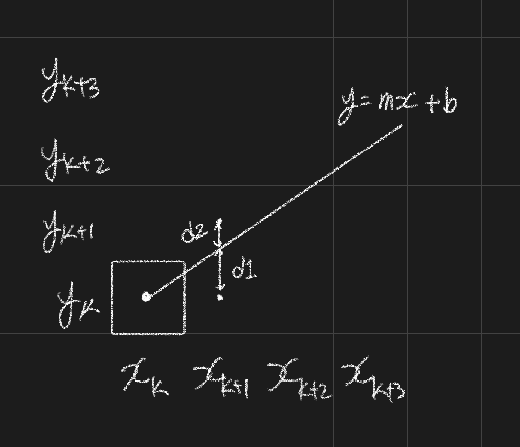

# 2D 직선

픽셀로 이루어진 화면에 직선을 그리기 위한 알고리즘이다. 만약에 직선을 그린다면 연속된 픽셀이 끊기지 않고 최대한 직선에 가깝게 표현되어야 한다. 픽셀의 중심이 좌표의 정수 부분이 된다.  

# DDA 알고리즘 (Digital Differential Analyzer Algorithm)

DDA 알고리즘은 양 끝점이 주어졌을 때 화면 위 직선을 그릴 수 있는 알고리즘이다.  

선의 양끝 점인 \begin{align}(X_a, Y_a)\end{align}, $$(X_b, Y_b)$$에서 다음과 같은 공식을 구하게 된다. 

$$
y = mx + c \\
m = \frac{y_b - y_a}{x_b - x_a} = \frac{\Delta x}{\Delta y}
$$

- 기울기 $m$이 $0 <= m <= 1$ 인 경우에는 $x$를 1씩 증가시킬 때 $y$는 기울기 값인 $m$만큼 증가한다.  
- 기울기 $m$이 1보다 큰 경우에 $x$를 1씩 증가시키면 $y$가 증가하는 $m$ 값이 1보다 크므로 픽셀의 사이가 멀어져 끊어진다. 따라서 $m$이 1보다 큰 경우에는 $x$를 증가시키지 않고 $y$를 1씩 증가시킨다.  

이러한 원칙을 적용하여 다음과 같이 공식을 유도할 수 있다.  

## 1. 초기화

$$\Delta x = x_b - x_a$$  
$\Delta y = y_b - y_a$  

$m = \frac{\Delta y}{\Delta x}$  

$x_1 = x_a$  
$y_1 = y_a$  

## 2. 연산

- $m$이 $0 <= m <= 1$인 경우, 매번 $K + 1$번째 점 $(1 \leq k \leq \Delta x)$ 에서  

$x_{K+1} = x_k + 1$  
$y_{K+1} = y_k + m$  
$y_{K+1}\ 's\ raster\ coordinate = Round(y_{k+1})$  

- $m$이 $-1 \geq m \ , \ m \geq 1$인 경우  

$y_{K+1} = y_k + 1$  
$x_{K+1} = x_k + 1/m$  
$x_{K+1}\ 's\ raster\ coordinate = Round(x_{k+1})$  

DDA 알고리즘은 증가하는 방향에 따라서 더하거나 빼서 알맞게 조정해서 사용할 수 있다. 하지만 소수점 계산을 해야하기 때문에 부담이 된다. 또한 매번 좌표를 구할 때마다 기울기 $m$ 또는 $1/m$을 더해서 반올림을 하기 때문에 오차가 누적되는 단점이 있다.  

# 브레젠헴 알고리즘 (Bresenham's Algorithm)

소수점 연산이 필요한 DDA 알고리즘의 단점을 브레젠헴 알고리즘으로 해결할 수 있다. 이 알고리즘에서는 소수점 계산없이 정수의 더하기 연산화 시프트 연산으로 처리되므로 더욱 빠르다. 이 알고리즘의 기본 개념은 다음과 같다.  

$y = mx + c$ 선에서 $m$이 $0 <= m <= 1$이라고 가정하면 선을 구성하고 있는 어느 한 점의 다음 점은 반드시 오른쪽 또는 오른쪽 바로 위의 점이 된다.  

위의 그림에서 보듯이 k번째 점인 $(x_k, y_k)$의 다음 점 $(x_{k+1}, y_{k+1})$은 $(x_{k} + 1, y_{k+1})$ 이거나 $(x_{k}+1, y_{k}+1)$ 이다.  

이때 어느 점인지 판별하는 방법은 원래의 선과 K+1번째 점과의 차를 구하여 결정한다. $d1$과 $d2$ 값을 구하고, 차이값을 빼는 판별식은 다음과 같다.  

$d_1 - d_2$  
$= \{m(x_k + 1) + c - y_k\} - \{y_k + 1 - m(x_k + 1) - c\}$  
$= 2m(x + 1) - 2y_k + 2c - 1$  

그리고 기울기 $m$의 값은 $m = \frac{\Delta y}{\Delta x}$이므로 양변에 $\Delta x$를 곱하여 다음과 같은 식을 만든다.    

$(d_1 - d_2) \Delta x = P_{k+1}$  

이를 판별식에 적용하면 다음과 같다.  

$P_{k+1}$  
$= 2 \Delta y (x_k + 1) + \Delta x (-2y_k + 2_c - 1)$  
$= 2 \Delta yx_k - 2 \Delta xy_k + 2 \Delta y + \Delta x(2_c - 1)$  

이 식에서 $P_{k+1}$에 $P_k$를 대입하면 $P_{k+1}$과 $P_k$의 관계식을 구할 수 있다.  

$P_k = 2 \Delta yx_{k-1} - 2 \Delta xy_{k-1} + 2 \Delta y + \Delta x (2c - 1)$  
$P_{k+1} - P_k = 2 \Delta y(x_k - x_{k-1}) - 2 \Delta x(y_k - y_{k-1})$  
$P_{k+1} = P_k + 2 \Delta y - 2 \Delta x (y_k - y_{k-1})$  

그리고 $(y_k - y_{k-1})$ 는 1또는 0이므로 다음과 같은 식을 2개 얻을 수 있다.  

$P_{k+1} = P_k + 2(\Delta y - \Delta x)$  
$P_{k+1} = P_k + 2 \Delta y$  

여기서 $2(\Delta y - \Delta x)$를 C1으로 하고, $2 \Delta y$를 C2로 하게 된다.  
선의 시작점은 $(x_a, y_a)$이므로 $P_{k+1}$의 공식으로부터 초기값 $P_1$을 다음과 같이 구한다.  

$P_1$  
$= 2 \Delta yx_a - 2 \Delta xy_a + 2 \Delta y + \Delta x(2c - 1)$  
$= 2 \Delta yx_a - 2 \Delta x(mx_a + c) + 2 \Delta y + \Delta x (2c - 1)$  
$= 2 \Delta yx_a - 2(\Delta yx_a + \Delta xc) + 2 \Delta y + \Delta x (2c - 1)$  
$= 2 \Delta y - \Delta x$  

이 식에서 초기값 $P1$을 알면 $P2$를 구할 수 있고, $P_{k+1}$은 $P_k$를 통해서 구할 수 있다.  
따라서 정리하게 되면 브레젠헴 선그리기 알고리즘은 다음과 같다. (기울기를 $0 \leq |m| \leq 1$로 가정)  

## 1. 초기화

시작점의 좌표를 $(x_1, y_1)$로 하고 계산한다.  

$C1 = 2(\Delta y - \Delta x)$  
$C2 = 2 \Delta y$  
$P_1 = 2 \Delta y - \Delta x$  

## 2. 연산

$d_1 - d_2$의 판별식에서 $P_k$ 값에 따라 다음 점의 위치를 아래와 같이 구할 수 있다. ( $1 \leq k \leq \Delta x$ )

$P_k \lt 0$ 이라면 다음 픽셀 점은 $(x_k + 1\ , y_k)$ 이며, $P_{k+1} = P_k + C_1$ 이다.  
$P_k \geq 0$ 이라면 다음 픽셀 점은 $(x_k + 1\ , y_k + 1)$ 이며, $P_{k+1} = P_k + C_2$ 이다.  

