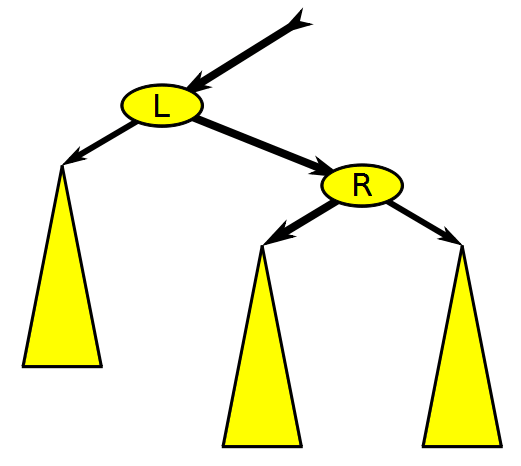

- [Containers](#containers)
	- [Requirements](#requirements)
	- [Implements](#implements)
	- [allocator](#allocator)
	- [iterator](#iterator)
	- [reverse_iterator](#reverse_iterator)
	- [vector](#vector)
	- [map](#map)
	- [Red-Black Tree](#red-black-tree)
		- [Rotation](#rotation)
		- [Insertion](#insertion)
			- [Recoloring](#recoloring)
			- [Restructuring](#restructuring)
				- [`G`노드 회전](#g노드-회전)
				- [`P`노드 회전](#p노드-회전)
		- [Deletion](#deletion)
	- [Problems](#problems)
		- [1. 템플릿 함수에서 템플릿 인자가 `iterator`인지 확인](#1-템플릿-함수에서-템플릿-인자가-iterator인지-확인)
			- [is_class : class 타입인지 확인하는 메타 함수](#is_class--class-타입인지-확인하는-메타-함수)
		- [2. vector의 저장 공간 관리](#2-vector의-저장-공간-관리)
			- [_TmpVector : vector의 메모리 재할당을 위한 클래스](#_tmpvector--vector의-메모리-재할당을-위한-클래스)


# Containers

이 프로젝트에서는 C++ STL의 몇 가지 컨테이너 타입을 구현한다. C++98 표준을 준수해야 하여 C++98 이후의 기능은 구현하지 않지만, 더 이상 사용하지 않는 C++98 기능은 구현해야 한다.  

## Requirements

- 메모리를 할당할 때 메모리 누수를 방지해야 한다. 
- 외부 라이브러리는 사용할 수 없다. C++11 및 Boost 라이브러리가 금지된다. 
- 각 헤더를 다른 헤더와 독립적으로 사용할 수 있도록 include guard를 추가해야 한다. 
- 네임 스페이스는 반드시 ft이어야 한다. 
- 사용된 내부 데이터 구조는 논리적이며 정당화되어야 한다. 
- 표준 컨테이너에서 제공되는 것보다 더 많은 public 기능을 구현할 수 없다.
- 컨테이너에 iterator 시스템이 있다면 구현해야 한다.
- std::allocator를 사용해야 한다.
- 비멤버 오버로드의 경우에 friend 키워드가 허용된다. 각 friend 키워드의 사용은 정당화되어야 한다.  
- map::value_compare를 구현해야하며 friend 키워드가 허용된다. 

## Implements

- [allocator](../../../docs/c%2B%2B/allocator)
  - allocator는 동적 메모리 할당을 관리하는데 필요한 기능이 정의된 객체이다.
  - STL은 사용자 지정 allocator가 제공되지 않으면 `std::allocator`를 사용한다.
- [iterator](../../../docs/c%2B%2B/iterator/README)
  - STL 컨테이너에 저장된 요소를 순회하며, 각각의 요소에 대한 접근을 제공한다.  
  - 컨테이너의 반복자는 iterator_category로 구별되며 5가지의 반복자 타입이 있다.  
- [enable_if](../../../docs/c%2B%2B/type_traits/enable_if.md)

- [vector](../../../docs/c%2B%2B/vector)
  - 순차적으로 엑세스할 수 있는 시퀀스 컨테이너이다.
- map
  - 빠르게 검색할 수 있도록 정렬된 연관 컨테이너이다.
- stack
  - 시퀀스 컨테이너에 대해 다른 인터페이스를 제공하는 컨테이너 어댑터이다.

## allocator

사용자 정의 allocator가 들어와도 std::allocator를 사용하는 경우와 같은 동작을 할 수 있는가?


## iterator

iterator는 컨테이너에 있는 요소를 가리키는 객체이다.  
기능에 따라서 5가지 iterator가 있으며 동일한 맴버 함수를 사용할 수 있다.  
맴버 함수는 모든 iterator 타입을 받지만 다르게 동작해야 하므로 컴파일 시점에 조건 처리를 한다.  
이때 속성 정보 클래스라는 개념을 사용한다.  
iterator_traits라는 속성 정보 클래스로 컴파일 시점에 iterator의 속성을 확인할 수 있다.  
컴파일 시점에 iterator_traits로 확인하는 속성을 모든 iterator가 가지고 있어야 한다.  
iterator_traits로 분별된 iterator는 각각의 iterator로 오버로드된 맴버함수를 호출한다.  

이 프로젝트에서 구현하는 컨테이너는 vector와 map이다.  
vector의 iterator_category는 random_access_iterator_tag이고,  
map의 iterator_category는 bidirectional_iterator_tag이다.  

## reverse_iterator

역방향 반복자는 반복자의 방향을 바꾸는 반복자 어댑터이다. 양방향 반복자가 역방향 반복자가 되면 끝에서 시작으로 이동하는 새로운 반복자를 생성한다. 반복자 `i`에서 생성된 역방향 반복자 `r`의 경우에 `&*r == &*(i-1)` 관계가 항상 `true`이다. 


## vector 

vector는 추가적인 메모리가 필요한 경우에 기존 크기의 2배로 메모리를 재할당한다.  
- 생성자에서는 생성해야하는 크기만큼 메모리 공간을 확보한다.
- 복사 할당자는 복사받는 데이터의 크기만큼 공간이 없는 경우에만 재할당한다.
- push_back으로 요소를 추가하는 경우에 메모리 크기를 확인하고, 2배로 늘린다.
- pop_back으로 요소를 제거하는 경우에는 메모리를 재할당하지 않는다.

멤버 함수를 위한 함수
- __destroy_end : new_end를 받고, old_end까지의 요소를 제거한다.
- __construct_end : 새로운 공간을 할당받고, 요소들을 위치시킨다.

- [벡터의 용량과 크기](https://thebook.io/006842/ch02/03/02/)  

## map

map은 key 값과 mapped 값이 쌍으로 저장되는 연관 컨테이너이다.  
두개의 값은 pair 타입으로 연결되며, compare 객체로 비교하여 정렬된다.  
각각의 pair는 key 값을 기준으로 정렬되어 저장된다.  
내부적으로 map은 red-black tree 구조로 요소들을 저장한다.  

## Red-Black Tree

레드-블랙 트리(Red-Black Tree)는 균형 이진 탐색 트리이다. 복잡한 자료구조이지만 효율적이고 우수한 실행 시간을 보인다. 트리에 n개의 요소가 있을때 O(log n)의 시간복잡도로 탐색, 삽입, 제거를 할 수 있다.  

이진 트리의 특수한 형태로 레드-블랙 트리는 각각의 자료를 노드에 저장한다.  
노드는 최대 두 개의 자식 노드를 가질 수 있고, 자식 노드도 최대 두 개의 자식 노드를 가질 수 있어서 이런식으로 계속 연결된다.  
어떤 노드에 자식 노드가 없다면 트리의 가장 자리에 있다고 하여 그 노드를 리프 노트라고 한다. 레드-블랙 트리의 리프 노드는 자료를 가지고 있지 않으며 비어 있다.  
보통 이진 탐색 트리에서 노드들은 다음과 같은 관계를 가지고 있다. 자신이 가진 자료는 자신의 왼쪽에 있는 노드가 가진 자료보다 크거나 같고, 자신의 오른쪽에 있는 노드가 가진 자료보다 작거나 같다.  

레드-블랙 트리는 각각의 노드가 `Red` 또는 `Black`인 색상 속성을 가지고 있는 이진 탐색 트리이다.  
다음과 같은 조건을 충족해야 유효한 레드-블랙 트리라고 한다.  
1. 노드는 `Red` 또는 `Black`이다.
2. 루트 노드는 `Black`이다.
3. 모든 리프 노드는 `Black`이다.
4. `Red` 노드의 자식 노드는 모두 `Black`이다.
5. 어떤 노드에서 시작하여 하위의 리프 노드에 도달하는 경로에 있는 `Black` 노드의 개수는 모두 같다. 

이러한 조건을 만족하면 레드-블랙 트리이며 개략적으로 균형이 잡힌다. 최악의 경우에 시간복잡도가 트리의 높이에 따라 결정되기 때문에 보통의 이진 탐색 트리보다 효율적이라고 할 수 있다.  
레드-블랙 트리의 특성을 만족하며 동작하기 위해서는 색 변환과 트리 회전이 필요하다. 삽입과 삭제가 복잡하게 동작하지만 복잡도는 여전히 O(log n)이다.  

### Rotation

레드-블랙 트리에서는 조건에 따라 노드의 구조를 회전하듯이 변경한다.  
회전은 어떠한 노드를 기준으로 왼쪽 혹은 오른쪽으로 이루어진다.  

```cpp
#define LEFT	0
#define RIGHT	1

enum color_t { BLACK, RED };

struct RBnode {
	RBnode* 		parent;
	RBnode* 		child[2];
	enum color_t	color;
	int				key;
}

struct RBtree {
	RBnode*	root;
}

RBnode* RotateDirRoot(
    RBtree* T,  // red–black tree
    RBnode* P,  // root of subtree (may be the root of T)
    int dir)    // dir ∈ { LEFT, RIGHT }
{
   RBnode* G = P->parent;
   RBnode* S = P->child[1 - dir];
   RBnode* C;

   assert(S != NIL); // pointer to true node required
   C = S->child[dir];
   P->child[1 - dir] = C; 
   if (C != NIL) {
      C->parent = P
   };
   S->child[  dir] = P; 
   P->parent = S;
   S->parent = G;
   if (G != NULL)
      G->child[ P == G->right ? RIGHT : LEFT ] = S;
   else
      T->root = S;
   return S; // new root of subtree
}

#define RotateDir(N,dir) RotateDirRoot(T,N,dir)
#define RotateLeft(N)    RotateDirRoot(T,N,LEFT)
#define RotateRight(N)   RotateDirRoot(T,N,RIGHT)
```





### Insertion

레드-블랙 트리의 삽입은 노드의 색상 속성을 `Red`로 정하며 시작한다. 단순 이진 탐색 트리에서 노드를 삽입하듯이 노드를 위치한다.  
그리고 주위 노드와의 관계를 확인하는데 삼촌 노드(uncle node) 개념을 도입한다. 삼촌 노드는 부모 노드 옆에 있는 노드이다.  
노드를 관계를 다음과 같이 명시하도록 한다. 삽입하는 노드는 `N`, N의 부모 노드를 `P`, P의 부모를 `G`, N의 삼촌 노드를 `U`로 나타내기로 한다.  

`Red`인 `P`노드에 `Red`인 `N`노드가 삽입되면 "`Red` 노드의 자식 노드는 모두 `Black`이다"라는 조건을 위반한다.  
이를 `Double Red`이라고 부르며 `U`노드의 색상에 따라서 해결방법이 달라진다.  

1. `U`노드가 `Red`인 경우 : Recoloring
2. `U`노드가 `Black`인 경우 : Restructuring

#### Recoloring

`Double Red`인 상황에서 삼촌인 `U`노드가 `Red`라면 `Recoloring`을 한다.  
`P`노드와 `U`노드를 `Black`으로 변경하고, 조부모인 `G`노드를 `Red`로 변경한다.  
색상을 변경한 이후에 `G`노드를 확인해야 한다. 다음과 같이 두 가지 상황이 있을 수 있다.  

1. `G`노드가 `root`인 경우 : `G`노드를 `Black`으로 변경
2. `G`노드로 인해 `Double Red`가 발생된 경우 : `G`노드의 상위 노드에 대하여 `Recoloring` 또는 `Restructuring`을 진행

두 번째 상황은 `G`노드의 부모 노드의 색상이 `Red`인 경우이다. `Double Red`가 발생되기 때문에 `N`노드을 삽입할 때 발생한 경우와 마찬가지로 처리하면 된다.  

#### Restructuring

`Double Red`인 상황에서 삼촌인 `U`노드가 `Black`이라면 `Restructuring`을 한다.  
다음에 나오는 방향은 `U`노드가 `G`노드의 왼쪽 자식이라고 가정한 경우이다. 만약에 오른쪽 자식이라면 방향을 반전시켜야 한다.  

`Restructuring`은 부모인 `P`노드의 어느 쪽에 `N`노드가 연결되어 있는지에 따라서 달라진다.  

1. `N`노드가 `P`노드의 오른쪽인 경우 : `G`노드 회전
2. `N`노드가 `P`노드의 왼쪽인 경우 : `P`노드 회전 후 `G`노드 회전

##### `G`노드 회전

`G`노드는 `U`노드의 위치로 이동하고, `P`노드는 기존 `G`노드의 위치로 이동하여 반시계 방향으로 회전하듯이 위치가 변경된다.  

1. `G`노드를 `P`노드의 왼쪽 자식으로 연결
2. 기존 `P`노드의 왼쪽 자식은 `G`노드의 오른쪽 자식으로 연결
3. 노드의 색상을 변경한다. `G`노드는 `Red`, `P`노드는 `Black`
   
##### `P`노드 회전

`P`노드는 `N`노드의 오른쪽으로 이동하고, `N`노드는 기존 `P`노드의 위치로 이동하여 시계 방향으로 회전하듯이 위치가 변경된다.

1. `P`노드를 `N`노드의 오른쪽 자식으로 연결
2. 만약에 기존 `N`노드의 오른쪽에 자식이 있었다면 `P`노드의 왼쪽에 연결
3. `N`노드를 `P`노드가 연결되어 있던 `G`노드의 오른쪽에 연결

위의 과정을 마치면 `G`노드 회전을 해야하는 조건이 만들어지므로 다시 한번 회전시킨다.  


### Deletion

레드-블랙 트리의 삭제는 기본적으로 이진 탐색 트리의 삭제를 기반한다.  
이진 탐색 트리와 같이 노드를 삭제한 후에 레드-블랙 트리의 규칙을 복원하는 과정이 필요할 수 있다.  
삭제되는 노드의 색상이 `Red`라면 아무 문제가 없지만 `Black`이라면 레드-블랙 트리 규칙에서 벗어나기 때문이다. 
삭제하려는 노드를 `M`, 자리를 대체하는 노드를 `C`, 삭제하려는 노드의 형제를 `S`라고 나타내기로 한다.   
`Black`노드를 제거하여 규칙에서 벗어나는 상황은 다음과 같다.  

1. `C`가 `Red`인 경우 : `C`의 색상을 `Black`으로 변경
2. `C`가 `Black`인 경우 : `Double Black` 처리

`C`가 `Black`이라면 레드-블랙 트리의 다섯번째 조건를 위반하기 때문에 구조를 변경하여 조건을 충족시켜야 한다.  
삭제하려는 노드의 형제인 `S`의 왼쪽 자식을 `SL`, 오른쪽 자식을 `SR`이라고 나타내기로 하며, `C`가 `S`의 왼쪽에 있다고 가정한다.  
다음과 같이 상황에 따라서 `Double Black`를 해결하는 방법이 다르다. 또한, 밸런스를 복구하는 작업은 루트에 도달하기 전까지 계속될 수 있다.  

1. `S`가 `Red`인 경우

```cpp
if (s.color == RED)
    s.color = BLACK
    c.p.color = RED
    left_rotate(x.p)
    s = x.p.right
```

2. `S`가 `Black`이고, `SL`, `SR`이 모두 `Black`인 경우

```cpp
if (s.left.color == BLACK && s.right.color == BLACK)
    s.color = RED
    c = c.p
```

3. `S`가 `Black`이고, `SL`은 `Red`, `SR`은 `Black`인 경우

```cpp
if (s.right.color == BLACK)
    s.left.color = BLACK
    s.color = RED
    right_rotate(s)
    s = c.p.right
```

4. `S`가 `Black`이고, `SR`이 `Red`인 경우

```cpp
s.color = c.p.color
c.p.color = BLACK
s.right.color = BLACK
left_rotate(c.p)
c = root
```


## Problems

### 1. 템플릿 함수에서 템플릿 인자가 `iterator`인지 확인
- 템플릿 인자에 `iterator_category`가 정의되어 있는지 확인하면 된다. 
- `iterator`는 `iterator_category`로 구분된다.
- `T::iterator_category`로 확인하면 맴버가 없는 경우에 오류가 발생된다.  
- 맴버를 확인하면 오류가 발생되므로 타입별로 오버로딩하는 방법을 사용할 수 없다. 

#### is_class : class 타입인지 확인하는 메타 함수

- 참조 링크 : [템플릿 프로그래밍](https://modoocode.com/295)  

`<type_traits>`에 있는 메타 함수 중에 `is_class`가 있다. 이 함수는 어떤 타입 `T`가 클래스인지 아닌지 확인한다.  

```cpp
namespace detail {
template <class T>
char test(int T::*);
struct two {
  char c[2];
};
template <class T>
two test(...);
}  // namespace detail

template <class T>
struct is_class
    : std::integral_constant<bool, sizeof(detail::test<T>(0)) == 1 &&
                                     !std::is_union<T>::value> {};
```

위의 예제 코드에서 `std::integral_constant`의 값은 템플릿 인자에 따라서 달라진다. 만약에 두번째 인자가 `true`가 되어서 `std::integral_constant<bool, true>`이면 `true`인 클래스가 된다.  

```cpp 
sizeof(detail::test<T>(0)) == 1 && !std::is_union<T>::value
```

즉, 위의 부분이 `true`이면 타입이 클래스라고 할 수 있다. `sizeof(detail::test<T>(0)) == 1` 부분이 중요하며 여기에서 클래스인지 아닌지 나뉜다. `detail` 네임스페이스에는 두개의 `test` 함수가 오버로드되어 인자에 따라서 호출되는 함수가 다르게 된다.  

첫번째 함수인 `char test(int T::*);`는 클래스가 아니라면 오버로드 후보에서 제외된다. `T::*`는 데이터 멤버를 가리키는 포인터이기 때문에 클래스에서만 사용할 수 있기 때문이다. 해당 클래스에 `int` 데이터 멤버가 없어도 유효한 문장이다.  

두번째 함수인 `two test(...);`는 타입에 상관없이 인스턴스화되며 `struct two { char c[2] };`에 의해서 `sizeof`가 2가 된다. 그러므로 클래스가 아니라면 `sizeof(detail::test<T>(0)) == 1`에서 `false`가 된다.  


### 2. vector의 저장 공간 관리
- 새로운 요소를 추가하는 경우에 저장 공간을 확인하고, 저장 공간이 부족하다면 2배로 확장한다.
- 저장 공간 크기를 변경하는 함수는 다음과 같다.
- push_back, insert, resize, reserve, assign
- 저장 공간 크기를 변경할 때마다 사용되는 변수와 함수를 포함하는 클래스를 구현한다.

#### _TmpVector : vector의 메모리 재할당을 위한 클래스
- _TmpVector : vector의 저장 공간 크기을 변경하기 위한 임시 객체이다. 
  - __begin, __end, __end_mem : 할당받은 메모리 주소를 저장한다.
  - _TmpVector : 생성해야하는 저장 공간의 크기와 새로운 요소를 받아서 메모리를 할당받는다.
  - ~_TmpVector : 메모리의 데이터를 소멸시키고, 메모리 공간을 해제한다.
  - insert_end(iter, iter) : 두 반복자를 인자로 받아서 끝에서 부터 요소를 추가한다.
  - insert_end(ele) : 하나의 요소를 받아서 끝에 추가한다.
  - move(vec) : vector와 메모리 주소를 교환한다.
  - swap(ptr, ptr) : 두 주소를 교환한다.


