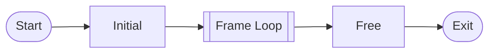
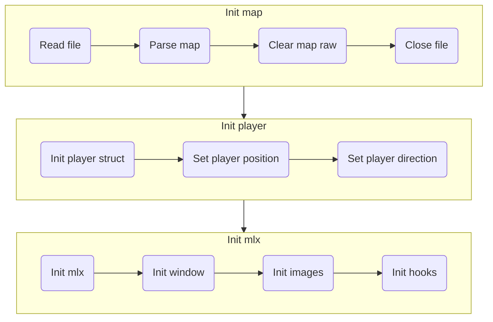
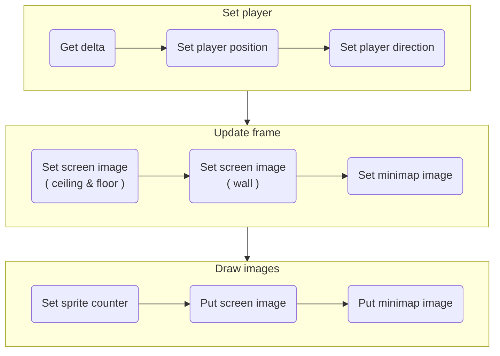

* [Cub3D](#cub3d)
  * [Constraints](#constraints)
  * [Implements](#implements)
  * [Logics](#logics)
    * [Flow chart](#flow-chart)
      * [Initial](#initial)
      * [Frame Loop](#frame-loop)
    * [Ray Casting](#ray-casting)
    * [DDA Algorithm](#dda-algorithm)
    * [Perpendicular Distance](#perpendicular-distance)
    * [Textured Walls](#textured-walls)
    * [미니맵 선 그리기](#미니맵-선-그리기)


# Cub3D 

<br/>

90년대에 세계적으로 유명했던 FPS게임인 [Wolfenstein 3D game](http://users.atw.hu/wolf3d/)에서 영감을 받은 프로젝트이다. Ray-Casting으로 1인칭 시점의 현실적인 3D 그래픽 표현을 만든다.  

## Constraints

- 주어진 miniLibX를 사용한다. 다른 창으로 변경, 최소화 등 창 관리가 원활하게 유지되어야 한다.  
- 벽이 향하는 면에 따라서 다른 텍스쳐의 벽을 표시해야 한다.  
- 바닥과 천장 색상을 두가지 다른 색상으로 설정해야 한다.  
- 프로그램은 창에 이미지를 표시하고 다음 규칙을 따른다.
  - 키보드의 왼쪽 및 오른쪽 화살표 키를 사용하여 미로에서 왼쪽과 오른쪽을 볼 수 있어야 한다.
  - WASD 키를 사용하여 시점을 이동할 수 있어야 한다.
  - ESC 키를 누르면 창을 닫고 프로그램을 완전히 종료한다. 
  - 창 프레임의 빨간색 십자가를 클릭하면 창을 닫고 프로그램을 완전히 종료해야 한다.  
- 프로그램은 확장자가 .cub인 장면 설명 파일을 첫번째 인수로 받는다. 
  - 지도는 6개의 가능한 문자로만 구성되어야 한다. 
  - 빈 공간은 0, 벽은 1, 플레이어의 시작 위치 및 생성 방향은 N,S,E 또는 W이다.
  - 지도는 벽으로 둘러싸여 있어야 하며 그렇지 않은 경우 프로그램에서 오류를 반환해야 한다.
  - 지도 콘텐츠를 제외하고 각 요소 유형은 하나 이상의 빈 줄로 구분할 수 있다.
  - 항상 마지막에 있어야 하는 지도 콘텐츠를 제외하고 각 요소 유형은 파일에서 임의의 순서로 설정할 수 있다.
  - 맵을 제외하고 요소의 각 정보 유형은 하나 이상의 공백으로 구분할 수 있다.
  - 맵은 파일에서 보이는 대로 구문 분석되어야 한다. 
  - 공간은 지도의 유효한 부분이며 처리는 마음대로 할 수 있다. 
  - 지도의 규칙을 준수하는 한 모든 종류의 지도를 구문 분석할 수 있어야 합니다.
  - 각 요소(지도 제외)의 첫 번째 정보는 유형 식별자(하나 또는 두 개의 문자로 구성됨)이고 다음과 같이 엄격한 순서로 각 객체에 대한 모든 특정 정보가 온다.
  - 파일에서 잘못된 구성이 발견되면 프로그램이 제대로 종료되고 "error\n" 다음에 선택한 명시적 오류 메시지가 반환되어야 한다.
- 아래는 .cub 파일의 예시이다.
```
NO ./path_to_the_north_texture
SO ./path_to_the_south_texture
WE ./path_to_the_west_texture
EA ./path_to_the_east_texture
F 220,100,0
C 225,30,0
        1111111111111111111111111
        1000000000110000000000001
        1011000001110000000000001
        1001000000000000000000001
111111111011000001110000000000001
100000000011000001110111111111111
11110111111111011100000010001
11110111111111011101010010001
11000000110101011100000010001
10000000000000001100000010001
10000000000000001101010010001
11000001110101011111011110N0111
11110111 1110101 101111010001
11111111 1111111 111111111111
```

## Implements

- `.cub` 맵 파일 파싱
- Ray-casting으로 벽 그리기
- Bresenham 알고리즘으로 미니맵 그리기
- 입력 키로 플레이어 움직이기

## Logics


### Flow chart



#### Initial



#### Frame Loop



### Ray Casting

2차원 맵에서 3차원 원근감을 만드는 렌더링 기술이다. 

원근감을 만들기 위해서 플레이어와 벽의 거리를 구한다.

- 2차원 정사각형 그리드 맵이 있고, 플레이어 위치에서 시작하는 광선을 그린다.
- 광선은 벽에 부딪힐때까지 직진하고, 충돌지점으로부터 플레이어까지의 거리를 구한다.
- 거리에 따라서 화면에 출력되는 벽의 높이가 결정된다. 거리가 멀면 낮게, 가까우면 높게 출력된다.

### DDA Algorithm

DDA 알고리즘은 증분 알고리즘 중 하나이다. 

2차원 그리드를 지나가는 선이 어떤 네모칸과 부딪히는지 찾을 때 사용되는 알고리즘이다. 

선이 지나가는 x축과 y축을 확인하여 벽에 충돌했는지 확인한다. 

- 현재 닿은 x축과 다음에 닿을 x축의 간격을 구한다. y축의 간격도 구한다.
- 현재 닿은 축에서 다음에 닿을 축의 간격은 그 다음의 간격과 같다.
- 이 간격을 누적하여 벽에 충돌되었는지 확인할 수 있다.

### Perpendicular Distance

광선이 충돌된 벽을 화면에 그리기 위해 수직 거리를 구한다.

플레이어 위치를 중심으로 방사된 광선의 길이로 벽을 그린다면 화면이 왜곡되어 보인다. 

- 플레이어가 벽을 마주보고 있음에도 광선의 길이가 다르기 때문에 어안렌즈 효과가 발생된다.
- 어안렌즈 효과를 방지하기 위해 거리측정을 다른 방식으로 한다.
- 충돌지점에서 플레이어까지의 거리가 아니라 충돌지점에서 카메라 평면까지의 수직거리를 측정한다.

### Textured Walls

화면에 그릴 픽셀 색상 값을 구하기 위해 광선이 충돌된 벽의 텍스쳐를 참조한다.

벽에서 충돌지점을 확인하고 해당 위치의 텍스쳐 픽셀 색상 값을 가져온다.

- 충돌된 벽의 텍스쳐 이미지 데이터는 2차원 배열이다.
- 벽에서 충돌 지점의 x좌표를 구하고, 텍스쳐 데이터에서 x좌표에 해당되는 모든 픽셀을 가져온다.
- 가져온 픽셀 색상 값을 화면에 표시한다.

### 미니맵 선 그리기

브레젠험 알고리즘으로 픽셀 화면에 직선을 그릴 수 있다.  
하지만 기울기가 1이하를 가정한 알고리즘이기 때문에 여러 상황에 따른 처리가 필요하다.  
기울기에 따라서 다음과 같이 연산을 다르게 되어야 한다.  
- m < 1: x를 1씩 증가
- m >= 1: y를 1씩 증가

또한 직선의 시작점을 원점으로 나뉜 사분면에 따라 다르게 연산되어야 한다.  
1사분면과 3사분면에 맞게 알고리즘을 설정하고, 시작점과 끝점을 바꾸는 방식으로 다른 사분면을 처리한다.  
1사분면을 뒤집어서 4사분면을 그리고, 3사분면을 뒤집어서 2사분면을 그릴 수 있다.  

- 1, 4: x 증가, y 증가
- 2, 3: x 증가, y 감소 또는 x 감소, y 증가 (기울기에 따라서)
