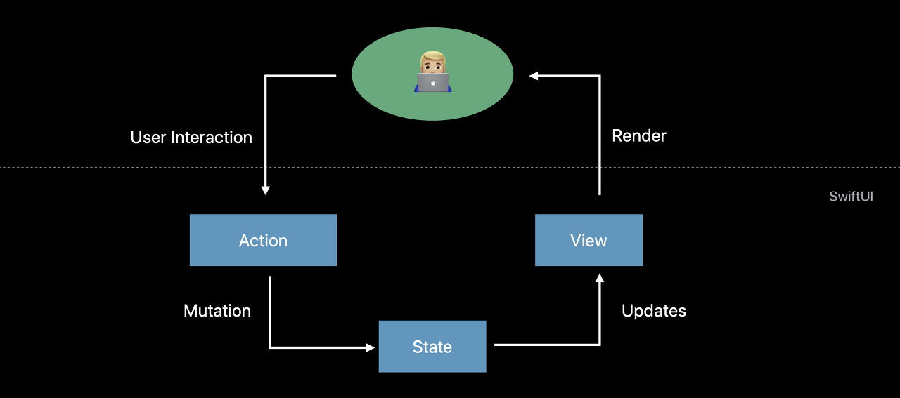
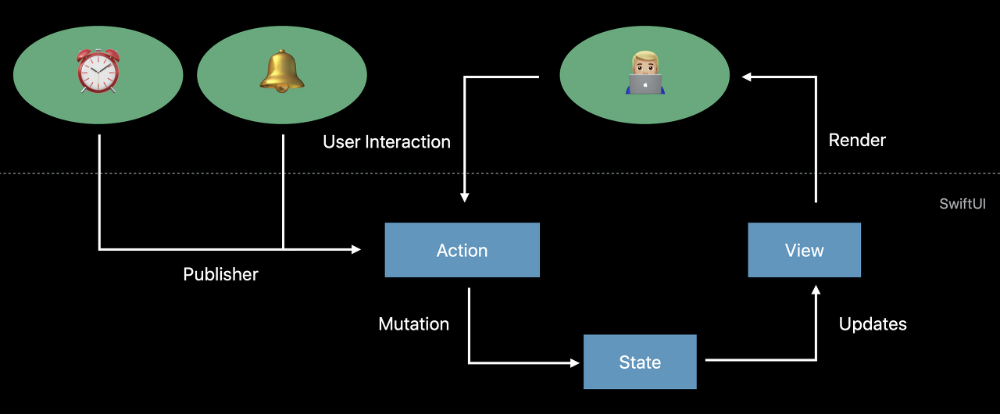
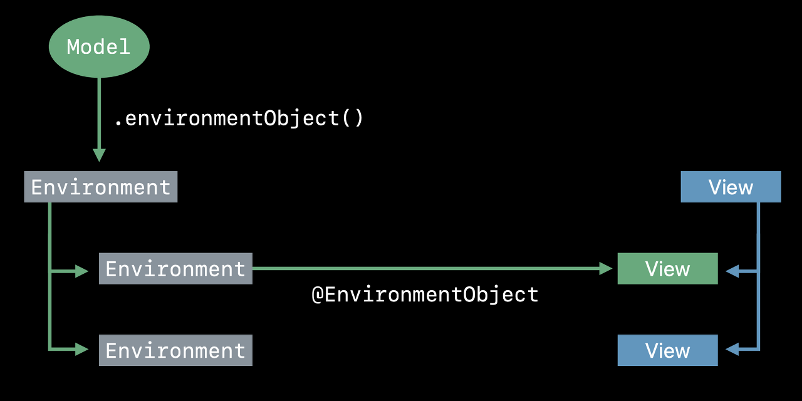
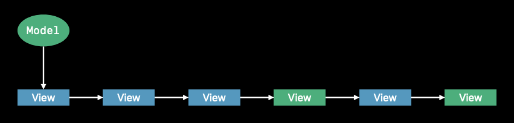
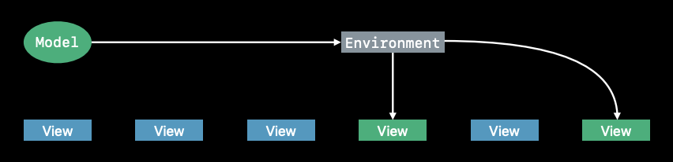
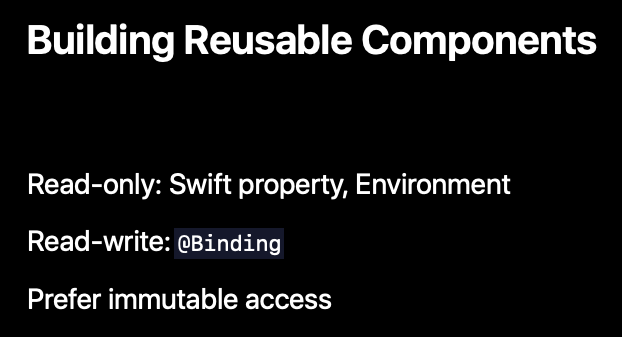

* [Architecture](#architecture)
* [SwiftUI Data Flow](#swiftui-data-flow)
	* [1. View에서 데이터를 읽을 때마다, View에는 데이터에 대한 의존이 발생된다.](#1-view에서-데이터를-읽을-때마다-view에는-데이터에-대한-의존이-발생된다)
	* [2. View의 계층에서 읽어들이는 모든 데이터들은 Source of Truth를 가진다.](#2-view의-계층에서-읽어들이는-모든-데이터들은-source-of-truth를-가진다)
	* [@State](#state)
	* [@Binding](#binding)
	* [External Change](#external-change)
		* [ObservableObject Protocol](#observableobject-protocol)
		* [@ObservedObject](#observedobject)
		* [@EnvironmentObject](#environmentobject)
		* [언제 무엇을 사용해야 하는가?](#언제-무엇을-사용해야-하는가)
	* [Source of Truth](#source-of-truth)
	* [Reusable Components](#reusable-components)
* [참조 링크](#참조-링크)

# Architecture

프로젝트에 맞는 아키텍처를 선택하기 위해서 검색해보니 다양한 아키텍처가 있었다. 이들은 모두 `관심사 분리`라는 공통된 목적을 가지고 있으며 `의존성 규칙`으로 기능하게 된다.  

`관심사 분리`로 기능을 관심사에 따라서 독립적으로 개발한 뒤에 조합한다. 독립된 특정 기능에 집중하기 때문에 코드를 파악하기 수월하고, 기능을 변경하거나 추가하기 쉽다. 기능을 조합할 때에는 의존성이 저수준에서 고수준으로 향하는 `의존성 규칙`을 지켜야 한다. 이를 통해서 업무 로직(고수준 정책)은 세부 사항(저수준 정책)의 변경에 영향을 받지 않도록 할 수 있다.  


# SwiftUI Data Flow

두 가지 개념을 통해서 SwiftUI를 이해할 수 있다.  

1. View에서 데이터를 읽을 때마다, View에는 데이터에 대한 의존이 발생된다.
2. View의 계층에서 읽어들이는 모든 데이터들은 Source of Truth를 가진다.

## 1. View에서 데이터를 읽을 때마다, View에는 데이터에 대한 의존이 발생된다.

SwiftUI 프레임 워크는 데이터가 변경을 감지하고, 새로운 값으로 UI를 업데이트한다. 그렇기 때문에 더 이상 데이터와 뷰의 동기화를 따로 해줄 필요가 없다.  

## 2. View의 계층에서 읽어들이는 모든 데이터들은 Source of Truth를 가진다.

View에서 읽는 데이터들은 결국 하나의 원천을 가진다. 만약에 하위의 여러 View에서 사용되는 데이터가 중복되어 존재한다면 직접 싱크를 맞추어야 한다. 이는 일관된 UI를 유지하기 힘들다. 그러므로 상위의 View에 데이터를 모으고, 하위의 View들이 그 데이터를 참조하게 만들면 데이터의 일관성을 지킬 수 있다.  

## @State

Property Wrapper인 `@State`가 있다. 프로퍼티에 적용하면 시스템은 이 프로퍼티의 값이 변경될 수 있으며, 값에 따라서 `self`의 상태도 변경될 수 있다고 받아들인다. View는 계속 재생성되지만 프로퍼티를 의존성으로 추적하여 저장공간을 유지해준다.  

`@State`로 인해 View는 더 이상 연속된 이벤트의 집합이 아니라 상태를 가지는 함수가 되었다. 그리고 `@State`로 정의된 프로퍼티는 `private`으로 선언되기 때문에 하나의 `Source of Truth`가 새롭게 정의되는 것과 마찬가지이다.  

## @Binding

`@Binding`으로 상위 View에서 `@State`로 정의된 프로퍼티를 하위 View에서 참조할 수 있다. 하위의 View는 `@State` 프로퍼티를 소유하지 않고도 읽거나 변경할 수 있다. 프레임 워크에서 제공하는 컴포넌트를 보면 `@Binding`으로 구현되어서 값이 변경될 때 자동으로 UI가 업데이트된다.  

이전에는 직접적으로 View 계층을 변경하는 방법으로 이벤트에 응답했었다. 예를 들어 유저 인터랙션이 발생될 때마다 직접 subView을 추가, 제거하거나 View의 알파값을 변경하는 코드를 실행하는 방식이었다. SwiftUI는 단순히 상태(State)를 변경하면 View가 업데이트된다. 

  

## External Change

SwiftUI 외부의 이벤트도 State를 변화시킨다. 외부에서 발생하더라도 결과적으로 유저의 인터랙션과 차이가 없다. SwiftUI에서는 외부 이벤트를 Pulisher라고 하며, `Combine` 프레임 워크로부터 발생된다.  

  

### ObservableObject Protocol

`ObservableObject`는 관리 중인 Model이 있을 경우, Model과 View의 동기화를 편하게 만들어주는 프로토콜들이다. 만약에 데이터가 변경되고, 그 상태를 외부에서 감지할 필요가 있는 모델이라면 `ObservableObject` 프로토콜을 따르도록 하면 된다. 예를 들어 팟캐스트 플레이어를 아이폰과 아이패드에서 이어서 들을 수 있도록하는 경우에 `ObservableObject`를 사용하면 간단하게 구현될 수 있다. 다음 코드에서는 `objectWillChange` 프로퍼티에 `PassthroughSubject`라는 `Publisher`를 정의하였고, 데이터가 변경되는 `advance()` 메소드 안에서 `Publisher`의 `send()`를 호출해주고 있다. 이 `Publisher`를 `subscribe`하여 데이터의 변경 시점을 정확히 알 수 있게 된다.  

```swift
class PodcastPlayerStore {
    var currentTime: TimeInterval
    var isPlaying: Bool
    var currentEpisode: Episode
    
    var objectWillChange = PassthroughSubject<Void, Never>()
    
    func advance() {
        self.currentEpisode = nextEpisode
        self.currentTIme = 0.0
        // Notify subscribers that the player changed
        self.objectWillChange.send()
    }
}
```

### @ObservedObject

View는 `@ObservedObject`라는 Property Wrapper를 사용하여 `ObservableObject` Model에 의존할 수 있다. `@State`와 같이 Model이 변경될 때 View가 알아서 변경된다. 다음은 Model의 상태가 변경될 때 자동으로 View를 업데이트한다.  

```swift
struct MyView: View {
    @ObservedObject var model: PodcastPlayerStore
    ...
}

MyView(model: modelInstance)
```

### @EnvironmentObject

SwiftUI의 `@EnvironmentObject`는 View 계층에 데이터를 넣어주는 캡슐화 방법이다.  

  

`.environmentObject(_:)`를 통해서 Model을 Environment로 만들고, View에서 `@Environment` Property Wrapper를 붙여서 Model에 대한 의존성을 정의할 수 있다. `ObservedObject`와 마찬가지로 상태가 변경될 때마다 자동으로 View를 업데이트한다.  

### 언제 무엇을 사용해야 하는가?

기본적으로 `@ObservedObject`를 사용하지만, Model의 변경이 여러 View를 거쳐서 전달되는 경우에는 `@EnvironmentObject`를 사용한다. 예를 들면 다음과 같은 View 계층이 있을 수 있다.  

  

Model의 변경을 알아야하는 View에 `@EnvironmentObject`를 사용하여 처리할 수 있다.  

  


## Source of Truth

SwiftUI에서 Source of Truth 방법은 다음과 같이 나누어 볼 수 있다.  

  


## Reusable Components

재사용 가능한 컴포넌트를 만드는 경우에는 사용하는 데이터에 따라서 나뉠 수 있다.  

  


# 참조 링크
- [더 나은 객체지향 개발을 위한 아이디어: 관심사의 분리부터 제어의 역전까지](https://teamdable.github.io/techblog/SoC-to-IoC#:~:text=%ED%8A%B9%EC%A0%95%ED%95%9C%20%EA%B4%80%EC%8B%AC%EC%82%AC%EC%97%90%20%EB%94%B0%EB%9D%BC%20%EA%B8%B0%EB%8A%A5,concerns%2C%20SoC)  
- [Data Flow Though SwiftUI](https://wlaxhrl.tistory.com/91)  
- [SwiftUI에서 MVVM 사용을 멈춰야 하는가?](https://green1229.tistory.com/267)  
- [iOS 아키텍처 패턴 VIPER](https://bugle.tistory.com/48)  
- [Composable Architecture](https://green1229.tistory.com/138)  
- [The Clean Architecture 번역](https://blog.coderifleman.com/2017/12/18/the-clean-architecture/)  
- [주니어 개발자의 클린 아키텍처 맛보기](https://techblog.woowahan.com/2647/)  
- [SwiftUI를 위한 클린 아키텍처](https://gon125.github.io/posts/SwiftUI%EB%A5%BC-%EC%9C%84%ED%95%9C-%ED%81%B4%EB%A6%B0-%EC%95%84%ED%82%A4%ED%85%8D%EC%B2%98/)  

