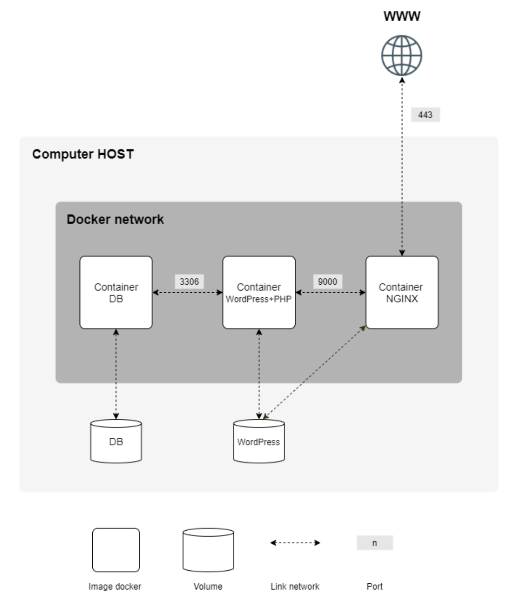
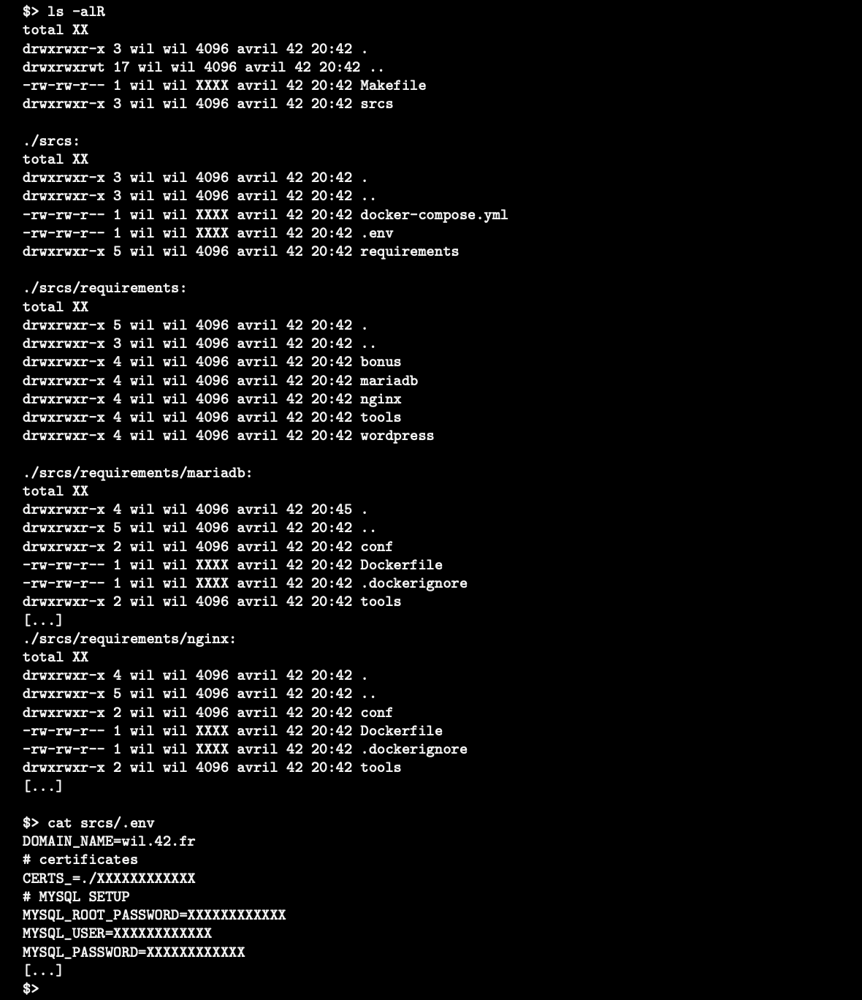

* [Inception](#inception)
* [Todos](#todos)
* [Dockerfile](#dockerfile)
  * [Base image : alpine Linux](#base-image--alpine-linux)
  * [MariaDB](#mariadb)
    * [mysql 원격 접속 설정](#mysql-원격-접속-설정)
      * [외부 유저 생성](#외부-유저-생성)
      * [mysql 설정 수정](#mysql-설정-수정)
    * [mysqld\_safe 실행 오류](#mysqld_safe-실행-오류)
  * [Nginx](#nginx)
    * [nginx.conf](#nginxconf)
    * [openssl](#openssl)
    * [nginx 컨테이너 실행 오류](#nginx-컨테이너-실행-오류)
* [docker-compose.yaml](#docker-composeyaml)
  * [volumes](#volumes)
    * [mysql 볼륨](#mysql-볼륨)
    * [wordpress, nginx 볼륨](#wordpress-nginx-볼륨)
  * [networks](#networks)

# Inception

이 프로젝트는 Docker를 사용하여 시스템 관리에 대한 지식을 넓히는 것을 목표로 한다. 여러 Docker 이미지를 가상화하여 새 개인용 가상 머신에 만든다.  

- 이 프로젝트는 가상 머신에서 완료되어야 한다.
- 구성에 필요한 모든 파일은 srcs 폴더에 있어야 한다.
- Makefile도 필요하며 디렉터리의 루트에 있어야 한다. 전체 애플리케이션을 설정해야 한다. 즉, docker-compose.yml을 사용하여 Docker 이미지를 빌드해야 한다.  

이 프로젝트는 특정 규칙에 따라 다양한 서비스로 구성된 소규모 인프라를 설정하는 것으로 구성된다. 전체 프로젝트는 가상 머신에서 수행되어야 한다. docker-compose를 사용해야 한다.  

각 Docker 이미지는 해당 서비스와 이름이 같아야 한다. 각 서비스는 전용 컨테이너에서 실행되어야 한다. 성능 문제의 경우 컨테이너는 Alpine Linux의 두 번째 안정 버전 또는 Debian Buster에서 빌드해야 한다.  
또한 서비스당 하나씩 자체 Dockerfile을 작성해야 한다. Dockerfile은 Makefile에 의해 docker-compose.yml에서 호출되어야 한다.  
즉, 프로젝트의 Docker 이미지를 직접 빌드해야 한다. 그런 다음 DockerHub(이 규칙에서 Alpine/Debian은 제외됨)와 같은 서비스를 사용하는 것뿐만 아니라 기성품 Docker 이미지를 가져오는 것이 금지된다.  

그리고 다음을 설정해야 한다.

- TLSv1.2 또는 TLSv1.3만 있는 NGINX를 포함하는 Docker 컨테이너
- NGINX 없이 WordPress + php-fpm만 포함하는 Docker 컨테이너(설치 및 구성해야함)
- NGINX 없이 MariaDB만 포함하는 Docker 컨테이너
- WordPress 데이터베이스가 포함된 볼륨
- WordPress 웹 사이트 파일이 포함된 두 번째 볼륨
- 컨테이너 간의 연결을 설정하는 Docker-network이며, 충돌이 발생할 경우 컨테이너를 다시 시작해야 한다.
  
> Docker 컨테이너는 가상 머신이 아니다. 따라서 실행하려고 할 때 'tail -f' 등을 기반으로 하는 해키 패치를 사용하지 않는 것이 좋다. 데몬이 어떻게 동작하는지 읽어보고, 데몬을 사용하는 것이 좋은지 생각해보아야 한다.  

> 네트워크 라인은 docker-compose.yml 파일에 있어야 합니다. host 또는 -link, links를 사용하는 것은 금지되어 있다. 무한 루프를 실행하는 명령으로 컨테이너를 시작하면 안된다. 따라서 이는 entrypoint로 사용되거나 entrypoint script에서 사용되는 모든 명령에도 적용된다. 다음은 금지된 해키 패치이다. tail -f, bash, sleep infinity, while true.

> PID 1 및 Dockerfile 작성 모범 사례에 대해 읽어보자.

WordPress 데이터베이스에는 두 명의 사용자가 있어야 하며, 그 중 한 명은 관리자이다. 관리자의 사용자 이름에는 admin/Admin 또는 administrator/Administrator가 포함될 수 없다.

> Docker를 사용하는 호스트 시스템의 /home/login/data 폴더에서 볼륨을 사용할 수 있다. 물론 로그인을 본인의 것으로 교체해야 한다.

작업을 더 간단하게 하려면 로컬 IP 주소를 가리키도록 도메인 이름을 구성해야 한다.  
이 도메인 이름은 login.42.ft이어야 한다. 반드시 자신의 로그인을 사용해야 한다. 예를 들어, 로그인인 wil인 경우에 wil.42.fr은 wil의 웹사이트를 가리키는 IP 주소로 리디렉션된다.  

> 최신 태그는 금지되어 있다. Dockerfile에 암호가 없어야 한다. 환경 변수를 사용하는 것은 필수이다. 또한, .env 파일을 사용하여 환경 변수를 저장하는 것이 좋다. .env 파일을 srcs 디렉토리의 루트에 있어야 한다. NGINX 컨테이너는 TLSv1.2 또는 TLSv1.3 프로토콜을 사용하여 포트 443가 인프라에 대한 유일한 진입점이어야 한다.

다음은 예상되는 결과의 다이어그램이다.  

  

아래는 예상되는 결과의 디렉터리 구조이다.  

  


# Todos

- [ ] [Dockerfile 작성](#dockerfile)
  - [x] [MariaDB](#MariaDB)
    - [x] [원격 접속 설정](#mysql-원격-접속-설정)
      - [x] [외부 유저 생성](#외부-유저-생성)
      - [x] [mysql 설정 수정](#mysql-설정-수정)
  - [ ] [Nginx](#nginx)
    - [ ] nginx.conf 파일
    - [ ] open ssl 인증서
  - [ ] WordPress
- [ ] [docker-compose.yml 작성](#docker-composeyaml)
  - [ ] [volumes](#volumes)
  - [ ] [Docker-network 컨테이너 간의 연결 설정](#networks)
- [ ] WordPress 데이터 베이스 사용자 이름 설정
- [ ] 호스트 시스템 로그인 설정
- [ ] Nginx 컨테이너 entrypoint port
- [ ] Makefile 작성

# Dockerfile

## Base image : alpine Linux

리눅스 커널을 기반으로 한 리눅스 배포판 가운데 하나이다. Musl과 BusyBox를 기반하고 있다. alpine linux는 작고, 보안이 뛰어나고, 간단함을 염두하여 만들어졌다. 이 장점이 두드러져서 배포판의 용량이 커널을 제외하고 8MB 밖에 되지 않으며, 수많은 패키지들을 설치할 수 있다.  

기본적으로 다른 리눅스 배포판보다 훨씬 가볍고 깔끔한 것이 장점이기 때문에 Docker 컨테이너에 사용되는 예시가 많고 유명하다. 주로 호스트 환경보다 특정 애플리케이션을 서비스하는 컨테이너 환경에서 사용할 수 있으면 되기 대문에 미러 서버의 규모가 다른 배포판에 비해 크지는 않다. 

## MariaDB

### mysql 원격 접속 설정

mysql은 설치시 기본으로 로컬 접근만 허용한다. 다른 컨테이너에서 접근할 수 있도록 설정해야 한다.  

#### 외부 유저 생성

외부에서 접근할 수 있는 새로운 유저를 생성한다. 다음은 모든 IP에서 접속 가능하며, 모든 권한을 가진 유저를 생성한다.  

```
mysql> CREATE USER '[USER_NAME]'@'%' IDENTIFIED BY '[USER_PWD]';
mysql> GRANT ALL PRIVILEGES ON *.* TO '[USER_NAME]'@'%' WITH GRANT OPTION;
mysql> FLUSH PRIVILEGES;
```

#### mysql 설정 수정

mysql 서비스를 실행하면 생성되는 설정 파일을 변경한다. 설정 파일에 skip-networking이 있는 경우 주석 처리를 해야 한다. skip-networking은 mysql 서버가 로컬의 유닉스 소켓 접속만 허용하도록 설정한다.  

```
sed -i 's/^skip-networking/#skip-networking/g' /etc/my.cnf.d/mariadb-server.cnf
```

### mysqld_safe 실행 오류

일반적으로 daemon 프로세스는 파일을 생성하여 로그를 기록한다. mysqld는 --datadir로 설정된 디렉토리에 .err 확장자 파일을 생성한다.  

mysqld_safe가 실행되지 않아서 로그 파일을 확인해보았다. 로그 파일에는 다음과 같은 에러 메시지가 있었다.  

```
Cannot open datafile for read-only: './mysql/gtid_slave_pos.ibd' OS error: 81  
```  

이는 폴더 권한 문제가 발생되었다는 에러 메시지이다. mysqld_safe를 실행하며 --datadir 옵션으로 지정된 폴더에 권한이 없는 사용자이기 때문에 파일을 읽을 수 없었다.  

지정된 폴더와 모든 하위 폴더의 소유자를 변경하면 문제가 해결된다.

```
$ chown -R mysql:mysql /var/lib/mysql
```  


## Nginx

### nginx.conf

[nginx 설정 문서](/docs/projects/Inception/nginx_conf.md)  

wordpress를 프록시 서버로 하는 nginx를 설정한다.  


### openssl

SSL(Secure Socket Layer)은 네트워크 전송 계층의 암호화를 통해 통신하는 프로토콜이다. HTTPS를 사용하기 위해서는 SSL가 적용되어 있어야 한다. 다음은 OpenSSL로 개인 인증서를 생성하여 적용하는 과정이다.   

```
# 개인 키와 인증 요청서 생성
$ openssl req -new -newkey rsa:2048 -nodes -keyout <개인키 이름>.key -out <인증요청서 이름>.csr -subj "/C=KR/ST=Seoul/L=GangNam/O=42Seoul/CN=example.com"

# 인증서 생성
$ openssl x509 -req -days 365 -in <인증요청서 이름>.csr -signkey <개인키 이름>.key -out <생성할 인증서 이름>.crt

# 개인 키의 비밀번호 제거
$ cp <생성된 개인키 이름>.key <생성할 개인키 복사본 이름>.key.secure
$ openssl rsa -in <생성된 개인키 복사본 이름>.key.secure -out <재생성할 개인키 이름>.key
```

다음과 같이 nginx 설정 파일을 수정하여 생성된 인증서와 개인키를 적용한다.

```
# Load Balancing
upstream target-server {
  least_conn;
  server 10.10.200.3:4000 max_fails=3 fail_timeout=10s;
  server 10.10.200.4:4000 max_fails=3 fail_timeout=10s;
}

server {
    listen                443;
    server_name           10.10.200.2;
    charset               utf-8;
    access_log            /etc/nginx/log/access.log;
    error_log             /etc/nginx/log/error.log;
    
    # ssl사용
    ssl                   on;            
    
    # 생성된 인증서경로                       
    ssl_certificate       /etc/nginx/ssl/jaehunpark-ssl.crt;    
    
    # 생성된 개인키
    ssl_certificate_key   /etc/nginx/ssl/jaehunpark-ssl.key;    
    
    location / {
        proxy_redirect    off;
        proxy_set_header  Host $http_host;
        proxy_set_header  X-Real-IP $remote_addr;
        proxy_set_header  X-Scheme $scheme;
        proxy_pass        http://target-server;
    }
}
```  

### nginx 컨테이너 실행 오류

Dockerfile CMD로 nginx를 background로 실행시켰다. 하지만 컨테이너가 실행된 상태로 유지되지 못하고 종료된다. nginx 서버를 foreground로 실행시키지 않으면 컨테이너 안의 서버가 실행이 되지 않은 상태이기 때문이다. 그래서 공식 nginx docker image의 Dockerfile을 보면 다음과 같이 nginx를 실행시킨다.  

```
CMD ["nginx", "-g", "daemon off;"]
```

[nginx docker image](https://github.com/nginxinc/docker-nginx/blob/23a990403d6dbe102bf2c72ab2f6a239e940e3c3/mainline/alpine/Dockerfile#L117)  


# docker-compose.yaml

## volumes

### mysql 볼륨

컨테이너가 종료되면 안에 저장된 데이터가 사라지기 때문에 호스트에 데이터를 저장해야 한다. docker-compose.yaml에서 볼륨을 설정하려면 서비스에 volumes 항목을 추가하면 된다.  

```
services:
  mariadb:
    (...)
    volumes:
      - mariadb-data:/var/lib/mysql
```

### wordpress, nginx 볼륨

wordpress와 nginx는 같은 볼륨을 공유한다.  


## networks

docker-compose.yaml 파일에 networks 항목을 추가하여 사용자 지정 네트워크를 추가할 수 있다. docker-compose up 명령어를 실행하면 기본 네트워크와 함께 사용자 지정 네트워크가 생성된다. 

```
services:
  web:
    build: .
    ports:
      - "8000:8000"
    networks:
      - new-net
  db:
    image: postgres
    ports:
      - "8001:5432"
networks:
  new-net:
    driver: bridge
```


https://www.daleseo.com/docker-compose-networks/  


