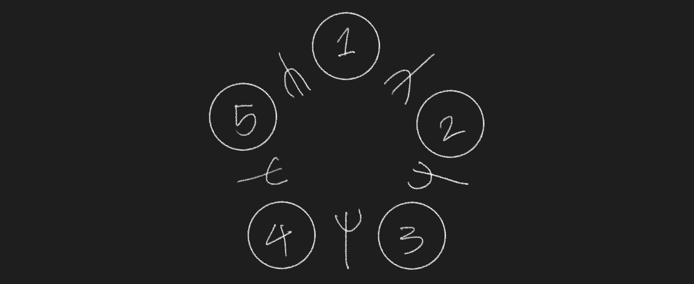
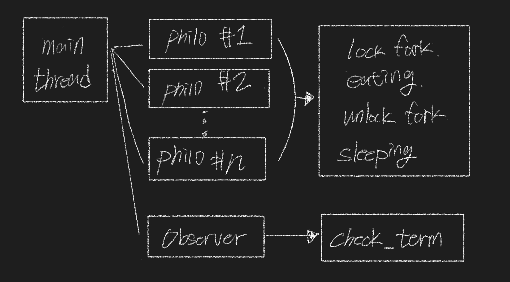
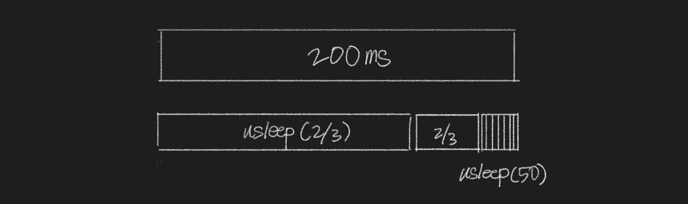

* [식사하는 철학자](#식사하는-철학자)
	* [교착 상태 (deadlock)](#교착-상태-deadlock)
	* [교착 상태 해결](#교착-상태-해결)
* [식사하는 철학자 구현](#식사하는-철학자-구현)
	* [과제 규칙](#과제-규칙)
	* [코드 구조](#코드-구조)
	* [스레드 동작](#스레드-동작)
	* [교착 상태 문제](#교착-상태-문제)
	* [usleep 정확도 문제](#usleep-정확도-문제)
	* [todos](#todos)

# 식사하는 철학자

  

원탁에 둘러 앉아있는 철학자들이 최대한 굶어 죽지 않도록 구현하는 과제이다. 철학자는 2개의 포크를 가지고 식사를 해야한다. 그러나 두 철학자 사이에는 1개의 포크만 있기 때문에 철학자는 옆에 있는 철학자가 식사 중이라면 포크를 내려놓기 전까지 기다려야 한다. 만약에 철학자가 주어진 시간 안에 2개의 포크를 가지고 식사를 시작하지 않으면 굶어 죽게 되는 것이다.  

## 교착 상태 (deadlock)

  

철학자 과제에서 해결해야하는 문제는 교착상태로 철학자들이 옆사람의 식사가 끝나기를 기다리다가 아무런 동작을 하지 못하고 굶어 죽게된다. 교착 상태는 다중 프로그래밍의 주요 난점 중 하나로써 두 개 이상의 작업이 상대방의 작업이 끝나기만을 기다리다가 아무것도 완료되지 못하는 상태를 말한다. 교착 상태가 일어나려면 다음과 같은 네 가지 조건을 충족시켜야 한다.  

> 1. 상호 배제: 프로세스들이 필요로 하는 자원에 대해 배타적인 통제권을 요구한다.
>     - 포크는 한 철학자만 사용할 수 있다.
> 2. 점유 대기: 프로세스가 할당된 자원을 가진 상태에서 다른 자원을 기다린다.
>     - 한 포크를 가진 상태에서 다른 포크를 가지기위해 기다린다.
> 3. 순환 대기: 각 프로세스는 순환적으로 다음 프로세스가 요구하는 자원을 가지고 있다.
>     - 철학자들이 원탁에 둘러앉아 있고, 사이에 포크가 놓여져 있다.
> 4. 비선점: 프로세스가 어떤 자원의 사용을 끝낼 때까지 그 자원을 뺏을 수 없다.
>     - 포크를 강제적으로 뺏을 수 없다.

철학자 과제는 모든 조건을 충족하므로 교착 상태가 일어날 수 밖에 없다. 교착 상태는 조건 중 한 가지라도 만족하지 않으면 발생하지 않으므로 다음과 같은 방법 중에서 하나를 선택하여 교착 상태를 예방해야 한다.

> 1. 상호 배제 부정: 여러 개의 프로세스가 공유 자원을 사용할 수 있도록 한다.
> 2. 점유 대기 부정: 프로세스가 실행되기 전 필요한 모든 자원을 할당한다.
> 3. 순환 대기 부정: 자원에 고유한 번호를 할당하고 순서대로 자원을 요구하도록 한다. 
> 4. 비선점 부정: 자원을 점유하고 있는 프로세스가 다른 자원을 요구할 때 점유하고 있는 자원을 반납하고 요구한 자원을 사용하기 위해 기다리도록 한다.

## 교착 상태 해결

  

효율적인 예방 방법인 순환 대기를 막는 방법을 사용한다. 철학자에게 고유 번호를 부여하고 번호가 홀수인 경우에는 오른쪽 포크를 먼저 가져가며 짝수인 경우에는 왼쪽 포크를 먼저 가져가도록 한다. 만약에 1번 철학자가 오른쪽 포크를 가져가면, 2번 철학자는 1번 철학자가 그 포크를 내려놓기 전까지 기다려야 한다. 그리고 1번 철학자는 왼쪽 포크를 가져가며 식사를 시작한다. 만약에 철학자의 수가 홀수라면 마지막 번호의 철학자가 오른쪽 포크를 가져가려해도 먼저 포크를 잡기 시작한 1번 철학자가 가지고 있기 때문에 기다리게 된다.  

# 식사하는 철학자 구현

## 과제 규칙
- 원탁에 앉아있는 각 철학자는 스레드로 구현되어야 하고, 철학자가 포크를 복제하는 것을 막기 위해서 뮤텍스를 이용해야한다.  
  - [스레드(Thread)](../../Thread.md)
  - [뮤텍스(Mutex)](../../Mutex.md)
- 한 명 이상의 철학자가 둥근 테이블에 앉아 다음과 같은 세 행동 중 하나를 취한다. (식사, 생각, 수면)  
- 철학자는 식사를 마치면 포크를 내려놓고 잠자기 시작한다. 잠을 다 잤으면 생각하기 시작한다.  
- 철학자는 반드시 2개의 포크를 사용하여 식사를 해야한다.
- 프로그램은 다음의 인자를 순서대로 받는다.  
  - 철학자의 수  
  - 철학자의 수명  
  - 식사하는 데 걸리는 시간  
  - 수면하는 데 걸리는 시간  
  - [철학자의 최소 식사 횟수]  
- 모든 철학자가 최소 식사 횟수만큼 밥을 먹었다면 시뮬레이션이 종료되고, 최소 식사 횟수가 명시되지 않았다면 철학자가 한 명이라도 사망하기 전까지 계속된다.

## 코드 구조


프로그램은 초기화, 생성, 잠금, 해제 순서로 실행된다. 
1. data 구조체를 생성하고, 입력받은 인자를 할당한다. mutex 배열을 생성하여 data 구조체에 할당한다.
2. philo 구조체를 철학자 수만큼 생성한다. data의 mutex 배열을 참조하여 각각 philo 구조체에 왼쪽 포크, 오른쪽 포크를 할당한다.
3. 철학자 스레드를 생성한다. philo 구조체를 참조하며, 철학자 행동을 구현한 함수를 실행하는 스레드가 생성된다. 
4. 관찰자 스레드를 생성한다. data 구조체를 참조하며, 프로그램의 종료 조건을 확인하는 함수를 실행하는 스레드가 생성된다.
5. 프로그램이 바로 종료되지 않도록 lock을 걸어준다.
6. 모든 데이터를 해제하고 프로그램이 종료된다.  

## 스레드 동작



메인 스레드에서 철학자 스레드와 옵저버 스레드를 생성한다. 철학자의 수만큼 스레드가 생성되면 스레드는 철학자의 동작을 반복하여 진행한다.  

철학자 스레드는 포크를 가져가고, 식사하고, 포크를 내려놓고, 잠을 자는 동작은 프로그램이 종료되기 전까지 반복된다.  

옵저버 스레드는 프로그램의 종료 조건이 충족되었는지 계속 확인한다. 어떤 철학자의 식사 시간이 넘어가서 굶어 죽었는지, 모든 철학자가 최소 식사 횟수만큼 식사를 했는지 보다가 프로그램을 종료시킨다.  

## 교착 상태 문제

  

스레드가 교착 상태에 빠지지 않도록 고유한 번호를 할당하고 번호에 따라서 순서를 정하였다. `lock_fork`과 `unlock_fork` 함수에서 스레드의 id 값이 홀수이면 오른쪽 포크를 먼저 집고, 짝수이면 왼쪽 포크를 먼저 집도록 한다. 이로 인해 스레드들이 순서대로 2개의 포크를 가져가게 되었으므로 교착 상태에 빠지지 않게 되었다. 

```c
// philo.h

typedef struct s_philo
{
	int					id;
	// ...
	pthread_mutex_t		*fork_left;
	pthread_mutex_t		*fork_right;
}	t_philo;
```

```c
// thread_philo.c

void	lock_fork(t_philo *philo)
{
	if (philo->id % 2)
	{
		// 홀수인 경우
		pthread_mutex_lock(philo->fork_right);
		print_status(philo, TAKEN);
		pthread_mutex_lock(philo->fork_left);
		print_status(philo, TAKEN);
	}
	else
	{
		// 짝수인 경우
		pthread_mutex_lock(philo->fork_left);
		print_status(philo, TAKEN);
		pthread_mutex_lock(philo->fork_right);
		print_status(philo, TAKEN);
	}
}

void	unlock_fork(t_philo *philo)
{
	if (philo->id % 2)
	{
		// 홀수인 경우
		pthread_mutex_unlock(philo->fork_right);
		pthread_mutex_unlock(philo->fork_left);
	}
	else
	{
		// 짝수인 경우
		pthread_mutex_unlock(philo->fork_left);
		pthread_mutex_unlock(philo->fork_right);
	}
}
```

## usleep 정확도 문제  

  

`usleep` 함수를 테스트해보면 정확하지 않음을 확인할 수 있다. ( [usleep 정확도 문제](https://www.notion.so/philosophers-VM-c60be9c836084edfbcd9c07e29b429c4) )  
usleep man 페이지를 보면 usleep 함수가 받는 인자는 잠을 자는 최소 값이라고 나와있다. 하지만 철학자 과제에서는 정확히 주어진 시간만큼 잠을 자야 하므로 다른 방법을 사용해야 한다.  

해결방법으로 `usleep(10)`을 반복하여 목표 시간만큼 재우는 방법이 있지만 성능 저하를 일으킬 수 있다. 그래서 `usleep(남은 시간의 2/3)`를 목표 시간의 10ms전까지 반복하고, 그 이후부터 `usleep(50)`을 반복하는 방법을 사용했다.

```c
// 현재 시간 반환 (ms)
long long	get_time(void)
{
	struct timeval	tv;
	long long		time;

	gettimeofday(&tv, NULL);
	time = (tv.tv_sec * 1000) + (tv.tv_usec / 1000);
	return (time);
}

void	new_sleep(long long time)
{
	long long	time_cur;
	long long	time_tar;
	long long	time_calc;

	time_cur = get_time();
	time_tar = time_cur + time;
	while (time_tar > time_cur)
	{
		time_calc = time_tar - time_cur;
		if (time_calc > 10)
			usleep((time_calc / 3) * 2000);
		else
			usleep(50);
		time_cur = get_time();
	}
}
```  


## todos

- [x]  argv 처리
- [x]  철학자 객체 생성
- [x]  mutex로 식사 구현
- [x]  옵저버 쓰레드 구현
    - [x]  철학자 구조체 배열을 넘겨받는다.
    - [x]  시간을 구하여 철학자가 죽어야 하는지 확인한다.
    - [x]  한 철학자가 죽게되면 모든 철학자 구조체에 알린다.
- [x]  출력 순서가 섞이지 않도록 동기화시킨다.
- [x]  mutex로 printf 구현
- [x]  시간 적용
    - [x]  철학자 수명 (밥을 먹고 일정 시간이 지나면 죽는다.)
    - [x]  밥먹는 시간 (밥먹는 시간)
    - [x]  잠자는 시간 (식사 후 잠을 자는데 소모되는 시간)
    - [x]  철학자의 상태를 출력 ( time / id / state )
- [x]  옵저버의 종료 조건
  - [x]  철학자의 수명이 다한 경우
  - [x]  모든 철학자가 최소 식사 횟수만큼 식사를 완료한 경우
    - [x]  옵저버에서 count한다.
    - [x]  철학자가 자신이 최소 식사를 마쳤음을 옵저버에게 알렸는지 확인하는 플래그를 가짐
    - [x]  모든 철학자가 식사를 완료하면 종료
- [x]  스레드를 모두 detached로 변경
- [x]  프로그램 종료 mutex를 생성
  - [x]  옵저버에 term_mutex를 넘긴다.
- [x]  옵저버의 프로그램 종료
  - [x]  종료 조건에 충족한 경우에 프로그램을 종료
  - [x]  term_mutex의 잠금을 해제
  - [x]  main에서 term_mutex를 받아서 프로그램을 종료
- [x]  리팩토링
  - [x]  코드 분할
  - [x]  파일 정리
  - [x]  구조 정리
- [x]  철학자가 최대한 죽지 않는 방법 (시간 지연 문제)
  - [x]  usleep 함수의 오차 해결
    - 반복문으로 목표 시간까지 시간을 계산해서 usleep 실행
    - ((목표 시간 - 현재 시간) / 3) * 2000
    - 만약에 (목표 시간 - 현재 시간)이 10ms 보다 적다면 usleep(50) 반복
- [x] mutex destroy
  - [x] 제거하기 전에 잠금을 해제한다.
  - [x] 출력은 종료 전까지만 실행되고, 종료 함수는 출력 mutex가 제거될 때까지 계속 mutex_destroy를 실행한다.
- [x] 메모리 누수
- [x] malloc guard
- [x] 파일 정리
- [x] norminette
- [x] 프로그램 인자
  - [x] validation 함수
- [x] 과제 설명 준비

