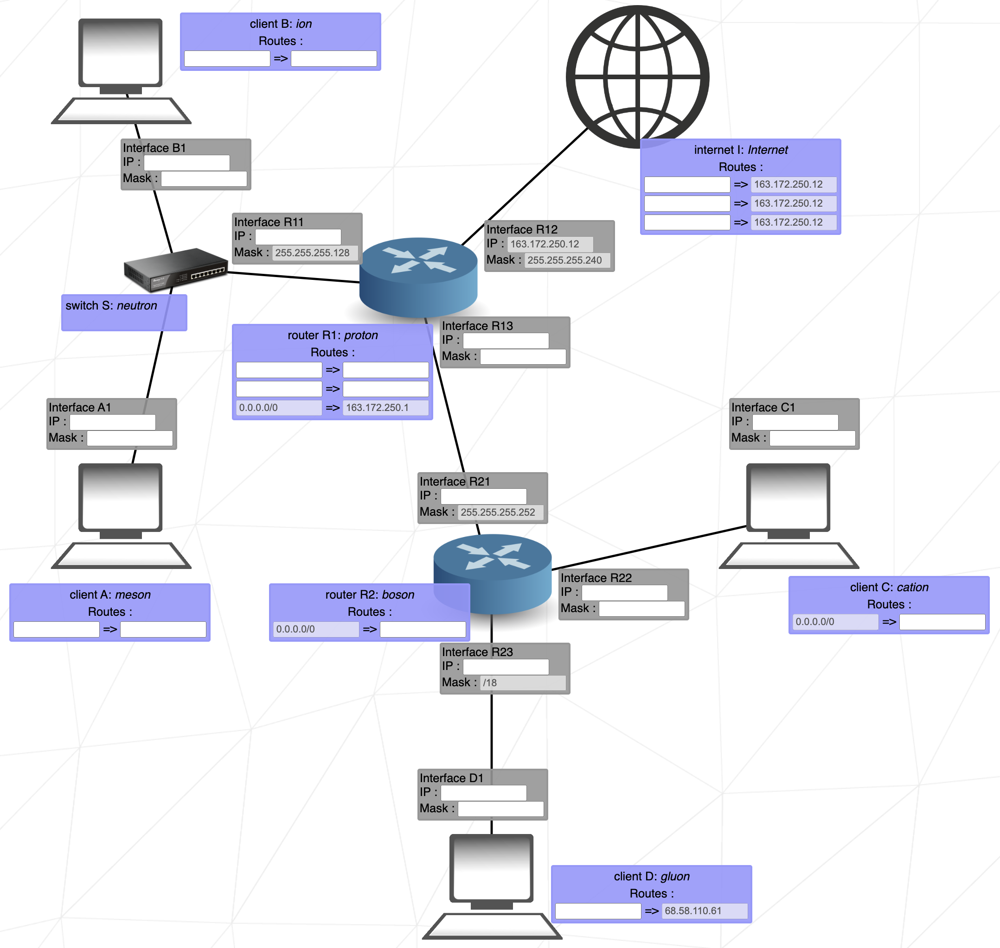

# Net Practice

TCP/IP 주소 지정이 작동하는 방식을 이해하고, 소규모 네트워크를 구성한다.  

## 네트워크란

- 네트워크는 둘 이상의 컴퓨터와 이들을 연결하는 링크의 조합이다.  
- 네트워크는 몇 개의 독립적인 장치가 적절한 영역내에서 적당히 빠른 속도의 물리적 통신 채널을 통하여 서로가 직접 통신할 수 있도록 지원해 주는 데이터 통신 체계이다.   

현대식 컴퓨터 네트워크의 복잡도로 인해 네트워크의 작업 방법을 설명하기 위한 여러 개념적 모델이 등장했다. 가장 일반적인 모델이 ISO(International Organization for Standardization)의 개방 시스템 연결 규약 참조 모델이다. OSI 7계층 모델(Open Systems Interconnection model)이라고도 한다. OSI 참조 모델이 네트워킹 개념을 논의하기에 유용하지만 많은 네트워킹 프로토콜이 OSI 모델을 그대로 따르지는 않는다. TCP/IP에서는 애플리케이션 및 프리젠테이션 계층 기능이 결합되며 세션 및 전송 계층 그리고 데이터 링크 및 물리적 계층도 마찬가지이다.  


네트워크를 사용함으로써 파일을 공유하거나 다른 네트워크에 있는 컴퓨터의 파일에 접근할 수 있다. 또한, 사진과 음악 또는 비디오같은 디지털 미디어를 네트워크를 통해서 스트리밍하거나 인터넷에서 다른 사람과 만나서 네트워크 게임을 즐길 수 있게 되었다. 이렇게 큰 장점을 가진 네트워크이지만 이로 인해서 바이러스나 악성코드, 해킹으로 인한 개인 정보 유출 등 보안상의 문제점이 생긴다.  

### 네트워크 종류

가장 작은 규모의 네트워크인 개인 통신망(Personal Area Network, PAN), 근거리 영역의 네트워크(Local Area Network, LAN), 대도시 영역의 네트워크인 도시권 통신망(Metropolitan Area Network, MAN), 광대역 네트워크인 원거리 통신망(Wide Area Network, WAN), 정보의 축적과 제공, 통신 속도와 형식의 변화, 통신 경로의 선택 등 여러 종류의 정보 서비스가 부가된 통신망인 부가 가치 통신망(Value Added Network, VAN)과 광대역 종합정보통신망(BISDN) 전화, 팩스, 데이터 통신, 비디오텍스 등 통신 관련 서비스를 종합하여 다루는 통합 서비스 디지털 통신망인 종합정보통신망(Integrated Service Digital Network, ISDN)이 있다.  

### 회선 구성 방식

중앙 컴퓨터와 단말기를 일대일로 연결하여 언제든지 데이터 전송이 가능하게 하는 방식인 포인트 투 포인트 방식이 있고, 다수의 단말기를 한 개의 통신 회선에 연결하여 사용하는 방식으로, 멀티 포인트 방식이라고도 하는 멀티 드롭 방식이 있다. 또한, 여러 대의 단말기를 다중화 장치를 활용하여 중앙 컴퓨터와 연결하여 사용하는 방식으로 다중화 방식이라고도 하는 회선 다중 방식이 있다. 

### 데이터 교환 방식

- 회선 교환 : 통신을 원하는 두 지점의 교환기를 이용하여 물리적으로 접속시키는 방법으로써 송신자의 모든 데이터는 동일한 경로로 전송된다. 대표적으로 음성 전화망이 있으며 포인트 투 포인트 방식으로 연결된다.  
- 패킷 교환 : 회선 교환과 다르게 전용선의 개녕이 없다. 데이터를 일괄적으로 한 번에 보내지 않고, 여러 개로 분할해서 송신하는 방법을 말한다. 분할된 데이터를 패킷이라고 한다. 패킷에는 데이터와 최종 목적지에 대한 정보가 들어있어서 라우터가 이를 보고 패킷을 최적 경로를 향해 전달한다.  
- 공간 분할 교환 : 기계식 접점과 전자 교환기의 전자식 접점 등을 이용하여 교환을 수행한다. 기존의 음성용 전화 회선망을 이용할 수 있어서 간단한 저속 데이터 전송에 매우 효과적이다.  
- 시분할 교환 : 전자 부품이 갖는 고속성과 디지털 교환 기술을 이용하여 다수의 디지털 신호를 시분할적으로 동작시켜 다중화하는 방식이다. 이 방식은 데이터 전용 회선 교환 방식에 이용된다.  

## 네트워크 장비

### 1. 스위치

스위치는 OSI 2계층(Data Link Layer)의 장치로 패킷을 효율적으로 전송하여 원활한 네트워크 통신이 이루어지도록 한다. 3계층(Network Layer)에서 각 세그먼트에 IP주소를 달아서 2계층으로 넘겨주는데, 2계층에서는 각 세그먼트에 출발지 / 목적지 MAC 주소 헤더를 추가하여 프레임을 구성한다.  

#### 패킷 전송 방식

스위치는 MAC 테이블에 존재하는 도착지 주소를 가진 패킷이 들어오면 매핑된 포트로만 패킷을 전송하고, 테이블에 존재하지 않는 도착지 주소를 가진 패킷이 들어오면 전체 포트로 패킷을 전송한다. 스위치의 동작 방식은 3가지로 정리된다.  

- 플러딩 : MAC 주소 테이블이 완전히 비어있는 경우, 패킷이 들어온 포트를 제외한 모든 포트로 패킷을 전달하는 작업
- 어드레스 러닝 : MAC 테이블을 만들고, 유지하는 작업
- 포워딩 : 들어온 패킷에서 MAC 주소를 확인하고 자신이 가진 MAC 테이블과 비교해 맞는 정보가 있으면 매칭되는 해당 포트로 패킷을 보내는 작업
- 필터링 : 패킷이 들어왔을 때, 주소가 매칭되지 않는 나머지 포트로는 패킷을 보내지 않는 작업

### 2. 라우터

라우터는 OSI 3계층(Network Layer)의 장치로 패킷의 목적지 IP 주소를 확인하고, 해당 주소의 경로를 지정해준다. 라우터는 여러 경로 정보를 가지고 있는데, 들어오는 패킷을 최적의 경로로 목적지까지 도달시키는 방법을 파악하여 포워딩한다. 이를 위해 라우터는 다양한 경로 정보를 수집하며, 라우팅 테이블에 저장한다.  

#### 패킷 라우팅 방식

라우터가 패킷을 라우팅하는 방식은 경로 지정, 브로드캐스트 컨트롤, 프로토콜 변환으로 나뉜다.

#### - 경로 지정


라우터에 패킷이 들어오면 패킷의 도착지 IP를 확인하여 경로를 지정한다. 패킷의 경로 정보를 얻고, 패킷을 포워딩하는 방법은 다음과 같이 세분화할 수 있다. 

- 경로 정보 얻는 방법
  1. 다이렉트 커넥티드 : IP 주소를 입력할 때 인접 네트워크 정보를 자동으로 얻는 방법
  2. 스태틱 라우팅 : 관리자가 직접 정보를 입력하는 방법
  3. 다이나믹 라우팅 : 라우터끼리 정보를 교환하는 방법

- 패킷 포워딩
  - 라우팅 테이블을 확인하여 패킷의 IP 주소에 맞는 넥스트 홉을 찾고, 포워딩한다. 
  - 패킷은 이동하며 여러 개의 라우터를 거치기 때문에 라우터는 다음 라우터까지의 경로를 지정한다. 
  - 네트워크를 한 단계씩 뛰어 넘으며 전달되는 방식을 홉-바이-홉 (Hop-by-Hop) 라우팅이라고 한다. 
  - 라우팅 테이블에서 Next Hop은 가장 인접한 라우터를 의미한다.


#### - 브로드캐스트 컨트롤

라우터는 멀티캐스트 정보를 습득하지 않고, 브로드캐스트 패킷을 전달하지 않는다. 이는 라우터의 주요한 특징 중 하나로써 분명한 도착지 정보가 있는 경우에만 통신을 허락한다. 만약에 패킷의 목적지 주소가 라우팅 테이블에 없다면 패킷을 버린다. 덕분에 패킷이 다른 네트워크로 전달되지 않는다.  


#### - 프로토콜 변환

라우터는 패킷의 2계층까지의 헤더 정보를 벗기고 3계층 주소를 확인하고, 2계층 헤더 정보를 새로 입혀서 내보낸다. 이 기능으로 패킷은 다른 프로토콜로 구성된 네트워크로 이동할 수 있다. 예를 들어서 LAN 기술을 WAN 기술로 변환하여 네트워크를 연결한다.  

- LAN (Local Area Network) : 지역 네트워크이다. 예를 들어 집에 있는 컴퓨터와 전화기, 프린트를 공유기를 통해 연결하는 경우에 LAN을 이용한다.  
- WAN (Wide Area Network) : LAN과 LAN의 사이를 구성하는 네트워크이다. 만약에 외부에서 집에 구성한 LAN에 접속하려는 경우에 ISP (Internet Service Provider) 업체에서 설치한 LAN선을 사용하여 ISP 네트워크 망에 접속한다.  


## TCP/IP (Transmission Control Protocol/Internet Protocal)

TCP는 인터넷 상에서 데이터를 메세지의 형태로 보내기 위해 IP와 함께 사용하는 프로토콜이다. 컴퓨터가 서로 통신하는 경우, 특정 규칙이나 프로토콜을 사용하여 순서대로 데이터를 전송 및 수신할 수 있다. 전세계적으로 가장 일상적으로 사용되는 프로토콜 세트 중 하나가 TCP/IP이다.  

일반적으로 TCP와 IP를 함께 사용하는데, IP가 데이터의 배달을 처리한다면 TCP는 패킷을 추적하거나 관리한다. TCP는 연결형 서비스를 지원하는 프로토콜로 인터넷 환경에서 기본으로 사용한다. 이에 반해 UDP는 비연결형 프로토콜이다. 데이터를 독립적인 관계를 지니는 패킷인 데이터 그램 단위로 처리한다. 

- TCP/IP는 컴퓨터 사이의 통신 표준 및 네트워크의 라우팅 및 상호연결에 대한 자세한 규칙을 지정하는 프로토콜 스위트이다.
- 네트워크에 연결된 여러 컴퓨터 사이의 통신을 허용한다. 각 네트워크는 호스트와 통신하는 다른 네트워크에 연결될 수 있다. 패킷 교환 및 스트림 전송으로 작동하는 많은 유형의 네트워크 기술이 있지만, TCP/IP는 하드웨어에 구애받지 않는다는 하나의 큰 장점이 있다.  
- TCP/IP는 컴퓨터 시스템을 네트워크에 접속하여 다른 인터넷 호스트와 통신할 수 있는 인터넷 호스트로 만드는 기능을 제공한다. 다음을 수행할 수 있는 명령과 기능이 포함된다. 
    - 시스템 사이에서 파일 전송
    - 원격 시스템에 로그인
    - 원격 시스템에서 명령 실행
    - 원격 시스템에 파일 인쇄
    - 원격 사용자에 이메일 전송
    - 원격 사용자와 대롸적 통신
    - 네트워크 관리

### TCP/IP 용어

- 클라이언트 : 네트워크 프로세스나 다른 컴퓨터의 데이터, 서비스 또는 자원들을 액세스하는 컴퓨터 또는 프로세스이다. 
- 호스트 : 인터넷 네트워크에 접속되고 다른 인터넷 호스트와 통신할 수 있는 컴퓨터이다. 
- 네트워크 : 둘 이상의 호스트 및 이들 사이의 연결 링크 조합이다.  
- 패킷 : 호스트와 네트워크 사이의 한 트랜잭션에 대한 제어 정보 및 데이터 블록이다. 
- 포트 : 프로세스에 대한 논리적 연결 지점이다. 데이터는 포트(또는 소켓)을 통해 프로세스 사이에서 전송된다. 각 포트는 데이터 송수신을 위한 큐를 제공한다. 
- 프로세스 : 실행 중인 프로그햄이다. 프로세스는 컴퓨터에서 활동 중인 요소이다. 터미널, 파일, 기타 입출력 장치는 각기 다른 프로세스를 통해 통신한다. 따라서 네트워크 통신은 프로세스 간 통신이다. 
- 프로토콜 : 물리적 또는 논리적 레벨로 통신을 처리하는 규칙 세트이다. 다른 프로토콜을 사용하여 서비스를 제공하는 경우도 있다. 예를 들어, 연결 레벨 프로토콜은 전송 레벨 프로토콜을 사용하여 두 호스트 사이의 연결을 유지하는 패킷을 전송한다.
- 서버 : 네트워크 상의 다른 컴퓨터 또는 프로세스가 액세스할 수 있는 데이터, 서비스 또는 자원을 제공하는 컴퓨터 또는 프로세스이다.  

### TCP/IP 네트워크 계획

TCP/IP는 유연한 네트워킹 도구이기 때문에 특정 요구에 맞게 조정하여 사용할 수 있다. 네트워크를 계획할 경우에 이와 같은 주요 문제점을 생각해봐야 한다.  

1. 사용하려는 네트워크 하드웨어의 유형 결정한다.
2. 네트워크의 물리적 배치를 계획한다. 각 호스트 머신이 제공할 기능을 고려한다.
3. 사용자의 요구사항에 가장 적합한 네트워크가 플랫 네트워크인지 계층 네트워크인지 결정한다.
    - 사용자의 네트워크가 작은 규모이고, 하나의 물리적 네트워크로 구성되는 경우에는 플랫 네트워크가 적합하다. 그러나 네트워크가 매우 크고, 여러 물리적 네트워크로 복잡한 경우에는 계층 네트워크가 효과적일 수 있다. 
4. 네트워크를 다른 네트워크에 연결하려면 게이트 웨이의 설정 및 구성 방식을 계획해야 한다. 
    - 게이트웨이로 서비스되는 하나 이상의 머신 결정
    - 정적 또는 동적 라우팅 또는 이 둘의 조합을 사용해야하는지 여부를 결정
5. 주소 지정 체계를 결정한다. 
6. 시스템을 서브넷으로 분할해야 하는지 여부를 결정하고, 분할하는 경우에는 서브넷 마스크 지정 방법을 결정한다.
7. 이름 지정 체계를 결정한다. 네트워크의 각 머신에는 자체적으로 고유 호스트 이름이 있어야 한다. 
8. 네트워크에 이름 해석을 위한 이름 서버가 필요한지, 아니면 /etc/hosts 파일의 사용만으로 충분한지 여부를 결정한다.
9. 네트워크에서 원격 사용자에게 제공하려는 서비스 유형을 결정한다.

### TCP와 UDP의 차이점

|            TCP             |            UDP             |
| :------------------------: | :------------------------: |
|  |  |
| 연결형 서비스로 가상 회선 방식을 제공 | 비연결형 서비스로 데이터그램 방식을 제공 |
| 3way handshaking 과정을 통해 연결을 설정하고 4way handshaking을 통해 해제 | 정보를 주고 받을 때 정보를 보내거나 받는다는 신호절차를 거치지 않음 |
|  |  |

### TCP/IP 프로토콜

프로토콜은 시스템과 애플리케이션 프로그램에서 정보를 교환할 수 있도록 하는 메시지 형식 및 일련의 작업 절차에 대한 규칙 세트이다.  
수신 호스트가 메시지를 이해하려면 통신에 관련된 각 시스템이 이런한 규칙을 준수해야 한다.  
TCP/IP 프로토콜은 계층이라는 관점에서 이해할 수 있다. 계층은 애플리케이션 계층, 전송 계층, 네트워크 계층, 네트워크 인터페이스 계층, 하드웨어로 구성된다.  

  

다음은 TCP/IP가 정보를 발신자에서 수신자로 이동하는 방법이다.  
- 애플리케이션 프로그램은 메시지나 데이터 스트림을 인터넷 전송 계층 프로토콜 중 하나로 전송한다. (UDP 또는 TCP로 전송)
- 데이터 스트림을 받은 프로토콜은 패킷이라고 부르는 작은 조각으로 데이터를 나누고, 대상 주소를 추가하여 다음 계층을 따라 패킷을 패스한다.  
- 인터넷 네트워크 계층은 패킷을 IP(Internet Protocol) 데이터그램에 포함한 후 데이터그램 헤더 및 트레일러에 넣고 데이터그램 전송 위치를 결정한 후 네트워크 인터페이스 계층으로 데이터그램을 패스한다. 
- 네트워크 계층은 IP 데이터그램을 승인하고 이더넷이나 토큰 링 네트워크와 같은 특정 네트워크 하드웨어를 통해 이들을 프레임으로 전송한다.  


위 그림을 보면 정보가 전송자에서 호스트로의 TCP/IP 프로토콜 계층에 따라 아래로 흐른다.
호스트가 수신한 프레임은 역 방향으로 프로토콜 계층을 이동한다. 각 계층은 데이터가 애플리케이션 계층에 다시 도달할 때까지 해당 헤더 정보를 스트립한다. 


위 그림을 보면 정보가 호스트에서 전송자로 TCP/IP 프로토콜 계층에 따라 위로 흐른다.  
- 프레임은 네트워크 인터페이스 계층에서 수신한다.  
- 네트워크 인터페이스 계층은 이더넷 헤더를 스트립하여 데이터그램을 네트워크 계층으로 전송한다.
- 네트워크 계층에서는 인터넷 프로토콜이 IP 헤더를 스트립하고 전송 계층으로 패킷을 전송한다. 
- 전송 계층에서는 TCP가 TCP 헤더를 스트립하여 애플리케이션 계층으로 데이터를 전송한다.  

네트워크의 호스트는 정보의 전송과 수신을 동시에 수행한다. 아래의 그림은 TCP/IP 계층에 따라 양방향으로 데이터가 흐르는 것을 보여준다.  


### TCP/IP 주소 지정

TCP/IP는 사용자와 애플리케이션이 통신할 고유 네트워크나 호스트를 식별할 수 있게 하는 인터넷 주소 지정 체계를 포함하고 있다.  
인터넷 주소는 우편번호 주소와 유사한 방식으로 작용하여 선택한 대상으로 데이터가 라우트되도록 한다.  
TCP/IP는 네트워크, 서브네트워크, 호스트, 소켓에 주소를 지정하고 브로드캐스트 및 로컬 루프백에 대한 특수 주소를 사용하기 위한 표준을 제공한다.  

인터넷 주소는 네트워크 주소와 호스트(또는 로컬) 주소로 이루어진다.  
고유한 공식 네트워크 주소는 다른 인터넷 네트워크에 연결할 때 각 네트워크에 지정된다.  
그러나 로컬 네트워크를 다른 인터넷 네트워크에 연결하지 않은 경우 로컬 사용에 간편한 네트워크 주소로 지정될 수 있다.  

### 인터넷 주소

IP(Internet Protocol)는 32비트의 두 부분으로 된 주소 필드를 사용한다.  
인터넷 주소는 네트워크 주소 부분과 호스트 주소 부분으로 이루어져 있다. 이를 사용하면 원격 호스트가 정보 전송 시에 원격 네트워크와 원격 네트워크의 호스트 모두를 지정할 수 있다.  

네트워크 주소 - 호스트들을 모아놓은 네트워크를 지칭하는 주소이며, 네트워크 주소가 동일한 네트워크는 곧 로컬 네트워크이다.  
호스트 주소 - 네트워크에 연결된 컴퓨터나, 이와 비슷한 장치의 주소이다. 

네트워크 주소와 호스트 주소를 구분하는 경계점은 고정되어 있지 않다. IP주소 체계에는 클래스라는 개념이 존재하는데, 이 클래스를 기준으로 네트워크와 호스트를 구분할 수 있다.  

TCP/IP는 인터넷 주소의 세 가지 클래스인 클래스 A, 클래스 B, 클래스 C를 지원한다.  
다른 클래스는 32비트 주소를 할당하는 방법으로 지정한다.  
네트워크가 지정되는 특정 주소 클래스는 네트워크의 크기에 따라 다르다.  
하나의 네트워크가 호스트의 수를 몇 개까지 가질 수 있는가에 따라서 클래스가 나뉘어진다.  

- 클래스 A
    - 8비트 네트워크 주소와 24비트 로컬 또는 호스트 주소로 구성된다. (255.0.0.0 서브넷 마스크)
    - 하나의 네트워크가 가질 수 있는 호스트 수가 가장 많은 클래스이다. 
    - 맨 앞쪽 bit가 항상 0으로 시작된다. 그래서 클래스 A는 1.0.0.0 ~ 126.0.0.0 안에서 정해진다. 
- 클래스 B
    - 16비트 네트워크 주소와 16비트 로컬 또는 호스트 주소로 구성된다. (255.255.0.0 서브넷 마스크)
    - 클래스 B는 128.0.0.0 ~ 191.255.255.255까지로 규정된다. 
- 클래스 C
    - 24비트 네트워크 주소와 8비트 로컬 또는 호스트 주소로 구성된다. (255.255.255.0 서브넷 마스크)
    - 클래스 C는 192.0.0.0 ~ 223.255.255.255까지로 규정된다.
- 0을 사용하는 인터넷 주소 : C 클래스 인터넷 주소가 호스트 주소 부분에 0을 포함하면 TCP/IP는 네트워크의 와일드 카드 주소를 전송한다.  

### 서브넷 주소

서브넷 주소 지정을 이용하면 여러 네트워크로 이루어진 자율 시스템이 동일한 인터넷 주소를 공유할 수 있다.  
TCP/IP의 서브 네트워크 기능은 단일 네트워크를 여러개의 논리적 네트워크(서브넷)로 분할할 수 있다.  
하나의 인터넷 네트워크 주소를 서브넷에 내부적으로 구성하면 더 적은 인터넷 네트워크 주소가 필요하면서 로컬 라우팅 기능은 개선된다.  

표준 인터넷 프로토콜 주소 필드에는 네트워크 주소와 로컬 주소의 두 부분이 있다.  
서브넷이 사용되도록 하기 위해 인터넷 주소의 로컬 주소 부분이 서브넷 번호와 호스트 번호로 분할된다.  
서브넷은 로컬 자율 시스템이 메시지를 확실하게 라우트할 수 있도록 식별된다.  


이 그림은 전형적인 클래스 A 주소 구조를 보여준다.  
처음 8비트는 네트워크 주소를 포함하고 나머지 24비트는 로컬 호스트 주소를 포함한다.  
클래스 A 인터넷 주소에 대한 서브넷 주소를 작성하기 위해 두가지로 나눌 수 있다.  
물리적 네트워크(또는 서브넷)를 식별하는 번호, 서브넷의 호스트를 식별하는 번호로 로컬 주소를 나눌 수 있다.  
전송인은 알려진 네트워크 주소로 메시지를 라우트하고, 로컬 시스템이 해당 서브넷과 호스트에 메시지를 라우트한다.  
로컬 주소를 서브넷 주소와 호스트 주소로 분할하는 방법을 결정할 때, 서브넷 수와 해당 서브넷의 호스트 수를 고려해야 한다.  


서브넷 주소와 호스트 주소를 유연하게 지정할 수 있고, 다음과 같은 제한사항이 있다. 
- network_address는 네트워크의 인터넷 주소이다.
- subnet_address는 주어진 네트워크에 대한 폭이 고정된 필드이다.
- host_address는 폭이 최소 1비트인 필드이다.  

subnet_address 필드의 폭이 0인 경우 네트워크는 서브넷으로 구성되지 않고 네트워크에 대한 주소 지정은 인터넷 네트워크 주소를 이용하여 수행된다.  

### 서브넷 마스크

시스템은 서브넷 마스크를 사용하여 대상 주소와 호스트 주소를 비교한다.  
호스트가 대상에게 메시지를 전송할 때 시스템은 대상이 소스와 동일한 네트워크에 있는지 또는 로컬 인터페이스 중 하나를 통해 대상에 직접 연결할 수 있는지 여부를 판별한다.  

대상이 로컬이 아닌 경우에 시스템은 메시지를 게이트웨이로 전송한다. 게이트웨이는 동일한 비교 작업을 수행하여 대상 주소가 로컬로 도달할 수 있는지 여부를 확인한다.  

서브넷 마스크는 시스템에 서브넷 분할 체계에 대해 알려준다. 이 비트 마스크는 네트워크 주소 부분과 인터넷 주소의 서브넷 주소 부분으로 구성된다.  

모든 IP 주소에는 서브넷 마스크가 있다. IP 주소를 서브네팅하지 않고 전부 쓰더라도 서브넷 마스크를 따라 다닌다. 주어진 네트워크를 나누어서 사용하는 경우에는 디폴트 서브넷 마스크를 고쳐서 사용한다.  


서브넷 마스크는 인터넷 주소처럼 4바이트 세트이다. 서브넷 마스크는 네트워크 및 서브네트워크 주소의 비트 위치에 해당하는 상위 비트와 호스트 주소의 비트 위치에 해당하는 하위 비트로 구성된다. 서브넷 마스크는 다음 그림과 유사하다.  


### 주소 비교

대상 주소와 로컬 네트워크 주소는 소스 호스트의 서브넷 마스크에서 AND, OR 연산자를 수행하여 비교한다.  
비교는 다음과 같이 일어난다.

- 대상 주소 및 로컬 서브넷 주소 마스크의 논리적 AND를 수행한다.
- 이전의 결과와 로컬 인터페이스의 로컬 넷 주소에서 배타적 OR를 수행한다.  
    - 결과가 모두 0이면 로컬 인터페이스 중 하나를 통해 대상에 직접 도달할 수 있다고 가정한다.
- 자율 시스템에 둘 이상의 인터페이스가 있는 경우 각 로컬 인터페이스에 대해 비교 프로세스가 반복된다.  

```
CLASS A   73.1.5.2    =  01001001 00000001 00000101 00000010


CLASS B   145.21.6.3  =  10010001 00010101 00000110 00000011
```

로컬 네트워크 인터페이스의 해당 서브넷 마스크는 다음 예제에 표시된다. 
```
CLASS A   73.1.5.2    =  11111111 11111111 11100000 00000000


CLASS B   145.21.6.3  =  11111111 11111111 11111111 11000000
```

IP주소 뒤에는 서브넷 마스크의 bit수를 표시된다. 예를 들어 클래스 A는 서브넷 마스크의 초기 bit가 8개이므로 `/8` 가 붙어서 `192.168.3.19/8` 처럼 IP주소를 표시한다.  

### 서브넷팅

기본 서브넷 마스크는 클래스 체계에 의해서 network_address 부분을 나누기 위한 개념이지만 인프라에서 정한 서브넷 마스크는 공인 IP 네트워크 망 안에서 부분망들을 나누기 위해 사용한다.  

만약에 A클래스만으로 전체 IP를 관리한다면 비효율적이다. 부분적으로 관리하기 어렵고 브로드 케스팅을 했을 때 트래픽량을 감당하기도 어렵다. 서브넷팅으로 이러한 문제를 해결한다.  

서브넷 마스크에 1bit를 추가할 때마다 네트워크의 크기는 2배 증가하고 할당할 수 있는 호스트의 수는 2로 나뉘어 진다.  

### 서브넷 마스크 예시

1. 공인 IP 주소로 210.100.1.0 (서브넷 마스크 255.255.255.0) 네트워크를 받았다. 이 공인 주소를 이용해서 30대의 PC의 네트워크를 만든 다음 이들 네트워크를 라우터를 이용해서 통신하려고 한다.  
    - 30대의 PC를 수용하는데 필요한 이진수 자릿수를 구하면 5자리이다. 
    - 그러므로 210.100.1.ssshhhhh (s - 서브넷, h - 호스트) 가 되어야 한다. 
    - 이를 십진수로 바꾸면 255.255.255.224이다.

2. 주어진 네트워크 : 201.222.5.0(255.255.255.0), 서브넷 요구 조건 : 서브넷 당 호스트 5개 이상, 총 서브넷 수 20개 이상
    - 20개의 서브넷 필요 = 최소 25 이상, 5개의 호스트 필요 = 최소 23 이상
    - ssssshhh 이므로 255.255.255.11111000이다.
    - 서브넷 마스크는 255.255.255.248 이다.

    - `00000`000 : 앞에 있는 5bit 자리로 32개의 서브넷이 만들어진다. 
    - 00000`000` : 뒤에 있는 3bit 자리로 6개의 호스트를 가지게 된다. 


### 특수 IP 주소

- `0.0.0.0/32` : 현재 네트워크이다. 근원지 주소인 자신의 주소를 모를 때 사용한다.
- `127.0.0.0/8` : Loopback 주소이다. 같은 장치 상에서 통신할 때 사용되며 주로 소프트웨어의 테스트 목적으로 사용된다. 
- `169.254.0.0/16` : Link-Local, Zero Configuration Networking을 위해 예약된 sunet이다. IP를 설정하지 못한 호스트들끼리 통신이 가능하도록 세팅된 주소범위이다.
- `10.0.0.0/8`, `172.16.0.0/12`, `192.168.0.0/16` : 사설 IP 범위이다. 로컬 영역에서만 사용할 수 있는 LAN을 구성하고 인터넷 망에 연결하지 않는 사설말에 부여하는 IP주소이다. 주로 IP주소의 절약과 보안을 목적으로 사용된다. 
- `224.0.0.0/4(~239.255.255.255)` : Multicast address이다. 
- `255.255.255.255/32` : Broadcast address이다.

  
## 소규모 네트워크 구성

  

네트워크를 구성하기 위해서 IP주소를 정해준다.  
서브넷팅으로 네트워크 부분망들을 나누어 준다.  
네트워크를 구성하는 요소에는 네트워크 장비인 스위치와 라우터가 포함되어있다.   
네트워크를 구성하기 위해서 동일한 네트워크에 포함되는 장치를 알아야 한다.  
같은 네트워크에 포함되는 장치에는 동일한 네트워크 주소를 정해준다.  
네트워크는 라우터를 기준으로 나뉜다.  

화면에는 장치의 IP주소가 입력되는 필드와 라우팅 테이블 주소가 입력되는 필드가 있다.  
IP주소 필드에는 다른 네트워크와 구별되는 IP주소와 서브넷 마스크를 정해준다.  
라우팅 테이블 필드에는 패킷 경로를 정해준다.  
왼쪽 입력필드에는 패킷의 목적지가 입력되고, 오른쪽 입력필드에는 넥스트 홉이 입력된다.  
넥스트 홉이란 패킷이 이동해야하는 다음 라우터를 의미한다.  
네트워크를 한 단계씩 뛰어 넘으며 패킷이 전달되는 방식을 홉바이홉 라우팅이라고 한다.  

라우터를 기준으로 네트워크를 나누어주고, 각각의 장치에 IP주소를 할당해준다.  
그리고 라우팅 테이블에는 패킷이 전달되어야 하는 목적지 IP주소와 다음 라우터의 IP주소를 입력해준다.  
IP주소를 정하며 만약에 특수 IP를 사용하게 된다면 의도처럼 패킷이 통신이 되지 않으므로 주의해야 한다.  


[IP 주소 체계의 과거와 현재](https://haeunyah.tistory.com/89?category=1002971)  
[TCP와 UDP의 특징과 차이](https://mangkyu.tistory.com/15)  
[OSI 7 Layer](https://www.youtube.com/watch?v=1pfTxp25MA8)  
[계층별 장비와 케이블](https://www.youtube.com/watch?v=xpAlLYIBIC4)  
[라우터의 동작 방식](https://haeunyah.tistory.com/98?category=1002971)  
